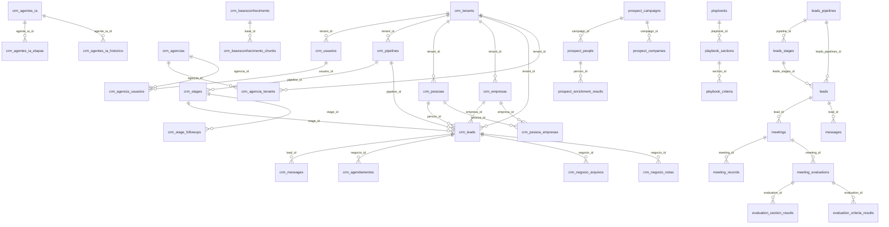

# Schema — rev-os

> Source of truth: `supabase/baseline.sql` (72 713 linhas) + `supabase/migrations/` (713 arquivos).  
> ORM: Supabase JS client (REST/RLS) — sem Prisma, sem Drizzle.  
> Extensions: `uuid-ossp`, `vector` (pgvector), `pg_cron`, `pg_net`.  
> Tenant isolation: via `tenant_id uuid REFERENCES crm_tenants(id)` + RLS por `current_setting('app.current_tenant_id')` ou funções `get_current_user_tenant_id()` / `user_has_tenant_access(uuid)`.

---

## Enums / Tipos Custom

| Tipo | Valores |
|---|---|
| `entidade_campo` | `pessoa`, `empresa`, `negocio` |
| `tipo_campo` | `texto`, `numero`, `data`, `select` |
| `tipo_time` | `vendas`, `suporte`, `marketing`, `financeiro` |

Sequences: `messages_id_seq`, `n8n_chat_histories_id_seq`

---

## ERD (Mermaid — tabelas principais)



---

## Módulo: Core / Multi-tenancy

### `crm_tenants`
| Coluna | Tipo | Constraints |
|---|---|---|
| id | uuid | PK, DEFAULT gen_random_uuid() |
| name | text | NOT NULL |
| value | text | NOT NULL, UNIQUE — slug do tenant |
| created_at | timestamptz | NOT NULL, DEFAULT now() |
| modulos_ativos | jsonb | DEFAULT `{"visitas":false,"reservas":false,"reunioes":false,"campanhas":false}` |
| webhook_conversas | text | nullable, CHECK URL válida |
| disc_config | jsonb | config GPT para DISC |
| resumo_config | jsonb | config GPT para resumo |
| ativo | boolean | NOT NULL, DEFAULT true |
| logo_url | text | nullable |

**RLS:** ativo

---

## Módulo: Agências / Usuários

### `crm_agencias`
| Coluna | Tipo | Constraints |
|---|---|---|
| id | uuid | PK |
| nome | text | NOT NULL |
| descricao | text | nullable |
| ativo | boolean | NOT NULL, DEFAULT true |
| created_at / updated_at | timestamptz | NOT NULL |
| created_by / updated_by | uuid | FK → auth.users(id) |

**RLS:** ativo

### `crm_usuarios`
| Coluna | Tipo | Constraints |
|---|---|---|
| id | uuid | PK |
| nome | text | NOT NULL |
| email | text | NOT NULL, UNIQUE |
| ativo | boolean | NOT NULL, DEFAULT true |
| tenant_id | uuid | FK → crm_tenants(id) |
| auth_user_id | uuid | FK → auth.users(id) |
| agencia_id | uuid | FK → crm_agencias(id) |
| super_adm | boolean | DEFAULT false |
| gestor | boolean | NOT NULL, DEFAULT false |
| whatsapp | text | nullable |
| deleted_at / deleted_by | timestamptz/uuid | soft delete |

**RLS:** ativo  
**Índices:** `idx_crm_usuarios_tenant_id`, `idx_crm_usuarios_email`

### `crm_agencia_tenants`
Junction: agencia ↔ tenant (UNIQUE agencia_id + tenant_id).

### `crm_agencia_usuarios`
Junction: agencia ↔ usuario (UNIQUE agencia_id + usuario_id).

---

## Módulo: Settings (schema principal da aplicação)

### `settings_users`
Usuários da aplicação moderna (auth_user_id → auth.users, tenant_id via settings). Tabela principal pós-refatoração.

**RLS (pós FIX-USR-01, 2026-05-07):**
- `settings_users_select_authenticated` — SELECT aberto para `authenticated` (UX de listas)
- `settings_users_insert_admin_only` — INSERT só via `is_admin()`
- `settings_users_update_owner_or_admin` — UPDATE: dono da linha (sem mudar `super_admin`/`user_type`) OU `is_admin()`
- `settings_users_delete_admin_only` — DELETE só via `is_admin()`

**Função auxiliar:**
- `public.is_admin()` — `STABLE SECURITY DEFINER` — true se usuário atual tem `super_admin=true OR user_type='admin'` E `active=true` E `deleted_at IS NULL`. Mais restritiva que `is_admin_or_manager()` (que aceita `manager`).

**Trigger (pós FIX-USR-03, 2026-05-07):**
- `trg_settings_users_sync_admin_flag` — `BEFORE INSERT OR UPDATE OF super_admin, user_type` — sincroniza invariante:
  - `super_admin=true` força `user_type='admin'`
  - `user_type='admin'` força `super_admin=true`
- Função: `public.settings_users_sync_admin_flag()`

### `settings_teams` / `settings_users_teams`
Grupos de usuários por tenant. Junction users ↔ teams.

### `settings_schedules`
Horários de disponibilidade por usuário.

### `settings_system_modules` / `settings_modules`
Módulos ativos por tenant (controle de feature flags).

### `settings_whatsapp_channels`
Canais WhatsApp configurados (n8n WAA integration).

### `settings_ai_providers`
Provedores de IA configurados por tenant (OpenAI, Anthropic, etc.).

### `settings_omni_new_contact`
Configurações de criação automática de contatos via Omni.

### `settings_elevenlabs`
Credenciais ElevenLabs por tenant (síntese de voz).

---

## Módulo: CRM (Clientes / Pipelines / Leads)

### `clients_people`
Contatos/pessoas do CRM moderno. Campos: nome, email, whatsapp, score, source, disc, status, tenant_id.

### `clients_companies`
Empresas do CRM moderno.

### `clients_people_updates`
Log de atualizações de campos de pessoas.

### `crm_pipelines`
| Coluna | Tipo | Constraints |
|---|---|---|
| id | uuid | PK |
| nome | text | NOT NULL |
| tenant_id | uuid | NOT NULL, FK → crm_tenants |
| ativo | boolean | DEFAULT true |

**RLS:** ativo

### `crm_stages`
| Coluna | Tipo | Constraints |
|---|---|---|
| id | uuid | PK |
| nome | text | NOT NULL |
| ordem | integer | NOT NULL |
| cor | text | DEFAULT '#3B82F6' |
| pipeline_id | uuid | NOT NULL, FK → crm_pipelines |
| tenant_id | uuid | NOT NULL, FK → crm_tenants |

**RLS:** ativo

### `leads_pipelines`
Pipeline moderno (schema paralelo ao crm_pipelines). Colunas: `name`, `active`, `order_index`, `tenant_id`.

### `leads_stages`
Stage moderno. Colunas: `name`, `order_index`, `pipeline_id`, `color`, `active`.

### `leads`
Lead/negócio moderno. Colunas principais: `id`, `status` (in_progress/won/lost), `value`, `leads_stages_id`, `leads_pipelines_id`, `leads_loss_reasons_id`, `person_id` (→ clients_people), `user_id` (→ settings_users), `utm_*`, `won_at`, `created_at`, `tenant_id`.

### `crm_leads` (schema legado/paralelo)
| Coluna | Tipo | Constraints |
|---|---|---|
| id | uuid | PK |
| person_id | uuid | NOT NULL, FK → crm_pessoas |
| empresa_id | uuid | FK → crm_empresas |
| pipeline_id | uuid | NOT NULL, FK → crm_pipelines |
| stage_id | uuid | NOT NULL, FK → crm_stages |
| status | text | DEFAULT 'em-andamento' |
| responsavel | uuid | FK → crm_usuarios |
| valor | numeric | nullable |
| tenant_id | uuid | NOT NULL, FK → crm_tenants |
| motivo_perda_id | uuid | FK → crm_motivo_perda |
| utm_source/medium/campaign/term/content | text | nullable |
| leads_info_json | jsonb | extensão flexível |

**RLS:** ativo  
**Índices:** `idx_crm_leads_tenant_id`, `idx_crm_leads_person_id`, `idx_crm_leads_stage_id`

### `crm_pessoas` / `crm_empresas` / `crm_pessoa_empresas`
Contatos e empresas legados. Ver ERD. UNIQUE index em crm_pessoa_empresas (pessoa_id, empresa_id, tenant_id).

### `crm_motivo_perda` / `leads_loss_reasons`
Motivos de perda configuráveis por tenant.

### `leads_notes` / `leads_files` / `leads_updates`
Notas, arquivos e histórico de atualizações de leads.

### `crm_negocio_arquivos` / `crm_negocio_notas`
Arquivos e notas por negócio (legado). FK → crm_leads.  
**Índices:** `idx_crm_negocio_arquivos_negocio_id`, `idx_crm_negocio_notas_negocio_id`

### `crm_motivo_perda`
Motivos de perda personalizados por tenant.

---

## Módulo: Mensagens / Conversas

### `messages` (schema moderno)
| Coluna | Tipo | Constraints |
|---|---|---|
| id | uuid | PK |
| lead_id | uuid | FK → leads |
| channel | text | whatsapp/instagram/email/sms/telefone/tldv |
| from_contact | text | agente_ia/follow_up/humano/cliente |
| message | text | NOT NULL |
| tenant_id | uuid | NOT NULL |
| created_at | timestamptz | |

**RLS:** ativo

### `crm_messages` (schema legado/paralelo)
id serial (messages_id_seq), lead_id → crm_leads, from_message CHECK (agente_ia/follow_up/humano/cliente), tipo_mensagem (texto/audio/chamada), canal text DEFAULT 'whatsapp'.

### `msg_buffer`
Buffer temporário de mensagens WhatsApp recebidas (id text PK, whatsapp, tenant_id text).

### `n8n_chat_histories`
Histórico de chats n8n (session_id, message jsonb).

### `canned_responses`
Respostas rápidas pré-configuradas por tenant.

### `message_delivery_attempts` ← NEW 2026-07-25 (FIX-SENDS-FIRST-MSG-01 AC8-AC9)
Observability log de delivery WhatsApp — 1:N com `messages`.

| Coluna | Tipo | Constraints | Descrição |
|---|---|---|---|
| id | bigserial | PK | — |
| message_id | bigint | NOT NULL, FK → messages(id) ON DELETE CASCADE | — |
| attempt_no | int | NOT NULL DEFAULT 1 | Monotônico por mensagem |
| channel | text | NOT NULL | whatsapp / email / sms / phone |
| provider | text | nullable | meta_graph / sendgrid / twilio |
| started_at | timestamptz | NOT NULL DEFAULT now() | — |
| finished_at | timestamptz | nullable | NULL enquanto pending |
| status | text | NOT NULL CHECK (pending/sent/failed/timeout) | — |
| request_body | jsonb | nullable, SANITIZED | Sem Bearer token nem credenciais |
| response_body | jsonb | nullable | Resposta completa do provider |
| http_status | int | nullable | — |
| wamid | text | nullable | ID da Meta Graph API |
| error_code | text | nullable | — |
| error_message | text | nullable | — |
| duration_ms | int | GENERATED ALWAYS AS STORED | (finished_at - started_at) * 1000 :: int |

**Índices:**
- `idx_mda_message_id_attempt` — (message_id, attempt_no) — primary lookup
- `idx_mda_status_started` — (status, started_at DESC) — monitoramento / ops

**RLS:** ativo — mirrors messages: `authenticated_read` + `authenticated_write` ambos `USING(true)`  
**Grants:** SELECT/INSERT/UPDATE → authenticated; ALL → service_role; USAGE/SELECT on sequence → authenticated, service_role  
**Migration:** `supabase/migrations/20260725350000_message_delivery_attempts.sql`  
**ADR:** `docs/smart-memory/decisions/ADR-SENDS-01-message-delivery-attempts.md`

---

## Módulo: Agendamentos / Schedule PRO

### `crm_agendamentos` (legado)
Agendamentos CRM legados. FKs: tenant, usuario, negocio (→ crm_leads). Campos: data, hora_inicio, hora_fim, status, id_calendar, google_meet_link, convidados text[].

### `meetings` (schema moderno)
| Coluna | Tipo | Constraints |
|---|---|---|
| id | uuid | PK |
| lead_id | uuid | FK → leads |
| user_id | uuid | FK → settings_users |
| start_time / end_time | timestamptz | |
| status | text | |
| source | text | nullable — 'google' para imports externos |
| meeting_type | text | discovery/demo/closing/consulting/mentoring/qbr/followup/other |
| zoom_meeting_id | text | nullable, UNIQUE INDEX |
| zoom_join_url / zoom_sync_error | text | nullable |
| tldv_meeting_id | text | nullable, UNIQUE INDEX onde not null |
| tenant_id | uuid | NOT NULL |

**RLS:** ativo

### `meeting_records`
Gravações/transcrições. Campos: meeting_id (FK), transcript_text, audio_url, duration_sec, tldv_meeting_id, transcript_json, highlights text[].

### `meeting_followup_queue`
Fila de followup pós-reunião. Campos: meeting_id, status, next_attempt_at, attempts.

### `schedule_automations`
Automações de pipeline acionadas por mudanças de status de agendamento.
| Coluna | Tipo | Constraints |
|---|---|---|
| id | uuid | PK |
| trigger_status | text | CHECK (criado/confirmado/cancelado/reagendado/realizado/no_show) |
| pipeline_id | uuid | NOT NULL, FK → leads_pipelines |
| target_pipeline_id | uuid | NOT NULL, FK → leads_pipelines |
| target_stage_id | uuid | NOT NULL, FK → leads_stages |
| is_active | boolean | NOT NULL, DEFAULT true |

**RLS:** `authenticated_all` (FOR ALL TO authenticated USING (true))  
**Índice único:** (pipeline_id, trigger_status) WHERE is_active = true

### `booking_rule_sets` (atualizado 2026-07-26)
| Coluna | Tipo | Constraints |
|---|---|---|
| id | uuid | PK |
| name | text | NOT NULL |
| description | text | nullable |
| is_default | boolean | NOT NULL DEFAULT false |
| is_active | boolean | NOT NULL DEFAULT true |
| url_id | smallint | nullable, UNIQUE (partial) |
| owner_user_id | uuid | nullable, FK → settings_users(id) ON DELETE SET NULL — NULL = global, não-NULL = rule set pessoal do closer |
| created_at / updated_at | timestamptz | NOT NULL DEFAULT now() |

**Índices:** `idx_booking_rule_sets_is_default WHERE is_default`, `idx_booking_rule_sets_url_id`, `idx_booking_rule_sets_owner (owner_user_id)`  
**RLS:** ativo (authenticated full access)

### `booking_rules`
| Coluna | Tipo | Constraints |
|---|---|---|
| id | uuid | PK |
| rule_set_id | uuid | NOT NULL FK → booking_rule_sets ON DELETE CASCADE |
| order_index | integer | NOT NULL DEFAULT 0 |
| rule_type | text | NOT NULL CHECK (team_priority/random/least_busy/specific_user/round_robin) |
| config | jsonb | NOT NULL DEFAULT '{}' |
| is_active | boolean | NOT NULL DEFAULT true |
| created_at | timestamptz | NOT NULL DEFAULT now() |

**RLS:** ativo

### Functions / Triggers de Booking (atualizado 2026-07-26)

| Função / Trigger | Descrição |
|---|---|
| `get_booking_eligible_user_ids(p_rule_set_id, p_pipeline_id)` | Priority: 1. team_priority → membros do time; 2. specific_user → usuários listados nas regras; 3. fallback → todos ativos. Pipeline filter defensivo. Colunas corretas: `ativo`, `usuario_id`, `time_id`. |
| `provision_closer_rule_set(p_user_id uuid) RETURNS uuid` | Cria rule_set pessoal (`is_default=false`, `owner_user_id=p_user_id`) + booking_rule `specific_user` apontando para o closer. Idempotente chamado pelo trigger. GRANT EXECUTE TO authenticated. |
| `trg_closer_booking_provision_fn()` | Trigger fn AFTER INSERT OR UPDATE OF user_type, ativo: provisiona rule_set se `user_type IN ('closer','comercial') AND ativo=true` e ainda não existe. |
| `trg_closer_booking_provision` | Trigger em `settings_users`, chama `trg_closer_booking_provision_fn`. |

### `user_calendar_connections`
Conexões de calendário por usuário. provider: google/microsoft/zoom. Colunas zoom_*: access_token, refresh_token, expires_at, user_id, account_id, email.

### `crm_horarios`
Horários de disponibilidade por usuário/tenant. dia_semana (0–6), hora_inicio, hora_fim.

### `crm_times` / `crm_usuario_times`
Times (vendas/suporte/marketing/financeiro) e junction usuário↔time.

### `crm_agendamentos_followups` / `leads_stages_followups` / `crm_stage_followups`
Followups automáticos por status de agendamento ou por stage.

---

## Módulo: CoachPRO (novo, 2026-04-22)

### `playbook_templates`
Templates de sistema (read-only para tenants). Campos: name, type (sales/consulting/mentoring/cs/custom), is_system=true.

### `playbooks`
Playbooks editáveis por tenant. FK → playbook_templates (parent), created_by → settings_users.

### `playbook_sections`
Seções de um playbook. weight NUMERIC(5,2) DEFAULT 20.0.

### `playbook_criteria`
Critérios de avaliação por seção. weight, detection_hints text[], example_good/bad, is_required.

### `meeting_playbook_assignments`
Associação 1:1 meeting → playbook. UNIQUE (meeting_id).

### `meeting_evaluations`
Avaliação de reunião por IA.
| Coluna | Tipo | Constraints |
|---|---|---|
| id | uuid | PK |
| meeting_id | uuid | NOT NULL, FK → meetings |
| playbook_id | uuid | NOT NULL, FK → playbooks |
| status | text | pending/processing/done/failed |
| overall_score | NUMERIC(4,2) | nullable |
| overall_verdict | text | excellent/good/needs_improvement/critical |
| talk_ratio_consultant/client | NUMERIC(4,1) | nullable |
| deal_risk | text | low/medium/high |
| strengths/gaps/next_steps | text[] | nullable |
| coaching_script | text | nullable |
| superseded_at | timestamptz | versão ativa = NULL |

**RLS:** `meeting_evaluations_all` (authenticated)  
**Índices:** por meeting_id, created_at DESC, status (pending/processing), (meeting_id, playbook_id) WHERE superseded_at IS NULL

### `evaluation_section_results` / `evaluation_criteria_results`
Resultados de avaliação por seção e por critério. UNIQUE (evaluation_id, section_id/criterion_id).

### `coach_email_log`
Log de emails enviados pelo CoachPRO. status: pending/sent/failed.

### `coach_ai_settings`
Configurações singleton do módulo Coach. email_auto_send, manager_user_id, weekly_summary_*.

---

## Módulo: Prospect PRO

### `prospect_campaigns`
Campanhas de prospecção.
| Coluna | Tipo | Constraints |
|---|---|---|
| id | uuid | PK |
| tenant_id | uuid | NOT NULL, FK → crm_tenants (adicionado em 20260422000700) |
| status | text | running/completed/error |
| created_by | uuid | FK → settings_users (auth_user_id) |
| version | int | 1/2/3 — v1 deprecated |

**RLS:** tenant-scoped via `user_has_tenant_access(tenant_id)`

### `prospect_companies`
Empresas prospecadas por campanha. tenant_id NOT NULL.

### `prospect_people` (ex-`prospect_people_v2`, renomeado em 20260422000500)
Pessoas prospecadas. tenant_id NOT NULL.  
**Índices:** idx_pp_company, idx_pp_campaign_status, idx_pp_role, idx_pp_seniority, idx_pp_selected, idx_pp_email, idx_pp_person_id, idx_pp_explorium_pid.

### `prospect_people_legacy` (ex-`prospect_people` v1)
Tabela v1 renomeada — preservada, usada por edge functions v1.

### `prospect_contacts` (foundation)
Contatos raw da campanha. status: raw/filtered/enriched/approved/rejected. ai_score integer.

### `prospect_enrichment_results`
Resultados de enriquecimento por pessoa. tenant_id NOT NULL.

### `prospect_enrichment_plugins`
Plugins de enriquecimento disponíveis.

### `prospect_opt_out_registry`
Registro de opt-out. tenant_id nullable (NULL = global). RLS: tenant IS NULL OR user_has_tenant_access(tenant_id).

### `prospect_audit_log`
Log LGPD imutável (INSERT-only). tenant_id NOT NULL.

---

## Módulo: Omni (Multi-canal)

### `omni_channel_configs`
Configurações por canal. channel CHECK (whatsapp/instagram/email/sms/telefone/tldv). credentials jsonb, is_active.

### `omni_channel_alerts`
Alertas por canal. tenant_id, channel, message, severity.

### `omni_delivery_dead_letter`
Fila de mensagens que falharam após retentativas.

### `omni_outbound_webhooks`
Webhooks de saída para automações LP → Omni.

### `email_templates` (novo, EMAIL-1.1 2026-07-03)
Biblioteca reutilizável de templates de e-mail HTML (mirror conceitual de `whatsapp_templates`, sem aprovação Meta). Colunas: `id uuid pk`, `name` NOT NULL, `subject` NOT NULL (aceita `{{var}}`), `html_body` NOT NULL (aceita `{{var}}`), `variables text[]` DEFAULT `'{}'`, `category` nullable, `active` bool DEFAULT true, `created_at`/`updated_at`. RLS: SELECT settings_users ativo; WRITE `manager`/`super_admin` ou `service_role`. Trigger `update_updated_at_column`. Referenciada por `leads_stages_followups.email_template_id` (FK nullable, ON DELETE SET NULL). Provider de envio fica em `omni_channel_configs.credentials` (canal `email`) — ADR-EMAIL-01.

---

## Módulo: BI PRO / Insights

### `bi_settings`
Configurações de BI por instância (singleton). Campos: meta_system_token, zoom_client_id/secret/account_id (adicionados 20260422001000).

### `bi_ad_accounts`
Contas de anúncios (Meta/Google).

### `bi_ad_campaigns`
Campanhas de anúncios.

### `bi_ad_spend`
Gastos diários por campanha de anúncios.

### `bi_tiktok_ad_spend`
Gastos TikTok Ads (adicionado 20260413230000).

### `bi_sdr_targets`
Metas SDR por usuário/período.

### `meta_lead_form_pages`
Páginas de anúncio Meta associadas a formulários.

### `meta_lead_forms`
Formulários de leads Meta (Lead Ads). status: active/inactive.

### `get_insights_context(p_date_from, p_date_to, p_pipeline_id)` — Function
SECURITY DEFINER. Retorna jsonb com 7 blocos: pipelines, funnel (com leads_by_day, sales_by_day), people, messages, meetings, calls, marketing, prospect.

---

## Módulo: Form PRO / Landing Pages

### `lp_templates`
Templates de landing page.

### `lp_forms`
Formulários configurados.

### `lp_pages`
Páginas publicadas. FK → lp_forms.

### `lp_submissions`
Submissões de formulário. FK → lp_forms, lead_id → leads (flexível após 20260317600000).

### `lp_analytics_events`
Eventos de analytics por página.

### `lp_automation_rules`
Regras de automação pós-submissão.

### `lp_automation_log`
Log de execuções de automação.

### `lp_page_analytics`
Métricas agregadas de página (views, clicks, conversions).

### `lp_ab_tests` / `lp_ab_variants` / `lp_ab_sessions` / `lp_ab_conversions`
Infraestrutura de testes A/B em landing pages.

### `form_pro_rate_limits`
Rate limiting por IP/form para submissões públicas.

### `conversion_platform_credentials`
Credenciais de plataformas de conversão (Meta CAPI, Google Ads).

### `conversion_stage_mappings`
Mapeamento stage → evento de conversão.

### `conversion_events_queue`
Fila de eventos de conversão para processamento assíncrono.

### `conversion_event_rules`
Regras de quando disparar eventos de conversão.

---

## Módulo: Sends PRO (Disparos em massa)

### `sends`
Campanhas de disparo. canal (whatsapp/email), status (rascunho/running/completed/failed). total_contacts, sent_count, delivered_count, read_count.

### `sends_contacts`
Contatos por disparo. status_envio, enviado_em, lead_id.

### `sends_import_sessions`
Sessões de importação de contatos. status: processing/done/failed. total_rows, processed, new_people, existing_people, failed_rows.

---

## Módulo: Call PRO

### `call_pro_settings`
Configurações de Call PRO por tenant.

### `call_pro_tabulation_categories`
Categorias de tabulação de chamadas.

### `call_pro_operator_mappings`
Mapeamento ramal/operador.

### `call_pro_calls`
Registro de chamadas. direction (inbound/outbound), status (answered/handled/missed), duration, outcome, user_id → settings_users.

### `call_pro_as_queues`
Filas do auto-serviço de chamadas.

---

## Módulo: IA Agents

### `ai_agents`
Agentes IA configurados. prompt_base, pipeline_id, ativo.

### `ai_agents_steps`
Etapas sequenciais do agente.

### `ai_agents_history` / `ai_agents_steps_history`
Histórico de versões.

### `ai_agents_score_matrix`
Matriz de qualificação por score.

### `ai_agents_execution_log`
Log de execuções de agentes IA.

### `crm_agentes_ia` / `crm_agentes_ia_etapas` / `crm_agentes_ia_historico` / `crm_agentes_ia_etapas_historico`
Versão legada dos agentes IA (schema crm_*). RLS ativo.

### `sistema_buffer_agente`
Buffer temporário de contexto para agentes IA (id bigint IDENTITY, sessionId, content json).

---

## Módulo: Base de Conhecimento

### `crm_basesconhecimento`
Documentos da base. origem: upload_manual/editado_manual.

### `crm_basesconhecimento_chunks`
Chunks de documentos com embedding `vector`. metadata jsonb.

---

## Módulo: LLM Connections

### `crm_llm_connections`
Conexões a provedores LLM. provider CHECK (openai/anthropic), api_key, model_default, temperature, status_conexao.

### `crm_llm_usage_logs`
Log de uso de tokens. tokens_input/output/total, custo_estimado, funcionalidade, sucesso.

---

## Módulo: Score / Qualificação

### `score_objectives` / `score_incomes` / `score_framings` / `score_matrix`
Critérios de pontuação de leads (objetivo, renda, enquadramento).

### `score_settings`
Configurações de score por tenant.

### `crm_campos_personalizados` / `crm_field_definitions` / `crm_field_values`
Campos personalizados por entidade (pessoa/empresa/negocio).

---

## Módulo: ADM (Multi-tenant SaaS management)

### `adm_clients`
Clientes gerenciados pelo painel ADM.

### `adm_sync_jobs` / `adm_sync_logs`
Jobs de sincronização de dados entre instâncias.

### `adm_audit_log`
Log de auditoria de ações ADM.

---

## Módulo: Segurança / Auditoria

### `crm_security_audit_log`
Log de auditoria de segurança. tenant_id, user_id, action, resource_type, resource_id, ip_address.  
**RLS:** ativo

### `secret_access_log` (ADR-SP-05)
Log append-only de acessos a secrets do Vault. INSERT-only via service_role. Retenção 90 dias (GC cron).

### `booking_token_jti_usage` (ADR-SP-01)
Denylist de JWTs de booking revogados. Apenas service_role pode escrever/ler.

### `action_token_consumed` (ADR-SP-02)
Single-use enforcement para tokens de ação (confirm/cancel/reschedule). PK = jti.

### `data_deletion_requests`
Solicitações de exclusão de dados (LGPD).

---

## Módulo: Auxiliares

### `whatsapp_templates`
Templates de mensagens WhatsApp aprovados.

### `msg_buffer`
Buffer de mensagens recebidas (id text PK).

### `sistema_controle_agendamentos`
Controle de slots de agendamento (usuário, cliente, dia, hora).

### `_app_config`
Tabela de configuração global (key/value). Usada por funções SECURITY DEFINER para ler supabase_url e service_role_key.

---

## RLS — Padrão de Tenant Isolation

Duas estratégias coexistem:

**1. `current_setting('app.current_tenant_id')::uuid`** (schema legado crm_*)
```sql
USING (tenant_id = current_setting('app.current_tenant_id')::uuid)
```

**2. `get_current_user_tenant_id()` / `user_has_tenant_access(uuid)`** (schema moderno, Prospect PRO)
```sql
-- SELECT
USING (public.user_has_tenant_access(tenant_id))
-- INSERT/UPDATE
WITH CHECK (tenant_id = public.get_current_user_tenant_id())
```

**3. `authenticated_all`** (algumas tabelas de módulos novos, CoachPRO, Schedule Automations)
```sql
FOR ALL TO authenticated USING (true) WITH CHECK (true)
```

**4. `service_role` only** (secret_access_log, booking_token_jti_usage, action_token_consumed)

---

## Functions / Triggers Relevantes

| Função | Tipo | Descrição |
|---|---|---|
| `get_current_user_tenant_id()` | SECURITY DEFINER | Retorna tenant_id do usuário autenticado |
| `user_has_tenant_access(uuid)` | SECURITY DEFINER | Valida acesso do usuário ao tenant |
| `get_insights_context(from, to, pipeline_id)` | SECURITY DEFINER | Contexto completo de BI para LLM (7 blocos) |
| `trigger_set_timestamp()` / `handle_updated_at()` | TRIGGER FUNC | Atualiza updated_at automaticamente |
| `set_schedule_automation_updated_at()` | TRIGGER FUNC | updated_at para schedule_automations |
| `trigger_tldv_daily_sync()` | SECURITY DEFINER | Dispara edge function tldv-sync via pg_net |
| `update_sends_import_sessions_updated_at()` | TRIGGER FUNC | updated_at para sends_import_sessions |
| `save_agent_complete_rpc()` | RPC | Salva resultado completo de agente IA |
| `get_public_settings_rpc()` | RPC | Configurações públicas sem autenticação |
| `create_user_rpc()` | RPC | Cria usuário com timeout adequado |

**Triggers ativos:**
- `trigger_crm_empresas_updated_at`, `trigger_crm_pessoas_updated_at`, `trigger_crm_leads_updated_at`, `trigger_crm_messages_updated_at`
- `trigger_crm_negocio_arquivos_updated_at`, `trigger_crm_negocio_notas_updated_at`
- `schedule_automations_updated_at`
- `trg_sends_import_sessions_updated_at`

**pg_cron jobs:**
- `tldv-daily-sync` — 02:00 UTC, sincroniza reuniões tl;dv do dia anterior
- `prospect-stuck-recovery` — a cada 5 min, marca campaigns stuck como 'error'
- GC de `capability_token_jti_usage` e `action_token_consumed` (definido em 20260422001400)
- Cron JWT vault bootstrap (20260422001700)
- Instagram token refresh — DISABLED (20260420220000)

---

## Índices Relevantes

| Índice | Tabela | Tipo |
|---|---|---|
| `idx_crm_pessoas_tenant_id` | crm_pessoas | btree |
| `idx_crm_empresas_tenant_id` | crm_empresas | btree |
| `idx_crm_leads_tenant_id` | crm_leads | btree |
| `idx_crm_leads_person_id` | crm_leads | btree |
| `idx_crm_leads_stage_id` | crm_leads | btree |
| `idx_crm_messages_tenant_id` | crm_messages | btree |
| `idx_crm_messages_lead_id` | crm_messages | btree |
| `idx_crm_agendamentos_tenant_id` | crm_agendamentos | btree |
| `idx_crm_usuarios_tenant_id` | crm_usuarios | btree |
| `idx_crm_usuarios_email` | crm_usuarios | btree |
| `idx_crm_pessoa_empresas_unique` | crm_pessoa_empresas | UNIQUE (pessoa_id, empresa_id, tenant_id) |
| `idx_crm_agencia_tenants_unique` | crm_agencia_tenants | UNIQUE |
| `idx_crm_agencia_usuarios_unique` | crm_agencia_usuarios | UNIQUE |
| `idx_crm_usuario_times_unique` | crm_usuario_times | UNIQUE |
| `schedule_automations_unique_rule` | schedule_automations | UNIQUE (pipeline_id, trigger_status) WHERE is_active |
| `idx_meeting_records_tldv_id` | meeting_records | UNIQUE WHERE tldv_meeting_id IS NOT NULL |
| `meetings_zoom_meeting_id_idx` | meetings | UNIQUE WHERE zoom_meeting_id IS NOT NULL |
| `idx_prospect_campaigns_tenant` | prospect_campaigns | btree (tenant_id, created_at DESC) |
| `idx_prospect_people_tenant_status` | prospect_people | btree (tenant_id, status) |
| `idx_meeting_evaluations_active_version` | meeting_evaluations | (meeting_id, playbook_id) WHERE superseded_at IS NULL |
| `idx_secret_access_log_accessed_at` | secret_access_log | btree |
| `idx_booking_token_jti_revoked_at` | booking_token_jti_usage | btree |
| `idx_action_token_consumed_at` | action_token_consumed | btree |

---

## Migrations — Listagem Cronológica (key milestones)

| Data | Arquivo (simplificado) | Descrição |
|---|---|---|
| 2025-06-24 | `692fb78f` | Tabelas iniciais: clientes, usuarios, usuario_clientes |
| 2025-11-10 | `c226a235` | Schema principal: settings_*, clients_*, leads_*, messages, meetings, ai_agents, sends |
| 2025-11-20 | `77ff6882` | ai_agents_score_matrix |
| 2025-12-02 | `8d6e7863` | settings, settings_users, settings_teams, clients_people/companies |
| 2025-12-03 | `0b5f24d3` | project_teams, projects, project_tasks |
| 2025-09-20 | `2fb2382e` | Schema crm_* consolidado completo (baseline section) |
| 2026-02-17 | `bi_ad_tables` | bi_ad_accounts, bi_ad_campaigns, bi_ad_spend |
| 2026-02-17 | `lpro_schema` | lp_templates, lp_forms, lp_pages, lp_submissions, lp_analytics_events |
| 2026-02-18 | `bi_settings` | bi_settings (singleton BI config) |
| 2026-02-18 | `google_calendar` | user_calendar_connections |
| 2026-02-19 | `canned_responses` | canned_responses |
| 2026-02-19 | `meeting_records` | meeting_records (transcrições) |
| 2026-02-23 | `phase_consolidation` | call_pro_*, score_settings, crm_field_*, ai_agents_execution_log, lp_ab_* |
| 2026-02-26 | `meeting_followup_system` | meeting_followup_queue |
| 2026-03-08 | `omni_channel_configs` | omni_channel_configs |
| 2026-03-08 | `bi_sdr_targets` | bi_sdr_targets |
| 2026-03-12 | `restore_adm_tables` | adm_clients, adm_sync_jobs, adm_sync_logs |
| 2026-03-12 | `prospect_pro_foundation` | prospect_campaigns, prospect_contacts, prospect_opt_out_registry, prospect_audit_log |
| 2026-03-17 | `meta_lead_forms_schema` | meta_lead_form_pages, meta_lead_forms |
| 2026-03-18 | `prospect_pro_v2` | prospect_companies, prospect_people_v2, prospect_enrichment_plugins/results |
| 2026-03-18 | `conversion_tracking_schema` | conversion_platform_credentials, conversion_stage_mappings, conversion_events_queue |
| 2026-03-18 | `omni_dead_letter_queue` | omni_delivery_dead_letter |
| 2026-03-19 | `adm_audit_log` | adm_audit_log |
| 2026-03-25 | `prospect_explorium_migration` | Integração Explorium em prospect |
| 2026-03-25 | `adm_secrets_encryption` | Encryption secrets ADM |
| 2026-03-25 | `create_meeting_followup_agent` | Agent de followup de reuniões |
| 2026-03-27 | `create_schedule_automations` | schedule_automations |
| 2026-03-27 | `create_data_deletion_requests` | data_deletion_requests (LGPD) |
| 2026-04-12 | `sends_import_sessions` | sends_import_sessions |
| 2026-04-13 | `tiktok_integration` | bi_tiktok_ad_spend + pg_cron sync |
| 2026-04-21 | `tldv_integration` | tldv campos em meeting_records + omni_channel_configs + cron |
| 2026-04-22 | `coach_schema_playbooks` | playbook_templates, playbooks, sections, criteria, meeting_playbook_assignments |
| 2026-04-22 | `coach_schema_evaluations` | meeting_evaluations, eval_section/criteria_results, coach_email_log, coach_ai_settings |
| 2026-04-22 | `prospect_rename_people_v2` | prospect_people_v2 → prospect_people; prospect_people → prospect_people_legacy |
| 2026-04-22 | `prospect_tenant_isolation` | tenant_id + RLS tenant-scoped em todas as tabelas prospect_* |
| 2026-04-22 | `prospect_people_scoring_columns` | Colunas de scoring em prospect_people |
| 2026-04-22 | `prospect_stuck_recovery_cron` | pg_cron: marca campaigns stuck como error a cada 5 min |
| 2026-04-22 | `zoom_integration` | user_calendar_connections + meetings zoom_* + bi_settings zoom_* |
| 2026-04-22 | `capability_token_tables` | booking_token_jti_usage (ADR-SP-01), action_token_consumed (ADR-SP-02) |
| 2026-04-22 | `secret_access_log` | secret_access_log (ADR-SP-05) |
| 2026-04-22 | `secure_http_post_wrapper` | Função secure_http_post SECURITY DEFINER |
| 2026-04-22 | `capability_token_gc_cron` | GC cron para tokens expirados |
| 2026-04-22 | `move_cron_jwt_to_vault` | JWT dos crons movido para Vault |
| 2026-04-22 | `vault_bootstrap_service_role_cron` | Bootstrap service_role credentials via Vault |
| 2026-04-22 | `get_booking_session_remove_pii` | Remove PII da função get_booking_session |

> Total migrations aplicadas: ~713 (440 de 2025, 272 de 2026, mais arquivos sem prefixo de data).

---

## ~~Módulo: Schedule PRO™ — Nylas v3~~ ❌ ABANDONADO (2026-05-08)

> Nylas foi descontinuado por decisão de produto. As colunas abaixo foram aplicadas ao banco (NYLAS-02, 2026-05-07T19:30) mas **não devem ser usadas**. Candidatas a remoção em sprint futuro de cleanup.

## Módulo: Schedule PRO™ — Nylas v3 (NYLAS-02, aplicada 2026-05-07T19:30 — ABANDONADO)

> Schema aditivo conforme ADR-NYLAS-01 D2 — colunas Google legadas permanecem intactas. Single-tenant, projeto `wotuyxscsfralqpoiyfv`.

### `user_calendar_connections` (extensão)

Colunas Nylas-aware adicionadas (mantém todas as Google existentes: `access_token`, `refresh_token`, `google_email`, `google_calendar_id`, `token_expires_at`):

| Coluna | Tipo | Constraints |
|---|---|---|
| `nylas_grant_id` | text | nullable |
| `nylas_grant_status` | text | CHECK IN ('valid','invalid','pending'), nullable |
| `nylas_scopes` | text[] | nullable |
| `nylas_synced_at` | timestamptz | nullable |
| `connection_method` | text | NOT NULL DEFAULT 'direct', CHECK IN ('direct','nylas') |

**Semântica (ADR-NYLAS-01 D4):** quando `connection_method='nylas'`, `access_token`/`refresh_token`/`token_expires_at` ficam NULL (Nylas custodia). `google_email` continua preenchido (vem de `/connect/token`).

**Índices:**
- `idx_user_calendar_connections_nylas_grant_id` ON `(nylas_grant_id) WHERE nylas_grant_id IS NOT NULL`

**RLS:** policies existentes (owner por `user_id = auth.uid()`) cobrem novas colunas — sem policy nova.

### `meetings` (extensão)

| Coluna | Tipo | Constraints |
|---|---|---|
| `nylas_event_id` | text | nullable, sem unique nesta fase |

Coexiste com `google_event_id` durante migração gradual.

**Índices:**
- `idx_meetings_nylas_event_id` ON `(nylas_event_id) WHERE nylas_event_id IS NOT NULL`

### `settings_users` (extensão)

| Coluna | Tipo | Constraints |
|---|---|---|
| `use_nylas_calendar` | boolean | NOT NULL DEFAULT false |

Feature flag por user (ADR-NYLAS-01 D3) para cutover por ondas.

### `settings` (extensão — credenciais globais Nylas)

Padrão idêntico a `google_client_id`/`google_client_secret` — admin preenche via UI (NYLAS-09, `NylasGlobalConfig`). Nunca como vault secrets.

| Coluna | Tipo | Constraints |
|---|---|---|
| `nylas_api_key` | text | nullable, DEFAULT NULL |
| `nylas_client_id` | text | nullable, DEFAULT NULL |
| `nylas_client_secret` | text | nullable, DEFAULT NULL |
| `nylas_redirect_uri` | text | nullable, DEFAULT NULL |

### `nylas_webhook_events` (nova tabela)

Idempotência de webhooks Nylas via PK = `notification.id` do payload (ADR-NYLAS-01 D8).

| Coluna | Tipo | Constraints |
|---|---|---|
| `id` | text | PK (= notification.id do payload Nylas) |
| `trigger_type` | text | NOT NULL |
| `grant_id` | text | nullable |
| `payload` | jsonb | NOT NULL |
| `received_at` | timestamptz | NOT NULL DEFAULT now() |
| `processed_at` | timestamptz | nullable |
| `error` | text | nullable |

**Índices:**
- `idx_nylas_webhook_events_received_at` ON `(received_at DESC)`
- `idx_nylas_webhook_events_grant_id` ON `(grant_id) WHERE grant_id IS NOT NULL`

**RLS:** `ENABLE ROW LEVEL SECURITY` sem policies — default-deny. Apenas `service_role` (Edge Function `nylas-webhook`) bypassa RLS por design Postgres. Webhooks chegam exclusivamente via service_role key.

### `inbound_webhooks` (tabela — wh-01 2026-05-10, wh-02 increment 2026-05-10)

Tokens públicos para recepção de leads de fontes externas (forms, ferramentas third-party). Cada token mapeia para um pipeline/stage destino com `field_mapping` JSON declarando como traduzir o payload de entrada em colunas de `leads`. Distinta de `webhooks` (que é OUTBOUND — envia eventos para URLs externas).

| Coluna | Tipo | Constraints |
|---|---|---|
| `id` | uuid | PK, DEFAULT `gen_random_uuid()` |
| `name` | text | NOT NULL |
| `token` | uuid | NOT NULL, UNIQUE, DEFAULT `gen_random_uuid()` |
| `pipeline_id` | uuid | nullable, FK → `leads_pipelines(id)` ON DELETE SET NULL |
| `stage_id` | uuid | nullable, FK → `leads_stages(id)` ON DELETE SET NULL |
| `field_mapping` | jsonb | NOT NULL, DEFAULT `'[]'::jsonb` |
| `active` | boolean | NOT NULL, DEFAULT true |
| `create_mode` | text | NOT NULL, DEFAULT `'criar'`, CHECK `IN ('criar','criar_se_nao_existir','atualizar_etapa','somente_etapa')` — wh-02 |
| `trigger_config` | jsonb | nullable (DEFAULT NULL) — wh-02 |
| `created_at` | timestamptz | NOT NULL, DEFAULT `now()` |
| `updated_at` | timestamptz | NOT NULL, DEFAULT `now()` (trigger `update_updated_at_column`) |

**Semântica wh-02:**
- `create_mode` controla comportamento da Edge `webhook-inbound` ao receber payload:
  - `criar` (default, compat com wh-01): sempre cria novo lead.
  - `criar_se_nao_existir`: dedup por chave única (email/telefone) — cria apenas se não houver lead existente.
  - `atualizar_etapa`: se lead existe, move para `stage_id` configurado; senão cria.
  - `somente_etapa`: apenas atualiza stage de lead existente — não cria nada.
- `trigger_config` (JSONB nullable, NULL = desabilitado) — disparo automático após processar payload:
  ```json
  {
    "enabled": true,
    "template_id": "uuid",
    "template_name": "string",
    "channel": "whatsapp",
    "delay_minutes": 0
  }
  ```

**Índices:**
- `inbound_webhooks_pkey` (id)
- `inbound_webhooks_token_key` (UNIQUE constraint em token)
- `idx_inbound_webhooks_token` (UNIQUE explícito em token — overlap com constraint, candidato a remover em cleanup)
- `idx_inbound_webhooks_active` ON `(active) WHERE active = true` — partial index para lookups quentes

**RLS:** ENABLED. 4 policies `authenticated`:
- `authenticated_select` USING `auth.uid() IS NOT NULL`
- `authenticated_insert` WITH CHECK `auth.uid() IS NOT NULL`
- `authenticated_update` USING + WITH CHECK `auth.uid() IS NOT NULL`
- `authenticated_delete` USING `auth.uid() IS NOT NULL`

GRANT `SELECT, INSERT, UPDATE, DELETE` para role `authenticated`. Não há policy para `anon` — recebimento público acontece via Edge Function `webhook-inbound` usando `service_role` key (bypassa RLS) e valida o token explicitamente.

### `user_calcom_connections` (nova — CAL-DB, 2026-06-13)

Conexão OAuth Cal.com por usuário (uma por user). Integração Cal.com paralela ao Google/Nylas em `user_calendar_connections` — tabelas independentes.

| Coluna | Tipo | Constraints |
|---|---|---|
| `id` | UUID | PK, DEFAULT gen_random_uuid() |
| `user_id` | UUID | NOT NULL, FK→`settings_users(id)` ON DELETE CASCADE, UNIQUE |
| `calcom_username` | TEXT | nullable |
| `calcom_access_token` | TEXT | NOT NULL |
| `calcom_refresh_token` | TEXT | NOT NULL |
| `calcom_token_expires_at` | TIMESTAMPTZ | nullable |
| `default_event_type_id` | INTEGER | nullable |
| `default_event_type_slug` | TEXT | nullable |
| `default_booking_url` | TEXT | nullable |
| `webhook_id` | TEXT | nullable |
| `webhook_secret` | TEXT | nullable |
| `use_calcom_booking_link` | BOOLEAN | NOT NULL DEFAULT false |
| `sync_booking` | BOOLEAN | NOT NULL DEFAULT true |
| `is_active` | BOOLEAN | NOT NULL DEFAULT true |
| `created_at` | TIMESTAMPTZ | NOT NULL DEFAULT NOW() |
| `updated_at` | TIMESTAMPTZ | NOT NULL DEFAULT NOW() |

**RLS:** ENABLED. 3 policies:
- `users_own_calcom_connection` FOR ALL USING `user_id IN (SELECT id FROM settings_users WHERE auth_user_id = auth.uid())`
- `gestores_see_all_calcom` FOR SELECT USING user é `super_admin`/`gestor` (necessário para select de agenda no Schedule PRO)
- `service_role_calcom` FOR ALL USING `auth.role() = 'service_role'` (edge functions)

### `meetings` (extensão — calcom_uid, CAL-DB)

| Coluna | Tipo | Constraints |
|---|---|---|
| `calcom_uid` | TEXT | nullable, UNIQUE (índice parcial) |

**Índices:** `meetings_calcom_uid_key` UNIQUE ON `(calcom_uid) WHERE calcom_uid IS NOT NULL`. Coexiste com `google_event_id`/`nylas_event_id`.

### `settings` (extensão — calcom_client_id, CAL-DB)

| Coluna | Tipo | Constraints |
|---|---|---|
| `calcom_client_id` | TEXT | nullable; backfill do OAuth client_id global do app |

---

## Módulo: Kiwify (integração venda → pipeline + automações WhatsApp) — KFY-1.1, 2026-07-02

> Migration `20260702120000_kiwify_integration_schema.sql`. Arquitetura: `docs/smart-memory/project/kiwify-integration-architecture.md` §3. ADR-KFY-01 (fila dedicada, não reuso de `followup_queue`).
> **RLS em todas as 5:** ENABLE + 3 policies — `kiwify_select_active_users` (SELECT p/ settings_users active), `kiwify_write_managers` (ALL p/ super_admin OR user_type='manager'), `kiwify_service_role` (ALL p/ auth.role()='service_role'). ⚠️ Corrigido em `20260702130000` — a versão inicial usava `'gestor'` (valor inexistente no enum admin/manager/user).
> **Secrets:** só colunas `*_enc`, cifradas via `app_encrypt_secret(value,'kiwify_'||account_id)`. Zero plaintext.

### `kiwify_connections`
| Coluna | Tipo | Constraints |
|---|---|---|
| `id` | UUID | PK, default gen_random_uuid() |
| `account_id` | TEXT | NOT NULL, UNIQUE (x-kiwify-account-id) |
| `client_secret_enc` | TEXT | NOT NULL (cifrado) |
| `access_token_enc` | TEXT | nullable (cache OAuth cifrado) |
| `token_expires_at` | TIMESTAMPTZ | nullable |
| `webhook_id` | TEXT | nullable |
| `webhook_token_enc` | TEXT | nullable (cifrado) |
| `enforce_signature` | BOOLEAN | NOT NULL DEFAULT false — gate do 401-reject (KFY-1.4) |
| `status` | TEXT | NOT NULL DEFAULT 'disconnected' CHECK (disconnected/connected/error) |
| `last_error` | TEXT | nullable |
| `created_at`/`updated_at` | TIMESTAMPTZ | NOT NULL DEFAULT now(); trigger updated_at |

### `kiwify_webhook_events` (log bruto + idempotência composta)
| Coluna | Tipo | Constraints |
|---|---|---|
| `id` | UUID | PK |
| `connection_id` | UUID | NOT NULL FK→kiwify_connections ON DELETE CASCADE |
| `trigger` | TEXT | nullable (nome do trigger na config) |
| `event_type` | TEXT | NOT NULL (webhook_event_type do payload) |
| `order_id` | TEXT | nullable |
| `subscription_id` | TEXT | nullable |
| `dedup_key` | TEXT | NOT NULL |
| `raw_payload` | JSONB | NOT NULL |
| `signature_valid` | BOOLEAN | NOT NULL DEFAULT false |
| `status` | TEXT | NOT NULL DEFAULT 'received' CHECK (received/processing/processed/failed/ignored) |
| `processed_at`/`error` | — | nullable |
| `created_at` | TIMESTAMPTZ | NOT NULL DEFAULT now() |

**Constraint:** `kiwify_webhook_events_idem` UNIQUE `(connection_id, event_type, dedup_key)`.
**Índices:** `..._order_id_idx WHERE order_id IS NOT NULL`, `..._status_idx`, `..._created_idx (created_at DESC)`.

### `kiwify_event_mappings` (trigger → pipeline/stage)
| Coluna | Tipo | Constraints |
|---|---|---|
| `id` | UUID | PK |
| `product_id` | TEXT | nullable (NULL = default do trigger) |
| `trigger` | TEXT | NOT NULL |
| `target_pipeline_id` | UUID | NOT NULL FK→leads_pipelines |
| `target_stage_id` | UUID | NOT NULL FK→leads_stages |
| `tags_to_add`/`tags_to_remove` | TEXT[] | NOT NULL DEFAULT '{}' |
| `active` | BOOLEAN | NOT NULL DEFAULT true |
| `created_at`/`updated_at` | TIMESTAMPTZ | trigger updated_at |

**Índices únicos parciais:** `..._default_uq (trigger) WHERE product_id IS NULL`; `..._product_uq (product_id,trigger) WHERE product_id IS NOT NULL`.
**Seed 10/10** (product_id NULL, pipeline "Cursos Online" `f8aae630-649e-49c0-93c6-bd8199682410`): pix_gerado+boleto_gerado→Checkout Iniciado; carrinho_abandonado→Carrinho Abandonado; compra_recusada→Pagamento Recusado; compra_aprovada→Pagamento Aprovado; compra_reembolsada→Reembolsado(nova); chargeback→Chargeback(nova); subscription_canceled→Assinatura Cancelada(nova); subscription_late→Inadimplente(nova); subscription_renewed→Em Andamento(existente `17d7db07`).

### `kiwify_message_automations` (definição dos fluxos)
| Coluna | Tipo | Constraints |
|---|---|---|
| `id` | UUID | PK |
| `product_id` | TEXT | nullable |
| `trigger` | TEXT | NOT NULL |
| `steps` | JSONB | NOT NULL — `[{delay_minutes, template_id, variables}]` |
| `cancel_on_triggers` | TEXT[] | NOT NULL DEFAULT '{}' |
| `active` | BOOLEAN | NOT NULL DEFAULT true |
| `created_at`/`updated_at` | TIMESTAMPTZ | trigger updated_at |

**Índices únicos parciais:** default/product (idem mappings).
**Seed 4 fluxos** (`template_id=null` até KFY-1.5): pix_gerado (0/30/120/1440min, cancela compra_aprovada); carrinho_abandonado (15/180/1440, cancela compra_aprovada/pix_gerado/boleto_gerado); compra_aprovada (0min); subscription_late (0/4320, cancela subscription_renewed).

### `kiwify_message_jobs` (fila runtime — espelha followup_queue, ADR-KFY-01)
| Coluna | Tipo | Constraints |
|---|---|---|
| `id` | UUID | PK |
| `event_id` | UUID | FK→kiwify_webhook_events ON DELETE SET NULL |
| `automation_id` | UUID | FK→kiwify_message_automations ON DELETE SET NULL |
| `people_id` | UUID | FK→clients_people ON DELETE CASCADE |
| `lead_id` | UUID | FK→leads ON DELETE SET NULL |
| `order_id` | TEXT | nullable (cancelamento por order) |
| `trigger` | TEXT | NOT NULL |
| `step_index` | INT | NOT NULL |
| `template_id` | TEXT | nullable |
| `variables` | JSONB | nullable (snapshot renderizado) |
| `cancel_on_triggers` | TEXT[] | NOT NULL DEFAULT '{}' |
| `scheduled_for` | TIMESTAMPTZ | NOT NULL |
| `status` | TEXT | NOT NULL DEFAULT 'pending' CHECK (pending/sent/failed/cancelled/skipped_no_optin) |
| `message_id` | BIGINT | FK→messages(id) ON DELETE SET NULL |
| `retry_count` | INT | NOT NULL DEFAULT 0 |
| `error_message`/`fired_at` | — | nullable |
| `created_at`/`updated_at` | TIMESTAMPTZ | trigger updated_at |

**Índices:** `..._due_idx (scheduled_for) WHERE status='pending'`, `..._order_idx WHERE order_id IS NOT NULL`, `..._people_idx`, `..._event_idx`.

### `clients_people` (extensão — whatsapp_optin, KFY-1.1)
| Coluna | Tipo | Constraints |
|---|---|---|
| `whatsapp_optin` | BOOLEAN | NOT NULL DEFAULT false — opt-in marketing; gate em KFY-1.5 (UTILITY sempre / MARKETING só com true) |

### `kiwify_lead_products` (M-N contato↔produto — KFY-2.2, 2026-07-02)
| Coluna | Tipo | Constraints |
|---|---|---|
| `id` | UUID | PK |
| `people_id` | UUID | NOT NULL FK→clients_people ON DELETE CASCADE |
| `product_id` | TEXT | NOT NULL (id do produto Kiwify) |
| `product_name` | TEXT | NOT NULL (snapshot no último evento de posse) |
| `connection_id` | UUID | FK→kiwify_connections ON DELETE SET NULL |
| `first_seen_at` | TIMESTAMPTZ | NOT NULL DEFAULT now() — nunca atualizado no upsert |
| `last_seen_at` | TIMESTAMPTZ | NOT NULL DEFAULT now() — refrescado no upsert |
| `created_at`/`updated_at` | TIMESTAMPTZ | trigger updated_at |

**Constraint:** `kiwify_lead_products_people_product_uq` UNIQUE `(people_id, product_id)`. **Índice:** `kiwify_lead_products_people_idx (people_id)`. **RLS:** 3 policies kiwify_* (SELECT active; WRITE super_admin/manager; service_role). Populada por `kiwify-process-event` em eventos de posse (compra_aprovada/subscription_renewed) via upsert `ON CONFLICT (people_id,product_id) DO UPDATE`.

### `leads_stages` (4 stages novas — pipeline "Cursos Online" `f8aae630`)
Reembolsado `3130aa19-7d22-4820-b372-d59d1a9a01ec` (order 11), Chargeback `812c33ce-a788-4d6a-b20a-cc1a90027d37` (12), Assinatura Cancelada `485dfe05-ed94-445c-99b3-36ed424918fb` (13), Inadimplente `1a559fcf-8348-4e10-944c-f7034711cdde` (14). Todas `active=true`.

> **DRIFT resolvido (2026-07-02):** 3 tabelas draft órfãs (`kiwify_event_mappings` com `kiwify_product_id`+targets nullable, `kiwify_webhook_events` com `idempotency_key` simples, `kiwify_pending_automations`) existiam ad-hoc no LIVE fora de schema_migrations, vazias/sem refs → DROP CASCADE + recriação a spec (lead+user aprovaram).
