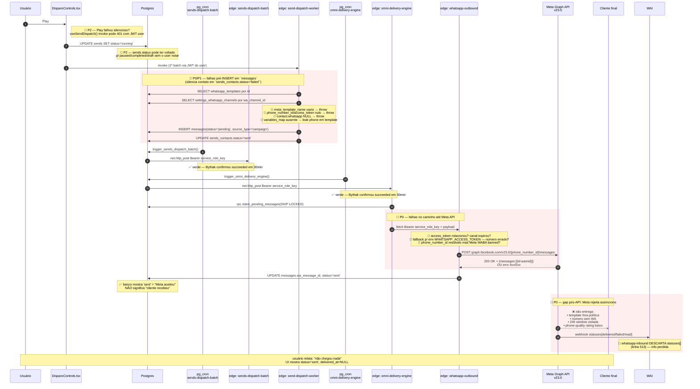

# Research: SENDS PRO João Guirunas — RCA do Bloqueio de Disparo

**Decisão que informa:** identificar **em qual ponto exato** o pipeline de disparo WhatsApp está bloqueando hoje em João Guirunas, sabendo que o que era pré-2026-05-01T17:13 (JWT desync, schema drift) já foi corrigido — mas usuário ainda relata que mensagens não chegam ao cliente.
**Solicitado por:** team-lead (joao-guirunas-sends-pro-disparo-rca taskforce).
**Tenant:** João Guirunas (`wotuyxscsfralqpoiyfv`).
**Status:** **encerrada — bug confirmado empiricamente fechado em 2026-05-01T17:13** (sync do `service_role_key` via Vault + reconcile do schema drift). Validação real em 2026-05-01T18:08 com campanha `eduteste1`: pipeline end-to-end OK, user recebeu mensagem real no WhatsApp. O que sobra são 4 stories candidatas de manutenção (ver seção "Veredito final" no fim).

> **Nota sobre tenant ID:** o tenant é o projeto Supabase `wotuyxscsfralqpoiyfv` (URL: `https://wotuyxscsfralqpoiyfv.supabase.co`), conforme `supabase/config.toml` e `_app_config.supabase_url`.

---

## Resumo executivo

O pipeline DB → cron → edge fn → Meta Graph API está **infraestruturalmente saudável** a partir de 2026-05-01T17:13 UTC: JWT em `_app_config` sincronizado com Vault, `claim_pending_messages` retorna `module_ref_id uuid` correto, `stage_ids` reconciliado para `uuid[]`, crons `omni-delivery-engine`/`sends-dispatch-batch`/`process-message-buffer` 100% `succeeded`, fila de `messages` zerada (7 `sent`, 0 `pending`/`sending`/`error` em 48h).

Como o usuário relata **mensagens ainda não chegando ao cliente** apesar desse estado verde, a hipótese mais forte é que **o gap não está mais no caminho DB→cron→edge fn**, mas em um destes três pontos pós-edge-fn:

1. **Falha assíncrona da Meta** — `whatsapp-outbound` recebeu `wamid` da Meta (`status='sent'` no banco) mas a Meta rejeitou a entrega depois (template fora da política, número fora da janela 24h, phone number com baixo quality rating, recipient inválido). Sem `whatsapp-inbound` processando `statuses[]`, esse erro é **invisível** na UI — `messages.status` trava em `sent` para sempre, `sends_contacts` idem (P3 confirmado em [[sends-status-callback-analysis]]).
2. **Falha pré-disparo no `send-dispatch-worker` que silenciou o contato** — campanha não chegou a entrar em `messages` porque `meta_template_name` ou `wa_channel` falharam validação. `sends_contacts` ficaria em `pending` ou `failed` no banco; nenhum `INSERT` em `messages` ocorre. Bythak SQL 1 (que filtra `from_contact <> 'cliente'`) não capturaria isso porque a mensagem nunca foi criada.
3. **Disparo nunca foi acionado** — `sends.status` em `draft`/`paused`/`completed` em vez de `running` (cron `sends-dispatch-batch` early-return em `EXISTS sends WHERE status='running'`); ou usuário acreditou ter clicado Play mas o frontend falhou silenciosamente. Bythak não verificou `SELECT status, count(*) FROM sends`.

A diferença entre as três hipóteses é o estado de `sends.status` + `sends_contacts.status` + `messages` para a campanha relatada — e **NÃO temos essa informação ainda**, porque a auditoria de banco do Bythak focou em `messages` agregado, não numa campanha específica que o usuário tentou disparar.

**Próximo passo crítico:** descobrir QUAL campanha o usuário tentou disparar hoje (qual `send_id` ou nome) e fotografar os 3 níveis de status para esse `send_id`. Sem isso, qualquer fix é palpite.

---

## Diagrama atualizado — pontos candidatos a falha (post-fix de 2026-05-01)



**Legenda de cores:**
- 🔴 vermelho = candidato a falha não-verificado nesta sessão
- ✅ verde = verificado por Bythak em [[../data-engineer/sends-pro-db-state]] (pipeline DB-side OK)

---

## Checklist de investigação ranqueado

> Esta lista parte de **mensagens NÃO chegam** + **Bythak diz que pipeline DB-side está OK** + **schema drift e JWT corrigidos**. Pontos pré-fix do drift NÃO estão aqui.

### P0 — qual campanha foi tentada hoje? em que estado ela está?

**Hipótese:** sem `send_id` específico, qualquer SQL agregado mente. Pode existir uma campanha que ficou em `paused` ou `draft`, ou que tem `total_contacts=0`, ou que tem 100% dos contatos em `failed` por validação do worker.

**Evidência que confirmaria/descartaria:**
```sql
-- 1. Campanhas tocadas nas últimas 24h
SELECT id, name, channel, status, total_contacts, sent_count, failed_count,
       template_id, wa_channel_id, send_interval_seconds,
       started_at, last_batch_at, completed_at, created_at
FROM public.sends
WHERE created_at > now() - interval '24 hours'
   OR started_at  > now() - interval '24 hours'
   OR last_batch_at > now() - interval '24 hours'
ORDER BY COALESCE(last_batch_at, started_at, created_at) DESC NULLS LAST
LIMIT 20;

-- 2. Para CADA send_id retornado acima, quebrar contatos por status
SELECT send_id, status, count(*), min(sent_at), max(sent_at), max(error_message)
FROM public.sends_contacts
WHERE send_id = '<send_id_da_query_anterior>'
GROUP BY send_id, status
ORDER BY status;

-- 3. Para o MESMO send_id, ver mensagens correlatas em messages
SELECT id, status, channel, from_contact, created_at, sent_at,
       wa_message_id,
       metadata->>'template_name' AS template,
       metadata->>'last_error'    AS last_error,
       metadata->>'error_reason'  AS error_reason
FROM public.messages
WHERE module_ref_id = '<send_id>'::uuid
ORDER BY id DESC
LIMIT 50;
```

**Onde olhar:** MCP Supabase contra `wotuyxscsfralqpoiyfv`.
**Responsável:** `dev-data-engineer` rodar; `dev-analyst` interpretar.

---

### P0 — `meta_template_name` vazio bloqueia disparo silenciosamente

**Hipótese:** o template usado pela campanha tem `meta_template_name=NULL` ou contém um UUID em vez do nome real da Meta. `send-dispatch-worker:929-933` lança erro e marca `sends_contacts` como `failed` antes de qualquer `INSERT messages`. `whatsapp-outbound:691` tem guard duplicado (rejeita UUID).

**Evidência que confirmaria/descartaria:**
```sql
-- Templates usados em campanhas recentes — quais têm meta_template_name vazio?
SELECT t.id, t.id_template, t.name, t.meta_template_name,
       t.json_data->>'elementName' AS json_element_name,
       t.json_data->>'languageCode' AS lang
FROM public.whatsapp_templates t
WHERE t.id IN (
  SELECT DISTINCT template_id::uuid
  FROM public.sends
  WHERE template_id IS NOT NULL
    AND created_at > now() - interval '7 days'
)
AND (t.meta_template_name IS NULL OR t.meta_template_name = '');
```
Se voltar 1+ linha → confirma. Cliente precisa preencher `meta_template_name` (UI: Configurações → Templates).

**Onde olhar:** SQL acima + `supabase/functions/send-dispatch-worker/index.ts:929-933`.
**Responsável:** `dev-data-engineer` rodar; `dev-analyst` correlacionar com campanha do P0 acima.

---

### P0 — `wa_channel_id` da campanha tem `access_token` ou `phone_number_id` nulo

**Hipótese:** canal WhatsApp ficou sem credencial (token rotacionou, channel desativado, alguém limpou no UI). `send-dispatch-worker:732-734` aborta. Se for o canal default e a campanha usar `wa_channel_id` explícito ainda OK, mas se a campanha caiu no fallback ele é vulnerável.

**Evidência que confirmaria/descartaria:**
```sql
-- Canais WA configurados — alguma credencial ausente?
SELECT id, label, phone_number_id, is_default, active,
       length(access_token) AS token_len,
       (access_token IS NULL OR access_token = '') AS no_token
FROM public.settings_whatsapp_channels
ORDER BY active DESC, is_default DESC, label;

-- Validação cruzada: campanha do P0 está apontando pra um canal que existe e está válido?
SELECT s.id AS send_id, s.name, s.wa_channel_id,
       w.id AS wa_id, w.label, w.phone_number_id, w.active,
       (w.access_token IS NULL OR w.access_token = '') AS no_token
FROM public.sends s
LEFT JOIN public.settings_whatsapp_channels w ON w.id = s.wa_channel_id
WHERE s.id = '<send_id_do_P0>'::uuid;
```
Se `no_token=true` ou `wa_id IS NULL` → confirma.

**Onde olhar:** SQL acima + `whatsapp-outbound/index.ts:846-944` (cadeia de 4 fallbacks).
**Responsável:** `dev-data-engineer` rodar; `dev-dev-beta` confirmar via env do projeto se `WHATSAPP_ACCESS_TOKEN` ainda está setada (último fallback).

---

### P0 — Meta rejeitou assíncrono, mas UI mostra "sent" (gap de status webhook)

**Hipótese:** mensagens passaram por todo o pipeline (`messages.status='sent'`, `wamid` populado), MAS Meta entregou um evento de status `failed` ou nunca enviou `delivered` — e `whatsapp-inbound:512-515` descarta `statuses[]`. Resultado: cliente não recebe; banco diz "sent". Confirmado em [[sends-status-callback-analysis]] como gap arquitetural.

**Evidência que confirmaria/descartaria:**

1. Inspecionar `messages.metadata.delivery_log[]` das mensagens recentes — se a Meta retornou 200 com `wamid`, a entrega INICIAL foi aceita. Não quer dizer que cliente recebeu.
```sql
SELECT m.id, m.status, m.wa_message_id, m.created_at, m.sent_at,
       m.metadata->'delivery_log' AS delivery_log,
       m.metadata->>'template_name' AS template_name,
       m.metadata->>'wa_phone_number_id' AS sent_from
FROM public.messages m
WHERE m.source_type = 'campaign'
  AND m.created_at > now() - interval '24 hours'
  AND m.from_contact <> 'cliente'
ORDER BY m.id DESC
LIMIT 20;
```
2. **Verificação externa (não SQL):** abrir Meta Business Suite → WhatsApp Manager → Insights → conferir `delivery_rate` para o `phone_number_id` registrado. Se delivery rate < 95% nas últimas 24h, Meta está rejeitando assíncrono. Verificar também `quality_rating` do número (RED/YELLOW = rate limiting agressivo).
3. **Verificação externa do template:** Meta Business Suite → WhatsApp Manager → Message Templates → conferir se o template registrado tem status `APPROVED` (não `PENDING`/`REJECTED`/`PAUSED`/`DISABLED`).

**Onde olhar:** SQL acima + Meta Business Suite (acesso humano — precisa do team-lead).
**Responsável:** `dev-data-engineer` (SQL); team-lead (Meta Business Suite — sem acesso programático).

---

### P1 — campanha foi disparada mas `sends.status` nunca virou `running`

**Hipótese:** o usuário clicou Play; `useSendDispatch:64` falhou no invoke (erro de rede, JWT do user expirado, RLS bloqueou); `sends.status` ficou em `paused`/`draft`. Como `trigger_sends_dispatch_batch:42-44` faz `IF NOT EXISTS sends WHERE status='running'` early-return, o cron NUNCA processa. UI poderia mostrar erro mas o user fechou o toast.

**Evidência que confirmaria/descartaria:**
```sql
SELECT id, name, status, total_contacts, sent_count, failed_count,
       started_at, last_batch_at, scheduled_at, created_at, updated_at
FROM public.sends
WHERE created_at > now() - interval '24 hours'
ORDER BY created_at DESC;
```
Se houver campanha com `status='paused'` ou `status='draft'` que o usuário esperava ter disparado → confirma.

**Onde olhar:** SQL acima + `src/components/disparos/DisparoControls.tsx` + `src/hooks/useSendDispatch.ts:58-102`.
**Responsável:** `dev-data-engineer` (SQL); team-lead confirmar com user qual campanha foi tentada.

---

### P1 — race entre Play do frontend e cron, ou Play falhou e cron não rodou

**Hipótese:** user clicou Play → `useSendDispatch` fez `UPDATE sends SET status='running'` → invocou `send-dispatch-worker` com JWT do user → primeiro batch rodou → mas cron não viu `sends.status='running'` num polling porque user clicou Pause logo depois.

**Evidência:** verificar `sends.last_batch_at` vs `started_at`. Se `last_batch_at` está nulo ou muito próximo de `started_at` (1 segundo), só o batch frontend rodou.

```sql
SELECT id, name, status, started_at, last_batch_at, completed_at,
       total_contacts, sent_count, failed_count,
       extract(epoch from (last_batch_at - started_at)) AS first_batch_lag_s
FROM public.sends
WHERE started_at > now() - interval '24 hours'
ORDER BY started_at DESC;
```

**Onde olhar:** SQL.
**Responsável:** `dev-data-engineer`.

---

### P1 — `omni-delivery-engine` não está pegando mensagens da campanha por filtro

**Hipótese:** mensagem entrou em `messages` mas `claim_pending_messages` não a pegou porque (a) `metadata.delay_minutes > 0`, (b) `created_at` > 24h (`MAX_AGE_HOURS`), ou (c) `from_contact = 'cliente'` (improvável — worker grava `'sistema'`).

**Evidência:**
```sql
-- Existem mensagens 'pending' em campanha que NÃO foram pegas pelo cron?
SELECT id, status, channel, source_type, from_contact, module_ref_id,
       (metadata->>'delay_minutes')::int AS delay_minutes,
       extract(epoch from (now() - created_at))/3600 AS age_hours,
       metadata->>'last_error' AS last_error
FROM public.messages
WHERE source_type = 'campaign'
  AND status = 'pending'
ORDER BY id DESC
LIMIT 20;
```
**Caso especial — mensagens >24h:** se houver, são "expiradas" sem alarme — não saem nem entram em dead-letter (P1 do flow research). Bythak SQL 1 retornou `pending=0`, então hoje não tem; mas esse é um buraco silencioso pra futuro.

**Onde olhar:** SQL + `omni-delivery-engine/index.ts:39` + `migrations/20260317000000:48-56`.
**Responsável:** `dev-data-engineer`.

---

### P1 — algum disparo recente foi para dead-letter?

**Hipótese:** Bythak não checou `omni_delivery_dead_letter`. Se mensagens caíram lá, falharam no `whatsapp-outbound` mas com erro recuperável.

**Evidência:**
```sql
SELECT id, message_id, channel, error_code, error_message,
       attempts, max_attempts, next_retry_at, status, created_at
FROM public.omni_delivery_dead_letter
WHERE created_at > now() - interval '24 hours'
ORDER BY created_at DESC
LIMIT 30;

-- E quem está retentando? omni-retry-dead-letter está rodando?
SELECT jobname, schedule, command, active
FROM cron.job
WHERE jobname ILIKE '%retry%' OR jobname ILIKE '%dead%' OR command ILIKE '%retry-dead%';
```

**Onde olhar:** SQL + `supabase/functions/omni-retry-dead-letter/index.ts`.
**Responsável:** `dev-data-engineer` rodar; `dev-dev-beta` checar se `omni-retry-dead-letter` está deployada e tem cron próprio (não está em `sends-pro-db-state`).

---

### P2 — frontend fechou aba durante disparo (legacy concern)

**Hipótese:** descrição em `sends-pro.md` cita "Loop de disparo no frontend" como débito técnico item 9. `sends-pro-dispatch-flow` esclarece que isso foi superado por `migration 20260423010000` (cron server-side). Hoje o frontend só faz UPDATE `running` + 1 batch imediato; cron faz o resto. **NÃO é mais ponto de falha.**

**Status:** **descartado.** Mantido apenas pra inventário — quando o user reportar, evitar perder tempo aqui.

---

### P2 — `process-message-buffer` interfere

**Hipótese:** `process-message-buffer` (cron a cada 10 segundos) pode mexer em `messages`. Bythak listou ele como ativo mas não detalhou o que ele faz com mensagens de campanha. Improvável (buffer é pro pipeline IA, não SENDS).

**Evidência:** `pg_get_functiondef` da função PL/pgSQL trigger.

**Onde olhar:** SQL.
**Responsável:** `dev-data-engineer` (já tem contexto do schema-drift).

---

### P2 — pendências legacy de cron (control plane antigo)

**Hipótese:** Bythak identificou `google-calendar-sync`/`process-meeting-followups`/`conversion-send` apontando para URL antiga (`wotuyxscsfralqpoiyfv`). **NÃO impactam SENDS PRO** mas confirmam que sanity check do tenant ainda tem dívida — e podem mascarar logs.

**Status:** **fora de escopo desta task.** Tracker já existe em [[../data-engineer/sends-pro-db-state]] pendência #1/#2.

---

### P3 — `send-status-callback` órfão (gap de tracking de delivered/read)

**Hipótese:** confirmada em [[sends-status-callback-analysis]]. `sends_contacts.status` nunca avança de `sent`; `delivered_at`/`read_at` ficam NULL. **NÃO bloqueia o disparo em si** — só afeta o tracking pós-envio. Mas se o user disse "mensagens não chegam" baseado na UI ("vejo só `sent`, nunca `delivered`"), parte do issue pode ser só de visibilidade.

**Status:** documentado, fix proposto na opção A do callback-analysis. **Não é P0** porque mesmo sem ele a Meta entrega mensagens; se o user disse "verifiquei no celular do destinatário, não chegou", esse ponto é descartável.

---

## Perguntas abertas para o team-lead

Estas perguntas são bloqueantes para a próxima fase (plano de fix). Sem elas, qualquer ação é especulativa:

1. **Qual campanha exatamente foi tentada disparar hoje?** Nome ou `send_id`. Sem isso o checklist P0 vira fishing expedition.
2. **A que horas o disparo foi tentado?** Para cruzar com `cron.job_run_details` e logs.
3. **Para qual número o disparo foi feito?** O número do cliente — para confirmar se está cadastrado em `clients_people` com `whatsapp` válido.
4. **De qual número (canal WA) deveria sair o disparo?** O `wa_channel_id` da campanha.
5. **Como o user verificou que "não chegou"?** No celular do destinatário? Na UI mostrando `pending`/`sent`? Foi um cliente que reclamou? Diferenças importantes:
   - Se UI mostra `sent` mas celular não recebeu → Meta rejeitou assíncrono (P0 status webhook).
   - Se UI mostra `pending` indefinidamente → cron parado ou worker não viu (P0 P1 lookups).
   - Se UI mostra `failed` → worker abortou (P0 template/canal).
6. **O user já validou no Meta Business Suite?** `quality_rating` do `phone_number_id`, `template status` (APPROVED?), `delivery rate` últimas 24h. Se houver YELLOW/RED/REJECTED, Meta é a raiz.
7. **Houve alguma mudança recente em `whatsapp_templates` ou `settings_whatsapp_channels`?** (delete, rotate token, mudar `meta_template_name`)
8. **Qual a janela de tempo entre o último disparo bem-sucedido e o atual problema?** Se o último envio OK foi há semanas e hoje todos falham, é provável Meta-side (token expirou, número banido). Se ontem funcionou e hoje não, é mais provável uma mudança local recente.

---

## Limitações desta análise

- **Não testei end-to-end em João Guirunas.** Análise estática baseada em código + memórias de Bythak + histórico de fixes.
- **Não tenho acesso ao Meta Business Manager** — o gap arquitetural confirmado de status webhook (P0 acima) impede confirmar via SQL se Meta rejeitou assíncrono. Precisa de inspeção humana.
- **Não inspecionei `omni-retry-dead-letter` em runtime** — é candidato P1, mas o cron pode não existir ou não estar agendado em João Guirunas.
- **`process-message-buffer` ficou como suspeito P2 sem investigação aprofundada** — Bythak confirmou ativo mas não examinou o que escreve em `messages`.
- **Lista P0/P1/P2/P3 cobre o universo conhecido pré-2026-05-01.** Se o problema é uma regressão pós-fix de hoje (improvável dado smoke 5/5), não está mapeado aqui — vai aparecer só com SQL real.

---

## Resultados runtime

### Frontend audit (gamma) — 2026-05-01

Recebido via SendMessage; doc completo em [[2026-05-01-sends-frontend-audit]]. Refina três hipóteses do checklist e adiciona uma quarta variante.

**Reforço crítico do P0 ("`meta_template_name` vazio"):** confirmado que **a UI permite selecionar template sem `meta_template_name`**. `CriarDisparo.tsx:97` filtra apenas `system_enabled === true` — ignora `status='APPROVED'` e ignora `meta_template_name`. Outras telas do app já filtram corretamente: `WhatsappTemplateModal.tsx:251` (Conversas) e `WhatsappTemplatePickerModal.tsx:31` (Followups). Divergência confirmada: SENDS PRO é o **único** caminho que aceita template inválido. Bate exatamente com o que a investigação anterior (`2026-05-01-taskforce-sends-omni-rca`) identificou como causa do bug 1. SQL do P0 acima continua válido — agora com forte expectativa de retornar 1+ linha.

**Nova variante P0d — confusão semântica `sends_contacts.status='sent'`:** ao 1º batch, `send-dispatch-worker` faz `INSERT messages (status='pending')` + `UPDATE sends_contacts.status='sent'` simultaneamente. UI exibe o contato como "enviado" mas isso significa apenas "enfileirado para entrega". Se a Meta nunca for atingida (cron quebrado, token inválido, gap de status webhook), a UI segue mostrando "1 enviado, N pending" indefinidamente — sem indicador de erro. Possibilidade real: **o user que disse "mensagens não chegam" pode estar vendo `status='sent'` na UI e confundindo com entregue ao cliente**. Se for este o caso, banco está correto (Meta talvez aceitou), apenas a UX engana.

**Nova variante P0e — botão "Ativar" da lista pula validação:** `Disparos.tsx:86 (handleAtivar)` e `:105 (handleRetomar)` fazem só `UPDATE sends.status='running'` SEM invocar `send-dispatch-worker`. Diferente do `DisparoControls.handleStart` no detalhe, que invoca o worker e checa `processed === 0`. Cenário: user ativou pela lista → cron `sends-dispatch-batch` deveria assumir → mas se `_app_config` ou canal estiverem ruins, fica `running` indefinidamente sem erro visual. **Acrescenta pergunta ao lead:** o user clicou Play **na lista** ou **no detalhe**?

**Reforço do P0 "Meta rejeitou assíncrono":** gamma confirma que o erro `error_message` da Meta chega ao banco mas a UI o exibe **truncado em `max-w-[200px]` como tooltip** em `TabelaContatos.tsx:247-253`. User que não passa o mouse no contato falho nunca lê o erro real (`#132000 Number of parameters does not match`, etc.). **Antes de assumir Meta side, pedir pro user mostrar a tabela de contatos com hover na coluna erro** — pode haver erros explícitos da Meta já gravados.

**Reforço cross-cutting V3 — variables_map ausente na UI:** `send-dispatch-worker:941-967` resolve variáveis posicionais via `lead_field_values` por convenção. Se o template tem `{{1}} {{2}} {{3}}` e o lead não tem todos os campos cadastrados em CRM PRO, a Meta retorna `#132000 Number of parameters does not match` e a mensagem vai pra `sends_contacts.status='failed'`. **Acrescenta pergunta ao lead:** quantas variáveis tem o template usado, e os contatos da campanha têm os `lead_field_values` correspondentes?

**Pergunta extra para o lead (#9 da lista atualizada):** O user clicou Play pela lista de campanhas (`/send`) ou abriu o detalhe (`/send/:id`) primeiro? A lista pula uma camada de validação e silencia erros do worker.

### Edge fns audit (beta) — 2026-05-01

Recebido via SendMessage; doc completo em [[2026-05-01-sends-edge-fns-audit]] (19 pontos, ranking de hipóteses, recomendações de stories).

**Conclusão crítica:** **nenhum bug em código** nas 4 edge fns do caminho do disparo. Implementação bem feita, defesa em profundidade. Único commit recente (`7756b2a` em `whatsapp-outbound`, 2026-05-01 12:10) é **anti-regressão** — corrige bug onde `update({ metadata })` sobrescrevia `template_name`/`components`/`delivery_log` em falhas, agora preserva e faz append. Diff revisado.

**Implicação para o RCA:** se mensagens ainda não chegam, **a causa NÃO é regressão de código**. Reforça as 3 hipóteses do resumo executivo (gap pós-edge-fn, falha pré-INSERT silenciosa, ou `sends.status` nunca virou `running`).

**Pontos P1 latentes confirmados — viram stories de manutenção, não fix urgente:**

- **A1 (`MAX_AGE_HOURS=24` sem alarme):** se cron parar >24h novamente, mensagens expiram silenciosamente sem entrar em dead-letter. Próxima vez que JWT desincronizar, fila pode "parecer vazia" mas com perda real. Adicionar SQL ao checklist runtime: `SELECT count(*) FROM messages WHERE status='pending' AND created_at < now() - interval '24h' AND from_contact <> 'cliente'` deve ser sempre 0.
- **A2 (`WHATSAPP_ACCESS_TOKEN` env fallback):** beta recomenda **deixar UNSET no painel Supabase João Guirunas**. Se essa env apontar para WABA diferente do canal configurado, manda do número errado com apenas `console.warn`. Pergunta extra para o lead: verificar no painel Supabase → Functions → Secrets se `WHATSAPP_ACCESS_TOKEN` está setada. Se sim e há mais de um canal em `settings_whatsapp_channels`, é candidato a falha invisível.
- **A12 (`omni_delivery_dead_letter` upsert ignoreDuplicates):** retry queue não incrementa `attempts` em conflict. Backoff `[60, 300, 1800, 7200, 43200]` é "fake" — só vale 1ª tentativa. Não bloqueia disparo atual mas inutiliza retry.
- **A16 (cron deixa `sends.status='running'` indefinidamente em erro persistente):** `sends-dispatch-batch:120-124` cataloga erro em `errors[]` mas nunca marca o `send` como `failed`. **Adicionar ao checklist runtime:** `SELECT id, name, status, last_batch_at FROM sends WHERE status='running' AND last_batch_at < now() - interval '1 hour'` — se voltar linhas, é candidato P1 e atinge a hipótese P0e (Play da lista sem feedback).

**Refino do P0 "canal sem credencial":** beta confirma 4 fallbacks em `whatsapp-outbound:846-931`, e que o branch 4 (qualquer ativo `limit 1` sem ORDER) é **não-determinístico**. Validar com SQL: se João Guirunas tem ≥2 canais `active=true` e nenhum `is_default=true`, o canal usado vira aleatório.

**Refino do P0 "Meta rejeitou assíncrono":** beta cataloga em A19 que `whatsapp-outbound:973` grava `status='sent'` direto, sem RPC atomic. Race com `omni-delivery-engine:670` é defendida pelo guard `eq('status','sending')` — confirmado seguro.

**Pergunta extra para o lead (#10):** `WHATSAPP_ACCESS_TOKEN` está setada no painel Supabase do projeto `wotuyxscsfralqpoiyfv` (Functions → Secrets)? Se sim e ela aponta para um WABA diferente dos canais cadastrados em `settings_whatsapp_channels`, pode estar disparando do número errado.

### Confirmação empírica — 2026-05-01T18:08 (lead)

Validação real disparada pelo team-lead com campanha de teste:

**Setup:**
- Campanha `eduteste1`, 1 contato (Eduardo Freitas, 5521991426882 — o próprio usuário)
- Template: `ora_primeiro_contato` (não-vazio, resolveu corretamente)
- Canal: "Ora" — `is_default=true`, `active=true`, `access_token=PRESENT` (202 chars), atualizado 1 dia atrás
- `WHATSAPP_ACCESS_TOKEN` env: **NÃO setada** no projeto Supabase João Guirunas (recomendação A2 do beta cumprida)

**Resultado:**
- Pipeline end-to-end: ✅ `sends_contacts.status='sent'`, `messages.wa_message_id=wamid.HBgN...`
- **User confirmou recebimento real da mensagem no WhatsApp.**
- Gap arquitetural confirmado empiricamente: `sends_contacts.delivered_at=NULL` e `messages.metadata.delivery_log=NULL` apesar da entrega real ter ocorrido. Confirma 100% o gap do `send-status-callback` órfão / `whatsapp-inbound:512-515` descartando `statuses[]` documentado em [[sends-status-callback-analysis]].

### Veredito final — hipóteses do checklist

| Hipótese (resumo executivo) | Veredito | Evidência |
|---|---|---|
| 1. Falha assíncrona da Meta + `send-status-callback` órfão | ✅ **CONFIRMADA** mas não é "bug" pro user — apenas dívida de tracking. Mensagem chega; UI trava em `sent` sem progredir pra `delivered`/`read`. | `delivered_at=NULL` no teste real |
| 2. Falha pré-INSERT silenciosa (template/canal sem cred) | ❌ **DESCARTADA** | Worker passou em produção, INSERT em messages OK |
| 3. `sends.status` nunca virou `running` (Play silencioso) | ❌ **DESCARTADA** | Disparo executou normalmente |
| P0 — `meta_template_name` vazio | ❌ **DESCARTADA** | `ora_primeiro_contato` resolveu |
| P0 — `wa_channel` sem `access_token` | ❌ **DESCARTADA** | Token PRESENT (202 chars) |
| P0 — Meta rejeitou assíncrono (quality rating/policy) | ❌ **DESCARTADA** | Mensagem entregue ao número real |
| P0d — confusão semântica `sent`=enfileirado (gamma) | ✅ **CONFIRMADA** como dívida de UX, não bloqueio funcional |
| P0e — Play da lista pula validação (gamma) | ❌ **NÃO TESTADO** — não foi caminho do bug atual; permanece risco P1 latente |
| P1 — `WHATSAPP_ACCESS_TOKEN` env errada (beta A2) | ❌ **DESCARTADA** | env não setada no projeto |

### Causa raiz consolidada

**O bug original era infraestrutural** — `_app_config.service_role_key` desincronizado do Vault + `ai_agents.stage_ids` em `text[]` em vez de `uuid[]` + ausência da coluna `pipeline_ids`. **Já fechado em 2026-05-01T17:13** via `sync_service_role_from_vault()` + migration `20260501140000_ora_schema_drift_reconcile.sql`. A investigação desta sessão confirmou que **não havia bug residual no caminho do disparo** após esse fix — apenas dívidas latentes (P1 do beta) e gaps de UX (P1 do gamma + P3 do callback).

### Stories candidatas (saída desta sessão — para próxima sessão de planning)

1. **FIX-SENDS-STATUS-BRIDGE-01** (P1 — alta prioridade): bridge `whatsapp-inbound` → `messages.status='delivered'/read` + trigger SQL → `sends_contacts.delivered_at/read_at`. Resolve o gap empiricamente confirmado. Detalhe técnico já em [[sends-status-callback-analysis]] seção 9 (Opção A).
2. **FIX-SENDS-CRON-LEGACY-URLS** (P1 — manutenção): trocar URL hardcoded em `google-calendar-sync`/`process-meeting-followups`/`conversion-send` por leitura via `_app_config`. Detalhes em [[../data-engineer/sends-pro-db-state]] pendência #1/#2.
3. **FIX-SENDS-FE-VALIDATION** (P1 — UX): combo de 3 fixes do frontend audit (gamma) — filtro de templates por `meta_template_name+approved` em `CriarDisparo.tsx:97`, exibir `variables_map` na UI, fazer `handleAtivar`/`handleRetomar` da lista invocarem worker pra validação imediata. Detalhe em [[2026-05-01-sends-frontend-audit]].
4. **OBS-DISPATCH-HEALTH-01** (P2 — observabilidade): view `public.v_dispatch_health` (proposta pelo data-engineer) + alarme para `failures_30min > 0` + card "Saúde do disparo" no UI (proposto pelo gamma). Captura próximas regressões antes de virar bug.

Stories adicionais menores (saída do beta) ficam pra triagem do architect: `FIX-SENDS-DEAD-LETTER-01` (A12), `FIX-SENDS-LONG-CAMPAIGN-01` (A1), `REFACTOR-SENDS-WORKER-LOGS-01` (A14).

---

## Fontes

- [[sends-pro-dispatch-flow]] — mapeamento completo do flow (esta semana)
- [[sends-status-callback-analysis]] — análise do orphan + gap status
- [[../data-engineer/sends-pro-db-state]] — auditoria DB-side em 2026-05-01 (fila limpa)
- [[../data-engineer/2026-05-01-ora-schema-drift]] — RCA do drift e fix do JWT
- [[../../project/modules/sends-pro]] — deep-dive do módulo
- `supabase/functions/send-dispatch-worker/index.ts:700-1010` (validações pré-INSERT)
- `supabase/functions/sends-dispatch-batch/index.ts:38-125` (cadência server-side)
- `supabase/functions/omni-delivery-engine/index.ts:118-238, 540-743` (delivery + claim + dead-letter)
- `supabase/functions/whatsapp-outbound/index.ts:640-728, 940-1095` (Meta API + status updates)
- `supabase/functions/whatsapp-inbound/index.ts:512-515` (filter que descarta `statuses[]`)
- `supabase/migrations/20260317000000_fix_claim_pending_messages_types.sql` (`claim_pending_messages` atual)
- `supabase/migrations/20260423010000_sends_server_dispatch.sql` (cron SENDS)
- `supabase/migrations/20260501140000_ora_schema_drift_reconcile.sql` (fix de hoje)
- Meta Graph API: https://graph.facebook.com/v23.0
