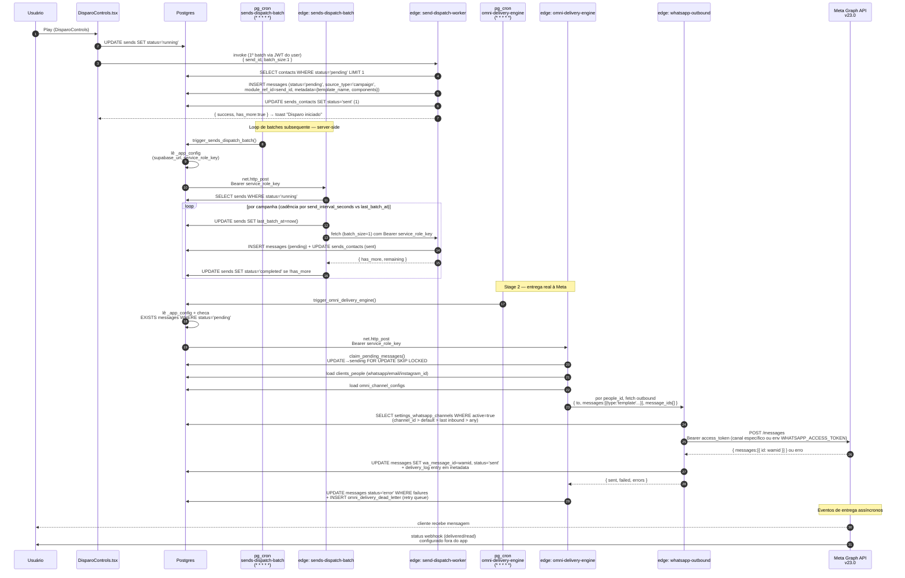

# Research: SENDS PRO — Fluxo Completo de Disparo WhatsApp

**Decisão que informa:** RCA do bug 1 (template não chega), correlação com schema drift de João Guirunas, e auditoria de pontos de falha do pipeline DB → cron → edge fn → Meta API.
**Solicitado por:** team-lead.
**Tenant referência:** João Guirunas (`wotuyxscsfralqpoiyfv`).

## Resumo executivo

O disparo WhatsApp do SENDS PRO segue um pipeline em **dois estágios via filas**:

1. **Estágio SENDS** — `sends-dispatch-batch` (cron 1min) consome `sends.status='running'` e chama `send-dispatch-worker` por campanha. O worker NÃO chama Meta API; apenas faz `INSERT` em `messages` (status `pending`) e marca `sends_contacts.status='sent'` (estado interno: "enfileirado pra entrega"; não significa "entregue ao cliente").
2. **Estágio OMNI** — `omni-delivery-engine` (cron 1min) faz `claim_pending_messages()` (`FOR UPDATE SKIP LOCKED`), agrupa por `people_id`, chama `whatsapp-outbound`, que enfim disparou para `graph.facebook.com/v23.0/{phone_number_id}/messages` usando `access_token` de `settings_whatsapp_channels`.

A documentação do módulo (`docs/smart-memory/project/modules/sends-pro.md`) está **desatualizada**: descreve loop de disparo via `setInterval` no browser; a realidade hoje é server-side via `pg_cron` + `last_batch_at` (migration `20260423010000_sends_server_dispatch.sql`). A frase "Loop de disparo no frontend" do débito técnico item 9 foi superada.

A migration de schema João Guirunas (`20260501140000_ora_schema_drift_reconcile.sql`) e o sync do `service_role_key` (`sync_service_role_from_vault()`) são pré-requisitos: sem o JWT atualizado em `_app_config`, AMBOS os crons falham silenciosamente porque `trigger_sends_dispatch_batch()` e `trigger_omni_delivery_engine()` autenticam contra as edge fns com Bearer JWT lido de `_app_config.service_role_key`.

## Diagrama do fluxo



## Componentes identificados

### 1. Tabela de fila — `messages` + `sends_contacts`

A "fila" é dupla: `sends_contacts.status='pending'` é a fila DO SENDS PRO; `messages.status='pending'` é a fila REAL da entrega WhatsApp.

**`sends_contacts`** (campanha-nível) — colunas de status:
- `status text` — `pending | sent | delivered | read | failed | invalid`
- `retry_count int` (max 3)
- `sent_at`, `delivered_at`, `read_at`, `error_message`

Path: `docs/smart-memory/project/modules/sends-pro.md:188-199`

**`messages`** (entrega-nível, mesma tabela do OMNI PRO) — colunas relevantes:
- `status` — `pending | sending | sent | delivered | read | error`
- `from_contact` — `cliente | sistema | ia` (`!= 'cliente'` é outbound)
- `source_type` — `'campaign'` quando enfileirada por SENDS PRO
- `module_ref_id` — uuid da campanha (`sends.id`)
- `whatsapp_template_id` — text (UUID de `whatsapp_templates`)
- `wa_phone_number_id` — text
- `metadata` jsonb — `{ template_name, language_code, components, send_id, send_name, delivery_log[] }`

Path: `supabase/functions/send-dispatch-worker/index.ts:985-1003` (INSERT)
Path: `supabase/functions/omni-delivery-engine/index.ts:43-60` (interface)

### 2. Mecanismo que dispara — pg_cron + funções SECURITY DEFINER

Existem **dois** jobs `pg_cron` independentes, ambos com schedule `'* * * * *'` (a cada minuto):

| Job name | Função SQL | Edge fn alvo | Migration |
|---|---|---|---|
| `sends-dispatch-batch` | `trigger_sends_dispatch_batch()` | `sends-dispatch-batch` | `supabase/migrations/20260423010000_sends_server_dispatch.sql:61` |
| `omni-delivery-engine` | `trigger_omni_delivery_engine()` | `omni-delivery-engine` | `supabase/migrations/20260308020000_omni_delivery_engine_cron-ok.sql:59` |

Ambas funções:
- Lêem `supabase_url` e `service_role_key` de `_app_config` via `SELECT INTO`.
- Fazem early-return se nada pra processar (otimização).
- Usam `net.http_post` (extensão `pg_net`) para invocar a edge fn com `Authorization: Bearer <service_role_key>`.

Source: `supabase/migrations/20260423010000_sends_server_dispatch.sql:19-53`
Source: `supabase/migrations/20260308020000_omni_delivery_engine_cron-ok.sql:8-46`

Adicionalmente, o **frontend** (`DisparoControls.tsx:29`) dispara o **primeiro batch imediato** via `useSendDispatch()` para feedback de UI, depois entrega ao cron. Antes da migration `20260423010000`, o loop inteiro era browser-side (`setInterval` em `useSendDispatch.ts`); hoje o hook só chama 1 batch e finaliza.

Source: `src/components/disparos/DisparoControls.tsx:23-52`
Source: `src/hooks/useSendDispatch.ts:58-102`

### 3. Edge function que processa o envio

São **três** edge fns no caminho, cada uma com responsabilidade distinta:

**a) `sends-dispatch-batch`** — `supabase/functions/sends-dispatch-batch/index.ts`
- Lê todas `sends WHERE status='running'`.
- Para cada campanha, compara `last_batch_at + send_interval_seconds * 1000` vs `now()`.
- Se devido: faz UPDATE atômico de `last_batch_at` (anti-double-dispatch), depois invoca `send-dispatch-worker` via fetch HTTP com `Authorization: Bearer ${SERVICE_ROLE_KEY}` e `signal: AbortSignal.timeout(55000)` (cabe na janela cron de 1min).
- Marca `sends.status='completed'` quando worker retorna `has_more:false`.

**b) `send-dispatch-worker`** — `supabase/functions/send-dispatch-worker/index.ts`
- Aceita JWT do user OU service role key (linha 632: `const isServiceRole = token === serviceRoleKey`).
- Para WA: lê `settings_whatsapp_channels` por `wa_channel_id`, lê `whatsapp_templates` por `template_id`, resolve `meta_template_name` (linhas 926-933 — bloqueia se UUID ou vazio), faz hidratação de variáveis posicionais via `lead_field_values` + `variables_map` (linhas 941-967), monta `components[]` Meta v22+ com `parameter_name`, e **ENFIM faz INSERT em `messages`** com `status='pending'` (linha 985). Não chama Meta API.
- Para Email/SMS/Phone: chama `dispatchNonWhatsApp()` que rola o provider (SMTP/SendGrid/Twilio/webhook) **diretamente, in-line, com retry exponencial** (5s/15s/45s, AC-2). Esses canais NÃO passam pelo `omni-delivery-engine`.
- Atualiza `sends_contacts.status='sent'` ao concluir batch (line 1006-1009).

**c) `omni-delivery-engine`** — `supabase/functions/omni-delivery-engine/index.ts`
- Faz `claim_pending_messages(batch_size=20, max_age_hours=24)` — RPC `SECURITY DEFINER` que executa um `UPDATE messages SET status='sending' ... FOR UPDATE SKIP LOCKED` atomicamente, retornando o batch claimed. Anti-duplicação cross-cron.
- Carrega `clients_people` em batch (linha 587).
- Carrega `omni_channel_configs` em batch (linha 576).
- Agrupa por `channel`. Para WA: chama `deliverWhatsApp()` que agrupa por `people_id` e invoca `whatsapp-outbound` uma vez por pessoa.
- Pós-resposta: para falhas → `INSERT omni_delivery_dead_letter` com backoff `[60, 300, 1800, 7200, 43200]` (1min, 5min, 30min, 2h, 12h).

**d) `whatsapp-outbound`** — `supabase/functions/whatsapp-outbound/index.ts`
- Resolve `phone_number_id` + `access_token` em **4 fallbacks** (linha 846-931):
  1. `channel_id` explícito.
  2. `is_default=true && active=true`.
  3. Canal usado na última inbound da pessoa.
  4. Qualquer canal `active=true` (`limit 1`).
- Token cai para `WHATSAPP_ACCESS_TOKEN` env var como último recurso (linha 740).
- Para template message: chama `sendTemplateToMeta()` → `POST graph.facebook.com/v23.0/{phone_number_id}/messages` com `Authorization: Bearer <access_token>` e payload `{messaging_product, type:'template', template:{name, language, components}}`.
- Atualiza `messages.wa_message_id = wamid` e `status='sent'` por `id` (`message_ids[i]`).
- Append em `metadata.delivery_log[]` via `recordDeliveryAttempt()` — preserva `template_name`/`components` existentes (anti-overwrite, linha 589).

### 4. Autenticação Meta Graph API

Modelo de credenciais por canal armazenado em `settings_whatsapp_channels`:
- `id` uuid PK
- `phone_number_id` text — ID do número no Meta WABA
- `access_token` text — token Meta (long-lived ou system user)
- `label` text
- `active` bool, `is_default` bool

Não é cifrada via Vault (diferente de `_app_config.service_role_key`). É lida por `select('id, phone_number_id, access_token, label')` com service role key.

Header montado: `'Authorization': 'Bearer ' + accessToken`.

Source: `supabase/functions/whatsapp-outbound/index.ts:847-863`, `884-913`

Versão da API: hardcoded `const GRAPH_API_VERSION = 'v23.0'` (`whatsapp-outbound/index.ts:38`).

### 5. Caminho completo (path-by-path)

```
[Frontend]
  src/pages/Disparos.tsx                                  → user clica Play
  src/components/disparos/DisparoControls.tsx:23          → handleStart()
  src/hooks/useSendDispatch.ts:64                         → invoke send-dispatch-worker (1º batch)
                                                            ↓
[Stage SENDS — server-side]
  pg_cron job 'sends-dispatch-batch'  (* * * * *)
    └─ trigger_sends_dispatch_batch()                     migration 20260423010000:19
       └─ net.http_post → supabase/functions/sends-dispatch-batch/index.ts
          └─ fetch → supabase/functions/send-dispatch-worker/index.ts
             ├─ SELECT sends_contacts WHERE status='pending' LIMIT batch_size
             ├─ INSERT messages (status='pending', source_type='campaign')
             └─ UPDATE sends_contacts SET status='sent'
                                                            ↓
[Stage OMNI — server-side]
  pg_cron job 'omni-delivery-engine'  (* * * * *)
    └─ trigger_omni_delivery_engine()                     migration 20260308020000:8
       └─ net.http_post → supabase/functions/omni-delivery-engine/index.ts
          ├─ rpc claim_pending_messages()                 migration 20260317000000:7
          │    UPDATE messages SET status='sending' FOR UPDATE SKIP LOCKED
          └─ fetch → supabase/functions/whatsapp-outbound/index.ts
             ├─ SELECT settings_whatsapp_channels (4 fallbacks)
             ├─ POST https://graph.facebook.com/v23.0/{phone_number_id}/messages
             └─ UPDATE messages SET wa_message_id, status='sent'
                                                            ↓
[Cliente recebe via Meta WA]
[Meta envia status webhook → endpoint configurado fora do app]
```

## Pontos de falha possíveis

Ordenados por blast radius:

### P0 — `_app_config.service_role_key` desincronizado do Vault
**Onde:** `migrations/20260423010000_sends_server_dispatch.sql:29-30` e `migrations/20260308020000_omni_delivery_engine_cron-ok.sql:18-19`.
**Sintoma:** Ambos crons silenciosamente respondem 401 e não logam nada útil. Mensagens ficam em `sends_contacts.status='pending'` indefinidamente.
**Detecção:** `SELECT sync_service_role_from_vault()` corrige; verificar via `trigger_fwup01_smoke_test()` 5/5.
**Confirmado em João Guirunas:** sim, foi a RCA do bug 1 (ref: `archive/2026-05-01-ora-schema-drift.md`).

### P1 — `meta_template_name` ausente no template
**Onde:** `send-dispatch-worker/index.ts:926-933`.
```ts
const resolvedTemplateName = waTemplate.meta_template_name
  || (waTemplate.json_data?.elementName as string)
  || '';
if (!resolvedTemplateName) {
  throw new Error(`Template ... sem meta_template_name — preencha o campo`);
}
```
**Sintoma:** Worker lança erro, contato vai pra `failed`, nunca chega no `omni-delivery-engine`. `whatsapp-outbound:691` tem guard duplicado que rejeita UUID.
**Detecção:** Buscar `whatsapp_templates WHERE meta_template_name IS NULL`.

### P1 — `wa_channel_id` nulo ou canal sem `phone_number_id`/`access_token`
**Onde:** `send-dispatch-worker/index.ts:732-734` (validação inicial); `whatsapp-outbound/index.ts:933-944` (último recurso falha).
**Sintoma:** `send-dispatch-worker` rejeita o batch. Se passar (campanha tinha canal mas access_token foi rotacionado), `whatsapp-outbound` retorna 500 e msg vai pra dead-letter.
**Detecção:** Buscar `settings_whatsapp_channels WHERE active=true AND (phone_number_id IS NULL OR access_token IS NULL)`.

### P1 — `claim_pending_messages` filtra por `delay_minutes` em metadata
**Onde:** `migrations/20260317000000_fix_claim_pending_messages_types.sql:48-56`.
```sql
AND ((m.metadata->>'delay_minutes') IS NULL
  OR (m.metadata->>'delay_minutes')::int = 0
  OR (COALESCE(m.sent_at, m.created_at) + ((m.metadata->>'delay_minutes')::int * interval '1 minute') <= now()))
```
**Sintoma:** Se uma feature futura (ou pipeline IA) settar `metadata.delay_minutes`, mensagens ficam invisíveis ao cron. SENDS PRO atual não usa esse campo, mas é compartilhada com OMNI.
**Detecção:** `SELECT id, metadata->>'delay_minutes' FROM messages WHERE status='pending' AND (metadata->>'delay_minutes')::int > 0`.

### P1 — Janela `MAX_AGE_HOURS = 24h` no `omni-delivery-engine`
**Onde:** `omni-delivery-engine/index.ts:39` e `claim_pending_messages` arg `p_max_age_hours=24`.
**Sintoma:** Se um disparo ficar parado >24h (ex: cron quebrado o dia inteiro como aconteceu com JWT desync), as mensagens NÃO são mais entregues automaticamente — silenciosamente expiram. Sem alerta.
**Mitigação:** Reset manual via `UPDATE messages SET created_at=now()` ou re-disparo. Story candidata: alarme + re-enqueue manual.

### P2 — Race condition entre `sends-dispatch-batch` cron e botão Play do user
**Onde:** O frontend chama `send-dispatch-worker` no Play; cron pode rodar simultaneamente. `sends-dispatch-batch` previne via `UPDATE sends SET last_batch_at=now() WHERE status='running'` antes de invocar worker (linha 72-76), mas o Play do frontend não consulta `last_batch_at`.
**Sintoma:** Possível duplicação do primeiro batch (1 contato vai 2x via 2 INSERTs distintos em messages). Como `claim_pending_messages` usa `FOR UPDATE SKIP LOCKED`, no nível Meta isso vira 2 wamids distintos pro mesmo contato.
**Detecção:** Buscar `messages` com `module_ref_id, people_id` duplicados no mesmo segundo. Provavelmente raro (cron precisa coincidir com Play num intervalo de <1s).

### P2 — Schema drift `stage_ids` (text[] vs uuid[])
**Onde:** João Guirunas tenant (`ai_agents.stage_ids` ficou `text[]`).
**Sintoma:** Trigger `notify_lead_stage_changed` quebra com `operator does not exist: text[] @> uuid[]`. Não impacta SENDS PRO diretamente, mas a auditoria correlaciona com o cluster João Guirunas.
**Status:** Resolvido em João Guirunas via migration `20260501140000_ora_schema_drift_reconcile.sql`.

### P2 — `whatsapp-outbound` cai para `WHATSAPP_ACCESS_TOKEN` env var
**Onde:** `whatsapp-outbound/index.ts:740,857,909,928`.
**Sintoma:** Se canal correto não foi resolvido, fallback usa env var — pode mandar do número errado se ela apontar para outro WABA. Especialmente perigoso multi-canal.
**Detecção:** Logs `whatsapp-outbound: ... has no access_token, using env fallback`.

### P3 — `template_id` armazenado como `text` sem FK em `sends`
**Onde:** schema `sends.template_id text`.
**Sintoma:** Template pode ser deletado de `whatsapp_templates`; `send-dispatch-worker:705` faz `.maybeSingle()` e segue com `waTemplate=null`, depois lança "Template WhatsApp não definido" (linha 923). User descobre só ao tentar enviar.

### P3 — `send-status-callback` órfão
**Onde:** Edge fn existe mas nenhuma outra fn no repo a chama (apenas em `migrations/20260314135000_increment_field_rpc.sql` e `baseline.sql`). É um endpoint para Meta configurar status webhook DIRETAMENTE para SENDS, mas o webhook ativo da Meta provavelmente vai para `whatsapp-inbound` (que não atualiza `sends_contacts`).
**Sintoma:** `sends_contacts.status` nunca avança de `sent` para `delivered`/`read` automaticamente. A coluna `delivered_at`/`read_at` fica NULL.
**Detecção:** `SELECT status, count(*) FROM sends_contacts WHERE sent_at IS NOT NULL GROUP BY status` — se 100% ficam em `sent` mesmo após 24h, callback não está cabeado.
**Confirmar:** verificar configuração Meta Webhook no Business Manager.

## Limitações

- Não foi possível verificar via SQL direto se os jobs `pg_cron` estão `active=true` em João Guirunas (cron schema não exposto via REST). O smoke `trigger_fwup01_smoke_test()` 5/5 PASS no schema-drift report sugere OK pós-fix, mas pode haver regressão.
- Não inspecionei `process_message_buffer` (mencionado na schema-drift como rota AI), por estar fora de escopo da task atual.
- Não validei rotas de configuração de webhook Meta no Business Manager (configuração externa).
- Não testei o fluxo end-to-end em João Guirunas — apenas leitura estática do código + migrations + schema-drift.
- A doc do módulo `sends-pro.md` está desatualizada quanto ao loop frontend; recomendo atualização separada via dev-architect.

## Fontes

- `supabase/functions/send-dispatch-worker/index.ts` (1162 linhas) — worker SENDS
- `supabase/functions/sends-dispatch-batch/index.ts` (148 linhas) — cron consumer SENDS
- `supabase/functions/omni-delivery-engine/index.ts` (744 linhas) — engine de entrega
- `supabase/functions/whatsapp-outbound/index.ts` (1096 linhas) — Meta API client
- `supabase/functions/send-status-callback/index.ts` — callback Meta (parcialmente órfão)
- `supabase/migrations/20260423010000_sends_server_dispatch.sql` — cron SENDS
- `supabase/migrations/20260308020000_omni_delivery_engine_cron-ok.sql` — cron OMNI
- `supabase/migrations/20260317000000_fix_claim_pending_messages_types.sql` — RPC FOR UPDATE SKIP LOCKED
- `src/components/disparos/DisparoControls.tsx` — gatilho frontend
- `src/hooks/useSendDispatch.ts` — invoke do 1º batch
- `docs/smart-memory/agents/data-engineer/2026-05-01-ora-schema-drift.md` — RCA bug 1
- `docs/smart-memory/project/modules/sends-pro.md` — deep-dive (desatualizado quanto ao loop)
- Meta Graph API v23.0 — `https://graph.facebook.com/v23.0/{phone_number_id}/messages`
