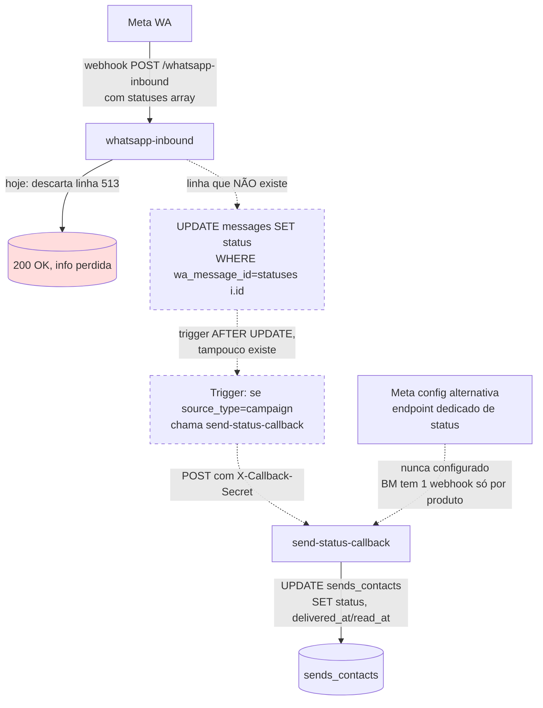

# Research: `send-status-callback` — Análise de Órfão e Gap de Status

**Decisão que informa:** confirma o ponto P3 do `sends-pro-dispatch-flow` — `sends_contacts.status` não avança de `sent` para `delivered/read` automaticamente porque o pipeline de eventos de status da Meta não está cabeado.
**Solicitado por:** team-lead.

## Resumo executivo

**Veredito:** `send-status-callback` está efetivamente **órfão em runtime**. A edge function existe, é defensivelente bem implementada (auth por shared secret, idempotência via `STATUS_RANK`, schema Zod, atomic counter via RPC, auto-completion), mas **NUNCA é chamada** — nem por código interno, nem (provavelmente) por webhook externo da Meta.

**Gap real:** os eventos `delivered`/`read` da Meta para mensagens enviadas via SENDS PRO **caem no vazio**. A Meta envia `statuses[]` no webhook `whatsapp-inbound`, e este **descarta explicitamente** todo payload que não contenha `messages[]` (linha 513). Não há trigger SQL que sincronize `messages.status='delivered'` → `sends_contacts.status='delivered'`. O único caminho que escreveria `delivered_at`/`read_at` em `sends_contacts` é via `send-status-callback` — que ninguém chama.

**Por isso** `sends_contacts.status` permanece em `sent` indefinidamente (escrito pelo `send-dispatch-worker` na linha 1006 quando enfileira a mensagem em `messages`, com semântica errada: "enfileirado para entrega" e não "entregue ao cliente"). Colunas `delivered_at` e `read_at` ficam NULL para 100% das campanhas.

## 1. Edge functions de webhook Meta — inventário completo

8 edge fns com nome de webhook/callback:

| Função | Trata WhatsApp status? | Conclusão |
|---|---|---|
| `whatsapp-inbound` | **NÃO** — descarta statuses na linha 513 (`if (!payload.messages?.length) return 200`) | Webhook ativo da Meta para mensagens entrantes; **ignora** `statuses[]` deliberadamente. |
| `meta-inbound` | **N/A** — exclusivo Instagram/Page/Leadgen, header linha 13 (`whatsapp_business_account → handled by whatsapp-inbound, not this function`) | Não é caminho WA. |
| `tiktok-inbound` | **N/A** — TikTok | Fora do escopo. |
| `send-status-callback` | **SIM (em tese)** — implementa a escrita em `sends_contacts.status='delivered'/read` | **ÓRFÃ** — sem caller identificado. Detalhe abaixo. |
| `followup-status-callback` | N/A — system de followup | Fora do escopo. |
| `dispara-webhook` | N/A — webhook OUTBOUND para clientes | Fora do escopo. |
| `call-pro-webhook` | N/A — Call PRO | Fora do escopo. |
| `tldv-webhook` | N/A — coach IA | Fora do escopo. |

## 2. `send-status-callback` — o que ELA faz quando chamada

Path: `supabase/functions/send-status-callback/index.ts` (184 linhas)

**Auth:** shared secret via header `X-Callback-Secret` vs env var `SEND_CALLBACK_SECRET` (linhas 22-39). Não usa JWT. `verify_jwt: false` (lista do módulo SENDS-PRO).

**Schema do request** (linhas 9-14):
```ts
{
  send_id: uuid,
  people_id: uuid,
  status: 'sent' | 'delivered' | 'read' | 'failed',
  error_message?: string (max 500)
}
```

**Lógica:**
1. Idempotência via `STATUS_RANK` (linhas 67-98) — bloqueia regressão (`pending<sent<delivered<read`, `failed/invalid` terminais).
2. Atualiza `sends_contacts SET status, [delivered_at|read_at|sent_at|error_message]` por `(send_id, people_id)` (linhas 107-119).
3. Increment atômico de `sends.sent_count`/`failed_count` via RPC `increment_field` em transições novas (linhas 126-148).
4. Auto-completa `sends.status='completed'` se `pendingCount=0` (linhas 151-170).

**A edge function está bem feita.** O problema é só que ninguém a chama.

## 3. Caller search — busca exaustiva

**Grep `send-status-callback` em todo o repo** (`*.ts`, `*.tsx`, `*.sql`, `*.json`, `*.md`):

| Arquivo | Tipo de menção |
|---|---|
| `supabase/functions/send-status-callback/index.ts` | a própria função |
| `supabase/migrations/20260314135000_increment_field_rpc.sql:2` | comentário: `-- Used by send-status-callback and send-dispatch-worker` |
| `supabase/baseline.sql` | mesmo comentário (cópia da migration) |
| `src/components/config/SystemDocConfig.tsx:edgeFunctions: [...]` | lista documental, não invoke |
| `docs/smart-memory/...` (5 docs) | menções em audit/research/story (incluindo o orphan audit que já a marcou NEEDS-REVIEW) |

**Zero invocações em runtime.** Nada de `supabase.functions.invoke('send-status-callback', ...)`, `fetch('.../send-status-callback')`, `net.http_post('.../send-status-callback', ...)` em código de produção.

**Grep `SEND_CALLBACK_SECRET`** confirma: env var é apenas lida dentro da própria edge function, não setada em outro caller.

## 4. Webhook Meta — onde os eventos `statuses[]` chegam

A Meta WA envia, no MESMO endpoint registrado para mensagens, payloads como:

```json
{
  "object": "whatsapp_business_account",
  "entry": [{
    "changes": [{
      "value": {
        "messaging_product": "whatsapp",
        "metadata": {...},
        "statuses": [{
          "id": "wamid.HBgL...",
          "status": "delivered",      // sent | delivered | read | failed
          "timestamp": "1700000000",
          "recipient_id": "5511..."
        }]
      },
      "field": "messages"
    }]
  }]
}
```

A URL configurada no Business Manager para o produto WhatsApp aponta (presumivelmente) para `whatsapp-inbound`. Evidência:
- `whatsapp-inbound/index.ts:5` — `GET /whatsapp-inbound  → Meta webhook verification`
- `whatsapp-inbound/index.ts:474-481` — handshake `hub.verify_token` com env `WHATSAPP_VERIFY_TOKEN`
- `whatsapp-inbound/index.ts:62-70` — verifica `x-hub-signature-256` (HMAC-SHA256 com `app_secret`)
- Tipos definem `statuses?` no payload (linha 56) mas nunca são consumidos.

**Linhas 8-9 do header da edge fn declaram a decisão:**
```ts
* Flow:
*   1. Validate Meta HMAC-SHA256 signature
*   2. Filter: skip status events (delivered/sent), keep message events
```

**Linha 512-515 implementa:**
```ts
// ── Filter: skip status events and non-message payloads ─────────────────────
if (!payload.messages?.length) {
  return new Response('OK', { status: 200 });
}
```

Logo: TODO evento de status (`statuses[]` sem `messages[]`) é respondido com 200 OK e **descartado**. A informação é perdida.

## 5. Atualização de `messages.status` para `delivered`/`read` — também não acontece

Mesmo que `whatsapp-inbound` capturasse `statuses[]`, ele teria de:
- Lookup `messages WHERE wa_message_id = statuses[i].id`.
- UPDATE `messages.status = statuses[i].status`.

**Nada disso existe.** Grep confirma:
- `wa_message_id` é setado por `whatsapp-outbound` em outbound (linhas 973, 1015) ou `whatsapp-inbound` em inbound do cliente (linhas 772, 819).
- Nenhum UPDATE em `messages.status` por `wa_message_id` em parte alguma do repo.
- Status terminal pra outbound queda em `sent` (escrito por `whatsapp-outbound` quando wamid retorna).

Resultado:
- `messages.status` em outbound de campanha: avança `pending → sending → sent`. Nunca chega em `delivered`/`read`.
- `sends_contacts.status`: avança `pending → sent` (escrito por `send-dispatch-worker` quando enfileira). Nunca chega em `delivered`/`read`.

## 6. Caminho que existiria SE alguém ligasse os fios



Existem **três** formas plausíveis de fechar o loop, todas atualmente desativadas:

1. **Bridge pelo `whatsapp-inbound`:** processar `statuses[]` lá, fazer UPDATE em `messages.status` e (em segundo passo) sincronizar `sends_contacts` via `module_ref_id+people_id`. Mais natural — é onde os dados já chegam. Não exige `send-status-callback` (pode chamá-la ou fazer UPDATE direto).

2. **Trigger SQL `AFTER UPDATE` em `messages`:** quando `status` muda para `delivered`/`read` e `source_type='campaign'`, derivar `send_id = module_ref_id` e atualizar `sends_contacts` por `(send_id, people_id)`. Mais elegante. Não exige `send-status-callback`.

3. **Webhook dedicado de status:** caso a Meta permita configurar um endpoint separado para `statuses` (não permite — é um webhook por produto). Inviável.

## 7. Por que isso ficou assim — hipótese

`send-status-callback` provavelmente foi escrita assumindo que um **provider externo de WhatsApp** (Twilio, Gupshup, MessageBird) chamaria essa URL com `X-Callback-Secret`. O resquício do "Gupshup legacy `containerMeta` format" em `send-dispatch-worker:138-150` confirma que houve passado Gupshup. Hoje, todo o stack migrou para Meta Graph API direto (`whatsapp-outbound:38` `GRAPH_API_VERSION='v23.0'`), que NÃO chama callbacks dessa forma — Meta usa webhook bidirecional na MESMA URL configurada no BM. Migração foi feita mas a função callback nunca foi religada nem removida.

A doc `2026-04-24-functions-orphan-audit.md` já marcou em 2026-04-24:
> 6. `send-status-callback` — confirmar se algum provider SMS/WhatsApp usa essa URL.

E `audit-sends-pro.md` (2026-04-30) classifica o débito apenas pela perspectiva de segurança ("AINDA PRESENTE — seguro se secret não vazar"), não pela perspectiva funcional de que ela está apagada.

## 8. Impacto real

Para o usuário final do SENDS PRO em João Guirunas (e qualquer tenant):

| Coluna/Métrica | Estado real |
|---|---|
| `sends_contacts.status` | Trava em `sent` para 100% dos contatos entregues com sucesso. |
| `sends_contacts.delivered_at` | Sempre `NULL`. |
| `sends_contacts.read_at` | Sempre `NULL`. |
| `sends.sent_count` | Correto (incrementado por `send-dispatch-worker:1111`). |
| `sends.failed_count` | Correto (incrementado por `send-dispatch-worker:1098`). |
| Métrica de "Entregue %" / "Lido %" no UI | Inexistente ou sempre 0%. |
| Detecção de bounce/invalid number | Apenas detecta erro síncrono na Meta API (4xx no POST). Erros assíncronos (número inexistente, bloqueio no app, etc.) são invisíveis. |

Se o frontend tem componentes que diferenciam `sent` de `delivered` (ex.: `StatusBadge` com cores distintas), eles funcionam zero. Vale verificar `src/components/disparos/StatusBadge.tsx` e `TabelaContatos.tsx`.

## 9. Recomendação

**Bridge pelo `whatsapp-inbound` é o caminho técnico correto.** Não exige nova configuração no Business Manager (webhook já existe), e elimina o `send-status-callback` como dependência:

**Opção A — Bridge in-place no `whatsapp-inbound` (recomendada)**
- Adicionar branch antes do filter da linha 513:
  ```ts
  if (payload.statuses?.length) {
    for (const s of payload.statuses) {
      await supabase.from('messages')
        .update({ status: s.status, ...(s.status === 'delivered' ? { delivered_at: ... } : {}) })
        .eq('wa_message_id', s.id);
    }
    return new Response('OK', { status: 200 });
  }
  ```
- Adicionar trigger SQL `AFTER UPDATE OF status ON messages` que, quando `source_type='campaign'`, atualiza `sends_contacts` derivando `send_id = module_ref_id` (ele já é uuid alinhado em João Guirunas pós-migration FWUP-15).
- **Custo:** baixo. ~30 linhas TS + 1 trigger SQL. Sem mudança em BM.
- **Pré-requisito:** schema `messages.delivered_at/read_at` existe? Verificar via dev-data-engineer.

**Opção B — Reaproveitar `send-status-callback`**
- Manter `send-status-callback` como está, mas chamá-la via fetch interno do `whatsapp-inbound` quando processar `statuses[]`. Acrescenta um hop HTTP desnecessário e exige propagar `SEND_CALLBACK_SECRET`. Não recomendado.

**Opção C — Deletar `send-status-callback`**
- Remover a edge fn (deploy + remover do `SystemDocConfig.tsx`). Útil só se Opção A for adotada. Faz parte do batch "7 fns a remover" do orphan audit.

**Story sugerida:** `FIX-SENDS-STATUS-BRIDGE-01: bridge de eventos delivered/read da Meta para sends_contacts via whatsapp-inbound + trigger SQL`. Opção A. Severidade P1 (vazamento de funcionalidade visível ao usuário; não corrompe dados, mas mata UX de tracking). Prioridade alta — único caminho atual pra dashboards de "entregue/lido".

## Limitações desta análise

- Não tive acesso ao Meta Business Manager para confirmar o webhook configurado para o WABA do João Guirunas. Inferência baseada em código (handshake `hub.verify_token` no `whatsapp-inbound`, env `WHATSAPP_VERIFY_TOKEN`) é robusta mas não 100%.
- Não consultei DB João Guirunas para confirmar empiricamente: `SELECT count(*) FROM sends_contacts WHERE delivered_at IS NOT NULL` deve retornar 0. Precisa do dev-data-engineer.
- Não validei se `messages` tem coluna `delivered_at` nativa (necessária pra Opção A). Provável que sim por simetria com `sent_at`/`status`, mas não confirmado.
- Provedores de SMS (Twilio) podem chamar `send-status-callback` em produção — não verifiquei configuração Twilio dashboard. Pelo código atual de `send-dispatch-worker` (`sendViaTwilioSms` linhas 318-340), não passamos URL de callback para Twilio na chamada `Messages.json`, então não há razão pra Twilio chamar.

## Fontes

- `supabase/functions/send-status-callback/index.ts` (184 linhas, integral lido)
- `supabase/functions/whatsapp-inbound/index.ts:8-9, 56, 470-515, 770-820`
- `supabase/functions/meta-inbound/index.ts:1-19, 1001-1010` (descartado por escopo)
- `supabase/functions/whatsapp-outbound/index.ts:38, 555-573, 711-728, 957-1067` (atualiza `messages.wa_message_id` mas não `delivered`/`read`)
- `supabase/functions/send-dispatch-worker/index.ts:985-1009` (escreve `sends_contacts.status='sent'` enfileirando)
- `supabase/migrations/20260314135000_increment_field_rpc.sql:2` (comentário órfão)
- `src/components/config/SystemDocConfig.tsx` (lista documental, não invoke)
- `docs/smart-memory/agents/research/2026-04-24-functions-orphan-audit.md` — primeira flag de orphan
- `docs/smart-memory/project/audit-sends-pro.md` — débito declarado
- `docs/smart-memory/agents/research/sends-pro-dispatch-flow.md` — P3 deste relatório elaborado
- Meta Graph API webhook docs: https://developers.facebook.com/docs/graph-api/webhooks/reference/whatsapp-business-account
