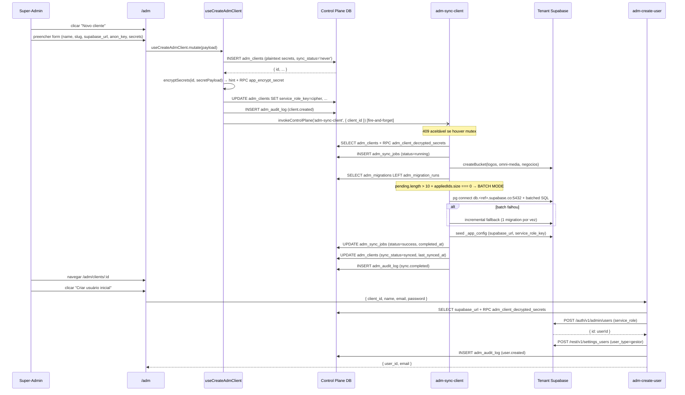
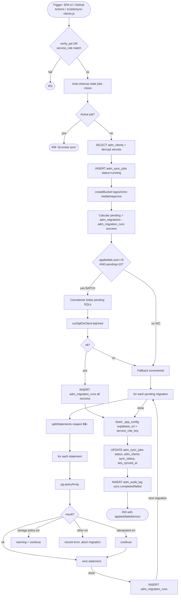
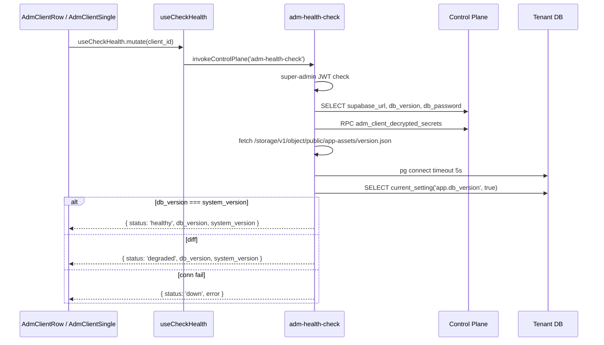

# ADM / Control Plane

## 1. Visão e responsabilidade

O **Control Plane** é o cérebro do modelo multi-tenant do rev-os. Ele vive num único projeto Supabase compartilhado (`ohzwetkaazgxafubzvop.supabase.co`) e responde por:

1. **Catálogo de tenants** (`adm_clients`) — slug, custom domain, URL/anon key do project Supabase do cliente, módulos habilitados, segredos cifrados.
2. **Provisioning** — criar registro do cliente, semear schema (`adm-sync-client`), criar usuário inicial (`adm-create-user`).
3. **Sync de schema** — replica migrations do repo (`supabase/migrations/`) para cada project tenant via Postgres direto + deploy de edge functions via Supabase Management API.
4. **Health monitoring** (`adm-health-check`) — pinga DB do tenant, compara `db_version` com `system_version`.
5. **Resolução de tenant** (`adm-client-config`) — endpoint público chamado pelo bootstrap do SPA (ver [[auth-tenant-bootstrap]] §3) para mapear `hostname → {supabase_url, anon_key, enabled_modules}`.
6. **Audit log** (`adm_audit_log`) — toda ação do super-admin é registrada com `actor_id`, `actor_email`, `action`, `entity_*`, `details`, `ip_address`.

**Operadores:** super-admins (`settings_users.super_admin = true`) — somente eles passam o guard de [[../../../src/components/auth/RestrictedRoute.tsx]] (`requireSuperAdmin`) e a policy RLS `adm_*_super_admin`.

**Não-responsabilidades:** o control plane NÃO armazena dados de negócio (leads, mensagens, agendamentos) — esses ficam no project tenant. NÃO faz autenticação de usuários finais — apenas do super-admin que opera o ADM.

> Para a relação com o bootstrap do app, ver [[auth-tenant-bootstrap]]. Para a estratégia geral multi-tenant, ver [[../architecture]] §2-3.

---

## 2. Rotas e páginas

| Rota | Componente | Guard | Layout |
|---|---|---|---|
| `/adm` | [[../../../../src/pages/Adm]] | `ProtectedRoute` + `RestrictedRoute requireSuperAdmin` | standalone fullscreen (sem `DashLayout`) |
| `/adm/clients/:id` | [[../../../../src/pages/AdmClientSingle]] | mesma combinação | standalone fullscreen |

Definidas em [[../../../../src/App.tsx]] (`/adm`, `/adm/clients/:id`). Layout próprio com brand bar (`RevOS R mark`), tab bar (Clientes / Sync Jobs / Audit Log) e botão de "voltar ao projeto" (`/`).

> Importante: usuário não-super-admin que cair em `/adm` **NÃO** vê 404 — vê uma tela "Acesso restrito" interna (guard duplo: `RestrictedRoute` no router + check `user?.profile.super_adm` no próprio `Adm.tsx`). Comportamento intencional para dar feedback explícito.

---

## 3. Componentes principais

Catálogo completo de componentes ver [[../../agents/ux/components]]. Específicos do módulo:

### Página `/adm` ([[../../../../src/pages/Adm]])

| Componente | Path | Função |
|---|---|---|
| `RMark` | inline em `Adm.tsx` | logo SVG com gradients laranja (definidos em `GRAD_DEFS`) |
| `StatsBar` | inline | 4 cards: total clientes, sincronizados, em andamento, com erros |
| `ClientTableHeader` | inline | header da tabela usando `ROW_COLS` exportado de `AdmClientRow` |
| `AdmClientRow` | [[../../../../src/components/adm/AdmClientRow]] | linha da tabela com status, sync_status, health badge, ações |
| `AdmClientModal` | [[../../../../src/components/adm/AdmClientModal]] | criar/editar cliente — react-hook-form + Zod, separa secrets em campos write-only |
| `AdmSyncPanel` | [[../../../../src/components/adm/AdmSyncPanel]] | tab "Sync Jobs": lista jobs (esquerda) + logs em tempo real (direita), refresh `8s`/`3s` |
| `AdmAuditLogPanel` | [[../../../../src/components/adm/AdmAuditLogPanel]] | tab "Audit Log" com filtros (action, entity_type, from/to, paginação 30/página) |
| `HealthBadge` | [[../../../../src/components/adm/HealthBadge]] | badge healthy/degraded/down + tooltip com `db_version` vs `system_version` |
| `SyncConfirmDialog` | [[../../../../src/components/adm/SyncConfirmDialog]] | confirmação "tem certeza?" antes de sync manual quando há sync em andamento |

### Página `/adm/clients/:id` ([[../../../../src/pages/AdmClientSingle]])

Drill-down num único cliente — combina:
- Form de edição (mesma lógica de `AdmClientModal`, inline)
- Switch grid de módulos (mesma lógica de `AdmModulesSection`, inline)
- Lista de sync jobs específicos do cliente (`useAdmSyncJobs(clientId)`)
- Botão "Sync agora" → `useSyncClientNow`
- `AdmCreateUserModal` ([[../../../../src/components/adm/AdmCreateUserModal]]) — provisionar usuário inicial no tenant

### `AdmModulesSection` ([[../../../../src/components/adm/AdmModulesSection]])

NÃO é renderizado pelas duas páginas atuais (substituído pelo grid inline em `AdmClientSingle`). Preservado como componente standalone — usável em outros contextos. Lista de módulos toggláveis com convenção: `enabled_modules = null` significa "todos habilitados", `enabled_modules = []` significa "nenhum". Auto-converte para `null` se todos os 9 estão checados.

> **Observação de débito:** `AdmModulesSection` lista 9 módulos enquanto `AdmClientSingle` lista 11 (`clientes`, `score` adicionais). Inconsistência de fonte de verdade — ver §9.

---

## 4. Hooks de dados

Todos em [[../../../../src/hooks/useAdmClients]]. **Crítico:** todas as queries usam `supabaseControlPlane` (não `supabase`). Ver [[auth-tenant-bootstrap]] §4 sobre os dois clients.

```ts
const db = () => supabaseControlPlane as unknown as { from, rpc };
```

| Hook | Tipo | Descrição |
|---|---|---|
| `useAdmClients()` | query | Lista todos clientes + agrega `has_*` booleans via RPC `adm_clients_secrets_status()` (SECURITY DEFINER) — confiável mesmo se column-level privileges mascararem os blobs cifrados. `staleTime: 60s`. |
| `useCreateAdmClient()` | mutation | INSERT com plaintext → pega ID → `encryptSecrets(id, ...)` → UPDATE com cifrado. Dispara `adm-sync-client` fire-and-forget (409 = mutex aceitável). Audit log `client.created`. |
| `useUpdateAdmClient()` | mutation | `encryptSecrets()` antes de UPDATE; rastreia `_changedFields` para audit log `client.updated`. |
| `useUpdateAdmClientModules()` | mutation | UPDATE só de `enabled_modules`; audit log `client.modules_updated` com `before`/`after`. |
| `useDeleteAdmClient()` | mutation | DELETE com cascade implícita (`adm_sync_jobs`, `adm_sync_logs`, `adm_migration_runs`, `adm_audit_log` referenciam por FK). Audit log `client.deleted`. |
| `useAdmSyncJobs(clientId?)` | query | Lista jobs (50 mais recentes) com join `adm_clients(name, slug)`. `staleTime: 15s`, `refetchInterval: 8s`. |
| `useSyncClientNow()` | mutation | Invoca `adm-sync-client` via `invokeControlPlane`; após sucesso, lê `/version.json` e UPDATE `db_version`. Trata erro 409 ("Já existe sync em andamento") como warning. |
| `useCreateSyncJob()` | mutation | INSERT job com status `pending` + `triggered_by: 'manual'` — para o caminho via GitHub Actions (não invoca edge fn diretamente). |
| `useAdmSyncLogs(jobId?)` | query | Logs do job. `staleTime: 0`, `refetchInterval: 3s` (live tail). |
| `useAdmAuditLog(filters?)` | query | Paginação (30/página) com filtros `action`, `entity_type`, `from`/`to`. |
| `useCheckHealth()` | mutation | Invoca `adm-health-check`; retorna `{status, db_version, system_version, error?}`. |
| `usePendingMigrations(clientId)` | query | Lê `adm_migrations` + `adm_migration_runs` (status=success), retorna delta. `staleTime: 60s`. |

### `encryptSecrets()` helper (ADM-V2-03)

Ciclo: para cada campo em `SECRET_FIELDS = ['service_role_key', 'db_password', 'management_token']`:
1. Salva `<field>_hint = makeHint(value)` (primeiros 12 chars + `…`) — visível na UI.
2. Chama RPC `app_encrypt_secret(p_value, p_context: clientId)` (pgcrypto, `clientId` como salt context).
3. Substitui o campo pelo blob cifrado.
4. Em caso de erro/exceção, **mantém plaintext** como fallback (preferível a perder o segredo).

### `insertAuditLog()` helper

Fire-and-forget. Lê `auth.getUser()` do `supabaseControlPlane`, INSERT em `adm_audit_log`. Falha silenciosa.

### `useAdmClients` data shape (`AdmClient`)

Campos sensíveis do tipo:
- `service_role_key`, `db_password`, `management_token` — blobs cifrados (nunca expor plaintext na UI)
- `service_role_key_hint`, `db_password_hint`, `management_token_hint` — hint plaintext de 12 chars
- `has_service_role_key`, `has_db_password`, `has_management_token` — booleans confiáveis vindos do RPC

---

## 5. Edge functions

Todas em `supabase/functions/`. Vivem no project do **control plane** (não são replicadas para tenants — exceção: `adm-client-config` é pública para o bootstrap do SPA).

### `adm-client-config` — resolução pública de tenant

| Atributo | Valor |
|---|---|
| Path | [[../../../../supabase/functions/adm-client-config/index.ts]] |
| `verify_jwt` | (default true em config.toml — mas o function lê `service_role_key` do env, não exige user JWT no payload) |
| Trigger | `main.tsx` no boot da SPA |
| Input | `{ host: string }` |
| Output | `{ client_id, supabase_url, anon_key, enabled_modules }` ou 404 |

**Lógica:**
1. Se `host = *.revos.growthsales.ai`, extrai slug do prefixo: `slug = host.match(/^([^.]+)\.revos\.growthsales\.ai$/)[1]`.
2. Senão, busca por `custom_domain = host`.
3. Sempre filtra `status = 'active'`.

### `adm-create-user` — provisionar usuário inicial no tenant

| Atributo | Valor |
|---|---|
| Path | [[../../../../supabase/functions/adm-create-user/index.ts]] |
| `verify_jwt` | true (super-admin only) |
| Input | `{ client_id, name, email, password }` |
| Output | `{ user_id, email }` |

**Fluxo:**
1. Valida JWT + checa `settings_users.super_admin = true` no control plane.
2. Lê `adm_clients.supabase_url` (NÃO seleciona `service_role_key` cru — está cifrado).
3. RPC `adm_client_decrypted_secrets(p_client_id)` para descifrar `service_role_key`.
4. Validação: `service_role_key.startsWith('eyJ')` — descarta se não for JWT (decifrou errado).
5. POST `${client.supabase_url}/auth/v1/admin/users` com `service_role_key` → cria auth user.
6. POST `${client.supabase_url}/rest/v1/settings_users` → INSERT perfil com `user_type: 'gestor'`, `super_admin: false`, `active: true`.
7. Audit log `user.created` com `actor_id` do super-admin.

> **Atenção:** se step 6 falhar, há órfão no `auth.users` do tenant. Não há rollback — débito conhecido.

### `adm-sync-client` — replicação de schema

| Atributo | Valor |
|---|---|
| Path | [[../../../../supabase/functions/adm-sync-client/index.ts]] |
| `verify_jwt` | (default true — mas aceita service_role key direto via env match OU JWT super-admin) |
| Input | `{ client_id }` |
| Output | `{ success, applied, failed, errors[], job_id }` |
| Tempo limite | 60s (edge function) — recuperação por stale-job cleanup (ver §7) |

**Auth dual:**
```ts
let isServiceRole = token === envServiceKey;
if (!isServiceRole && token.startsWith('eyJ')) {
  // Decode JWT → checar role === 'service_role' && payload.ref === SUPABASE_URL ref
}
if (!isServiceRole) { /* fallback: super-admin user JWT check */ }
```

Permite invocação tanto pelo SPA (super-admin JWT) quanto por GitHub Actions / `scripts/sync-clients.js` (service_role key direto).

**Fluxo (alto nível, ver [[#7-fluxos-críticos]] para diagrama):**
1. Mutex: auto-cleanup de jobs `running`/`pending` mais antigos que 5min; rejeita 409 se houver job ativo.
2. Fetch `adm_clients` + descifra `db_password` e `service_role_key` via RPC `adm_client_decrypted_secrets`.
3. `extractProjectRef(supabase_url)` → `db.${projectRef}.supabase.co:5432`.
4. INSERT `adm_sync_jobs` (status `running`).
5. Garante storage buckets do tenant (`logos`, `omni-media`, `negocios`) via Supabase storage SDK.
6. Lê `adm_migrations` + `adm_migration_runs` (status=success) → calcula `pending`.
7. **Decisão de modo:** `isNewClient = appliedIds.size === 0 && pending.length > 10` → batch path (uma única conexão, todas migrations concatenadas). Caso contrário, incremental.
8. Se batch path falhar, **fallback automático para incremental** — não cascateia erro.
9. Para cada migration: `splitStatements(sql)` (respeita `$$` blocks e `--` comments) → loop com try/catch isolado por statement; idempotência via `isIdempotentError()` (`already exists`, `duplicate key`, `multiple primary keys`).
10. **Bug 1 workaround:** statements `CREATE/DROP POLICY ON storage.objects|buckets` — pular com warning (postgres user não tem permissão em storage schema em alguns projects).
11. INSERT `adm_migration_runs` por migration (mesmo se falhar — registra `error`).
12. Seed `_app_config` (`supabase_url`, `service_role_key`) no tenant via SQL.
13. UPDATE `adm_sync_jobs.status` (`success` se `failed === 0`, senão `failed`) + `adm_clients.sync_status` + `last_synced_at`.
14. Audit log `sync.started` no início, `sync.completed`/`sync.failed` no fim.

**`splitStatements()` — parser SQL caseiro:**
- Respeita `$tag$ ... $tag$` (PL/pgSQL function bodies)
- Respeita `--` line comments (semicolons em comentário NÃO separam statements)
- Filtra statements vazios ou só-comentário

### `adm-health-check` — probe de DB

| Atributo | Valor |
|---|---|
| Path | [[../../../../supabase/functions/adm-health-check/index.ts]] |
| `verify_jwt` | true (super-admin) |
| Input | `{ client_id }` |
| Output | `{ status: 'healthy'\|'degraded'\|'down', db_version, system_version, error?, checked_at }` |

**Fluxo:**
1. Auth: super-admin JWT.
2. Descifra `db_password` via RPC.
3. `system_version` = `version.json` do storage `app-assets/` (fallback: `client.db_version`).
4. Conecta `db.${projectRef}.supabase.co:5432` com timeout de 5s.
5. Query: `SELECT current_setting('app.db_version', true)`.
6. Status: `healthy` se `db_version === system_version`; `degraded` se diferente; `down` se conexão falhar.
7. Sempre retorna HTTP 200 (mesmo em down) — UI consome o `status` do payload.

---

## 6. Schema e tabelas

> Schema completo em [[../../agents/data-engineer/schema]]. Aqui apenas as tabelas do control plane (não replicadas para tenants).

### Tabelas (control plane only)

| Tabela | Migration | Descrição |
|---|---|---|
| `adm_clients` | `20260311130000_adm_control_plane.sql` + `20260311140000_adm_drop_plan_column.sql` (+`db_password`, -`plan`) + `20260405220000_adm_clients_secret_hints.sql` (+ `*_hint`) | Catálogo de tenants |
| `adm_sync_jobs` | `20260311130000_adm_control_plane.sql` | Histórico de sync por cliente |
| `adm_sync_logs` | mesma | Log entries por job |
| `adm_audit_log` | (não no migration_adm — provavelmente em migration tenant aplicada apenas no control plane) | Log de ações do super-admin |
| `adm_migrations` | idem | Catálogo de migrations replicáveis (alimentado por `register-migrations.js`) |
| `adm_migration_runs` | idem | Execuções de migration por cliente — `(client_id, migration_id, status)` |

### `adm_clients` — colunas-chave

```sql
id               uuid PK
name             text
slug             text UNIQUE
custom_domain    text
supabase_url     text                                -- https://<ref>.supabase.co
anon_key         text                                -- exposto à SPA
service_role_key text                                -- CIFRADO via app_encrypt_secret
db_password      text                                -- CIFRADO
management_token text                                -- CIFRADO (Supabase Management API)
service_role_key_hint, db_password_hint, management_token_hint text
status           text CHECK ('active'|'inactive'|'suspended')
sync_status      text CHECK ('never'|'pending'|'syncing'|'synced'|'error')
enabled_modules  jsonb                               -- null = all enabled
db_version       text
last_synced_at, created_at, updated_at timestamptz
contact_name, contact_email, notes text
```

Trigger `adm_clients_updated_at` (BEFORE UPDATE) atualiza `updated_at`.

### RPCs relacionadas (no control plane)

| RPC | Tipo | Função |
|---|---|---|
| `adm_clients_secrets_status()` | SECURITY DEFINER | Retorna `[{id, has_*}]` — bypass de column-level privs para boolean checks |
| `adm_client_decrypted_secrets(p_client_id uuid)` | SECURITY DEFINER | Descifra `service_role_key`, `db_password`, `management_token` — chamada APENAS dentro de edge fns; usa `client_id` como context para pgcrypto |
| `app_encrypt_secret(p_value, p_context)` | SECURITY DEFINER | Cifra valor com pgcrypto + context |

### RLS strategy (control plane)

Três tabelas com policy `*_super_admin`:

```sql
create policy "adm_clients_super_admin" on adm_clients for all
using (
  exists (
    select 1 from settings_users
    where auth_user_id = auth.uid()
      and super_admin = true
      and active = true
      and deleted_at is null
  )
);
```

Idêntica para `adm_sync_jobs`, `adm_sync_logs`. Fonte de verdade do super-admin é `settings_users` do **próprio control plane** (`settings_users` existe nos dois lados — control e tenant — mas semanticamente diferentes).

> Para a estratégia geral de RLS no tenant (JWT claim `app_metadata.tenant_id`), ver [[auth-tenant-bootstrap]] §6.

---

## 7. Fluxos críticos

### 7.1 Provisioning de um novo cliente



**Edge cases:**
- **Crash entre INSERT + UPDATE em `useCreateAdmClient`** — fica registro com `service_role_key` plaintext; próximo `useUpdateAdmClient` cifra (idempotente).
- **`adm-sync-client` 409 (mutex)** — fire-and-forget aceita; super-admin pode acionar manualmente depois via "Sync agora".
- **Step 6 do `adm-create-user` falha** — usuário no `auth.users` sem `settings_users` → órfão, login funciona mas profile fetch retorna fallback ([[../../../../src/hooks/useSimpleAuthSingleTenant]] linha ~80, fallback profile com `user_type: 'atendente'`, `super_adm: false`).

### 7.2 Sync de migrations (full lifecycle)



**Invariantes críticas:**
- **Bug 2/3 fix (em `applyIncremental`)**: cada migration tem try/catch isolado — falha em migration N **NÃO** cascateia. O record de `adm_migration_runs` é inserido individualmente.
- **Idempotência:** repetir `adm-sync-client` é seguro — migrations já aplicadas (FK `migration_id` em `adm_migration_runs` com status=success) são puladas. Erros idempotentes (`already exists`, `duplicate key`) são tratados como não-erro durante a aplicação.
- **Stale job cleanup:** 5min de TTL. Edge function tem 60s — se crashar, próxima tentativa marca o stale como `failed` e segue.

### 7.3 GitHub Actions sync (CI/CD)

```mermaid
flowchart LR
    A[push main with supabase/migrations/** OR functions/**] --> B[bump-version.yml]
    B -->|version.json bumped| C[sync-clients.yml]
    C --> D[Setup Supabase CLI + Node]
    D --> E[scripts/sync-clients.js]
    E --> F[GET /rest/v1/adm_clients?status=eq.active]
    F --> G[for each client]
    G --> H[POST /functions/v1/adm-sync-client client_id]
    H --> I[supabase functions deploy --project-ref X]
    I --> J{verify_jwt=false fns}
    J -->|yes| K[supabase functions deploy fn --no-verify-jwt --project-ref X]
    J -->|no| L[next client]
    K --> L
    L -->|all done| M[exit code based on results.failed]

    workflow_dispatch -.optional.-> C
    Note1[CLIENT_SLUG opcional]
```



`scripts/sync-clients.js` chama edge fn via HTTP em vez de TCP direto — **evita problema de IPv6 nos runners do GitHub Actions** (não conseguem acessar `db.<ref>.supabase.co:5432` por IPv6). Comentário explícito no header do arquivo.

`getNoJwtFunctions()` lê `supabase/config.toml` com regex `\[functions\.X\]\s*\n(?:.*\n)*?verify_jwt\s*=\s*false` para reaplicar `--no-verify-jwt` após deploy padrão. Necessário porque `supabase functions deploy` (sem flag) sempre habilita JWT verification.

### 7.4 Health check



UI usa `healthMap` local em `Adm.tsx` para acumular resultados por cliente sem refetch (`onHealthResult` callback).

---

## 8. Integrações externas

| Integração | Onde | Função |
|---|---|---|
| **Supabase Management API** | `scripts/sync-clients.js`, `supabase functions deploy` | Deploy de edge functions ao project tenant — usa `management_token` do cliente |
| **Postgres direto (porta 5432)** | `adm-sync-client`, `adm-health-check` | Aplicar SQL e probe — `db.<projectRef>.supabase.co:5432` com `db_password` cliente |
| **Supabase Auth Admin API** | `adm-create-user` | `POST /auth/v1/admin/users` no project tenant com `service_role_key` |
| **Supabase REST API** | `adm-create-user`, `scripts/sync-clients.js` | INSERT em `settings_users` no tenant; lê `adm_clients` no control plane |
| **Supabase Storage** | `adm-sync-client` | `createBucket()` para `logos`, `omni-media`, `negocios` |
| **GitHub Actions** | `.github/workflows/sync-clients.yml`, `bump-version.yml` | Sync automático em push para `main` com path filters; bump versão `version.json` |

**Não-integrações (importante):**
- ADM **NÃO** chama LLMs diretamente.
- ADM **NÃO** integra com Meta/Google/TikTok — essas são responsabilidade de edge fns dos próprios produtos PRO no tenant.

---

## 9. Estado atual e débito técnico

### Bugs conhecidos (com workaround)

| ID | Onde | Sintoma | Workaround atual |
|---|---|---|---|
| **Bug 1** | `adm-sync-client` `runSqlOnClient` | `CREATE/DROP POLICY ON storage.objects` falha com permission denied via postgres user em alguns Supabase projects | `isStoragePolicyStatement()` detecta e pula com warning |
| **Bug 2 (fix)** | `adm-sync-client` batch path | Falha em migration N cascateava marcando todas como erro | Fallback automático batch → incremental + try/catch isolado por migration |
| **Bug 3 (fix)** | mesmo | `adm_migration_runs` não era inserido se sync abortasse | INSERT individual por migration mesmo em erro, em try/catch separado |
| **IPv6 Actions** | `scripts/sync-clients.js` | Runners GitHub não conectam IPv6 a `db.<ref>.supabase.co:5432` | Chama edge function via HTTP em vez de TCP direto |

### Débito técnico ativo

1. **Inconsistência de catálogo de módulos** — `AdmModulesSection` lista 9 (sem `clientes`, `score`); `AdmClientSingle.ALL_MODULES` lista 11. Fonte de verdade duplicada — extrair para `src/utils/constants.ts` ou `useSystemModules`.
2. **Órfãos em `adm-create-user`** — sem rollback se INSERT em `settings_users` falha após criar user no `auth.users`. Mitigation: try-final delete + reverter, ou usar transação remota.
3. **`extractTenantId` unsigned** ([[../../../../supabase/functions/_shared/response.ts]]) — marcado @deprecated em ADR-PP-03 (pendente de criar arquivo). Substituir por `supabase.auth.getUser(token)`.
4. **Falta de retry estruturado** em sync — falhou? operador precisa clicar "Sync agora" novamente. Sem backoff exponencial no GitHub Actions.
5. **`adm-client-config`** sem cache server-side — cada bootstrap de SPA hits o DB. SPA cacheia 5min em `sessionStorage`, mas burst de tráfego pode pressionar.
6. **`adm_audit_log`** não tem índice em `created_at` ou `actor_id` evidenciado nas migrations vistas — paginação 30/página pode degradar com volume.
7. **Hint storage** (`*_hint`) é plaintext — risco se control plane vazar. Aceitável só para 12 chars, mas documentar política.
8. **`AdmModulesSection` não é usado pelas páginas atuais** — código morto ou uso futuro? Decidir.
9. **`management_token` não tem rotação automática** — secret vive até expirar manualmente.

### Observações operacionais

- `supabase/migrations_adm/` tem **apenas 3 migrations** versionadas — `adm_audit_log`, `adm_migrations`, `adm_migration_runs`, RPCs (`app_encrypt_secret`, `adm_client_decrypted_secrets`, `adm_clients_secrets_status`) provavelmente foram aplicadas via `manual-fixes/` ou migrations regulares aplicadas só ao control plane (filtro `adm_*` em [[../../../../scripts/auto-update-manifest.js]]). **Verificar antes de greenfield.**
- Storage bucket `app-assets` (consultado por `adm-health-check` para `version.json`) precisa existir no control plane — não auto-criado.
- `_app_config` table é semeada em todo sync — precisa existir como migration regular replicada aos tenants.

---

## 10. Stories candidatas / ADRs relevantes

### ADRs a criar

- **ADR-ADM-01** — Modelo project-per-tenant + control plane (registra a decisão fundadora; consequências: isolamento forte, custo Supabase por cliente, complexidade de deploy)
- **ADR-ADM-02** — Estratégia de cifragem de segredos no control plane (pgcrypto via `app_encrypt_secret` + context = client_id; hints plaintext de 12 chars)
- **ADR-ADM-03** — Auth dual em `adm-sync-client` (super-admin JWT vs service_role key direto) — justificar exposição da service key em GitHub Actions
- **ADR-ADM-04** — Estratégia batch vs incremental de migration sync (threshold de 10 + appliedIds.size===0 = batch; bug-2/3 fix incremental)

### Stories candidatas (backlog)

- **ADM-V3-01** — Unificar catálogo de módulos (extrair `ALL_MODULES` para constante única; corrigir inconsistência entre 9 e 11)
- **ADM-V3-02** — Rollback em `adm-create-user` (transação compensatória se INSERT settings_users falhar)
- **ADM-V3-03** — Substituir `extractTenantId` unsigned por server-verified em todas edge fns (PP-V2-8 / fim do ADR-PP-03)
- **ADM-V3-04** — Retry com backoff exponencial em `adm-sync-client` por migration falhada
- **ADM-V3-05** — Cache server-side em `adm-client-config` (Redis ou material view)
- **ADM-V3-06** — Rotação automática de `management_token` (cron + Supabase Management API)
- **ADM-V3-07** — Índices em `adm_audit_log` (`created_at`, `actor_id`, `entity_type`)
- **ADM-V3-08** — Versionar migrations RPCs/audit_log em `migrations_adm/` (atualmente possivelmente em manual-fixes)
- **ADM-V3-09** — UI: badge na sidebar de drift de schema (`db_version !== system_version`) por cliente
- **ADM-V3-10** — Health check periódico via cron (atualmente manual via UI) — popular `adm_clients.last_health_check_at`

### Referências cruzadas

- [[auth-tenant-bootstrap]] — bootstrap do SPA usa `adm-client-config`
- [[../architecture]] §2-3 — topologia geral e tenant resolution
- [[../../agents/data-engineer/schema]] — schema completo (control + tenant)
- [[../../../../scripts/sync-clients.js]] — entry point de CI/CD
- [[../../../../scripts/auto-update-manifest.js]] — filtro `adm_*` para isolamento de migrations control-plane

---

**Última atualização:** 2026-04-22 · **Mantido por:** dev-architect
