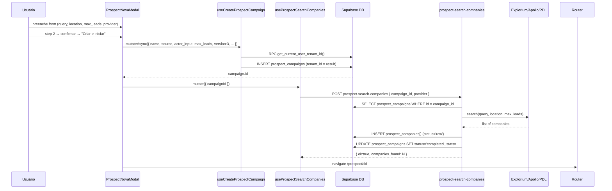
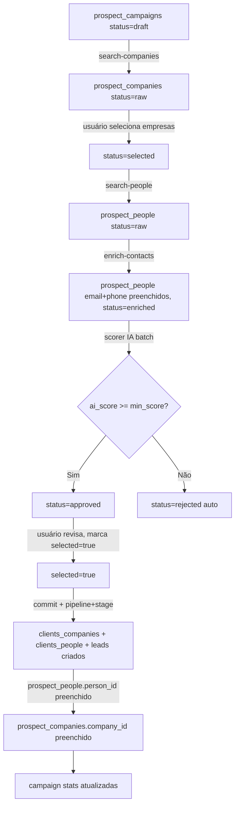
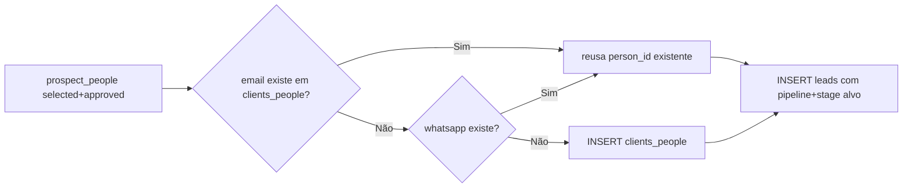

# Prospect PRO

## 1. Visão e responsabilidade

Módulo de prospecção B2B outbound. Permite criar campanhas de busca de empresas e profissionais em provedores externos (Explorium, Apollo, PDL), enriquecer os contatos com email/telefone verificados, qualificá-los via IA com scoring 0–100, revisar manualmente os aprovados e comitá-los como pessoas+empresas+leads no CRM em um único fluxo.

**Responsabilidade exclusiva:** geração e qualificação de leads frios (outbound). Não lida com leads inbound (que entram via FORM PRO ou WhatsApp).

**Estado atual:** módulo v3 ativo. v1 (`prospect_people` via `establishment_id`) foi deprecado e renomeado para `prospect_people_legacy`. v2 foi renomeado para `prospect_people` em 2026-04-22. Tenant isolation completa aplicada na mesma data.

---

## 2. Rotas e páginas

| Rota | Componente | Responsabilidade |
|---|---|---|
| `/prospect` | [[../../../../../src/pages/ProspectPro.tsx]] | Lista de campanhas + botão Nova Campanha |
| `/prospect/:id` | [[../../../../../src/pages/ProspectPro.tsx]] | Detalhe da campanha (tabs: Empresas → Pessoas → CRM → Revisar) |

Entry point: `src/pages/ProspectPro.tsx`. A navegação entre steps usa tabs ou parâmetro de rota dentro da mesma página.

---

## 3. Componentes principais

Ref: [[../../agents/ux/components]]

Todos em `src/components/prospect/`:

| Componente | Arquivo | Responsabilidade |
|---|---|---|
| `ProspectNovaModal` | [[../../../../../src/components/prospect/ProspectNovaModal.tsx]] | Modal de criação de campanha — 2 steps (Configurar + Confirmar). Seleciona provider, query, localização (país/estado/cidade), max_leads, nome da campanha. Chama `useCreateProspectCampaign` + `useProspectSearchCompanies` ao criar. |
| `ProspectEditModal` | [[../../../../../src/components/prospect/ProspectEditModal.tsx]] | Edição de campanha existente (nome, config) |
| `ProspectStepEmpresas` | [[../../../../../src/components/prospect/ProspectStepEmpresas.tsx]] | Aba de empresas: lista resultados de `prospect_companies`, seleção para avançar para busca de pessoas |
| `ProspectStepPessoas` | [[../../../../../src/components/prospect/ProspectStepPessoas.tsx]] | Aba de profissionais: lista `prospect_people` por empresa selecionada, filtros de role/seniority, ação de enriquecimento |
| `ProspectStepCRMV2` | [[../../../../../src/components/prospect/ProspectStepCRMV2.tsx]] | Aba de commit ao CRM: seleciona pipeline + stage de destino, aciona `prospect-commit` |
| `ProspectStepRevisarV2` | [[../../../../../src/components/prospect/ProspectStepRevisarV2.tsx]] | Revisão final: aprovados/rejeitados, scoring IA, ação de commit |

`src/components/prospect/types.ts` — tipos de UI internos ao módulo.
`src/components/prospect/constants.ts` — listas de roles, seniority levels, países (também definidos em `ProspectNovaModal`).

---

## 4. Hooks de dados

Todos em `src/hooks/`, TanStack Query.

| Hook | Arquivo | O que faz |
|---|---|---|
| `useProspectCampaigns` | [[../../../../../src/hooks/useProspectCampaigns.ts]] | `SELECT prospect_campaigns` com join para `leads_pipelines` e `leads_stages`. staleTime 5min. |
| `useProspectCampaign(id)` | [[../../../../../src/hooks/useProspectCampaigns.ts]] | Single campaign por ID. staleTime 2min. |
| `useCreateProspectCampaign` | [[../../../../../src/hooks/useProspectCampaigns.ts]] | INSERT em `prospect_campaigns` — chama RPC `get_current_user_tenant_id()` para obter `tenant_id`. |
| `useUpdateProspectCampaign` | [[../../../../../src/hooks/useProspectCampaigns.ts]] | UPDATE `prospect_campaigns`. |
| `useDeleteProspectCampaign` | [[../../../../../src/hooks/useProspectCampaigns.ts]] | DELETE `prospect_campaigns`. |
| `useProspectCompanies` | [[../../../../../src/hooks/useProspectCompanies.ts]] | `SELECT prospect_companies` por campaign_id. |
| `useProspectPeopleV2` | [[../../../../../src/hooks/useProspectPeople.ts]] | `SELECT prospect_people` com join para `prospect_companies`. Filtros: campaign_id, company_id, status, search, selectedOnly. |
| `useProspectPlugins` | [[../../../../../src/hooks/useProspectPlugins.ts]] | `SELECT prospect_enrichment_plugins` (plugins disponíveis). |
| `useProspectProfiles` | [[../../../../../src/hooks/useProspectProfiles.ts]] | Profiles de enrichment por pessoa (dados de `prospect_enrichment_results`). |
| `useProspectAuditLog` | [[../../../../../src/hooks/useProspectAuditLog.ts]] | `SELECT prospect_audit_log` por campaign. |
| `useProspectProviders` | [[../../../../../src/hooks/useProspectProviders.ts]] | Lê `useSettings()` para checar se `explorium_api_key`, `apollo_api_key`, `pdl_api_key` estão configuradas. Retorna lista de providers com `active: boolean`. |
| `useProspectSearchCompanies` | [[../../../../../src/hooks/useProspectActions.ts]] | Mutation — invoca `prospect-search-companies` edge fn. |
| `useProspectSearchPeople` | [[../../../../../src/hooks/useProspectActions.ts]] | Mutation — invoca `prospect-search-people` edge fn. |
| `useProspectEnrichContacts` | [[../../../../../src/hooks/useProspectActions.ts]] | Mutation — invoca `prospect-enrich-contacts` edge fn. |
| `useProspectEnrichPlugin` | [[../../../../../src/hooks/useProspectActions.ts]] | Mutation — invoca `prospect-enrich-plugin` edge fn. |
| `useProspectScorePeople` | [[../../../../../src/hooks/useProspectActions.ts]] | Mutation — invoca `prospect-scorer` edge fn. Invalida `prospect_people` e `prospect_campaigns`. |
| `useProspectCommitV2` | [[../../../../../src/hooks/useProspectActions.ts]] | Mutation — invoca `prospect-commit` edge fn com campaign_id + pipeline_id + stage_id. |

**Padrão de error handling:** `callEdgeFunction()` em `useProspectActions.ts` lida com dois cenários de erro: `res.error` (falha HTTP) e `data.ok === false` (edge fn retornou erro semântico). Isso contorna o comportamento do `supabase.functions.invoke()` que descarta body em não-2xx.

---

## 5. Edge functions

Todas em `supabase/functions/`, autenticadas por JWT (service_role key internamente, token do usuário para validar tenant).

| Função | verify_jwt | Responsabilidade |
|---|---|---|
| `prospect-search-companies` | true | Busca empresas no provider (Explorium/Apollo/PDL) e insere em `prospect_companies`. Usa `_shared/prospect-providers.ts` → `resolveProvider()`. |
| `prospect-search-people` | true | Para cada `company_id` selecionado, busca profissionais e insere em `prospect_people`. |
| `prospect-enrich-contacts` | true | Enriquece pessoas com email/telefone verificados via provider de enrichment. |
| `prospect-enrich-plugin` | true | Enriquecimento via plugin específico (`prospect_enrichment_plugins`). |
| `prospect-scorer` | true | Scoring IA: pega até `batch_size` pessoas com `status='pending'`, chama LLM via `_shared/llm-provider.ts`, persiste `ai_score`, `ai_reasoning`, `ai_tags`, muda status para `approved` (≥ min_score) ou `rejected`. Grava em `prospect_audit_log`. |
| `prospect-commit` | true | Commita pessoas `selected=true, status='approved'` para CRM: UPSERT `clients_companies` + `clients_people` (dedup por email/telefone/linkedin), INSERT `leads`. Atualiza `prospect_people.person_id` e `prospect_companies.company_id`. |
| `prospect-test-connection` | true | Testa conectividade com o provider configurado. |

**Shared helpers relevantes:**
- `_shared/prospect-providers.ts` — `resolveProvider(id)` → retorna implementação de Explorium/Apollo/PDL.
- `_shared/explorium.ts` — client Explorium (lê `EXPLORIUM_API_KEY` de Vault).
- `_shared/apollo-provider.ts` — client Apollo.io.
- `_shared/pdl-provider.ts` — client People Data Labs.
- `_shared/llm-provider.ts` — `getActiveProvider()` + `callLLM()` — usado pelo scorer.
- `_shared/response.ts` — `ok200`, `err200`, `err401`, `extractActor` — padrão HTTP 200 para todos os erros semânticos.

---

## 6. Schema e tabelas

Ref completo: [[../../agents/data-engineer/schema]]

### `prospect_campaigns`

| Coluna | Tipo | Notas |
|---|---|---|
| id | uuid PK | |
| name | text | nome da campanha |
| source | text | provider: 'vibe' (Explorium), 'apollo', 'pdl' |
| actor_input | jsonb | parâmetros da busca (searchQuery, country_code, state, city, etc.) |
| max_leads | int | limite de empresas a retornar |
| target_pipeline_id | uuid | FK → leads_pipelines (destino padrão do commit) |
| target_stage_id | uuid | FK → leads_stages (destino padrão do commit) |
| enrichment_config | jsonb | config de enriquecimento |
| scoring_config | jsonb | `{"min_score": 50}` — threshold para aprovação |
| status | text | draft/running/completed/error/paused |
| stats | jsonb | `{total_raw, filtered, enriched, scored, approved, committed, ...}` |
| version | int | 1 (deprecated), 2 (legacy), 3 (ativo) |
| tenant_id | uuid NOT NULL | FK → crm_tenants — adicionado em 20260422000700 |
| created_by | uuid | FK → settings_users via auth_user_id |

**RLS (após 20260422000700):** tenant-scoped via `user_has_tenant_access(tenant_id)`.

### `prospect_companies`

| Coluna | Tipo | Notas |
|---|---|---|
| id | uuid PK | |
| campaign_id | uuid | FK → prospect_campaigns |
| name | text | nome da empresa |
| industry | text | setor |
| linkedin_url | text | URL LinkedIn (usado para dedup no commit) |
| website | text | |
| headquarters | text | endereço/HQ |
| employee_count | int | |
| status | text | raw/selected/committed |
| company_id | uuid | FK → clients_companies (preenchido após commit) |
| tenant_id | uuid NOT NULL | |

**Índices tenant:** `idx_prospect_companies_tenant` (tenant_id, campaign_id), `idx_prospect_companies_tenant_status`.

### `prospect_people` (ex-`prospect_people_v2`, renomeado 2026-04-22)

| Coluna | Tipo | Notas |
|---|---|---|
| id | uuid PK | |
| campaign_id | uuid | FK → prospect_campaigns |
| company_id | uuid | FK → prospect_companies |
| name | text | |
| role_title | text | cargo |
| seniority | text | junior/mid/senior/director/vp/c-level |
| department | text | |
| email | text | enriquecido |
| phone | text | enriquecido |
| linkedin_url / linkedin_id | text | |
| explorium_prospect_id | text | ID no Explorium |
| ai_score | int | 0–100 pelo scorer |
| ai_reasoning | text | justificativa do score |
| ai_tags | text[] | tags geradas pela IA |
| status | text | raw/pending/enriched/approved/rejected |
| selected | boolean | marcado pelo usuário para commit |
| selected_at | timestamptz | |
| person_id | uuid | FK → clients_people (preenchido após commit) |
| consent_basis | text | base legal LGPD |
| data_retention_deadline | timestamptz | |
| tenant_id | uuid NOT NULL | |

**Índices:** `idx_pp_company`, `idx_pp_campaign_status`, `idx_pp_role`, `idx_pp_seniority`, `idx_pp_selected`, `idx_pp_email`, `idx_pp_person_id`, `idx_pp_explorium_pid`.

### `prospect_people_legacy` (ex-`prospect_people` v1)
Tabela v1 preservada após rename. Referenciada por edge functions v1 (que estão quebradas — ver seção 9).

### `prospect_contacts` (foundation, sem tabela prospects_contacts no schema canônico)
Nota: a migration `prospect_pro_foundation` criou `prospect_contacts` (contatos raw com ai_score). Análise do código indica que a app v3 usa `prospect_people` diretamente. `prospect_contacts` pode ser resquício de v1/v2.

### `prospect_enrichment_plugins`
Plugins de enriquecimento disponíveis. Metadados: id, name, endpoint, config_schema.

### `prospect_enrichment_results`
Resultados brutos de enriquecimento por pessoa (person_id → prospect_people). tenant_id NOT NULL.

### `prospect_opt_out_registry`
Emails/telefones no opt-out. tenant_id nullable (NULL = global). RLS: tenant IS NULL OR user_has_tenant_access.

### `prospect_audit_log`
Log LGPD imutável. INSERT-only. Campos: campaign_id, action (scored/enriched/committed/etc.), actor, details jsonb, tenant_id NOT NULL.

---

## 7. Fluxos críticos

### 7.1 Criação de campanha e busca de empresas

### 7.2 Pipeline completo: busca → enrichment → scoring → commit

### 7.3 Dedup no commit (prospect-commit)

---

## 8. Integrações externas

| Provider | ID interno | API Key config | Capacidade |
|---|---|---|---|
| **Explorium** | `'vibe'` | `settings.explorium_api_key` | 150M+ empresas, 800M+ profissionais. Busca + enrichment. |
| **Apollo.io** | `'apollo'` | `settings.apollo_api_key` | 275M+ contatos, sales intelligence. |
| **People Data Labs** | `'pdl'` | `settings.pdl_api_key` | 1.5B+ perfis, enrichment. |
| **LLM ativo** | — | via `settings_ai_providers` | Scoring semântico (gpt-4o, claude, gemini). |

API keys são lidas do Vault (via `SUPABASE_SERVICE_ROLE_KEY`) dentro das edge functions. O frontend verifica via `useSettings()` se a key está configurada para mostrar o provider como `active`.

Configuração das keys: `Configurações → Prospect → Integração`.

---

## 9. Estado atual e débito técnico

### P0 BUG — Edge functions Prospect v1 quebradas (2026-04-22)

A migration `20260422000500_prospect_rename_people_v2` renomeou:
- `prospect_people` → `prospect_people_legacy`
- `prospect_people_v2` → `prospect_people`

Edge functions que referenciam `prospect_people` via `establishment_id` (schema v1) **estão quebradas** porque a tabela `prospect_people` agora tem schema v2 (sem `establishment_id`):

**Funções afetadas:**
- `supabase/functions/prospect-scorer/index.ts` — verificar se ainda tem branch v1 que lê `prospect_people` por `establishment_id`
- `supabase/functions/prospect-commit/index.ts` — verificar se ainda tem fallback v1

**Ação necessária:**
1. Auditar cada edge function acima para remover branches v1 ou adicionar `WHERE version = 1` em `prospect_campaigns` antes de redirecionar para `prospect_people_legacy`
2. Ou declarar v1 oficialmente morto e deixar apenas o happy path v2/v3

Campanhas `version=1` no banco estão afetadas — não conseguem scorer nem commit. `version=2` e `version=3` não são afetadas.

### Outros débitos

- `prospect_contacts` (criado na foundation migration) parece ser resquício de v1/v2. O código v3 usa `prospect_people`. Verificar se pode ser dropada.
- `useProspectProviders` retorna `defaultProvider = activeProviders[0]?.id ?? 'vibe'`. Se nenhuma key estiver configurada, o modal bloqueia o botão Confirmar mas permite selecionar o provider — UX inconsistente.
- `prospect-stuck-recovery` pg_cron roda a cada 5 min, marca campaigns `status='running'` por mais de 3 minutos como `status='error'`. Isso pode ser agressivo para buscas lentas (PDL).
- Tenant isolation aplicada em 20260422000700 deixou `prospect_opt_out_registry.tenant_id` nullable (decisão deliberada — revisão humana pendente para backfill).

---

## 10. Stories candidatas / ADRs relevantes

**ADRs aplicados:**
- **ADR-PP-02** — Tenant isolation: `prospect_opt_out_registry` é per-tenant, não global (nullable para compatibilidade com dados históricos)
- **ADR-PP-03** — Server-verified tenant_id: `prospect-commit` e `prospect-scorer` usam `supabase.auth.getUser(token)` → `user.app_metadata.tenant_id` (não decode unsigned)

**Stories candidatas:**
- `[P0]` Fix edge functions v1 quebradas: remover código que usa `prospect_people.establishment_id` ou redirecionar para `prospect_people_legacy`
- `[P1]` Auditoria e eventual drop de `prospect_contacts` (resquício v1)
- `[P2]` Backfill e NOT NULL constraint em `prospect_opt_out_registry.tenant_id`
- `[P2]` UX: feedback em tempo real do progresso de busca (actualmente é polling via `useProspectCampaign` com staleTime 2min)
- `[P3]` Ajuste do threshold do `prospect-stuck-recovery` cron (3 min pode ser conservador para PDL)
