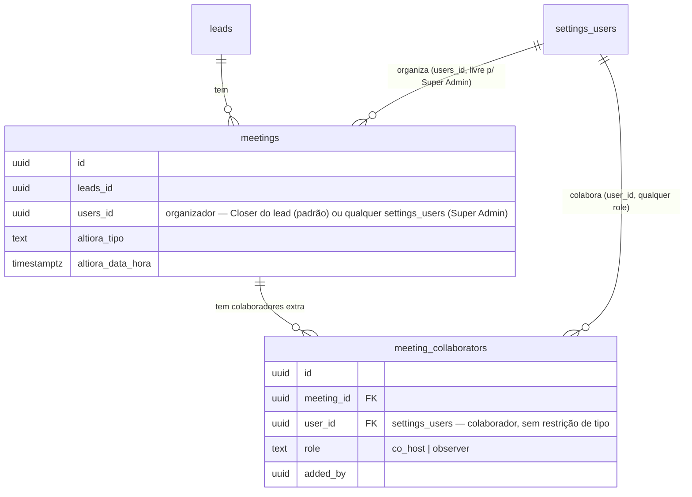

# ADR-ALTIORA-01: Colaboradores adicionais e organizador livre para Super Admin em reuniões

> **Revisão 2026-08-07 (mesmo dia):** escopo reduzido a Google Calendar (MS Teams e Zoom fora) e
> ampliado no eixo organizador — ver seção "Revisão de escopo" ao final. As seções acima ficam como
> registro histórico da primeira versão; a decisão vigente é a combinação desta revisão com o
> modelo de dados original (tabela de junção), que não mudou.

## Contexto

Hoje cada `lead` tem exatamente 1 Closer responsável (`leads.altiora_closer_id`), e cada `meeting`
(R1/R2/R3) tem exatamente 1 organizador (`meetings.users_id`), cujo token OAuth é usado para criar
o evento em Google Calendar (`google-cal-upsert-event`). O convite ao cliente (`buildAltioraInvite`
em `_shared/altiora-invite-template.ts`) cita 1 único consultor (nome + WhatsApp).

Pedido original do dono do produto (via áudio, 2026-08-07): em algumas reuniões — hoje excepcional,
ex. "Rafael e André vão fazer juntos" — mais de uma pessoa da equipe comercial precisa aparecer como
responsável/participante daquela reunião específica.

Pedido revisado, no mesmo dia, após ver a primeira versão deste ADR:
1. **Escopo de integração reduzido**: só Google Calendar importa para este fluxo de colaboradores.
   MS Teams e Zoom ficam fora (não removidos do produto — apenas fora do escopo desta feature).
2. **Mudança de modelo mais relevante**: não é só "Closer + colaboradores extras". Qualquer **Super
   Admin** deve poder criar uma reunião tendo **a si mesmo** (ou qualquer outro usuário) como
   organizador — não apenas o Closer dono do lead — e adicionar outros participantes (inclusive
   outros Super Admins) como colaboradores na mesma reunião.

Isso **não** deve alterar o conceito de "1 Closer dono do lead" (`leads.altiora_closer_id`), que
segue intacto em todo o resto do sistema (Kanban, badges, `useAltioraClosers`/`useAtribuirCloser`,
permissões de acesso ao pipeline). O que muda é: **quem pode escolher livremente o organizador de
uma reunião específica** — hoje isso é implícito (`closerId` da ficha do lead), e passa a ser
explícito e editável para Super Admin.

## Opções Consideradas

### Opção A: `jsonb`/array de uuids em `meetings` (ex: `altiora_colaboradores_ids uuid[]`)
**Prós:** migration trivial, zero joins novos.
**Contras:** sem FK (integridade fica a cargo da aplicação), sem RLS granular por colaborador,
difícil de estender com metadado por colaborador (papel, notificação, etc.), queries "reuniões em
que X colabora" exigem `= ANY()` menos idiomático que join.

### Opção B: nova tabela de junção `meeting_collaborators` (meeting_id, user_id, role)
**Prós:** FK real para `meetings` e `settings_users` (integridade), extensível (papel,
notificado_em), join natural para "minhas reuniões como colaborador", RLS pode ser adicionada
depois sem redesenhar o modelo, é o mesmo padrão já usado no projeto para relações N:N
(`settings_users_teams`, `leads_stages_followups`). Não precisa de tratamento especial para
"colaborador é Super Admin" — `role` é por usuário, sem restrição de `user_type`, então já cobre
Closer, Gestor ou Super Admin como colaborador sem qualquer mudança de modelo.
**Contras:** uma tabela nova + 1 migration a mais que a Opção A.

### Opção C: permitir múltiplos `users_id` reescrevendo `meetings` para N:N nativo (sem "organizador" único)
**Prós:** modelo "mais correto" teoricamente.
**Contras:** `meetings.users_id` é usado em dezenas de lugares (RLS, `useCheckAltioraConflict`,
followups, RPCs `book_meeting_*`, insights/BI) — reescrever isso é uma migração estrutural de alto
risco. Superdimensionado mesmo com o escopo ampliado (Super Admin livre): o pedido é sobre
**quem pode escolher** o valor de `users_id`, não sobre o tipo da coluna deixar de ser singular.

## Decisão

**Opção B, sem mudança de tipo em `meetings.users_id`.** Nova tabela `public.meeting_collaborators`:

```sql
CREATE TABLE public.meeting_collaborators (
  id           uuid PRIMARY KEY DEFAULT gen_random_uuid(),
  meeting_id   uuid NOT NULL REFERENCES public.meetings(id) ON DELETE CASCADE,
  user_id      uuid NOT NULL REFERENCES public.settings_users(id) ON DELETE CASCADE,
  role         text NOT NULL DEFAULT 'co_host' CHECK (role IN ('co_host', 'observer')),
  added_by     uuid REFERENCES public.settings_users(id) ON DELETE SET NULL,
  created_at   timestamptz NOT NULL DEFAULT now(),
  UNIQUE (meeting_id, user_id)
);
```

`meetings.users_id` **continua sendo, em tipo e contrato, o organizador único** — dono do
calendário/token OAuth usado para criar o evento no Google Calendar. O que muda é **quem tem
permissão de escolher livremente esse valor**:

| Perfil | Quem pode ser organizador (`meetings.users_id`) | Quem escolhe |
|---|---|---|
| Closer comum | Sempre ele mesmo (= Closer do lead, comportamento atual, sem UI de escolha) | Implícito — `closerId` da ficha do referral, como hoje |
| Super Admin (`super_adm = true`) | Qualquer `settings_users` ativo (ele mesmo por padrão, ou outro — incluindo outro Super Admin) | Explícito — campo de seleção no modal (ALTIORA-27) |

Colaboradores adicionais em `meeting_collaborators` são **convidados/co-hosts no Google Calendar**,
nunca donos alternativos do evento — o mesmo vale se o colaborador for outro Super Admin. Isso evita
reescrever a integração de calendário (que hoje só sabe lidar com 1 organizador/1 token) e cobre os
dois pedidos: "mais de uma pessoa aparece na reunião" e "Super Admin escolhe quem organiza".

**Único provedor no escopo desta feature: Google Calendar.**

| Provedor | Organizador (token) | Colaboradores adicionais | Escopo |
|---|---|---|---|
| Google Calendar | `meetings.users_id` (connection primária, como hoje — agora escolhível por Super Admin) | Adicionados em `attendees[]` com `settings_users.email` do colaborador — aparecem no convite recebido pelo cliente/organizador, podem aceitar/recusar, mas não têm o evento no *próprio* Google Calendar como organizador (aparece como convidado, igual ao cliente) | **IN** |
| MS Teams | — | — | **OUT** (não mexer em `ms-teams-upsert-event` nesta feature) |
| Zoom | — | — | **OUT** (não mexer em `zoom-upsert-event` nesta feature; `alternative_hosts` descartado) |

## Diagrama



## Consequências

**Positivas:**
- Zero mudança em `leads.altiora_closer_id`, Kanban, badges, `useAltioraClosers`/`useAtribuirCloser`.
- `meetings.users_id` continua com o mesmo tipo/contrato em todo o resto do sistema (RLS, conflito
  de agenda, followups, RPCs de BI) — nenhuma dessas superfícies precisa saber que a escolha do
  organizador ficou mais livre para Super Admin.
- `meeting_collaborators` já cobre "colaborador é outro Super Admin" sem qualquer ajuste de schema
  — `role` não depende de `user_type`.
- Escopo reduzido a Google Calendar simplifica ALTIORA-28 (uma única edge function tocada) e adia
  a decisão sobre Teams/Zoom para se/quando houver demanda real.
- RLS de leitura de `meetings` já é ampla por pipeline (`lead_pipeline_accessible_to_current_user`,
  ver `20260716150000_meetings_rls_pipeline_access.sql`) — colaboradores adicionais **já enxergam**
  a reunião mesmo sem RLS nova em `meeting_collaborators`, desde que tenham acesso ao pipeline (o
  que é sempre verdade para Super Admin via `is_admin_or_manager()`).

**Negativas / trade-offs aceitos:**
- Verificação de conflito de agenda (`useCheckAltioraConflict`) hoje só olha `users_id` do
  organizador — colaboradores extras **não** têm conflito de agenda checado nesta fase (aceito como
  limitação do V1 da exceção; registrado como follow-up, não bloqueia o pedido original). Quando
  Super Admin escolhe outro usuário como organizador, o conflito passa a ser checado para esse
  usuário escolhido (a query já usa `userId` como parâmetro — só muda quem é passado).
- Colaboradores aparecem no Google Calendar como convidados comuns (não co-organizam o evento no
  calendário deles).
- Cancelamento/exclusão do evento (`action: 'delete'`) segue endereçado apenas à connection do
  organizador — colaboradores só recebem o e-mail de cancelamento (`sendUpdates=all`).
- MS Teams e Zoom continuam com o comportamento de organizador único de hoje, sem colaboradores —
  se o produto pedir isso depois, é uma extensão localizada nas respectivas edge functions
  reaproveitando a mesma tabela `meeting_collaborators` (nenhuma mudança de schema necessária).

## Revisão de escopo (2026-08-07, mesmo dia — resumo executivo)

1. **Google Calendar apenas.** `ALTIORA-28` fica restrita a `google-cal-upsert-event`. A leitura de
   `meeting_collaborators` em `ms-teams-upsert-event`/`zoom-upsert-event` não entra nesta wave.
2. **Organizador livre para Super Admin.** `meetings.users_id` não muda de tipo — continua 1 uuid.
   Muda a regra de UI/negócio: Closer comum não escolhe (é sempre ele mesmo, como hoje); Super Admin
   escolhe livremente (default = ele mesmo) via novo campo no modal de agendamento (`ALTIORA-27`).
3. **Nenhuma mudança de modelo de dados adicional** foi necessária para cobrir "colaborador pode ser
   outro Super Admin" — a tabela `meeting_collaborators` da decisão original já suporta isso.

## Nota de implementação (2026-08-07) — divergência entre desenho de RLS e banco real

Ao implementar ALTIORA-26, o data engineer confirmou via `pg_policy`/`pg_proc` no banco real
(`dtsmbqrzyxhjjjvpjfjd`) que a premissa de RLS deste ADR **não reflete o estado atual de produção**:

- Este ADR (seção "Consequências") e a story ALTIORA-26 assumem que `meetings` tem policies
  granulares (`users_manage_own_meetings`/`users_read_own_meetings`, de
  `supabase/migrations/20260716150000_meetings_rls_pipeline_access.sql`) apoiadas em funções como
  `is_admin_or_manager()`, `get_current_settings_user_id()` e
  `lead_pipeline_accessible_to_current_user()`.
- Essa migration **existe no repositório mas nunca foi aplicada ao banco real**. A única policy ativa
  hoje em `public.meetings` é `meetings_access_policy` (`cmd=ALL`, `USING (true)`, sem `WITH CHECK`) —
  ou seja, RLS ligada mas sem nenhuma restrição de posse/pipeline na prática. Nenhuma das três funções
  acima existe no banco (`pg_proc` vazio).
- **Decisão tomada para não travar ALTIORA-26:** `meeting_collaborators` foi criada com RLS que
  espelha o estado real de `meetings` hoje (`USING (true)`), não o desenho granular deste ADR, com
  TODO explícito no comentário SQL da migration (`20260807260000_create_meeting_collaborators.sql`)
  para endurecer junto se/quando `meetings` for endurecida.
- **Implicação para stories futuras (ALTIORA-27, 28, 29):** não assumir que `meetings` já tem
  controle de acesso granular por pipeline/equipe/posse — hoje qualquer usuário autenticado com
  grant na tabela pode ler/editar qualquer reunião. Se alguma dessas stories depende desse controle
  existir de fato, é um pré-requisito não atendido, não um detalhe de implementação. Endurecer a RLS
  de `meetings` para o desenho original é uma decisão de segurança maior (risco de quebrar acesso
  legítimo se a policy nova tiver qualquer imprecisão) e deve ser tratada como story própria, com o
  dono do produto ciente do impacto — não como efeito colateral de uma story de colaboradores.
- Detalhe completo da investigação: `.claude/agent-memory/dev-data-engineer/meeting-collaborators-rls-conflict.md`.
