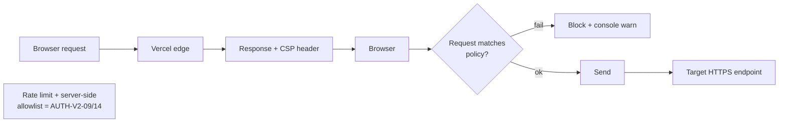

# ADR-AUTH-05: CSP com connect-src permissivo (https: + wss:)

## Contexto

A story AUTH-V2-08 exigia configurar CSP + headers de segurança no `vercel.json`. A ideia original era listar explicitamente cada host autorizado em `connect-src` (Supabase, Google APIs, Meta Graph, TikTok, Microsoft, ElevenLabs, etc.), no estilo "allowlist por host".

Durante a auditoria identifiquei dois obstáculos:

1. **Arquitetura multi-tenant project-per-tenant (ADR-ADM-01)**: cada tenant tem seu próprio subdomínio `*.supabase.co` — hosts únicos por cliente. `*.supabase.co` resolve, mas também precisamos cobrir `custom_domain` mapeado por tenant (futuro) que pode ser `*.cliente.com`.
2. **Webhooks configuráveis pelo usuário**: `useConversas.ts` linha 226 faz `fetch(webhookUrl, ...)` onde `webhookUrl` vem de `settings.webhook_conversas` — URL arbitrária definida pelo tenant (N8N, Zapier, self-hosted). Uma allowlist fixa quebraria qualquer integração nova sem redeploy do header CSP.
3. **Integrações OAuth chamadas client-side**: `MetaIntegrationConfig.tsx` linha 255 faz `fetch('https://graph.facebook.com/v25.0/...')` direto do browser para popular selector de Pages. Analogamente Google (`googleapis.com`), TikTok (`tiktokapis.com`), Microsoft (`graph.microsoft.com`).

## Opções Consideradas

### Opção A: Allowlist estrita host-a-host
**Prós:**
- Máximo controle — qualquer exfiltração XSS precisa atingir um dos hosts listados.
- Evidente para auditoria quais endpoints o app usa.

**Contras:**
- Quebra webhooks user-defined sem whitelist dinâmica. UX ruim — cliente cadastra URL nova em `settings.webhook_conversas` e nada chega.
- Manter a lista atualizada é custo operacional contínuo. Novo integração = PR no `vercel.json`.
- Não cobre `custom_domain` de tenants sem regex curinga.
- Requer duplicar conhecimento entre `useConversionConfig.ts`, `MetaIntegrationConfig.tsx`, edge fns.

### Opção B: connect-src 'self' + lista mínima de schemes
**Prós:**
- Pragmático — confia em HTTPS como garantia mínima (bloqueia downgrade).
- Não quebra webhooks configuráveis.

**Contras:**
- Um XSS pode exfiltrar para qualquer host HTTPS (incluído attacker-controlled).

### Opção C: Mix — allowlist para hosts críticos + 'self' para o resto
Exige infraestrutura server-side (nonce/hash) que não temos (SPA estática no Vercel, sem SSR).

## Decisão

**Opção B** — CSP permissivo em `connect-src`, mas estrito nas outras diretivas:

```
default-src 'self';
script-src 'self' 'unsafe-inline' 'unsafe-eval';
style-src 'self' 'unsafe-inline' https://fonts.googleapis.com;
font-src 'self' data: https://fonts.gstatic.com;
img-src 'self' data: blob: https:;
media-src 'self' blob: https:;
connect-src 'self' https: wss:;
frame-src 'self' https:;
worker-src 'self' blob:;
object-src 'none';
base-uri 'self';
form-action 'self';
frame-ancestors 'none';
upgrade-insecure-requests
```

**Racional:**
- `frame-ancestors 'none'` + `X-Frame-Options: DENY` → impede clickjacking (substitui `frame-ancestors` em browsers antigos).
- `object-src 'none'` → bloqueia Flash/Java residual.
- `base-uri 'self'` → impede ataques de `<base href>` injection.
- `form-action 'self'` → impede POST forjado para endpoints externos.
- `upgrade-insecure-requests` → força HTTPS em subresources (mitiga downgrade).
- `script-src 'unsafe-inline' 'unsafe-eval'` — necessário para Vite (inline scripts runtime) e React DevTools. Removível no futuro com nonce quando tivermos SSR.
- `img-src https:` — imagens vêm de N fontes (avatares, uploads, storage tenant + control plane).
- `connect-src https: wss:` — trade-off consciente; ver contexto.

**COOP/COEP excluídos:**
- `Cross-Origin-Opener-Policy: same-origin` quebraria `window.open()` para fluxos OAuth (Google/Meta/TikTok popups). `same-origin-allow-popups` é alternativa mas COEP seria necessário para SharedArrayBuffer — não usamos. Sem ganho real.

**Outros headers adicionados:**
- `X-Frame-Options: DENY`
- `X-Content-Type-Options: nosniff`
- `Referrer-Policy: strict-origin-when-cross-origin`
- `Permissions-Policy: camera=(self), microphone=(self), geolocation=(), browsing-topics=()`
- `Strict-Transport-Security: max-age=63072000; includeSubDomains; preload` — 2 anos, HSTS preload ready.

## Consequências

**Positivas:**
- Zero regressão em fluxos OAuth, webhooks N8N, integrações Meta/Google/TikTok/Microsoft.
- Reduz drasticamente superfície para XSS exfiltrando via `` HTTP, forms externos, iframes maliciosos.
- HSTS + `upgrade-insecure-requests` endurece MITM.

**Negativas / riscos aceitos:**
- XSS bem-sucedido pode exfiltrar para qualquer host HTTPS. Mitigação: as entradas user-controlled passam por `DOMPurify` no renderer (já usado em `MessageContent.tsx`), React escape-by-default.
- Futuro endurecimento requer: (1) nonce script-src via SSR (Next.js?) OU (2) allowlist curada mantida por job de CI.

**Plano de sequência:**
- AUTH-V2-13 (futuro) — auditar endpoints user-controlled com `DOMPurify`; documentar política para novo código.
- AUTH-V2-14 (futuro) — quando migrar para SSR, reintroduzir nonce-based CSP removendo `unsafe-inline`.

## Diagrama



## Referências

- MDN — [Content-Security-Policy](https://developer.mozilla.org/en-US/docs/Web/HTTP/CSP)
- OWASP — [Content Security Policy Cheat Sheet](https://cheatsheetseries.owasp.org/cheatsheets/Content_Security_Policy_Cheat_Sheet.html)
- ADR-AUTH-01 — Hostname-based bootstrap (motiva por que não podemos listar hosts fixos)
- AUTH-V2-08 story (done)
