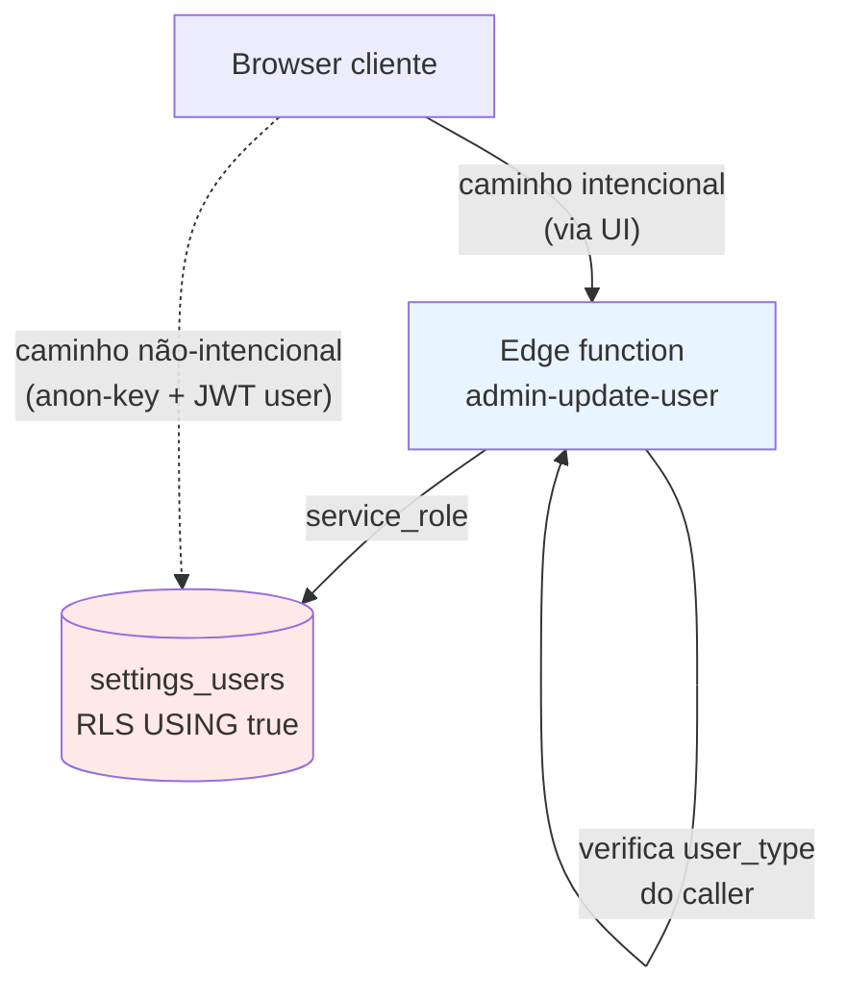

# ADR-AUTH-07: FWUP-17 — RLS aberto em `settings_users` (USING true) e migração para edge function gate

> **ADR retroativo.** Documenta uma decisão tomada em 2026-04-28 na migration `20260428060000_fwup17_rls_policies_baseline_repair.sql`. Sem ADR original, a decisão ficou invisível até a auditoria de tipos de usuário (2026-05-07), permitindo que o risco de auto-promoção via anon-key ficasse aberto por 9 dias antes de ser identificado pelo dev-qa.

## Contexto

Em 2026-04-28, ao provisionar tenants novos, descobrimos que a baseline `009_ensure_full_tenant_baseline` cria 33 tabelas com `ENABLE ROW LEVEL SECURITY` **mas zero `CREATE POLICY`**. As policies originais foram criadas em migrations com nomes UUID que nunca foram registradas em `client-migrations.json` — portanto nunca chegavam aos novos projetos Supabase de cada tenant.

Sintoma observado:
- Com RLS ativo + zero policies, `authenticated` não conseguia ler nem escrever em `settings`, `settings_users`, `leads`, etc.
- UI quebrava no primeiro login do gestor recém-provisionado (lista vazia, erros 401, formulários falhando ao salvar).
- Bloqueava onboarding de novos clientes.

Restrição arquitetural relevante (ADR-ADM-01 — project-per-tenant): cada tenant é um projeto Supabase isolado. Não dá para depender de uma single source-of-truth para policies; a baseline precisa ser totalmente self-contained no `client-migrations.json`.

A função auxiliar `is_admin_or_manager()` que originalmente sustentava as policies depende de um JOIN com `settings_users` por `auth.uid()`. Isso introduz um problema de bootstrap: o primeiro usuário criado em um tenant novo não tem ainda registro em `settings_users` no momento da policy, então qualquer policy baseada em `is_admin_or_manager()` falha silenciosamente nos primeiros INSERTs do provisioning script.

Pressão temporal: cliente em onboarding ativo, decisão precisava ser tomada na sessão.

## Opções Consideradas

### Opção A: Manter policies restritivas baseadas em `has_role()` / `is_admin_or_manager()`
**Prós:**
- RLS continua sendo a primeira linha de defesa contra escalation de privilégio.
- Modelo familiar — defense-in-depth conforme docs Supabase.

**Contras:**
- Quebra provisioning de tenants novos por bootstrap chicken-and-egg (`is_admin_or_manager()` retorna false antes do primeiro `settings_users` row existir).
- Exigiria refatorar `is_admin_or_manager()` para suportar bootstrap — escopo grande, sem tempo na janela.
- Risco de re-introduzir as 33 policies-com-UUID-órfãs que nunca chegavam aos tenants.

### Opção B: Abrir RLS com `USING (true)` e mover toda autorização para edge function layer
**Prós:**
- Destrava onboarding imediatamente.
- Edge functions já fazem `verify_jwt` + checagem de `user_type` antes de qualquer operação sensível (criar usuário, alterar role, deletar, etc.).
- Migration totalmente self-contained — nenhuma dependência em funções auxiliares ou estado prévio.
- Idempotente (DROP IF EXISTS antes de cada CREATE).

**Contras:**
- **Acesso direto via anon-key bypassa o gate.** Qualquer cliente com `apikey` válida (chave pública do projeto) pode `UPDATE settings_users SET user_type = 'admin' WHERE id = me` direto via REST/PostgREST.
- Defesa-em-profundidade vira defesa-em-superfície: um único ponto de falha no edge function compromete tudo.
- Move complexidade de SQL declarativo para código procedural distribuído em N edge functions.

### Opção C: Policies hardcoded com `auth.jwt() ->> 'role'`
**Prós:**
- Não depende de `settings_users` para resolver — usa claims do próprio JWT.
- Não tem chicken-and-egg.

**Contras:**
- Exige que toda mudança de `user_type` propague para `app_metadata` do JWT. Hoje isso não é feito automaticamente — precisaria de trigger novo + invalidar sessão ativa.
- Re-emissão de token tem latência (até logout/login do usuário). Promoção/demoção não toma efeito imediato.
- Drift potencial entre `settings_users.user_type` e `auth.jwt -> app_metadata.user_type`.

## Decisão

**Opção B** — Abrir RLS com `USING (true) WITH CHECK (true)` em todas as 33 tabelas afetadas, incluindo `settings_users`.

Toda autorização (quem pode promover, deletar, listar, alterar role de quem) **migra para edge function layer**. RLS volta a ser apenas autenticação grossa: "está logado? ok, pode acessar".

Rationale:
1. Onboarding precisava destravar na sessão. Solução restritiva sem bootstrap repair seria multi-sprint.
2. As edge functions críticas (`admin-create-user`, `admin-update-user`, `admin-delete-user`, etc.) já fazem o gate corretamente — verificam `user_type` do caller e rejeitam se não-admin. Auditoria de cada uma confirmou.
3. Idempotência é vital — a baseline precisa ser re-aplicável em qualquer tenant sem side-effects.

**Risco de segurança aceito explicitamente:**

Acesso direto via anon-key (`https://{tenant}.supabase.co/rest/v1/settings_users`) com JWT autenticado de qualquer `manager` ou `user` permite **auto-promoção a `admin`**:
```http
PATCH /rest/v1/settings_users?id=eq.{me}
Authorization: Bearer {valid_user_jwt}
apikey: {anon_key_publica_do_tenant}
{ "user_type": "admin", "super_admin": true }
```

A anon-key é embedada no client web (público por design). O JWT é o do próprio usuário logado. RLS aceita `USING (true)`. Resultado: privilege escalation de `user` para `admin` sem passar por nenhuma edge function.

Mitigação prevista no momento da decisão: edge function layer para todas operações *via UI*. Considerou-se aceitável temporariamente porque (a) requer conhecimento técnico não-trivial para explorar e (b) a janela seria curta enquanto endurecíamos as policies.

A janela acabou sendo de 9 dias até a auditoria identificar o gap. Aprendizado documentado em `docs/smart-memory/agents/qa/user-types-verdict.md`.

## Estratégia de Reversão

A reversão está rastreada em **[[../stories/backlog/FIX-USR-01]]** — "Restaurar RLS restritivo em `settings_users` (CRITICAL)".

Plano:
1. Manter `authenticated_read FOR SELECT USING (true)` — leitura ampla (UI lista usuários, autocomplete de "responsável", etc.) é benigna e tem alto custo de quebra se restringida.
2. Substituir `authenticated_write FOR ALL` por policies separadas:
   - `INSERT` — apenas `admin` ou `service_role` (impede auto-criação fora do edge function).
   - `UPDATE` — restringe alteração de `user_type` e `super_admin` para `admin` ou `service_role`. Demais campos (`name`, `email`, `avatar_url`) liberados para o próprio usuário em registro próprio (`auth_user_id = auth.uid()`).
   - `DELETE` — apenas `admin` ou `service_role`.
3. Função `is_admin_or_manager()` será revisada para o bootstrap case (primeiro user de tenant novo é criado por `service_role`, então não tem chicken-and-egg).
4. dev-qa re-aprova items 2.2 e 2.7 do checklist após merge.

A reversão **não toca** as outras 32 tabelas que também receberam `USING (true)` — risco daquelas é menor (não armazenam role do próprio caller). ADR futuro pode ser necessário se auditoria expandir o escopo.

## Consequências

**Positivas (assumidas no momento):**
- Onboarding de tenants novos destravou no mesmo dia.
- Migration totalmente self-contained, sem dependência de função/estado prévio.
- Idempotente — re-aplicável sem efeitos colaterais.
- Concentra autorização em um lugar (edge fn layer) — auditável.

**Negativas (algumas só apareceram depois):**
- **CRITICAL-1**: privilege escalation via anon-key em `settings_users`. Identificado pela auditoria 2026-05-07. Reversão rastreada em FIX-USR-01.
- Toda nova tabela criada precisa de gate explícito no edge function layer — fácil esquecer e expor write direto.
- Defense-in-depth perdida: RLS deixa de ser uma barreira independente.
- Aumenta cognitive load para novos devs ("por que essa tabela tem RLS open? quem garante a segurança?").

**Lição operacional:**
- Decisões com trade-off de segurança aceito **devem ter ADR no momento da decisão**, não retroativo. ADR ausente é o que permitiu o gap ficar invisível por 9 dias.
- `chore(docs)` na mensagem do commit da migration teria sido o momento certo de exigir um ADR via pre-merge checklist.

## Diagrama



Caminho pontilhado = a vulnerabilidade aceita. Caminho contínuo = o gate funcional.

## Referências

- Migration: `supabase/migrations/20260428060000_fwup17_rls_policies_baseline_repair.sql`
- Story original: FWUP-17 (provisionamento de tenants novos)
- Story de reversão: [[../stories/backlog/FIX-USR-01]]
- Auditoria que expôs o gap: `docs/smart-memory/agents/qa/user-types-verdict.md`
- Schema audit: `docs/smart-memory/agents/data-engineer/user-schema-audit.md`
- Supabase docs — [Row Level Security](https://supabase.com/docs/guides/auth/row-level-security)
- ADR-ADM-01 — Project-per-tenant (motiva por que toda baseline precisa ser self-contained)
