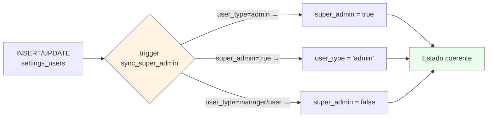

# ADR-AUTH-08: Invariante `super_admin ↔ user_type='admin'` em `settings_users`

> **ADR retroativo.** Documenta o contrato semântico das duas colunas que representam super-administrador no tenant — `super_admin boolean` e `user_type = 'admin'`. A ausência de garantia formal permitiu drift entre as duas representações e deixou o frontend (`useAuth.ts:196`) lendo apenas uma delas.

## Contexto

A tabela `settings_users` representa "quem é super-admin do tenant" de duas formas redundantes:

| Coluna | Tipo | Origem |
|---|---|---|
| `super_admin` | `boolean DEFAULT false` | Adicionada na baseline original |
| `user_type` | `text` (`'admin' \| 'manager' \| 'user'`) | Adicionada quando o RBAC ganhou granularidade |

A intenção sempre foi que **as duas representassem o mesmo conceito**: "este usuário pode tudo no tenant". Mas isso nunca foi garantido formalmente — não há trigger, constraint ou check, e nenhum ADR documentando a equivalência.

Estado observado pela auditoria (2026-05-07):
- Existem callers que setam `super_admin = true` mas deixam `user_type = 'manager'` (ou vice-versa).
- Frontend `src/hooks/useAuth.ts:196` deriva `super_adm` **apenas de `user_type === 'admin'`**, ignorando completamente a coluna `super_admin`.
  - Resultado: usuário com `super_admin = true` e `user_type = 'manager'` aparece como "manager" no client — não recebe os privilégios de UI esperados.
- Edge functions oscilam: algumas checam `super_admin`, outras checam `user_type === 'admin'`. Inconsistência silenciosa.

A causa raiz é histórica: ao introduzir `user_type`, ninguém formalizou se `super_admin` seria deprecado, sincronizado ou mantido como flag independente.

## Opções Consideradas

### Opção A: Deprecar `super_admin` e usar só `user_type`
**Prós:**
- Single source of truth — elimina drift por construção.
- Mais flexível — `user_type` permite expandir granularidade no futuro sem nova coluna.

**Contras:**
- Migration destrutiva — exige varrer todo código (client + edge fns + queries) e substituir refs a `super_admin`.
- Perde a semântica boolean rápida (`if user.super_admin`) que vários callers já usam.
- Risco alto de regressão — o código tem N pontos lendo `super_admin` boolean direto.

### Opção B: Deprecar `user_type` e usar só `super_admin`
**Prós:**
- Coluna boolean é mais simples e barata.

**Contras:**
- Perde granularidade `manager`/`user` — destrói o RBAC inteiro.
- Pior que A em todo aspecto exceto simplicidade.

### Opção C: Manter ambas e formalizar a invariante via trigger
**Prós:**
- Preserva todo código existente que lê `super_admin` ou `user_type`.
- Garante consistência por construção — drift fica impossível.
- Migração incremental: adiciona o trigger sem remover nada.
- Permite que cada caller use a representação que faz mais sentido (boolean rápido vs role-based).

**Contras:**
- Mantém duas representações (custo cognitivo: novo dev precisa entender que são equivalentes).
- Trigger é uma camada extra de complexidade no schema.

## Decisão

**Opção C** — Manter ambas as colunas e formalizar a invariante:

> **`super_admin = true` ↔ `user_type = 'admin'`**
>
> As duas colunas representam o mesmo conceito ("super-administrador do tenant") e devem sempre estar coerentes. Qualquer divergência é considerada estado inválido.

### Como a invariante é garantida

Trigger `BEFORE INSERT OR UPDATE` em `settings_users`, criado em **[[../stories/backlog/FIX-USR-03]]**:

**Estratégia adotada (a definir na story FIX-USR-03):** sincronização automática (não rejeição). Se `super_admin = true`, força `user_type = 'admin'`. Se `user_type = 'admin'`, força `super_admin = true`. Demoção (`user_type` muda para `manager`/`user`) força `super_admin = false`.

Justificativa para sincronização vs rejeição:
- Rejeição quebra callers legados que setam apenas uma das colunas — exigiria audit + fix de N pontos antes do deploy do trigger.
- Sincronização é idempotente e self-healing: registros inconsistentes hoje viram consistentes na primeira UPDATE que os tocar.
- Quem importa de fato é o resultado final (estado coerente), não o caminho do INSERT.

### Quem pode alterar

Após FIX-USR-01 fechar o RLS:
- `service_role` — provisioning, edge functions admin, scripts de seed.
- `user_type = 'admin'` (autenticado) — promoção/demoção via UI passa pelo edge function `admin-update-user`.
- Auto-update **proibido**: usuário não pode alterar o próprio `user_type` ou `super_admin` (RLS de UPDATE em FIX-USR-01 garante).

### Frontend alinhado

`src/hooks/useAuth.ts:196` deve passar a derivar `super_adm` da coluna `super_admin` boolean diretamente — não de `user_type === 'admin'`. Isso elimina o cenário de drift visível ao usuário e mantém a consistência mesmo se o trigger falhar (defense-in-depth).

Mudança rastreada em [[../stories/backlog/FIX-USR-03]] AC4.

## Consequências

**Positivas:**
- Drift entre as duas representações vira impossível por construção.
- Callers existentes continuam funcionando — qualquer um pode ler qualquer coluna e obter resposta correta.
- Self-healing: estado inconsistente legado se corrige no primeiro UPDATE.
- Frontend alinhado elimina classe inteira de bugs do tipo "promovi mas a UI não mudou".

**Negativas:**
- Custo cognitivo: novo dev precisa aprender a invariante e que as colunas são sinônimas. Mitigação: este ADR + comentário SQL no trigger.
- Trigger tem custo de runtime em cada INSERT/UPDATE em `settings_users`. Tabela é pequena (≤ centenas de rows por tenant) — custo desprezível.
- Se o trigger for desabilitado/dropado por engano, drift volta a ser possível e silencioso. Mitigação: snapshot do trigger no schema dump + alarme se schema diverge da baseline.

**Pendências futuras:**
- Considerar se `super_admin` boolean deve ser eventualmente deprecada (Opção A) quando o codebase estiver maduro o suficiente para uma varredura completa. Não é prioridade — invariante via trigger resolve o problema imediato sem custo.

## Diagrama

## Referências

- Story de implementação do trigger: [[../stories/backlog/FIX-USR-03]]
- Story de reversão de RLS (irmã, garante que só admin/service_role pode tocar nessas colunas): [[../stories/backlog/FIX-USR-01]]
- Frontend afetado: `src/hooks/useAuth.ts:196`
- Auditoria que identificou o drift: `docs/smart-memory/agents/qa/user-types-verdict.md`
- Schema audit: `docs/smart-memory/agents/data-engineer/user-schema-audit.md`
- ADR-AUTH-07 — RLS aberto em `settings_users` (contexto correlato)
