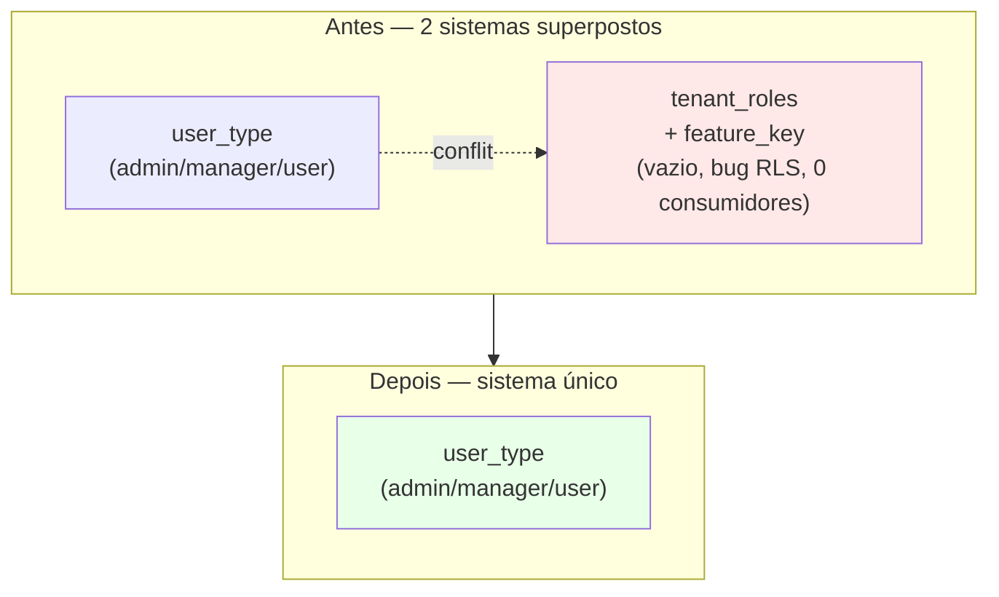

# ADR-AUTH-09: RBAC granular — descontinuar `tenant_roles` + `feature_key`

## Contexto

O codebase tem **dois sistemas de autorização superpostos**:

1. **Sistema canônico (ativo):** `settings_users.user_type ∈ { admin, manager, user }` + invariante `super_admin ↔ user_type='admin'` (formalizada em [[ADR-AUTH-08-invariante-super-admin-user-type]]). Toda lógica real de gating depende dele.

2. **Sistema granular (latente):** `tenant_roles` + `tenant_role_permissions` + 8 `feature_key` (`crm_export`, `crm_delete`, `score_view`, `coach_view`, `coach_edit`, `sends_create`, `bi_view`, `settings_view`) + coluna `settings_users.role_id`. Introduzido na story US-CFG-06, migration `20260423009000_tenant_role_permissions.sql`. Em uso parcial: schema, hooks e UI existem mas estão desconectados em produção.

A auditoria FIX-USR-04 inicialmente classificou o sistema (2) como dead code. dev-data-engineer descobriu que o frontend está cabeado e impediu o DROP cego. Isso forçou a decisão formal: **manter+evoluir ou descontinuar?**

### Estado quantitativo (verificado em 2026-05-07)

**Schema:**
```
tabelas: tenant_roles, tenant_role_permissions
coluna FK: settings_users.role_id (uuid, nullable)
enum: feature_key (8 valores)
função: seed_default_tenant_roles(p_tenant_id) — nunca chamada em produção
RLS: configurada (read por tenant_id em JWT, write por user_type='gestor' OR super_admin=true)
```

**Frontend:**
| Arquivo | LOC | Papel |
|---|---|---|
| `src/hooks/usePermissions.ts` | 162 | define `FeatureKey`, CRUD de tenant_roles (5 hooks React Query) |
| `src/hooks/useUserPermissions.ts` (parcial) | ~30 das 172 | sub-hook `useCurrentUserFeaturePermissions`, função `canFeature(key, default)` |
| `src/components/config/PermissoesConfig.tsx` | 286 | UI listagem/criação/toggle |
| `src/pages/settings/registry.ts` (entry) | 1 entry | rota `/settings/general/permissoes` |

**Total LOC granular:** ~480 LOC + 1 migration + 1 entry no registry.

**Callers de gates granulares:**
```
canExportCRM    : 0 consumidores fora de useUserPermissions.ts
canDeleteCRM    : 0
canViewScore    : 0
canViewCoach    : 0
canEditCoach    : 0
canCreateSends  : 0
canViewBI       : 0
canViewSettings : 0
```

**Os 8 gates granulares estão DEFINIDOS no hook mas NUNCA LIDOS por nenhum componente.** Verificado por grep word-boundary em todo `src/`. Eles existem como exports inutilizados.

**Callers de `useUserPermissions` (17 totais):**
- 8 consomem apenas roles canônicos (`isManager`, `isUser`, `isSuperAdmin`, `isGestor`, `isCliente`, `isProvisional`).
- 7 consomem derivações canônicas + filters (`canChangeFilters`, `userTimes`, `currentUserId`, `currentUserName`, `getTeamFilter`).
- 5 consomem gates `can*` derivados de `canManage` (não-granulares): `canCreateUser`, `canEditUser`, `canDeleteUser`, `canCreateClient`, `canEditClient`, `canDeleteClient`.
- 0 consomem qualquer gate granular do conjunto `canExportCRM..canViewSettings`.
- 1 (`PermissoesConfig.tsx`) consome diretamente `usePermissions` para CRUD da UI.

**DB (auditoria 2026-05-07):**
- `tenant_roles`: 0 rows.
- `tenant_role_permissions`: 0 rows.
- `settings_users.role_id`: NULL em todos os registros.

### Conclusão do diagnóstico

O sistema granular está em estado de **infraestrutura sem produtores E sem consumidores**:
- Nenhum tenant produziu roles via UI (zero rows em `tenant_roles`).
- Nenhum componente consome os gates granulares mesmo que houvesse roles.
- A função `seed_default_tenant_roles` está disponível mas nunca foi chamada em provisioning.

A presença do código não está habilitando nenhuma funcionalidade observável — está apenas adicionando superfície de manutenção e ambiguidade arquitetural ("temos RBAC granular?" — não, temos código que finge ter).

## Opções Consideradas

### Opção A: Manter e evoluir

**O que envolve:**
1. Migration de seed: chamar `seed_default_tenant_roles(tenant_id)` para cada tenant existente + integrar no provisioning de tenants novos.
2. Backfill: para cada `settings_users` existente, atribuir `role_id` baseado em `user_type` (`admin/manager` → role `gestor`, `user` → role `atendente`).
3. Conectar os 8 gates: editar 5+ componentes (Negocios, BI, Coach, Sends, Settings) para realmente checar `canExportCRM`/`canDeleteCRM`/etc. ao invés de ações sem gating.
4. UI de atribuição de role por usuário: nova seção em `UsuariosConfig` ou tela dedicada (estimativa ~200 LOC).
5. Trigger de invariante: garantir que `role_id` aponta para uma role do mesmo tenant (atualmente FK só checa existência, não tenant_id).
6. Documentar regras: admin pode criar role com mais poder que admin? regras de superseding `user_type` → `role`? (ambíguo hoje)
7. Reescrita de `RLS tenant_roles_gestor_write`: hoje filtra `user_type='gestor' OR super_admin=true` — mas `gestor` não é valor canônico de `user_type` (o canônico é `manager`). **Bug latente**: a RLS atual nunca daria write a ninguém porque `user_type='gestor'` não existe. Confirma que o sistema está inteiramente inalcançável em produção hoje.

**Esforço estimado:** L-XL (3-5 stories: backfill, UI, triggers, refactor, RLS fix).

**Prós:**
- Preserva extensibilidade futura para "papéis customizados".
- Investimento já feito no schema + UI + hooks não vai pro lixo.

**Contras:**
- Investimento grande para entregar valor que **ninguém pediu**. A auditoria não identificou stakeholder esperando granularidade.
- Sistema canônico (`user_type`) é simples e suficiente para todos os 17 callers identificados. Não há demanda observada.
- Bug latente da RLS (`user_type='gestor'` inválido) prova que ninguém tentou usar o sistema desde a implementação — qualquer tentativa real teria falhado.
- Aumenta cognitive load permanentemente: "qual sistema tem precedência? `user_type` ou `role`? E se discordarem?"
- Interage com FIX-USR-01: introduzir UI de atribuição de role precisa do RLS restritivo + edge fn gate, multiplicando o trabalho de revisão.

### Opção B: Descontinuar

**O que envolve:**
1. Remover entry de rota: deletar `/settings/general/permissoes` de `src/pages/settings/registry.ts:252-257` (1 entry, ~6 linhas).
2. Deletar arquivos:
   - `src/components/config/PermissoesConfig.tsx` (286 LOC)
   - `src/hooks/usePermissions.ts` (162 LOC)
3. Refatorar `src/hooks/useUserPermissions.ts`:
   - Remover `useCurrentUserFeaturePermissions` (15 LOC).
   - Remover import de `FeatureKey`.
   - Remover função `canFeature` (6 LOC).
   - Remover 8 gates granulares do retorno (8 LOC).
   - Remover destructure de `featurePerms` (3 LOC).
   - Total: ~32 LOC removidas, 0 callers afetados (porque ninguém consome esses 8 gates).
4. Migration de drop:
   ```sql
   ALTER TABLE settings_users DROP COLUMN IF EXISTS role_id;
   DROP TABLE IF EXISTS tenant_role_permissions;
   DROP TABLE IF EXISTS tenant_roles;
   DROP TYPE IF EXISTS feature_key;
   DROP FUNCTION IF EXISTS seed_default_tenant_roles(uuid);
   ```
   Adicionada à `client-migrations.json`.
5. Atualizar `agents/research/user-types-mapping.md` removendo a menção a `tenant_role_permissions`.

**Esforço estimado:** S (1 story, ~1-2h de trabalho real).

**Prós:**
- Elimina ~480 LOC de código que não exerce sua função.
- Elimina 3 tabelas + 1 enum + 1 função + 1 coluna FK que estão vazios em produção.
- Simplifica modelo mental: um único sistema de autorização (`user_type`).
- Remove ambiguidade arquitetural permanente.
- Reduz superfície de auditoria de segurança (menos RLS para revisar).
- Remove bug latente da RLS `user_type='gestor'` que estava silenciosamente quebrado.

**Contras:**
- Bloqueia "papéis customizados" como feature futura — quem quiser isso volta ao zero. Mitigação: re-introduzir é ~2 dias quando houver demanda real, e idealmente com decisões de design baseadas em uso real (não preventivas).
- Investimento da story US-CFG-06 vira sunk cost. Mitigação: aprendizado registrado neste ADR, e código preservado em git history (sempre recuperável).

### Opção C: Manter o schema, deletar só frontend

Considerada brevemente: deletar UI + hooks mas manter as tabelas para re-adoção futura. Rejeitada porque tabelas vazias com RLS quebrada (`user_type='gestor'` inexistente) são pior do que ausência — induzem a falsa sensação de feature disponível e exigem explicação permanente. Se a feature voltar, schema redo é trivial.

## Decisão

**Opção B — descontinuar.**

Rationale dominante: **o sistema granular está sem produtores E sem consumidores em produção.** As 8 features `feature_key` são definidas no hook e nunca lidas; as 3 tabelas estão vazias em produção; a função `seed_default_tenant_roles` nunca é chamada; a RLS de write tem bug latente (`user_type='gestor'` inválido) que prova que ninguém testou o caminho real.

Manter código que não exerce sua função é débito permanente sem ROI. Re-introduzir quando houver demanda real é trivial (~2 dias) e melhor — design dirigido por requisito real, não suposição.

A decisão é **reversível em código** (git preserva tudo) e **reversível em design** (re-implementação é S, não L).

### Alinhamento com ADRs adjacentes

- **ADR-AUTH-04 (granularidade de hooks):** afetado. Os 8 gates granulares listados em ADR-AUTH-04 (canFeature) saem. ADR-AUTH-04 será atualizado em ARCH-RBAC-02 para refletir.
- **ADR-AUTH-07 (RLS aberto em settings_users):** não afetado diretamente. A coluna `role_id` é dropada como parte desta decisão; FIX-USR-01 (que fechou o RLS) não dependia dela.
- **ADR-AUTH-08 (invariante super_admin ↔ user_type='admin'):** não afetado. `user_type` continua sendo a fonte canônica.

### Restrições de execução

- Pode prosseguir agora: FIX-USR-01 (CRITICAL) já foi fechada (lead confirmou em 2026-05-07).
- Migration de drop deve ser numerada após a última aplicada e registrada em `supabase/client-migrations.json`.
- Refactor de `useUserPermissions.ts` deve preservar 100% da assinatura usada pelos 17 callers — a remoção é apenas dos exports não-consumidos.

## Consequências

**Positivas:**
- ~480 LOC removidas + 3 tabelas + 1 enum + 1 função + 1 coluna FK + 1 entry de rota.
- Sistema de autorização unificado em `user_type` — um único modelo mental.
- Remove bug latente de RLS (`user_type='gestor'` inválido).
- Reduz superfície de auditoria de segurança permanente.
- Story US-CFG-06 fica documentada como aprendizado: introduzir infraestrutura RBAC sem caso de uso real e sem consumidores conectados → débito.

**Negativas:**
- Quem quiser papéis customizados no futuro precisa re-implementar. Aceitável: nenhuma demanda observada, e re-implementar é S quando guiado por requisito real.
- Story US-CFG-06 vira sunk cost. Aceitável: o aprendizado vale mais que os ~480 LOC.

**Pendências:**
- Atualizar [[ADR-AUTH-04-auth-hooks-granularity]] removendo a tabela de gates granulares quando ARCH-RBAC-02 mergear.
- Atualizar `agents/research/user-types-mapping.md` removendo seção de `tenant_role_permissions`.

## Diagrama



## Stories de execução

- [[../stories/backlog/ARCH-RBAC-02-drop-rbac-granular]] — execução do drop completo (frontend + backend + migration).

## Referências

- Migration introdutória: `supabase/migrations/20260423009000_tenant_role_permissions.sql` (story US-CFG-06).
- Story de decisão: [[../stories/done/ARCH-RBAC-01]].
- Auditoria que motivou a re-validação: `docs/smart-memory/agents/data-engineer/user-schema-audit.md`.
- Mapeamento de roles original: `docs/smart-memory/agents/research/user-types-mapping.md`.
- ADR-AUTH-04, ADR-AUTH-07, ADR-AUTH-08 (auth/auth-hooks correlatos).
