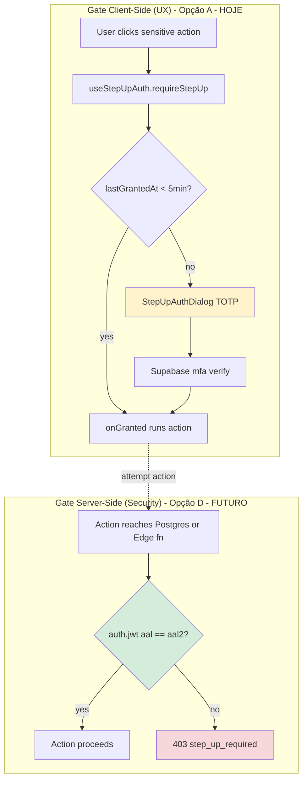

# ADR-AUTH-STEPUP-01: Estratégia de enforcement do step-up auth

## Context

A story AUTH-V2-03c entregou o mecanismo de step-up auth (challenge AAL2 sob demanda) como **fundação** — `useStepUpAuth` + `StepUpAuthDialog` + verificação de AAL via `supabase.auth.mfa.getAuthenticatorAssuranceLevel()`. A intenção é proteger ações sensíveis: chamar `requireStepUp(onGranted)` antes de executar a ação; se a sessão atual for AAL1, o dialog TOTP abre; após verify, `onGranted` é executado e o resultado é cacheado por 5 min.

Re-review de QA (2026-04-26, registrado em `docs/smart-memory/agents/qa/results.md`) levantou um issue arquitetural HIGH: **o gate é client-side**. O cache `lastGrantedAt` mora em variável módulo-scope (`src/hooks/useStepUpAuth.ts:19`) — atacante com devtools pode setar `lastGrantedAt = Date.now()` no console e bypassar o dialog inteiro. O verify do TOTP em si é server-side (Supabase Auth), mas a **decisão de pedir TOTP** é local.

A nota da QA da 03c sobre PR #36 ter trocado `lastGrantedAt` para `useRef` está confirmada — commit `dbb940a3` (Apr 26 18:30) aplicou a migração junto com o fix de race condition em `ProtectedRoute` e a remoção de `extractTenantId`. O bypass via devtools permanece possível como limitação intrínseca de qualquer gate client-side, o que motiva a decisão arquitetural abaixo.

### Estado atual no código

| Item | Estado |
|---|---|
| `requireStepUp` callsites em produção | **0 — zero** (`grep -rn "useStepUpAuth\|requireStepUp" src` fora dos próprios arquivos do hook/dialog: vazio) |
| `lastGrantedAt` scope | `useRef<number \| null>` per-instance (corrigido em commit `dbb940a3` / PR #36 — escopo isolado entre instâncias do hook). Bypass via devtools ainda é possível em runtime (limitação fundamental do gate client-side), mas vazamento entre instâncias está fechado. |
| RLS por AAL em migrations | **0 ocorrências** (`grep -rn "auth.jwt()" supabase/ + filtros AAL`: nenhuma policy condicional em `aal2`) |
| Edge fns sensíveis com gate AAL | **0** — todas as fns ADM/admin (`admin-unenroll-mfa`, `adm-purge-tenant`, `create-tenant-user`, `update-user-password`, etc.) checam apenas role/super_admin via `app_metadata`/`settings_users`, nunca AAL |

### Ações sensíveis candidatas (inventário)

Mapeamento das ações do produto que **deveriam** exigir step-up sob uma política conservadora:

| Categoria | Ação | Onde | Hoje exige |
|---|---|---|---|
| MFA management | Remover TOTP factor de outro usuário | `supabase/functions/admin-unenroll-mfa` | gestor OU super_admin (RBAC, sem AAL) |
| MFA management | Auto-unenroll do próprio TOTP | `useMFA.unenrollSelf` (Supabase exige AAL2 nativamente) | AAL2 (enforced pelo Supabase Auth) |
| Tenant lifecycle | Purgar tenant (soft → hard delete) | `supabase/functions/adm-purge-tenant` | service_role (cron-only, sem usuário humano) |
| Tenant provisioning | Criar usuário em tenant | `supabase/functions/create-tenant-user` | super_admin no control plane (RBAC) |
| Auth admin | Trocar senha de usuário (admin) | `supabase/functions/update-user-password` | RBAC |
| Tenant secrets | Rotacionar `service_role_key`, `db_password`, `management_token` | `supabase/functions/adm-rotate-management-token` | super_admin (RBAC) |
| Settings críticos | Alternar feature flags caros (ex.: `bi_voice_chat_beta_enabled`) | UI Settings | RLS gestor/super_admin (RBAC) — em discussão na story BI-VOICE-04 |
| Integrações | Conectar/desconectar OAuth providers (Meta, TikTok, Google Cal) | `bi-meta-oauth`, `instagram-oauth`, etc. | RBAC |
| Data export | Solicitar export LGPD do tenant inteiro | `data-export-request` (LGPD) | RBAC |

Hoje **nenhuma** dessas exige AAL2. RBAC sozinho responde "esse usuário tem o papel?" mas não responde "esse usuário acabou de provar posse do segundo fator?" — o que é o ponto inteiro do step-up.

## Options

### Opção A — Gate client-only (estado atual + correção mínima)

`useStepUpAuth` continua sendo a fonte de verdade. Correções mínimas:
1. Mover `lastGrantedAt` para `useRef` (per-instance) — fecha o bypass mais óbvio em runtime React
2. Wire-up explícito em uma whitelist conservadora de callsites (ex.: `unenrollSelf`, troca de senha pelo próprio usuário, conectar OAuth)
3. Documentar que esse gate é **UX-grade**, não **security-grade** — atacante autenticado com devtools/curl bypassa

**Prós:**
- Zero infraestrutura nova (nenhuma migration, nenhuma edge fn nova)
- Latência zero — checagem local é síncrona
- Coerente com a fundação que AUTH-V2-03c já entregou
- UX consistente: dialog único, mesma janela de 5 min, mesmas mensagens

**Contras:**
- Bypass trivial via devtools (`lastGrantedAt = Date.now()` ou simplesmente chamar a função protegida direto via fetch com o JWT existente)
- **Não defende contra atacante autenticado** — só contra "usuário usa o produto via UI normal"
- Falsa sensação de segurança: presença do dialog dá a impressão de gate forte
- Re-issue de TOTP server-side acontece (verify é real), mas o resultado não vira nada que o backend reconheça

### Opção B — RLS condicional em `auth.jwt() ->> 'aal' = 'aal2'`

Para cada tabela/RPC sensível, adicionar policy específica que exige AAL2 no JWT. Exemplos:

```sql
-- Exemplo: settings_users sensitive updates
CREATE POLICY "settings_users_sensitive_aal2"
  ON public.settings_users FOR UPDATE TO authenticated
  USING (
    (auth.jwt() ->> 'aal') = 'aal2'
    AND <existing tenant/role guards>
  );

-- Ou em RPC SECURITY DEFINER:
CREATE FUNCTION rotate_secret(...) RETURNS ... AS $$
BEGIN
  IF (current_setting('request.jwt.claims', true)::jsonb ->> 'aal') <> 'aal2' THEN
    RAISE EXCEPTION 'aal2_required';
  END IF;
  ...
END $$ LANGUAGE plpgsql SECURITY DEFINER;
```

**Prós:**
- Enforcement real no Postgres — qualquer caller (UI, curl, edge fn) é checado
- Auditável: a policy é a fonte de verdade, lê em SQL
- Consistente com como o resto do produto faz multi-tenancy (RLS por `tenant_id`)
- Custo ~zero em latência (Postgres lê JWT claim local da request)

**Contras:**
- **Problema do JWT**: para o cliente conseguir um token com `aal=aal2`, ele precisa ter acabado de fazer challenge+verify de um factor MFA. O token do usuário só sobe pra `aal2` após `mfa.challengeAndVerify()`. Tudo bem — mas o token volta pra `aal1` no próximo refresh? Resposta: **não**, o claim `aal` persiste pelo lifetime do token (1h padrão). Logo a janela natural é 1h, não 5 min como o cache atual.
- **Forçar refresh**: se quiséssemos uma janela menor que o token TTL, precisaríamos invalidar o token explicitamente (signOut/refresh) — UX ruim
- Cobrir todas as ações sensíveis exige sweep + migrations por tabela/RPC (escopo grande, multi-story)
- Edge fns que não usam Postgres (puro JavaScript chamando Supabase Admin API com `service_role`) **não são protegidas por RLS** — RLS só existe quando o caller é authenticated user, não service_role. Para essas (`admin-unenroll-mfa`, `adm-purge-tenant`, etc.), precisaríamos da Opção C
- Risco de quebrar fluxos existentes: qualquer usuário sem MFA enrolado não consegue executar a ação — degrada UX para gestores que ainda não migraram pra MFA

### Opção C — Edge fn middleware verificando `aal` na claim do JWT

Cada edge fn sensível faz, no topo, algo como:

```ts
const { data: { user } } = await supabase.auth.getUser(token);
if (user?.aal !== 'aal2') return json({ error: 'aal2_required', code: 'STEP_UP_REQUIRED' }, 403);
```

(Nota: `supabase.auth.getUser()` retorna `aal` no objeto user — claim verificada server-side.)

**Prós:**
- Enforcement real no servidor — devtools bypass impossível
- Cobre as edge fns que usam `service_role` (RLS não cobre essas)
- Granularidade fina: dá para escolher quais fns exigem AAL2 e quais não

**Contras:**
- Espalhado: uma checagem manual por edge fn, fácil esquecer em fn nova (precisa virar boilerplate `requireAal2(req)` em `_shared/`)
- Mesma questão de TTL do token (Opção B): janela de "frescor" do AAL é o lifetime do token, não 5 min
- Não cobre RPCs Postgres (precisa Opção B em paralelo)

### Opção D — Híbrido: client gate (UX) + server gate (security) por categoria

Manter `useStepUpAuth` como **gate de UX** (abre o dialog, melhora descoberta, contém "frescor" de 5 min), e **adicionar** server gate em B/C para as ações que importam de fato.

Categorização proposta:

| Categoria | Server gate | Justificativa |
|---|---|---|
| Mutações em `auth.users`, `mfa_factors`, `mfa_recovery_codes` (cross-user) | C (edge fn middleware) | Service_role não passa por RLS |
| Rotação de secrets (`adm_clients.service_role_key`, etc.) | C | service_role only, alto impacto |
| Tenant purge | (já é cron-only, sem caller humano) | N/A |
| Mudanças em `settings_users.user_type`/`super_admin` | B (RLS) | Caller é authenticated user; RLS aplica |
| Toggle de feature flags caros (`bi_voice_chat_beta_enabled`) | B (RLS) | Mesmo motivo |
| Auto-unenroll do próprio TOTP | (Supabase já força AAL2 nativamente) | N/A |

**Prós:**
- Cobre as duas faces (UI bonita + segurança real) sem deixar buraco
- Permite rollout incremental: Opção A já cuida de UX hoje; B/C são adicionados por categoria conforme prioridade

**Contras:**
- Mais código a manter (gate em duas camadas)
- TTL desalinhado: cliente cacheia 5 min, servidor cacheia o token TTL (~1h) — confuso para auditar "por quanto tempo a aprovação vale?"

## Decision

**Adotar Opção A no curto prazo (estado atual + correção P1) e migrar para Opção D conforme uso real cresce.**

Justificativas:
1. **Zero callsites hoje**: o mecanismo está em `main` mas nenhuma ação sensível chama `requireStepUp`. Bypass é teórico — não há atacante explorando porque não há gate em ação a explorar
2. **Custo de oportunidade**: implementar Opção D agora exige sweep de RLS + migrations + middleware — escopo cross-cutting que compete com fixes mais urgentes (BI-VOICE-04 em progresso, FIX-* no backlog)
3. **Caminho de evolução claro**: Opção A não fecha portas para D — quando wire-up começar (ex.: na story de hardening de admin actions), cada callsite **opta** pelo gate B ou C conforme a ação
4. **AAL2 nativo do Supabase já cobre o pior caso**: `mfa.unenroll()` (auto-unenroll) já exige AAL2 server-side por padrão do Supabase Auth. A ação mais perigosa do ponto de vista do próprio usuário (queimar o próprio fator) já é segura por construção

### Ações imediatas (escopo desta ADR — fora dessa story)

1. ~~**Correção P1 em `useStepUpAuth.ts`**~~ — **JÁ FEITO** em `dbb940a3` (PR #36): `lastGrantedAt` migrado para `useRef<number | null>(null)` per-instance. Bypass via devtools continua possível (limitação fundamental do client gate) mas vazamento entre instâncias está fechado.
2. **Comentário explícito** no topo do hook: "client-side UX gate; not a security boundary; sensitive server-side actions must enforce AAL2 independently" — recomendação para ser aplicada quando o primeiro callsite real for adicionado
3. **Não wire-up agressivo de callsites** sem antes definir, por categoria (Opção D), qual o server gate correspondente

### Ações deferidas (criar story dedicada)

- **Story de hardening cross-cutting**: implementar Opção D por categoria (ver tabela acima). Inclui:
  - Helper `_shared/requireAal2.ts` em edge fns (Opção C)
  - Migrations RLS para tabelas sensíveis (Opção B)
  - Wire-up de callsites client-side ao `requireStepUp` por simetria UX
  - Decisão de TTL: alinhar janela cliente (5 min) com janela token (1h) — provavelmente reduzindo TTL do JWT pós-AAL2 ou aceitando 1h como TTL real

## Diagrama



Hoje só a coluna esquerda existe. Ataque possível: pular a coluna esquerda inteira via devtools, action chega no servidor, servidor não tem coluna direita ainda, action passa.

## Consequences

**Positivo:**
- Decisão registrada e justificada — futuras stories de hardening têm contexto histórico (porquê não fizemos D agora)
- Correção P1 documentada (`useRef`) destrava QA da 03c que estava operando com info errada sobre o estado de `lastGrantedAt`
- Inventário das ações sensíveis fica mapeado em um lugar — base para a futura story
- Rollout incremental aceita: cada categoria pode receber o server gate quando o módulo correspondente for tocado, sem big-bang

**Negativo / trade-offs:**
- **Falsa sensação de segurança ativa**: enquanto callsites forem adicionados sem o server gate da Opção D, o produto carrega um gate UX que parece de segurança mas não é. Mitigação: comentário explícito no hook + revisão obrigatória pelo dev-architect ao introduzir cada novo callsite
- **Débito de segurança real**: enquanto a Opção D não rola, qualquer ação sensível que dependa só de `requireStepUp` pode ser bypassada por usuário autenticado com curl. Hoje **isso não é um risco efetivo** porque há zero callsites; vira risco real no momento que o primeiro callsite for ligado
- **Inconsistência potencial entre as TTLs**: 5 min client / ~1h server quando D vier. Aceitar e documentar, ou alinhar via signOut+signIn pós-AAL2 (UX ruim)

## When to revisit

Re-abrir esta ADR e disparar a story de hardening (Opção D) quando QUALQUER um destes triggers ocorrer:

1. **Primeiro callsite real de `requireStepUp`** for proposto em PR. A revisão deve verificar se o caller correspondente tem (ou ganhará) gate server-side. Sem isso, o callsite **não merge**
2. **Auditoria externa** (LGPD, SOC2, pen test) levantar enforcement client-side como achado
3. **Incidente** confirmando bypass real — qualquer caso de ação sensível executada via curl com JWT AAL1
4. **Crescimento de ações administrativas críticas**: quando o número de callsites candidatos passar de 5 (a tabela "Ações sensíveis candidatas" cresceu de 9 para 15+), o custo marginal de manter o gate só client-side excede o custo de implementar Opção D

**Owner da revisão:** dev-architect (Zaelor) coordena, dev-data-engineer (byte) implementa migrations RLS, dev-dev-beta (rex) ou dev-dev-alpha (Nova) implementam helper `_shared/requireAal2.ts` e wire-up.

## Arquivos relevantes

- `src/hooks/useStepUpAuth.ts` — hook client-side, fonte de verdade do gate UX hoje
- `src/components/auth/StepUpAuthDialog.tsx` — UI TOTP de 6 dígitos
- `src/components/auth/ProtectedRoute.tsx` — gate `requiresMfa` no router (separado deste fluxo; cobre login inicial AAL2)
- `src/hooks/useMFA.ts` — `getAssuranceLevel`, `consumeRecoveryCode`, `unenrollSelf` — wrappers de Supabase Auth MFA API
- `supabase/functions/admin-unenroll-mfa/index.ts` — exemplo de edge fn que **deveria** ganhar gate AAL2 quando Opção D rolar
- `supabase/functions/_shared/response.ts` — local natural para helper `requireAal2` quando vier
