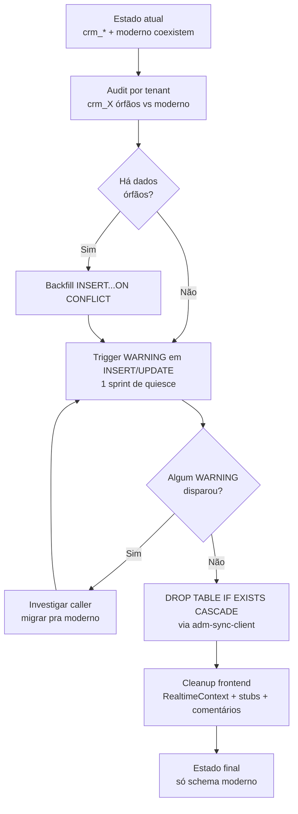

# ADR-SCHEMA-MIGRATION: Estratégia para schema dual `crm_*` (legado) vs moderno

## Status

**in-progress** — Opção A aprovada. Frontend cleanup (Fase 3) parcialmente concluído em AUDIT-FIX-10:

| Componente | Status | Evidência |
|---|---|---|
| RealtimeContext: subs a `crm_pessoas`/`crm_leads` | ✅ removidas | `src/contexts/RealtimeContext.tsx` linhas 116-140 — só `clients_people`+`leads` ativos com `tenant_id=eq.${tenantId}` |
| `crm_messages` DROP | ✅ aplicado | `20260423016000_drop_crm_messages.sql` |
| Comentários doc em `google-cal-connect`/`ms-teams-connect` | ✅ atualizados | `crm_usuarios.id` → `settings_users.id` (2026-05-04) |
| RLS `USING(true)` em crm_* | ✅ corrigido | `20260426010000_crm_rls_tenant_isolation.sql` substituiu policies por `get_current_user_tenant_id()` |
| Backfill por tabela (Fase 1) | ⏳ pendente | requer análise empírica em `schema-dual-analysis.md` |
| Quiesce trigger WARNING (Fase 2) | ⏳ pendente | aguarda Fase 1 |
| DROPs das 6 tabelas restantes (Fase 4) | ⏳ pendente | wave após quiesce |

Análise complementar do data-engineer em `agents/data-engineer/schema-dual-analysis.md` (story #35).

### Edge Functions Afetadas (verificação 2026-05-04)

Levantamento via grep `crm_pessoas|crm_empresas|crm_leads|crm_agendamentos|crm_pipelines|crm_stages|crm_usuarios|crm_messages` em `supabase/functions/`:

| Edge function | Tipo de referência | Ação |
|---|---|---|
| `google-cal-connect/index.ts` | comentário doc obsoleto | ✅ atualizado para `settings_users.id` |
| `ms-teams-connect/index.ts` | comentário doc obsoleto | ✅ atualizado para `settings_users.id` |

**Zero queries reais** em edge functions referenciam schema legado. As 39 edge functions com queries CRM operam exclusivamente em tabelas modernas (`clients_people`, `leads`, `messages`, `meetings`, `clients_companies`, `leads_pipelines`, `leads_stages`, `settings_users`).

**Conclusão:** edge layer está pronto para Fase 4 (DROPs) sem nenhum trabalho adicional.

### Verificação: DROPs sem `IF EXISTS` em migrations (AUDIT-FIX-10 AC3)

`grep -r "DROP TABLE\|DROP FUNCTION\|DROP INDEX\|DROP VIEW" supabase/migrations/ | grep -v "IF EXISTS"` retorna **7 ocorrências**, todas em migrations legadas de 2025 (junho-setembro):

| Migration | Linha | DROP |
|---|---|---|
| `20250624155147-...-ok.sql` | 24 | `DROP TABLE public.usuarios` (ALTER + rename pattern) |
| `20250625182017-...-ok.sql` | 160-161 | `DROP TABLE empresa_mapping, ... backup_*` (cleanup pós-migration) |
| `20250625204533-...-ok.sql` | 205-206 | idem |
| `20250915194910_...-ok.sql` | 5 | `DROP FUNCTION get_dashboard_conversas_aggregated(...)` (overload cleanup) |
| `20260422000600_prospect_drop_v1_tables.sql` | 14 | comentário, não DROP real |

**Nenhuma é candidata a converter:**
1. **Migrations imutáveis após aplicadas** — alterar uma migration de 2025 já em produção quebra audit trail e o registro `supabase_migrations.schema_migrations` (que armazena hash do conteúdo).
2. **Não há risco de re-run** — Supabase gerencia idempotência via tabela de migrations aplicadas; mesmo que houvesse, esses DROPs operam em objetos temporários (`backup_*`, `*_mapping`) ou já dropados.
3. **Migrations modernas (2026+) já seguem padrão `IF EXISTS`** — verificado: todas DROPs em `20260*` usam `IF EXISTS`. Padrão estabelecido para migrations futuras.

**Resultado AC3:** nenhuma alteração necessária. Padrão `IF EXISTS` já aplicado em migrations recentes; legadas são imutáveis por contrato.

## Contexto

O projeto carrega dois conjuntos paralelos de tabelas para entidades CRM:

| Schema legado (`crm_*`) | Schema moderno | Status no banco |
|---|---|---|
| `crm_pessoas` | `clients_people` | Ambos existem |
| `crm_empresas` | `clients_companies` | Ambos existem |
| `crm_leads` | `leads` | Ambos existem |
| `crm_messages` | `messages` | **legado já dropado** em `20260423016000_drop_crm_messages.sql` ✅ |
| `crm_agendamentos` | `meetings` | Ambos existem |
| `crm_pipelines` + `crm_stages` | `leads_pipelines` + `leads_stages` | Ambos existem |
| `crm_usuarios` | `settings_users` | Ambos existem |
| `crm_tenants` | (control plane: `adm_clients`) | Ambos existem |

Issues mapeados a esta dualidade na auditoria de banco (`audit/database.md`):

- **DB-P0-002** — RLS `USING(true)` em tabelas `crm_*` no baseline (sem isolamento real de tenant interno).
- **DB-P0-003** — `prospect_campaigns.tenant_id` backfilled condicionalmente a partir de `crm_usuarios` — se tenant já migrou para schema moderno, campanhas legacy ficam com `tenant_id NULL`.
- **DB-P1-002** — schema legado `crm_*` paralelo ao moderno **sem migration de dados** documentada.
- **DB-P1-003** — `RealtimeContext` subscreve `crm_pessoas` e `crm_leads` com `filter: tenant_id=eq.X`. Se essas tabelas não recebem mais writes (frontend usa `clients_people`/`leads`), as subscrições retornam **0 eventos** — UI não atualiza em tempo real.
- **DB-P1-004** — funções RLS misturadas (`current_setting`, `get_current_user_tenant_id`, `user_has_tenant_access`, `get_current_settings_user_id`) — depende da tabela.

### Verificação empírica do uso vivo (2026-04-26)

Levantamento por grep em `src/` e `supabase/functions/` (busca por nome de tabela em strings de query):

| Local | crm_* (legado) | Moderno |
|---|---|---|
| `src/hooks/` | **0 queries** | 79 arquivos com queries em `clients_people`, `leads`, `messages`, `meetings` |
| `src/contexts/RealtimeContext.tsx` | **2 subscrições** (`crm_pessoas`, `crm_leads`) — silently dead | (também subscreve `clients_people`, `leads` — handler único) |
| `src/components/layout/DashLayout.tsx:183` | 1 string em filtro de `queryClient.invalidateQueries` (orphan key — não há query usando essa chave) | — |
| `src/hooks/useStubsAll.ts` | 4 campos OPCIONAIS em interfaces TS (`crm_pessoas?`, `crm_empresas?`, etc.) — convivem com campos modernos no mesmo objeto, herdados de payloads JOIN antigos | — |
| `supabase/functions/` | **0 queries**. 2 comentários doc em `google-cal-connect/` e `ms-teams-connect/` mencionando `crm_usuarios.id` — código real usa schema moderno | 39 arquivos com queries em tabelas modernas |

**Conclusão empírica:** o **frontend e edge functions já operam 100% no schema moderno**. As referências sobreviventes a `crm_*` são:
- 2 subscrições Realtime mortas (não recebem eventos).
- 1 string órfã em invalidação de cache.
- 4 campos opcionais em interface TS de stubs.
- 2 comentários doc desatualizados.

Não há código vivo dependendo de `crm_*`. **A "duplicação"é fantasma — só existe no banco.**

A migração de `crm_messages` em `20260423016000_drop_crm_messages.sql` (commit precedente) confirmou esse padrão para uma das tabelas: SPA + edge migrados → DROP IF EXISTS, sem incidente. Replicar a mesma fórmula nas demais.

### Restrições / fatos

- **Modelo project-per-tenant** ([[ADR-ADM-01-project-per-tenant]]): cada tenant é um projeto Supabase isolado. Cada DROP precisa rodar em **N tenants** via `adm-sync-client` (apply incremental), não somente no control plane.
- **Existem dados em produção** em tabelas `crm_*` em tenants ativos? — incerto sem auditoria viva. A auditoria DB (`audit/database.md` DB-P1-002) afirma "Dois conjuntos de dados divergentes existem em paralelo, com nenhuma sincronização detectada", mas isso é hipótese baseada em grep + ausência de código de sync. Validação obrigatória antes de qualquer DROP.
- **Schema moderno tem coverage de RLS adequado** (auditoria mostra policies usando `user_has_tenant_access` ou `get_current_user_tenant_id` em quase todas tabelas modernas). Schema legado tem `USING(true)` ou policies inconsistentes (DB-P0-002, DB-P1-004).
- **`crm_tenants`** é caso especial — é o registry de tenants do control plane (mencionada na migration `20260312170000_ensure_crm_tenants_baseline.sql`). **NÃO** é equivalente a `adm_clients` no control plane (este último é de outro projeto). Precisa avaliação separada.
- **Padrão já exercitado:** `20260423016000_drop_crm_messages.sql` foi aplicado nesta arquitetura sem incidente — DROP IF EXISTS CASCADE em tabela cujo conteúdo já estava no equivalente moderno. Template direto.
- **Story `AUDIT-FIX-10` é XL** — escopo dimensionado para refator significativo, não micro.

---

## Opções consideradas

### Opção A — Migrar dados legado → moderno (se houver) e descontinuar `crm_*` em wave de DROPs

**Fluxo proposto, aplicado por tabela:**

1. **Audit phase (por tenant):**
   - Query SQL via `tools/audit_client.sql` em cada tenant: `SELECT count(*) FROM crm_pessoas WHERE NOT EXISTS (SELECT 1 FROM clients_people WHERE clients_people.id = crm_pessoas.id)` para cada par.
   - Identifica tenants com dados órfãos no legado.

2. **Backfill phase (idempotente):**
   - Migration `INSERT INTO clients_people SELECT ... FROM crm_pessoas ON CONFLICT DO NOTHING` por par.
   - Aplicada via `adm-sync-client` em todos os tenants.
   - Logs de quantos rows transferidos por tenant em `_meta_debug` ou tabela de audit.

3. **Quiesce phase (1 sprint de observação):**
   - Adicionar trigger `BEFORE INSERT/UPDATE` em cada `crm_*` que faz `RAISE WARNING 'legacy table'` (não bloqueia, só sinaliza).
   - Monitorar logs por uma sprint — se nenhum WARN dispara, confirma que ninguém está escrevendo.

4. **Drop phase:**
   - Migration `DROP TABLE IF EXISTS public.crm_X CASCADE` para cada par. Idempotente via `IF EXISTS`.
   - Aplicada via `adm-sync-client` em todos os tenants.
   - Mesmo padrão de `20260423016000_drop_crm_messages.sql`.

5. **Cleanup frontend (paralelo):**
   - `RealtimeContext.tsx` linhas 88, 126, 136 — remover refs a `crm_pessoas`/`crm_leads` (DB-P1-003 fechado).
   - `DashLayout.tsx:183` — remover string órfã `'crm_leads'`.
   - `useStubsAll.ts` — remover campos opcionais `crm_*?` se confirmar que nenhum payload legado os contém.
   - 2 comentários em `google-cal-connect/` e `ms-teams-connect/` — atualizar para `settings_users.id`.

**Risco:**
- **Dados:** se backfill falhar parcialmente em um tenant, dropar `crm_*` perde dados. Mitigação: backfill idempotente + audit obrigatória pré-drop por tenant.
- **Downtime:** zero por tabela individual — DROP é instantâneo, mas precisa estar dentro de janela de manutenção do tenant. Per-tenant pode rolar incremental sem coordenação global.
- **Reversibilidade:** depois de DROP, dados que sobreviviam só em `crm_*` se perdem. Mitigação: backup antes de cada DROP (`pg_dump --table=public.crm_X`); precedente em `20260423016000` mostra que o time confiou no estado já migrado.
- **Dependências escondidas:** outras migrations / triggers / views podem referenciar `crm_*`. CASCADE resolve, mas pode dropar coisas inesperadas. Mitigação: `pg_depend` query antes do DROP por tabela.

**Esforço:** ~6 migrations (uma por par), ~3 tarefas frontend (Realtime + DashLayout + stubs + comentários), 1 auditoria por tenant. Estimativa: 2-3 dias de implementação + 1 sprint de quiesce + 1 dia de drops.

**Impacto edge functions:** nenhum (já não usam crm_*). 2 comentários a atualizar.
**Impacto frontend:** 3 arquivos tocados, ~30 linhas — risco de regressão baixo.

**Reversibilidade:** baixa após DROP. Alta antes. Sprint de quiesce + audit dão confiança.

---

### Opção B — Manter dual com sync automático via trigger/cron

**Fluxo:**
1. Criar trigger `AFTER INSERT/UPDATE/DELETE` em `clients_people` que replica para `crm_pessoas` (e vice-versa).
2. Replicar para todos os 6 pares.
3. Cron job de reconciliação (semanal) verifica divergências e faz INSERT compensatório.

**Risco:**
- **Dados:** triggers bidirecionais geram loop de updates a menos que se use guard (`current_setting('app.skip_sync')`). Erro fácil. Padrão histórico de bugs em sistemas com replicação local bidirecional.
- **Downtime:** zero direto, mas latência de write dobra (trigger síncrono).
- **Complexidade:** alta. Cada nova coluna em qualquer lado precisa ser replicada. Schemas evoluem em ritmos diferentes (legado tem `pessoa_id`, moderno tem `person_id` — campo renomeado entre versões — replicação precisa mapping). RLS diferente nos dois lados gera buracos.
- **Reversibilidade:** alta — desliga triggers e o sync para. Mas o estado pode ter dados sobrescritos por triggers em loop, irrecuperáveis sem backup.

**Esforço:** alto. ~10 triggers, mapping de schema cross-versão, cron de reconciliação, monitoring. Estimativa: 1-2 semanas. Mais débito permanente: cada PR no schema afeta os dois lados.

**Impacto edge functions:** indireto — qualquer função que faz transação multi-tabela passa a custar 2x writes (trigger síncrono).
**Impacto frontend:** zero direto, mas o `useStubsAll` ambíguo (campos `pessoa_id` E `person_id` no mesmo payload) ficaria permanente.

**Reversibilidade:** alta para o sync; baixa para danos por loops/conflitos.

---

### Opção C — Descontinuar moderno, consolidar tudo no legado

**Fluxo:**
1. Migration backfill `INSERT INTO crm_pessoas SELECT ... FROM clients_people ON CONFLICT DO NOTHING` para cada par.
2. Reescrever 79 arquivos de hooks + 39 edge functions para apontar para tabelas `crm_*`.
3. Reescrever migrations recentes (`20260318200000_prospect_pro_v2`, `20260422000700_prospect_tenant_isolation`, etc.) que usam schema moderno.
4. DROP tabelas modernas.

**Risco:**
- **Dados:** mesmo risco que A — backfill incompleto perde dados.
- **Downtime:** zero direto; mas todo PR recente que mexeu em schema moderno precisa ser reescrito.
- **Complexidade:** muito alta — significa **reverter ~6 meses de evolução** em direção ao schema moderno. RLS legado é pior (`USING(true)` documentado no audit) — voltar pra ele cria buraco de segurança ativo.
- **Reversibilidade:** baixíssima — desfazer este caminho exige refazer todo o trabalho de modernização.

**Esforço:** semanas. Reescrita massiva de SPA, edge functions, migrations.

**Impacto edge functions:** todas as 39 com queries modernas precisam ser tocadas.
**Impacto frontend:** todos os 79 hooks precisam ser tocados.

**Reversibilidade:** péssima.

**Por que está nesta ADR:** completude. O contexto do prompt do lead pediu avaliação das três. Não é uma opção séria pelos números acima.

---

## Decisão

**Recomendação: Opção A — migrar dados (se houver) → quiesce → DROP em wave por tabela.**

### Justificativa

1. **A é o caminho que o time já está percorrendo.** A migration `20260423016000_drop_crm_messages.sql` já dropou `crm_messages` exatamente nesse fluxo (comentários da migration: "SPA and all edge functions now use messages exclusively. Data: all historical data has been migrated to messages in prior migrations"). Esta ADR é codificar o padrão já usado e estendê-lo às 6 tabelas restantes.

2. **B e C são piores em todas as dimensões.** B adiciona débito permanente para resolver problema temporário; C reverte trabalho de modernização para voltar a um schema com RLS comprovadamente quebrada (`USING(true)`). A é a única que vai na direção da seta do tempo.

3. **Custo do quiesce é o que paga a confiança.** O risco principal de A é "havia tenants com dados só em crm_*?". Sprint de WARNING via trigger + audit por tenant resolvem isso sem chumbar prazos. Se zero WARNING dispara em uma sprint, é evidência forte que o legado está morto vivo. Se algum disparar, paramos e investigamos antes do DROP.

4. **A causa raiz dos issues DB-P1-003 (Realtime) e DB-P1-002 (schema dual) é a sobrevivência das tabelas legacy.** Drop = fix. Não há fix mais barato.

5. **Reversibilidade é gerenciada com backup pré-DROP.** `pg_dump --table=public.crm_X` antes de cada DROP em cada tenant. 6 tabelas × N tenants = backups baratos para 30 dias se algo der errado.

6. **`crm_tenants` é caso especial e fica fora desta wave.** A migration `20260312170000_ensure_crm_tenants_baseline.sql` ainda é referenciada por client-migrations e tem RLS própria. Tratá-la separadamente em ADR posterior se for necessário.

### Ordem de DROP recomendada (do menos crítico ao mais crítico)

| # | Tabela legado | Equivalente moderno | Razão da ordem |
|---|---|---|---|
| 1 | `crm_messages` | `messages` | **JÁ DROPADO** — `20260423016000` ✅ |
| 2 | `crm_agendamentos` | `meetings` | Pouco volume, fluxo isolado |
| 3 | `crm_empresas` | `clients_companies` | Volume médio; depende de pessoas |
| 4 | `crm_pessoas` | `clients_people` | Volume alto; central |
| 5 | `crm_pipelines` + `crm_stages` | `leads_pipelines` + `leads_stages` | Estruturais; muitas FKs |
| 6 | `crm_leads` | `leads` | Volume mais alto, mais FKs apontando — último |
| 7 | `crm_usuarios` | `settings_users` | Auth-adjacent — último, com cuidado extra (comentários ainda referenciam em google-cal e ms-teams docs) |

**Não dropar nesta wave:**
- `crm_tenants` — semântica de control plane / tenant registry, avaliar em ADR específico.

---

## Diagrama



---

## Plano de implementação (para dev-data-engineer + dev-alpha)

### Fase 0 — Pré-requisitos (validar antes de qualquer DROP)

1. **dev-data-engineer:** completar `agents/data-engineer/schema-dual-analysis.md` (story #35) com:
   - Por tenant ativo: contagem `crm_pessoas` vs `clients_people` (e os outros 5 pares).
   - Lista de migrations que ainda referenciam `crm_*` (CREATE/ALTER/INSERT) — confirmar que nenhuma é "ativa" (não-rodada em algum tenant).
   - Lista de FKs apontando PARA `crm_*` (com `pg_constraint` query).
2. **dev-architect (este):** revisar análise; ajustar ADR se houver dado novo (ex: tenant com 10k rows órfãos no legado mudaria estratégia).

### Fase 1 — Backfill (uma migration por par)

3. Migrations idempotentes:
   ```sql
   -- 20260427000001_backfill_crm_agendamentos_to_meetings.sql
   INSERT INTO public.meetings (id, lead_id, ...)
   SELECT id, lead_id, ... FROM public.crm_agendamentos
   ON CONFLICT (id) DO NOTHING;
   ```
4. Aplicar via `adm-sync-client` em todos os tenants.
5. Logar count em `_meta_debug` por tenant.

### Fase 2 — Quiesce (1 sprint)

6. Migrations adicionando trigger:
   ```sql
   CREATE OR REPLACE FUNCTION crm_legacy_warn() RETURNS trigger AS $$
   BEGIN
     RAISE WARNING 'LEGACY_WRITE: % on %', TG_OP, TG_TABLE_NAME;
     RETURN NEW;
   END $$ LANGUAGE plpgsql;
   CREATE TRIGGER warn_crm_pessoas BEFORE INSERT OR UPDATE ON crm_pessoas FOR EACH ROW EXECUTE FUNCTION crm_legacy_warn();
   -- ...para cada tabela
   ```
7. Coletar logs por 1 sprint via `_meta_debug` + Supabase logs UI.

### Fase 3 — Cleanup frontend (paralelo à Fase 2)

8. `dev-alpha`:
   - `src/contexts/RealtimeContext.tsx`: remover linhas 88, 126-130, 136-140 (refs a `crm_pessoas` e `crm_leads`). Manter apenas `clients_people` e `leads`.
   - `src/components/layout/DashLayout.tsx:183`: remover `'crm_leads'` da lista de queryKeys.
   - `src/hooks/useStubsAll.ts`: remover campos `crm_pessoas?`, `crm_empresas?`, `crm_pipelines?`, `crm_stages?` das interfaces.
   - `supabase/functions/google-cal-connect/index.ts:8`, `ms-teams-connect/index.ts:8`: trocar comentário `crm_usuarios.id` → `settings_users.id`.

### Fase 4 — DROP (uma migration por par, ordem da tabela acima)

9. Para cada par (na ordem 2→7 da tabela acima), uma migration:
   ```sql
   -- 20260427001000_drop_crm_agendamentos.sql
   DROP TABLE IF EXISTS public.crm_agendamentos CASCADE;
   ```
10. Aplicar via `adm-sync-client` por tenant. Backup `pg_dump --table=...` antes de cada DROP.

### Fase 5 — Validação

11. `dev-qa`: confirmar que `RealtimeContext` agora recebe eventos de `clients_people`/`leads` (test manual: criar lead, ver invalidação de cache).
12. Atualizar `audit/database.md`: remover DB-P1-002, DB-P1-003. Atualizar contagem.
13. Atualizar `agents/data-engineer/schema.md` removendo as tabelas dropadas do ERD.

### Fase 6 — Tratamento separado

14. `crm_tenants`: ADR posterior. Não tocar nesta wave.
15. RLS `USING(true)` legado (DB-P0-002): se as tabelas estão dropadas, problema desaparece. Nada a fazer.

---

## Consequências

**Positivas:**
- DB-P1-002 fechado estruturalmente (schema dual elimina-se).
- DB-P1-003 fechado (Realtime aponta para tabelas vivas).
- DB-P0-002 mitigado (sem tabela legacy, não há policy `USING(true)` sobrevivendo).
- Schema do banco fica auditável (uma fonte de verdade por entidade).
- Tipos TS em `useStubsAll` ficam menos ambíguos.
- Performance marginal: triggers de quiesce podem ser dropados após Fase 4.

**Negativas / riscos:**
- Risco residual de tenant com dados não migrados — mitigado por audit (Fase 0) + backfill (Fase 1) + quiesce (Fase 2). Se nenhum dispara, evidência forte; ainda assim, backups pré-DROP.
- Custo de aplicar 6+ migrations × N tenants. Já é a operação rotineira do `adm-sync-client`, mas requer monitoramento.
- 1 sprint de quiesce adiciona latência ao roadmap. Não-negociável: pular o quiesce aumenta risco de perda de dados.

**Compatibilidade:**
- Edge functions: nenhuma mudança de comportamento (já não usam `crm_*`).
- Frontend: 4 arquivos tocados, mudanças cirúrgicas.
- Migrations futuras: simplificadas — não há mais "qual schema usar?".

**Pontos abertos para `agents/data-engineer/schema-dual-analysis.md` confirmar:**
- Existem dados em `crm_*` em qualquer tenant ativo? (probabilidade alta de SIM em alguns; estratégia A já trata via Fase 1).
- Há migrations não-aplicadas que ainda criam tabelas `crm_*`? (improvável, mas confirmar).
- `crm_tenants` — confirmar que pode ficar fora desta wave (provável: é control plane, não dado de tenant).

Se a análise trouxer surpresa (ex: 100k rows em `crm_pessoas` sem equivalente em `clients_people`), revisitar Fase 1 — possivelmente exigindo mapping mais cuidadoso de colunas renomeadas (`pessoa_id` vs `person_id`, etc.). Mas a estratégia macro (A) não muda.

---

## Notas para QA (gate AUDIT-FIX-10)

QA deve verificar:
1. Após Fase 1 (backfill): contagem de rows em tabelas modernas ≥ contagem prévia (nada perdido).
2. Após Fase 2 (quiesce de 1 sprint): zero WARNINGs de legado em logs por tenant.
3. Após Fase 3 (cleanup frontend): `RealtimeContext` ainda dispara invalidações em criação de leads/pessoas (test manual).
4. Após Fase 4 (DROP): `bun run build` passa; smoke tests dos módulos CRM/Schedule/Coach passam.
5. Backups `pg_dump` confirmados disponíveis pré-DROP em cada tenant.
6. `audit/database.md` atualizado removendo DB-P1-002, DB-P1-003.

---

## Notas operacionais

- **Não rodar Fase 4 em sexta à tarde.** Janela de manutenção segura.
- **Tenants críticos** (alta volumetria, contratos enterprise) — aplicar Fase 4 por último, com monitoramento ativo.
- **`adm-sync-client`** já tem rollback compensatório (per [[ADR-ADM-05-create-user-rollback]]) — confirmar que a saga está OK para esses jobs antes de iniciar.
