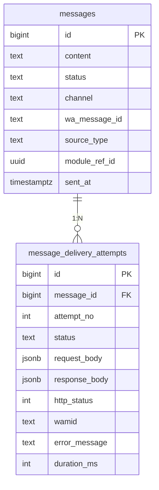
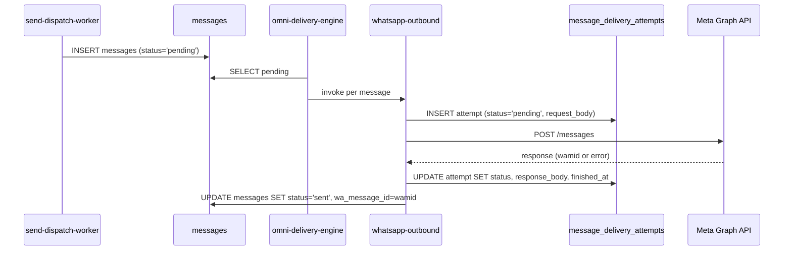

# ADR-SENDS-01: Persistência de log de delivery WhatsApp

## Contexto

A story `FIX-SENDS-FIRST-MSG-01` (P0) expandiu para incluir observabilidade permanente: cada mensagem do Sends precisa expor o log da chamada à Meta Graph API (request, response, timestamp, erro) na UI Omni — para que o usuário consiga distinguir "registrei localmente" de "enviei pra Meta" de "Meta confirmou recebimento".

Estado atual em `supabase/functions/whatsapp-outbound/index.ts`:

- `messages.metadata` (JSONB) é usado de forma **fragmentada** e **destrutiva**:
  - Linha 932: `metadata: { error_reason: errReason }` — sobrescreve o que estiver lá
  - Linha 985, 990: idem em outros caminhos
  - Linha 1003 do `send-dispatch-worker`: `metadata: { send_id, send_name, template_name, language_code, components, ...enrichment }` — schema misturado com runtime
- O objeto `diag` (download_bytes, upload_mime, meta_payload_type, etc.) hoje só vive na **resposta** da edge function e não é persistido em lugar nenhum.
- Não há histórico de tentativas — se a primeira chamada à Meta falhou e a segunda passou, o registro de erro original é perdido.

Para satisfazer o pedido do usuário ("inclua na mensagem do Omni o log de envio do WhatsApp"), precisamos persistir **request + response + timestamp + erro de cada tentativa** de forma que a UI consiga renderizar a sequência completa.

## Opções Consideradas

### Opção A: Campo JSONB em `messages` — `delivery_log: jsonb[]`

Adicionar um array JSONB em `messages` que cresce a cada tentativa. Cada elemento tem `{ attempt, started_at, finished_at, request, response, error, wamid }`.

**Prós:**
- Migration simples (ALTER TABLE ADD COLUMN)
- Sem JOIN — UI já lê `messages` direto, expor o array é trivial
- Mantém co-localidade com a mensagem (1 query → tudo)
- Roundtrip único na escrita: `UPDATE messages SET delivery_log = delivery_log || $new_attempt`

**Contras:**
- JSONB array em Postgres é **append O(n)** — toda atualização lê e reescreve o array inteiro. Para mensagens com muitas tentativas (raro mas possível), o custo cresce
- Indexação parcial: GIN sobre o JSONB array é caro pra filtros como "todas tentativas falhas nas últimas 24h"
- Schema do payload é livre — fácil derivar e quebrar a UI
- RLS sobre elementos do array não é granular (a permissão é tudo-ou-nada da row de `messages`)
- Mistura ainda mais o `messages.metadata` que já está usado de forma confusa hoje
- Concurrency: dois workers atualizando o mesmo JSONB array em paralelo precisam de `FOR UPDATE` ou de RPC dedicado para evitar lost-update

### Opção B: Tabela separada `message_delivery_attempts`

Tabela 1:N com cada tentativa de envio em uma row própria, FK para `messages.id`.

```sql
CREATE TABLE message_delivery_attempts (
  id            bigserial PRIMARY KEY,
  message_id    bigint NOT NULL REFERENCES messages(id) ON DELETE CASCADE,
  attempt_no    int NOT NULL DEFAULT 1,
  channel       text NOT NULL,            -- whatsapp / email / sms / phone
  provider      text,                     -- meta_graph / sendgrid / twilio / etc.
  started_at    timestamptz NOT NULL DEFAULT now(),
  finished_at   timestamptz,
  status        text NOT NULL,            -- pending | sent | failed | timeout
  request_body  jsonb,                    -- payload mandado pra Meta (sanitized)
  response_body jsonb,                    -- resposta completa
  http_status   int,
  wamid         text,                     -- ID retornado pela Meta (FK lógica → messages.wa_message_id)
  error_code    text,
  error_message text,
  duration_ms   int GENERATED ALWAYS AS (extract(epoch from (finished_at - started_at)) * 1000) STORED
);

CREATE INDEX idx_mda_message_id ON message_delivery_attempts(message_id, attempt_no);
CREATE INDEX idx_mda_status_started ON message_delivery_attempts(status, started_at DESC);
```

**Prós:**
- **Append-only** — cada tentativa é INSERT puro, sem race
- Indexação natural (B-tree em `(message_id, attempt_no)` resolve "tentativas dessa mensagem")
- Queries de observabilidade ficam triviais: "todas as falhas nas últimas 24h", "duração média p95 do delivery", "mensagens com mais de 3 tentativas"
- Schema explícito — colunas tipadas, fácil evoluir com migration
- RLS pode espelhar a de `messages` via policy que faz JOIN
- Retenção/purge separado: pode-se truncar logs antigos sem mexer em `messages`
- Pattern já estabelecido no projeto (ex.: `adm_audit_log`, `sends_import_sessions`)

**Contras:**
- Migration adicional (uma tabela + índices + RLS)
- UI Omni precisa fazer um JOIN ou um lookup paralelo (1 query extra por mensagem expandida)
- Edge function precisa fazer dois INSERTs (a `messages` original + a `message_delivery_attempts`) — mas como são em momentos distintos do fluxo (insert da mensagem vs. tentativa do envio), isso é natural
- Pequeno custo de storage extra (uma row por tentativa) — desprezível na escala atual

### Opção C: Híbrido — JSONB rápido em `messages` + tabela detalhada

Manter um sumário leve em `messages.last_delivery` (último status/erro/wamid) para a UI listar rápido, e tabela detalhada para histórico/auditoria.

**Prós:**
- UI lista rápido sem JOIN
- Histórico completo na tabela para auditoria

**Contras:**
- Duas fontes de verdade — risco de divergência entre `messages.last_delivery` e a row mais recente em `message_delivery_attempts`
- Complexidade extra na escrita (manter ambos sincronizados)
- O usuário pediu "log na mensagem do Omni" — o expansível na UI já mostra histórico, então o sumário é supérfluo

## Decisão

**Opção B — tabela separada `message_delivery_attempts`.**

Razões principais:

1. **Append-only é correctness-first.** A natureza de "tentativa" é cardinalidade N e cresce com retry. Modelar como array JSONB força a equipe a lidar com locking/race em todo INSERT, e o pattern aceitável dentro da nossa stack edge fns + service role é INSERT direto em tabela.

2. **Observabilidade exige queries cross-message.** "Quantos sends têm primeira tentativa falhando hoje?" é o tipo de pergunta que o usuário vai fazer próximo desta correção. JSONB array torna isso uma query exótica; tabela com índice é trivial.

3. **Pattern já estabelecido.** O projeto usa tabelas dedicadas para histórico (`adm_audit_log`, `sends_import_sessions`, `ai_agents_history`). Adicionar `message_delivery_attempts` é coerente com convenções existentes.

4. **A `messages.metadata` está sobrecarregada hoje.** Adicionar `delivery_log` lá agravaria um problema de schema misto. A migração para tabela separada é também oportunidade de iniciar a limpeza de `metadata` (escopo separado, fora desta story).

5. **Custo de JOIN é controlado.** A UI Omni mostra o log apenas quando o usuário expande a mensagem (clique). Isso vira um lookup sob demanda — 1 query a mais por interação, não por listagem. Para listagem, basta uma coluna `delivery_status` derivada do último attempt (preenchida pela própria edge fn ou via trigger leve).

## Diagrama





## Consequências

**Positivas:**
- Observabilidade total do delivery WhatsApp (e canais futuros) com queries SQL nativas
- Histórico de retry preservado (FIX-SENDS-DISPATCH-02 fica trivial de auditar pós-fix)
- Storage clearout opcional via cron de retenção
- Base para futuras métricas de SLA (p50/p95/p99 de envio)

**Negativas:**
- Migration nova + RLS nova
- 1 query extra na UI Omni quando o usuário expande log
- Pequeno overhead de I/O por envio (1 INSERT + 1 UPDATE adicional)

**Mitigações:**
- A migration é simples e idempotente; risco baixo de breakage
- Caching de UI pode mitigar o JOIN (TanStack Query já usado no projeto)
- O overhead de I/O é desprezível na escala de envio atual (≤ algumas centenas/min)

**Coordenação requerida:**
- `dev-data-engineer` (Byte): autor da migration + RLS + índices
- `dev-dev-beta`: alteração em `whatsapp-outbound` para fazer INSERT/UPDATE em `message_delivery_attempts`
- `dev-ux` (Vela+Astra): spec do componente expansível na conversa Omni
- `dev-dev-alpha`: implementação do componente UI Omni

**Reversibilidade:** ALTA. Se a opção falhar, basta parar de escrever na tabela e ela vira read-only history. Sem impacto em fluxos existentes — `messages` permanece intocada na shape.
