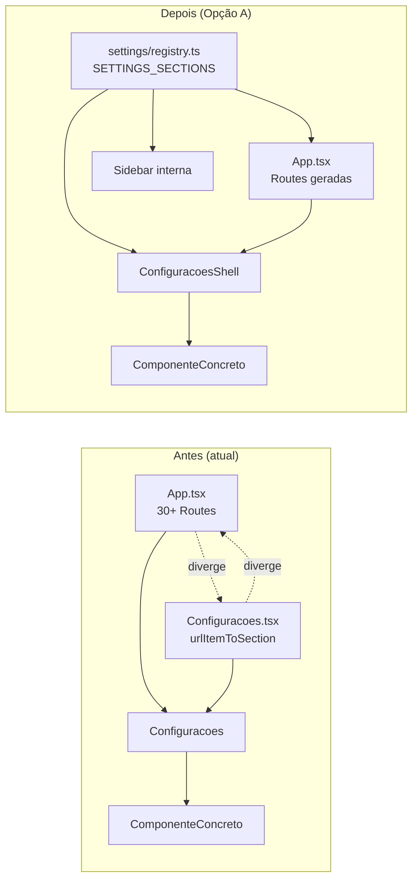

# ADR-SETTINGS-CONSOLIDATION: Consolidar dispatch `/settings/*` em fonte única de verdade

## Status

**proposed** — aguarda aprovação do lead. Implementação por **dev-alpha** após aprovação.

## Contexto

A rota `/settings/*` tem **dois mecanismos paralelos e divergentes** para mapear path → componente, cada um com 30+ entradas:

### Mecanismo 1 — `App.tsx` Routes (linhas 475-663)

~30 `<Route>`s declaradas como filhas do path `/settings`. **Quase todas montam o mesmo componente `<Configuracoes />`**, exceto três casos especiais:

```tsx
// App.tsx:518-522 — caso especial 1
<Route path="crm/aiagents/:id" element={<AgenteSingle />} />

// App.tsx:633-637 — caso especial 2
<Route path="general/times/:teamId" element={<TimeSingle />} />

// App.tsx:666-690 — casos especiais 3, 4, 5 — fora do <Route path="/settings"> parent
<Route path="/settings/mfa-setup" element={<MfaSetup />} />
<Route path="/settings/mfa-recovery-regenerate" element={<MfaRecoveryRegenerate />} />
<Route path="/mfa-verify" element={<MfaVerify />} />  // anomalia: sem prefixo /settings
```

As demais 25+ rotas simplesmente "registram" o path no React Router. **Não passam props nem fazem despacho — só servem para que o catch-all `*` não dispare.**

### Mecanismo 2 — `urlItemToSection` em `Configuracoes.tsx:240-302`

Tabela de mapeamento path → section ID (chave interna do componente). Quando `Configuracoes` monta, lê `useLocation().pathname`, faz match com a regex `/\/settings\/([^/]+)(?:\/([^/]+))?/`, busca em `urlItemToSection[area][item]` e retorna o ID da seção, que dispara o `switch (activeSection)` em `renderContent()` (linhas 378-406) escolhendo o componente concreto (`PipelinesConfig`, `IntegracoesConfig`, etc.).

A inversa (`sectionToUrl` em linhas 329-353) é usada quando o usuário clica no menu lateral interno do Configuracoes para mudar de seção sem deep-link.

### Causas raiz dos issues

Como os dois mecanismos são editados **manualmente em arquivos separados**, divergem:

| Caso | App.tsx tem Route? | `urlItemToSection` tem mapping? | Resultado |
|---|---|---|---|
| `/settings/omni/whatsapp` | ❌ | ✅ → `'integracoes'` | **404** (catch-all `*`) |
| `/settings/general/brandbook` | ❌ | ✅ → `'outros'` | **404** |
| `/settings/send/config` | ✅ | ❌ | Cai em `'geral'` (default) — UX errada |
| `/settings/general/webhooks` | ✅ | ❌ | Cai em `'geral'` |
| `/settings/crm/elevenlabs` | ❌ | ✅ → `'integracoes'` | **404** |
| `/settings/omni/meta` (legacy) | ❌ | ✅ → `'integracoes'` | **404** |

**Issues mapeados a esta causa raiz** (audit/routes.md + audit/navigation.md):
- P0-3 (whatsapp 404), P0-4 (brandbook 404)
- P1-1 (send/config + webhooks silently caem em geral)
- P1-2 (filtro `adminOnly` morto — herança de quando havia uma seção super_admin)
- P1-9 (URL não muda ao navegar internamente em settings — navegação por seção via `setSearchParams` em vez de `navigate`)
- P1-12 (`VoiceChatButton` usa `?tab=` em vez de `?section=`)
- P2-6 (~6 chaves órfãs em `urlItemToSection`)
- P2-10 (state ignorado em `CriarDisparoModal` ao abrir settings)

**Volume:** 8 issues P0/P1 + 1 P2 — todos descendem da divergência.

### Restrições / fatos do código

- **Lazy loading agressivo:** todos os 22 sub-componentes de config são `lazy()` (Configuracoes.tsx:33-59). Mudar de seção é `Suspense` boundary, não navegação completa.
- **3 sub-rotas com componente próprio** (`AgenteSingle`, `TimeSingle`, MFA pages) já estão fora do dispatch via `Configuracoes`. São raras o suficiente pra serem casos especiais.
- **Sidebar interno** do Configuracoes (linhas 410-454) não usa as Routes — usa `setActiveSection()` que ou navega para uma URL canônica, ou faz `setSearchParams({section: ...})`. Já é inconsistente.
- **Auth gate:** `Configuracoes` envolve seu conteúdo em `<RestrictedRoute requireGestor>` (linha 215). Toda a árvore `/settings/*` (que monta `Configuracoes`) é pra-gestor — exceto MFA-setup/recovery (que são pra-todos com profile). Esse gate precisa continuar.
- **Settings backlog conhecido:** auditoria detectou que `setActiveSection` decide entre `navigate(url)` e `setSearchParams({section})` baseado em existência da chave no `sectionToUrl` map — mais uma fonte de bug (P1-9).

---

## Opções consideradas

### Opção A — `urlItemToSection` como fonte única; Routes geradas dinamicamente

**Ideia:** mover `urlItemToSection` (e seu inverso `sectionToUrl`) para um único módulo `src/pages/settings/registry.ts` e gerar as `<Route>`s a partir dele.

```ts
// src/pages/settings/registry.ts
export interface SettingsSection {
  id: string;
  group: 'crmPro' | 'omniPro' | 'coachPro' | 'schedulePro' | 'geral';
  title: string;
  icon: ComponentType;
  paths: string[];          // todos os paths /settings/... que mapeiam a esta seção
  Component: LazyExoticComponent<...>;
  badge?: string;
}

export const SETTINGS_SECTIONS: SettingsSection[] = [
  {
    id: 'pipelines',
    group: 'crmPro',
    title: 'settings.sections.pipelines.title',
    icon: GitBranch,
    paths: ['/settings/crm/pipelines'],
    Component: lazy(() => import('@/components/config/PipelinesConfig')),
  },
  {
    id: 'integracoes',
    group: 'geral',
    title: 'Integrações',
    icon: Plug,
    paths: [
      '/settings/general/integracoes',
      '/settings/general/design-system',
      '/settings/general/ai-providers',
      '/settings/schedule/google',  // legacy alias
      '/settings/schedule/teams',   // legacy alias
      '/settings/bi/ads',
      '/settings/prospect/integracao',
      '/settings/lp/config',
      '/settings/crm/elevenlabs',
      '/settings/omni/whatsapp',    // <- corrigido
    ],
    Component: lazy(() => import('@/components/config/IntegracoesConfig')),
  },
  // ...
];
```

Em `App.tsx`, o bloco `/settings` é gerado:

```tsx
<Route path="/settings" element={<ProtectedRoute><DashLayout /></ProtectedRoute>}>
  <Route index element={<RestrictedRoute requireGestor><ConfiguracoesShell defaultSectionId="geral" /></RestrictedRoute>} />
  {SETTINGS_SECTIONS.flatMap(section =>
    section.paths.map(p => (
      <Route key={p} path={p.replace('/settings/', '')} element={
        <RestrictedRoute requireGestor>
          <ConfiguracoesShell sectionId={section.id} />
        </RestrictedRoute>
      } />
    ))
  )}
  <Route path="crm/aiagents/:id" element={<AgenteSingle />} />
  <Route path="general/times/:teamId" element={<TimeSingle />} />
</Route>
```

`ConfiguracoesShell` recebe `sectionId` como prop, não precisa mais ler `useLocation().pathname` nem ter o `urlItemToSection` interno.

**Prós:**
- Adicionar nova seção = editar UMA estrutura.
- Tipagem forte (`SETTINGS_SECTIONS` é typed → IDs ficam autocompleted).
- Sidebar interna gerada do mesmo registry (substitui `allSections` em Configuracoes.tsx).
- Todos os 22 itens em `allSections` + `urlItemToSection` + `sectionToUrl` colapsam em uma fonte.
- Validação automática implícita: TypeScript reclama se você esquecer um campo.
- Aliases legacy (`schedule/google`, `crm/elevenlabs`) tratados explicitamente como entradas múltiplas em `paths`.

**Contras:**
- Requer refator do `Configuracoes.tsx` inteiro: remover `allSections`, `urlItemToSection`, `sectionToUrl`, `getActiveSectionFromUrl`, `setActiveSection`, e o `switch` em `renderContent`.
- Migração não é mecânica — exige varredura de cada seção pra montar o registry corretamente.
- Diff grande (1 arquivo novo + 2 arquivos modificados, ~600 linhas tocadas).
- Caso especial: `whatsapp-log` é deep-link único usado pela página WhatsApp — precisa entrar como mais um path em `omni-dedup` ou virar seção própria; trivial mas é decisão.
- O efeito colateral de ter Routes geradas: a build de Vite precisa do array no escopo do módulo (já está em `Configuracoes.tsx`, OK), mas qualquer dynamic import circular no registry vai causar erro críptico.

**Esforço:** M-L (1 dia de dev + meio dia de QA).

---

### Opção B — Cada path vira child-route real; eliminar `urlItemToSection`

**Ideia:** o path da URL E o componente concreto ficam declarados juntos em `App.tsx`. `Configuracoes` deixa de existir como dispatcher — vira só shell visual.

```tsx
<Route path="/settings" element={<ProtectedRoute><DashLayout /></ProtectedRoute>}>
  <Route index element={<RestrictedRoute requireGestor><SettingsShell><GeralConfig /></SettingsShell></RestrictedRoute>} />
  <Route path="crm/pipelines" element={<RestrictedRoute requireGestor><SettingsShell><PipelinesConfig /></SettingsShell></RestrictedRoute>} />
  <Route path="crm/motivos" element={<RestrictedRoute requireGestor><SettingsShell><MotivosConfig /></SettingsShell></RestrictedRoute>} />
  {/* ...30+ rotas */}
</Route>
```

`SettingsShell` é o layout de duas colunas (sidebar interna + main panel). A sidebar interna lista links com `<NavLink>` apontando para os paths.

**Prós:**
- Modelo mais idiomático React Router v6 — cada URL → 1 componente direto, sem dispatcher.
- Elimina `urlItemToSection` e `sectionToUrl` totalmente.
- Cada seção é uma rota independente — code-splitting natural por path.
- Deep-link funciona "automaticamente" (não há lookup interno).
- Aliases legacy ficam óbvios: cada um vira um `<Route>` apontando para o mesmo componente.

**Contras:**
- App.tsx fica MAIS poluído (continua com 30+ rotas, mas cada uma com `RestrictedRoute + SettingsShell + Component` aninhados — mais verbose que hoje).
- `RestrictedRoute requireGestor` precisa repetir em cada Route (ou um wrapper subcomponente) — DRY pior que A.
- Adicionar nova seção exige editar App.tsx **mais** o sidebar — ainda dois lugares (a sidebar não pode ler do roteador trivialmente).
- Sidebar interna precisa ter sua própria lista (volta a ser duplicação, ainda que mais explícita).
- Mudar de seção = navegação de rota completa = unmount/remount do shell = perde estado de UI (scroll, drafts não salvos). Hoje é `Suspense` interno (estado preservado). Trade-off de UX.
- Refator é grande (cada seção precisa ser explicitamente mencionada no JSX).

**Esforço:** L (1.5 dia + QA).

---

### Opção C — Manter os dois mecanismos + validador automático

**Ideia:** aceitar a duplicação. Adicionar teste/script que falha o build quando os dois divergem.

```ts
// scripts/validate-settings-routes.ts
const declaredRoutes = parseAppTsxForSettingsPaths();    // AST parse de App.tsx
const mappedItems    = Object.entries(urlItemToSection); // de Configuracoes.tsx

const declaredSet = new Set(declaredRoutes);
const mappedSet   = new Set(mappedItems.map(toFullPath));

const onlyInRoutes = [...declaredSet].filter(p => !mappedSet.has(p));
const onlyInMap    = [...mappedSet].filter(p => !declaredSet.has(p));

if (onlyInRoutes.length || onlyInMap.length) {
  console.error('❌ Settings divergence:', { onlyInRoutes, onlyInMap });
  process.exit(1);
}
```

Adiciona ao CI (e idealmente ao `bun run build` pré-step).

**Prós:**
- Zero refator no código de produção. Risco mínimo.
- Mais rápido de entregar (1-2 horas).
- Captura todas as divergências futuras.

**Contras:**
- **Não resolve a causa raiz** — só detecta sintomas mais cedo. O dev ainda precisa editar 2 arquivos pra cada seção nova.
- Parser de AST sobre `App.tsx` é frágil (mudanças de formatação podem quebrar).
- Issues P1-2 (filtro `adminOnly` morto), P1-9 (URL não muda em navegação interna) não são cobertos — esses são bugs do MECANISMO, não da divergência.
- Acumula débito em vez de pagar.
- O time já decidiu (audit/QA-VERDICT) que a duplicação é um problema arquitetural, não operacional.

**Esforço:** S (2-3h).

---

## Decisão

**Recomendação: Opção A — `urlItemToSection` como fonte única, Routes geradas dinamicamente.**

### Justificativa

1. **A é o padrão certo para esse problema.** O dispatch interno de Configuracoes hoje é, na prática, um mini-roteador. Levar isso ao registro central é o que React Router permite naturalmente em v6 (`<Route>` aceita JSX dinâmico). Não é "fugir" do roteador — é deixar o roteador fazer o que ele já faz, com dados estruturados.

2. **B trade-off de UX é real.** Hoje, mudar entre "Pipelines" e "Motivos" no sidebar interno do Configuracoes não desmonta o shell — só troca o conteúdo via Suspense. A perde isso? Não — `ConfiguracoesShell` recebe `sectionId` como prop e mantém o mesmo componente raiz. Em B, cada navegação seria unmount/remount do shell — perde scroll, animações ficam mais ásperas, e o `RestrictedRoute requireGestor` revalida toda vez (custo desnecessário).

3. **C não paga o débito.** Lead já indicou que essa é a "causa raiz de 8 issues P0/P1". Validador automático é band-aid sobre band-aid; resolve detecção, não a inversão da arquitetura.

4. **Custo de A é amortizado em N seções.** Hoje o sistema tem ~22 seções e está em crescimento ativo (audit menciona 22 painéis nível 1 + 10 sub-tabs em Integrações). Cada nova seção em status quo = 2 lugares; em A = 1 lugar. ROI cresce com cada item.

5. **Story `AUDIT-FIX-06` está marcada XL** — o lead já dimensionou o trabalho como significativo. Optar por C contradiz a sinalização do escopo.

### Casos especiais permanecem como Routes manuais

Não migrar pra registry:
- `/settings/crm/aiagents/:id` → `AgenteSingle` (param dinâmico)
- `/settings/general/times/:teamId` → `TimeSingle` (param dinâmico)
- `/settings/mfa-setup`, `/settings/mfa-recovery-regenerate` (standalone, fora do `DashLayout`, auth diferente)

Esses 4 ficam como `<Route>`s manuais em App.tsx, fora do bloco gerado.

---

## Diagrama



---

## Plano de implementação (para dev-alpha)

### Fase 1 — Registry (ordem importa)
1. Criar `src/pages/settings/registry.ts` com tipo `SettingsSection` e o array `SETTINGS_SECTIONS`.
2. Migrar **todos** os 22 itens de `allSections` (Configuracoes.tsx:63-202) — preservar `id`, `group`, `titleKey`, `icon`, `badgeKey`.
3. Para cada item, listar **todos** os paths que mapeiam pra ele (consolidar `urlItemToSection` + Routes do App.tsx).
4. Para cada item, adicionar `Component: lazy(() => import(...))` apontando pro componente concreto (consolida o `switch` em `renderContent`).

### Fase 2 — Componente shell
5. Criar `src/components/settings/ConfiguracoesShell.tsx` que aceita `sectionId: string` e renderiza:
   - Sidebar (gerada do registry, agrupada por `group`).
   - Painel principal com `<Suspense>` envolvendo o `<Component />` resolvido pelo `sectionId`.
   - Versão (`__APP_VERSION__`).
6. `ConfiguracoesShell` deve disparar `navigate(section.paths[0])` no clique do sidebar (não usa mais `setActiveSection`).

### Fase 3 — Routes
7. Em `App.tsx`, substituir o bloco `/settings` (linhas 475-663) por:
   - Index → `<ConfiguracoesShell sectionId="geral" />`.
   - `flatMap` sobre `SETTINGS_SECTIONS` gerando uma `<Route>` por path.
   - Manter os 4 casos especiais (aiagents/:id, times/:teamId, mfa-setup, mfa-recovery-regenerate).
8. Manter o gate `<RestrictedRoute requireGestor>` envolvendo o shell (não cada rota — usar wrapper único).

### Fase 4 — Cleanup
9. Deletar `Configuracoes.tsx` (substituído por `ConfiguracoesShell`).
10. Auditar callers de `navigate('/settings/...')` — todos os paths agora batem com `SETTINGS_SECTIONS[].paths`. P0-3 e P0-4 (já corrigidos em AUDIT-FIX-01 pontualmente) ficam validados estruturalmente.
11. Filtro `adminOnly` (P1-2): se ainda for desejável, adicionar campo `adminOnly?: boolean` ao tipo e filtrar no render do sidebar; senão deletar o filtro.

### Fase 5 — Validação
12. `bun run build` deve passar sem erros.
13. Smoke test manual: navegar para todos os 22 itens via deep-link. Verificar que título de página, sidebar interno e componente carregado batem.
14. Revalidar que `setActiveSection` agora reflete no URL (P1-9 fix verificado).
15. Revalidar `VoiceChatButton.tsx:170` (P1-12) — `href="/settings?tab=ia"` precisa virar `href` com path correto.

### Fase 6 — Docs
16. Atualizar `docs/smart-memory/audit/routes.md` removendo P0-3, P0-4, P1-1 (subset), P1-2, P2-6 da lista de issues.
17. Atualizar `docs/smart-memory/project/modules/settings.md` (se houver) com o novo padrão.

---

## Consequências

**Positivas:**
- 8 issues P0/P1 fechados estruturalmente (não pontualmente).
- Custo de adicionar nova seção colapsa de 2-3 lugares → 1.
- Tipagem ganha — IDs são `keyof typeof` em vez de strings soltas.
- Base sólida pra futuras evoluções: roles por seção, ordenação dinâmica, settings condicionais por módulo ativo.

**Negativas / riscos:**
- Refator grande (~600 linhas tocadas, 1 arquivo novo, 2 arquivos reescritos).
- Risco de regressão em deep-links que não estão coberto por testes E2E (não há testes E2E hoje em settings — recomendação: adicionar smoke test pelo menos em Sprint subsequente).
- Caso especial (`/settings/crm/aiagents/:id`, `/settings/general/times/:teamId`) precisa ser explicitamente declarado FORA do registry — esquecimento gera 404. Mitigação: comentário no registry indicando os paths "reservados".
- `RestrictedRoute requireGestor` envolvendo todas as rotas geradas exige decidir: wrapper externo no `<Route element>` ou dentro do `ConfiguracoesShell`? Recomendação: dentro do shell (DRY).

**Compatibilidade:**
- Nenhum quebrado — paths existentes continuam acessíveis. Aliases legacy (whatsapp-log, schedule/google, etc.) explicitamente listados.
- Não exige migration de banco.
- Não exige mudança em edge functions.

---

## Notas para QA (gate AUDIT-FIX-06)

QA deve verificar:
1. Todos os 22 deep-links abrem o componente correto.
2. Mudar de seção via sidebar interna **atualiza a URL** (era P1-9; deve estar fixed).
3. `RestrictedRoute requireGestor` continua bloqueando consultor (perfil sem gestor=true) e libera para gestor/super_adm.
4. Sub-rotas dinâmicas (`aiagents/:id`, `times/:teamId`) continuam funcionando.
5. `/settings/mfa-setup` e `/settings/mfa-recovery-regenerate` (standalone) renderizam fora do `DashLayout`.
6. Aliases legacy (whatsapp-log, schedule/google, crm/elevenlabs) abrem sem 404.
7. `bun run build` sem warnings novos.
