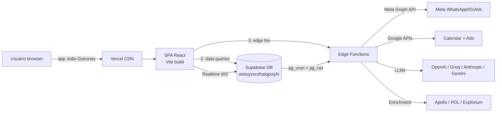
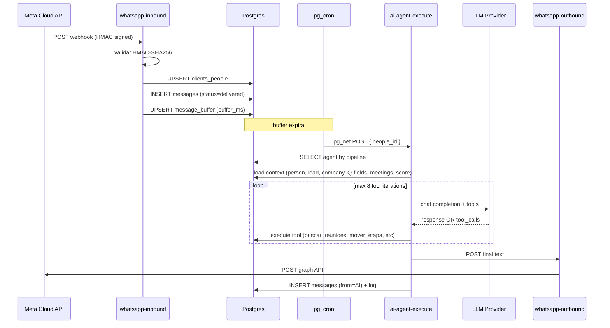
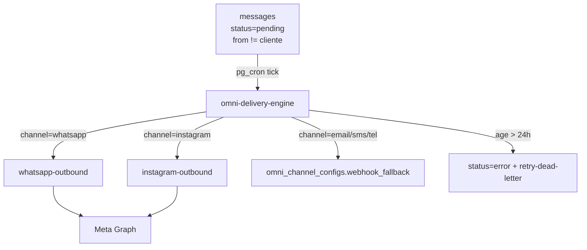
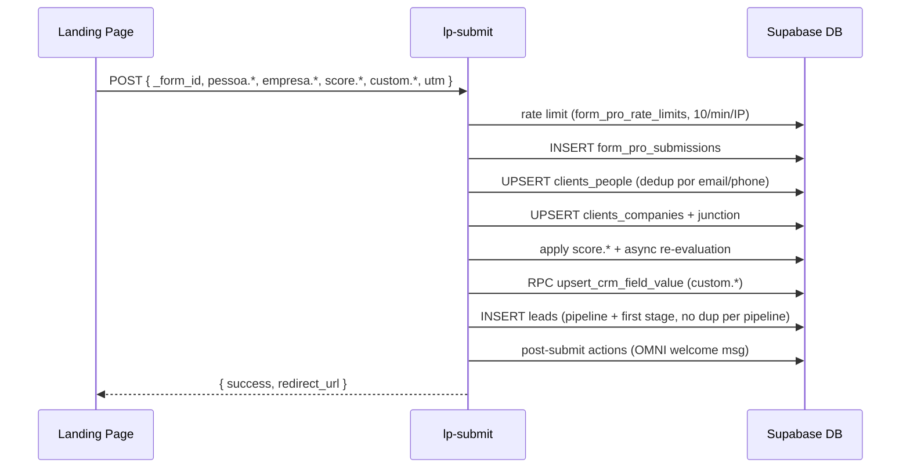
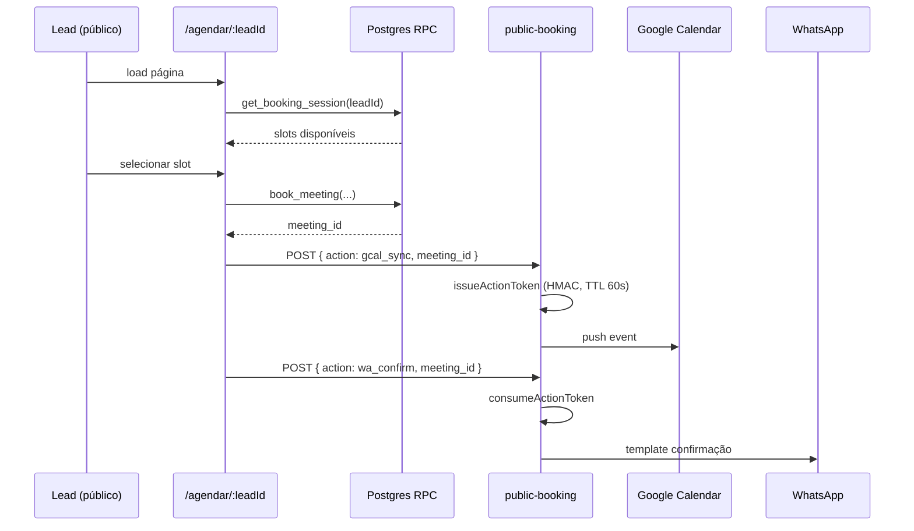

# Arquitetura — João Guirunas

## 1. Visão geral

SPA React (Vite + TS) servida em domínio fixo, com backend 100% Supabase em projeto único e dedicado (`wotuyxscsfralqpoiyfv`): Postgres + Auth + Storage + Realtime + Edge Functions Deno. **Single-tenant** — sem control plane, sem catálogo de clientes, sem resolução de tenant em runtime; credenciais Supabase ficam fixas em [[../../../src/integrations/supabase/client.ts]]. Navegação mobile é redirect-based para uma shell dedicada em `/m/*`.

**Padrão:** single-tenant + edge-function-first para integrações externas (Meta, Google, Microsoft, TikTok, ElevenLabs, Apollo, PDL, Explorium, tl;dv, Zoom).

## 2. Deployment topology

## 3. Bootstrap do client

[[../../../src/main.tsx]] importa `App` direto. As credenciais Supabase (`SUPABASE_URL` e `SUPABASE_PUBLISHABLE_KEY`) estão hardcoded em [[../../../src/integrations/supabase/client.ts]] apontando para `wotuyxscsfralqpoiyfv.supabase.co`.

**Vestígios do antigo desenho multi-tenant** (resolução por hostname + `sessionStorage._supabase_client_config` + edge fn `adm-client-config`) podem ainda existir em código por herança, mas **não são exercitados em runtime** nesta operação single-tenant. Refactor futuro deve eliminá-los (ver backlog).

**Listener de deploy:** `window.addEventListener('vite:preloadError', () => location.reload())` auto-recarrega em deploys novos (hashes de chunk antigos).

## 4. Client/server boundary

### Client (SPA)
- **Auth:** `@supabase/supabase-js` em modo client (localStorage persist, autoRefreshToken). [[../../../src/hooks/useSimpleAuthSingleTenant.ts]] gerencia o auth.
- **Data fetching:** TanStack Query v5 com cache agressivo (`staleTime: 60s`, `gcTime: 5min`, `refetchOnWindowFocus: false`). 177+ hooks `useX.ts`.
- **Server state only:** nenhum estado de servidor em Zustand. Zustand é usado pontualmente para UI state (ex: wizard steps).
- **RLS-first:** queries usam anon key + JWT do usuário; Postgres decide autorização via RLS (ver §6).

### Server (Supabase)
- **Postgres 15** com ~713 migrations.
- **RLS** ativo em todas as tabelas com `tenant_id`. JWT claim `app_metadata.tenant_id` mantido como fonte de verdade do filtro RLS — herdado do desenho multi-tenant; mantido como defesa em profundidade mesmo em single-tenant. (ver [[../decisions/ADR-PP-03]] histórico: deprecação de `extractTenantId` unsigned).
- **Edge Functions Deno** para I/O externo e orquestração. 90+ funções agrupadas em §5 de [[modules]].
- **pg_cron + pg_net** disparam edge fns por evento de DB (ex: `ai-agent-execute` quando `message_buffer` expira; `omni-delivery-engine` processando `messages.status='pending'`).
- **Realtime** via canal Supabase filtrado por `tenant_id=eq.*` em [[../../../src/contexts/RealtimeContext.tsx]].

## 5. Fluxos de dados principais

### 5.1 Inbound WhatsApp → AI Agent → Outbound

**Invariantes:**
- `verify_jwt=false` em `whatsapp-inbound` (Meta não envia JWT). Segurança via HMAC-SHA256.
- `whatsapp-outbound` é interno, também `verify_jwt=false` — chamado de edge↔edge.
- Timeout de LLM: 30s dentro do limite de 60s do edge.

### 5.2 OMNI Delivery Engine (outbound broadcast)

### 5.3 Public Form submission (FORM PRO)

### 5.4 Public Booking (SCHEDULE PRO)

**Decisão-chave (ADR-SP-02):** Ações edge↔edge autenticam via **action tokens HMAC-SHA256** (`issueAction`/`consumeAction` em [[../../../supabase/functions/_shared/capability/]]) em vez de JWT, pois as sub-ações operam sem contexto de usuário. TTL máximo 120s, chave rotacionada via vault.

## 6. Segurança (RLS + capability)

| Camada | Mecanismo | Onde |
|---|---|---|
| **Auth app** | Supabase Auth + magic link + Google OAuth | [[../../../src/hooks/useSimpleAuthSingleTenant.ts]] |
| **RLS tenant_id** | policy usa `auth.jwt() -> 'app_metadata' -> 'tenant_id'` (defesa em profundidade) | migrations de cada tabela |
| **Role roles** | `settings_users.user_type ∈ {gestor, consultor, atendente, cliente}` + `super_admin` | [[../../../src/components/auth/RestrictedRoute.tsx]], [[../../../src/components/auth/ModuleProtectedRoute.tsx]] |
| **Webhooks externos** | HMAC-SHA256 assinatura (Meta, TikTok) | `whatsapp-inbound`, `tiktok-inbound`, `meta-inbound` |
| **Edge↔Edge** | Action tokens HMAC com TTL 10-120s | [[../../../supabase/functions/_shared/capability/]] |
| **Public endpoints** | Rate limit DB-backed (lp-submit: `form_pro_rate_limits`; public-booking: in-memory 30/min/IP) | — |

**ADR histórico (contexto):** `extractTenantId` em [[../../../supabase/functions/_shared/response.ts]] usa decode **unsigned** de JWT — marcado @deprecated, substituir por `supabase.auth.getUser(token)` → `user.app_metadata.tenant_id` (ver comentário no arquivo citando ADR-PP-03).

## 7. Mobile strategy

Não é app nativo — é a mesma SPA com shell dedicado em `/m/*`:

- [[../../../src/hooks/use-mobile.tsx]] detecta viewport < md.
- [[../../../src/App.tsx]] redireciona usuários mobile autenticados para `/m/bi` se pousarem em rota desktop (exceção: `PUBLIC_ROUTES`).
- `MobileShell` + `MobileBottomTabs` = layout mobile; rotas `bi`, `crm`, `omni`, `perfil` (subset do desktop).
- `MobileModuleGuard` replica `ModuleProtectedRoute` com UI mobile.

## 8. Performance

- **QueryClient agressivo:** `staleTime: 60s`, `refetchOnWindowFocus: false`, `retry: 1` ([[../../../src/App.tsx]]).
- **Realtime com rate limit:** 3s por evento em [[../../../src/contexts/RealtimeContext.tsx]]; `stabilizedInvalidate` com debounce diferenciado por tabela.
- **Auth com timeout agressivo:** 2s para profile fetch, 3s para init ([[../../../src/hooks/useSimpleAuthSingleTenant.ts]]). Fallback profile em caso de timeout — UI nunca trava.
- **Heartbeat realtime:** 45s ping, max 2 falhas antes de reconnect ([[../../../src/hooks/useRealtimeHeartbeat.ts]]).
- **Exponential backoff:** realtime reconnect usa `min(2000 * 1.5^n, 15000)` até 50 tentativas.
- **No manualChunks:** [[../../../vite.config.ts]] deixa o rollup decidir code-splitting. `vite:preloadError` auto-reload.

## 9. Padrões arquiteturais identificados

1. **Single-tenant** com credenciais Supabase fixas no client.
2. **Edge-function-first** para qualquer I/O externo ou trabalho assíncrono. Cron em DB, execução em edge.
3. **RLS como autorização primária** — backend lógica é mínimo, Postgres decide.
4. **Response uniforme HTTP 200 + `{ ok: boolean }`** em edge fns do Prospect PRO (ver `_shared/response.ts`), para contornar limitação do `supabase.functions.invoke()` que descarta body em não-2xx.
5. **Action tokens HMAC** para edge↔edge em vez de JWT compartilhado.
6. **Feature-folder + hooks-per-domain:** cada produto PRO tem `components/<produto>/` + `hooks/use<Produto>*`.
7. **shadcn/ui para primitivos, feature-folders para composição** — nenhuma abstração de "design system interna" acima de `ui/`.
8. **Mobile como subset** da mesma SPA (redirect-based), não app separado.
9. **Deploy-aware:** versão injetada via [[../../../vite.config.ts]] (`__APP_VERSION__`) e auto-reload em chunk stale.

## 10. Decisões arquiteturais relevantes

ADRs numerados vivem em `docs/smart-memory/decisions/`. ADRs identificados por referência no código:

- **ADR-SP-02** — capability tokens HMAC para autenticação edge↔edge em `public-booking` ([[../../../supabase/functions/_shared/capability/issueAction.ts]])
- **ADR-PP-03** — server-verified tenant_id (deprecação de `extractTenantId` unsigned)
- **N8N-WAA-5/6/7/8** — rework da integração WhatsApp → AI Agent (referências em `whatsapp-inbound/index.ts` e `ai-agent-execute/index.ts`)

Recriar ADRs será responsabilidade posterior quando revisitados.

---

**Relacionados:** [[modules]] · [[overview]] · [[tech-stack]] · [[conventions]] · [[../decisions/|ADRs]]
