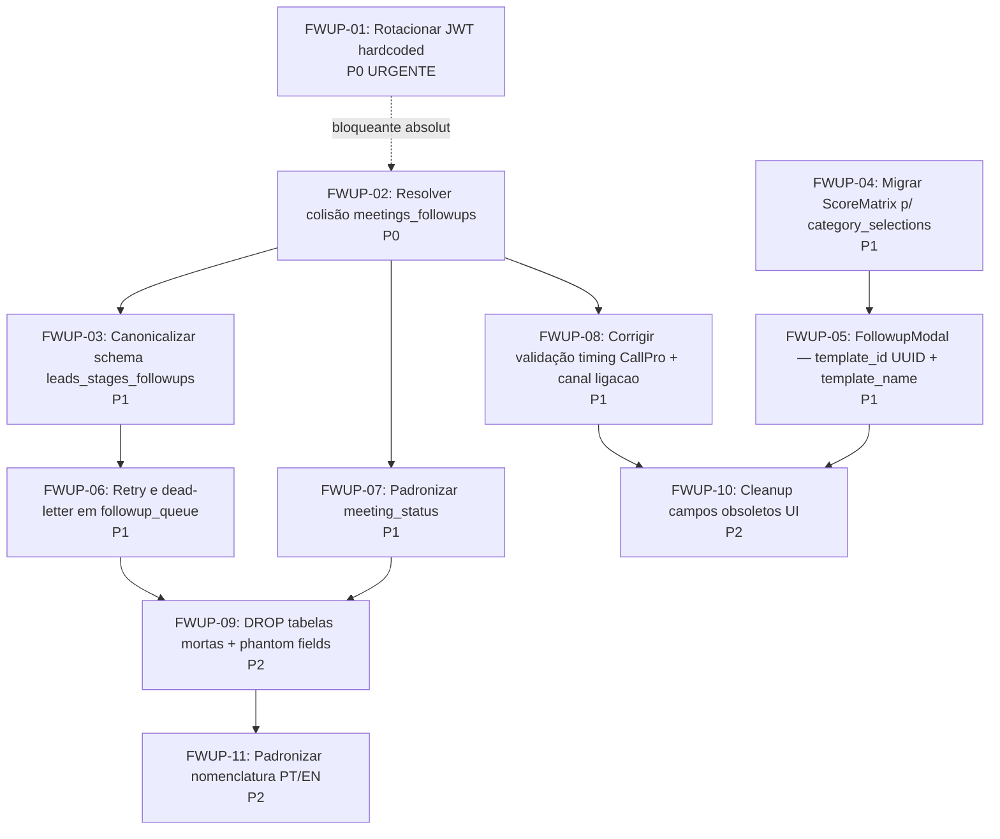

# Diagnóstico Consolidado — Auditoria Followups

> Síntese das três auditorias paralelas: dev-analyst (campos obsoletos / N8N), dev-dev-alpha (componentes React), dev-data-engineer (schema DB).

---

## 1. Sumário Executivo

O domínio **Followups** opera em **duas dimensões paralelas** que evoluíram independentemente e hoje compartilham infraestrutura sem coordenação:

1. **Stage followups** — disparos quando lead muda de etapa (`leads_stages_followups` + `followup_queue`)
2. **Meeting followups** — disparos por status de reunião (`meetings_followups` + `meeting_followup_queue`)

**O estado atual é frágil em três frentes:**

- **Segurança:** uma migration de `pg_cron` carrega o **service_role JWT em plaintext** — qualquer dev com acesso ao histórico tem a chave master do tenant.
- **Integridade de dados:** dois hooks (`useCallProFollowups` e `useAgendamentosFollowups`) escrevem/lêem a **mesma tabela `meetings_followups`** com schemas incompatíveis, podendo corromper registros mutuamente.
- **Schema ambíguo:** `leads_stages_followups` foi criada **três vezes em migrations distintas** com colunas conflitantes via `IF NOT EXISTS` — o resultado em produção depende da ordem de aplicação.

A **integração N8N não foi descontinuada**: SendsPro e CallProFollowups dependem dela como mecanismo central de entrega. Mas há **referências textuais e lógicas residuais** em outras superfícies (FollowupModal, StageFollowupsCard, VariablePicker) que misturam o canal `ligacao` entre N8N e AS Discador, gerando UX inconsistente.

Componentes de UI quebrados — `MultiSelectScoreMatrix` e `ScoreMatrixSelector` — acessam campos legados (`objective_id`, `investment_id`, `framing_id`) que não existem mais no tipo `ScoreMatrix` (migrado para `category_selections: Record<string, string[]>`). Os badges nunca renderizam.

**Recomendação geral:** sequenciar correção em três ondas — **P0 segurança imediata** (rotacionar JWT), **P1 integridade** (resolver colisão de tabela e schema ambíguo), depois **P2 cleanup** (campos obsoletos, componentes legados, inconsistências textuais).

---

## 2. Mapa de Impacto por Prioridade

### 🔴 P0 — Bloqueante / Urgência de segurança

| Item | Onde | Risco | Fonte |
|---|---|---|---|
| **JWT service_role hardcoded em migration** | `20260226301000_meeting_followup_system-ok.sql:207` | Chave master no histórico git; rotacionar imediatamente | data-engineer |
| **Colisão de tabela `meetings_followups`** | `useCallProFollowups` + `useAgendamentosFollowups` ambos escrevem na mesma tabela com schemas incompatíveis | Corrupção de dados em produção | dev-alpha |

### 🟠 P1 — Importante / Bugs funcionais com impacto direto

| Item | Onde | Impacto | Fonte |
|---|---|---|---|
| **`leads_stages_followups` com 3 schemas conflitantes** | Migrations 20251005, 20251110, 20251202 | Schema final depende de ordem; drift entre ambientes | data-engineer |
| **`MultiSelectScoreMatrix` e `ScoreMatrixSelector` quebrados** | Acessam `objective_id`/`investment_id`/`framing_id` que não existem mais | Badges nunca renderizam — UX severamente degradada | dev-alpha |
| **`followup_queue` preso em `queued` forever** | `followup-trigger-worker` sem retry implementado | Campanhas paradas sem visibilidade se N8N não callback | data-engineer |
| **`whatsapp_template_id` nunca salvo no FollowupModal** | Linha 435 — `onSelect` captura 2 de 3 args | UUID do template perdido para stage followups | dev-alpha |
| **`template_name` mostra ID técnico ao editar** | `FollowupModal:97` — `template_name: followup.template_id ?? ''` | UX confusa — gestor vê hash em vez de nome | dev-alpha |
| **Inconsistência `nao_compareceu` vs `'não compareceu'`** | Constraint DB usa `nao_compareceu` (sem acento), frontend envia `'não compareceu'` | Falha silenciosa ao criar regras com esse status | data-engineer |
| **`|| true` anula validação de timing** | `CallProFollowupsConfig:114` | Disparo imediato sempre habilitado mesmo com timing inválido | analyst |

### 🟡 P2 — Cosmético / Cleanup / Dívida técnica

| Item | Onde | Fonte |
|---|---|---|
| `businessHours.enabled` flag morta (sempre false, sem UI) | `EmailMegaConfig:27` | analyst |
| `audio_file` campo no DB sem UI nem escrita | `leads_stages_followups`, `meetings_followups` | analyst + data-engineer |
| 6 tabelas mortas (`crm_stage_followups`, `crm_agendamentos_followups`, `clients_meetings_followups`, `crm_pipelines`, `crm_stages`, `crm_campos_personalizados`) | Schema | data-engineer |
| `leads.followup_attempts` e `leads.followup_status` phantom fields | `leads` table | data-engineer |
| `control` (N8N routing) nunca lido pelo frontend | `leads_stages_followups`, `meetings_followups` | data-engineer |
| Canal `ligacao` inconsistente (N8N vs AS Discador) | `FollowupModal:316`, `StageFollowupsCard:93`, `VariablePicker:208` | analyst + dev-alpha |
| `_selectedTenantId` prop nunca usada | `PipelinesConfig:188` | analyst |
| `description: null` sempre no SendsPro | `SendsProConfig:53` | analyst |
| Canais legados em `CANAL_META` (`whatsapp_texto`, `whatsapp_audio`, `email_texto`) | `AgendamentoFollowupsCard` | analyst |
| `WhatsappTemplatePickerModal` lê `json_data?.language` (campo errado, deveria ser `languageCode`) | Badge de idioma nunca renderiza | dev-alpha |
| Nomenclatura mista `canal/channel`, `scheduled_at/scheduled_for`, `pessoa_id/person_id/people_id` | `followup_queue`, `meeting_followup_queue` | data-engineer |
| `alert()` em vez de `toast` no `AgendamentoFollowupModal` | Linhas 114, 117, 121 | dev-alpha |
| `deletarStage` faz soft-delete mas label diz "Excluir" | `StagesConfig:79` | dev-alpha |
| Drag-reorder de stages com N chamadas sequenciais (não-batch) | `StagesConfig:104-128` | dev-alpha |

---

## 3. Mapa de Dependências entre Stories

**Sequência recomendada:**

1. **FWUP-01** — JWT (urgência absoluta, antes de qualquer outra coisa tocar followups)
2. **FWUP-02** — colisão de tabela (bloqueante para qualquer outra mudança em `meetings_followups`)
3. **FWUP-03 + FWUP-04** — em paralelo: schema canônico de `leads_stages_followups` e migração ScoreMatrix
4. **FWUP-05, FWUP-06, FWUP-07, FWUP-08** — bugs funcionais P1 (paralelizáveis após FWUP-02 e FWUP-03)
5. **FWUP-09 + FWUP-10 + FWUP-11** — cleanup final (após estabilização das estruturas)

---

## 4. Recomendações de Arquitetura

### 4.1 Unificar modelo de followups via discriminator

A causa raiz da colisão `meetings_followups` é que **duas features distintas reutilizaram a mesma tabela**: regras de webhook N8N (CallPro) e regras de canal direto (AgendamentoFollowups). Recomendação:

- **Opção A (mínima):** adicionar coluna `source: 'webhook' | 'channel'` discriminadora; cada hook filtra por seu source. Permite coexistência. **Custo: baixo. Risco: baixo.**
- **Opção B (limpa):** separar em `meetings_followup_rules_webhook` e `meetings_followup_rules_channel`. Mais correto semanticamente, mas requer migration grande e mudança em ambos os hooks.
- **Recomendação Zaelor:** **Opção A** para FWUP-02 (estabilização rápida); avaliar Opção B em ADR posterior se a divergência semântica crescer.

### 4.2 Schema canônico de `leads_stages_followups`

O legado de 3 migrations conflitantes via `CREATE TABLE IF NOT EXISTS` é uma armadilha. Recomendação:

- **Migration de squash:** uma única migration que documenta o estado canônico atual (`leads_stages_id`, `type`, `days/hours/minutes`, `score_matrix_id`, `target_stage_id`, `control`, `whatsapp_template_id`).
- **Drop colunas conflitantes não usadas** (`stage_id` duplicado, `delay_minutes` órfão, `name` órfão) com `IF EXISTS`.
- Validar via `audit_client.sql` que tenants em produção convergem para o schema canônico antes de executar.

### 4.3 ScoreMatrix migrado: `category_selections` único

Os componentes `MultiSelectScoreMatrix` e `ScoreMatrixSelector` precisam ler `matrix.category_selections[categoryId]: string[]` em vez dos campos legados. Recomendação:

- Adicionar utility hook `useScoreMatrixLabel(matrix)` que resolve labels a partir de `category_selections` + categorias dinâmicas.
- Aposentar `useScoreObjectives` / `useScoreInvestments` / `useScoreFramings` se as categorias agora são dinâmicas (verificar com Lyra/dev-analyst antes).

### 4.4 Retry/dead-letter em `followup_queue`

A fila tem coluna `retry_count` mas a lógica de retry não foi implementada — confiando 100% em N8N callback. Recomendação:

- **Cron secundário** que pega `followup_queue.status = 'queued' AND updated_at < now() - interval '15 min'` e re-enfileira com `retry_count + 1`.
- **Limite de 3 tentativas**, depois marca `status = 'failed'` e gera evento em audit log.
- Espelhar o padrão de `omni-retry-dead-letter` que já existe no domínio OMNI.

### 4.5 Canal `ligacao` — definir contrato único

Hoje há divergência: `FollowupModal` (stage) diz "via N8N", `AgendamentoFollowupModal` usa fila AS Discador. O usuário não entende qual sistema vai disparar. Recomendação:

- **Single source of truth:** AS Discador para ambas dimensões. Adicionar seletor `as_queue_id` ao `FollowupModal` quando canal=`ligacao`.
- Se N8N continuar sendo usado em algum tenant, usar `webhook_url` explícito (não implícito por canal).

### 4.6 Nomenclatura: convergir para EN snake_case

`followup_queue` tem `canal`, `mensagem`, `pessoa_id` (PT) enquanto `meeting_followup_queue` tem `channel`, `message`, `people_id` (EN). Recomendação:

- ADR de convenção: **EN snake_case é canônico** (já é o padrão em todas as tabelas pós-2025/10).
- Migration de rename com VIEW de compat para frontend que ainda lê PT (durante grace period).

---

## 5. O que NÃO deve ser tocado

Pra evitar zelo demais e quebrar coisas vivas:

- **N8N em SendsPro e CallProFollowups** — modelo central de entrega, não resquício. `webhook_url` em `meetings_followups` continua ativo.
- **`control` em `leads_stages_followups`** — tem UI no FollowupModal (linhas 399-411), embora no DB esteja marcado como "obsoleto". Confirmar uso real antes de remover.
- **`as_queue_id`** em `meetings_followups` — integração AS Discador ativa.
- **`audio_file`** no DB — verificar com dev-data-engineer se há triggers ou edge functions que populam antes de DROP. Pode ser preenchido por workflow externo.
- **Tipo `ScoreMatrix` legado em outras superfícies** — antes de remover, varrer todas as ocorrências de `objective_id`/`investment_id`/`framing_id` no codebase.

---

## 6. Métricas de saúde a observar pós-refactor

- **Drift de schema:** `audit_client.sql` deve retornar zero divergências em `leads_stages_followups` entre tenants.
- **`followup_queue` sem stuck:** zero entries em `status='queued'` há > 1h após FWUP-06.
- **Componentes de score:** badges renderizam labels corretas em `MultiSelectScoreMatrix` e `ScoreMatrixSelector`.
- **Sem warnings de tipo:** `tsc --noEmit` limpo nos arquivos auditados.
- **Sem JWTs em migrations:** `grep -r "eyJ" supabase/migrations` retorna zero.

---

**Total de stories propostas:** 11 (FWUP-01 a FWUP-11)
**Distribuição:** 2 P0 · 6 P1 · 3 P2
**Complexidade estimada total:** 2S + 5M + 3L + 1XL

**Relacionados:**
- [[../agents/research/audit-followups-campos-obsoletos]]
- [[../agents/ux/audit-followups-componentes]]
- [[../agents/data-engineer/audit-followups-schema]]
- [[../stories/BACKLOG]]
