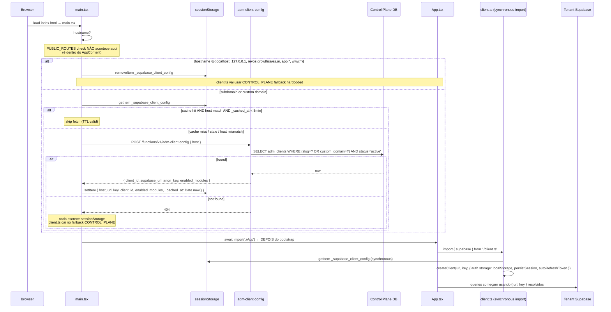
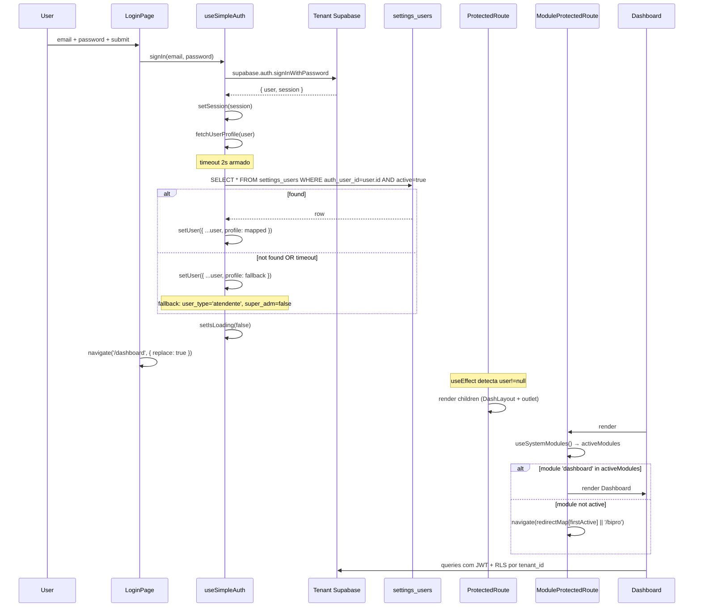
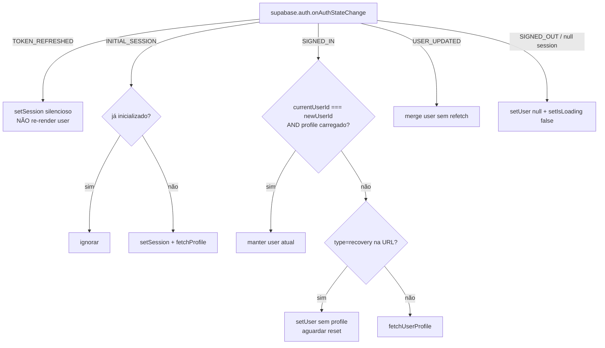
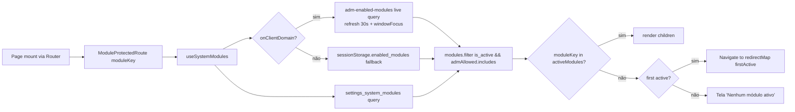
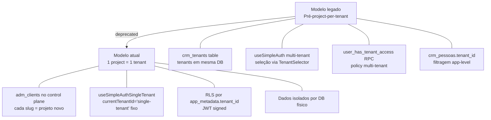

# Auth + Tenant Bootstrap

> ⚠️ **Documento parcialmente legado.** Descreve o desenho multi-tenant do rev-os com control plane externo. O projeto **João Guirunas** opera em single-tenant (Supabase project único `wotuyxscsfralqpoiyfv`); a parte de "Tenant Bootstrap" e resolução por hostname **não é exercitada em runtime**. Mantido como referência histórica até refactor de cleanup. A parte de **Auth (sub-sistema 2)** continua válida.

## 1. Visão e responsabilidade

Este é o **gatekeeper**: tudo que o usuário enxerga depende dele decidir corretamente quem ele é, qual tenant ele acessa, e quais módulos/áreas ele tem direito de ver. Combina dois sub-sistemas que se acoplam fortemente:

1. **Tenant Bootstrap** — resolver o **project Supabase certo** ANTES do React montar. Roda no `main.tsx` antes de importar `App`. Resultado fica em `sessionStorage._supabase_client_config` e é lido **síncrono** por `client.ts`.
2. **Auth (single-tenant style)** — após o bootstrap, autentica o usuário contra o Supabase do tenant resolvido, carrega `settings_users` profile, e expõe contexto via `useAuth()`.

Sobre essas duas pernas se montam:
- **3 guards de rota** (`ProtectedRoute`, `ModuleProtectedRoute`, `RestrictedRoute`)
- **Provider stack** ([[../../../../src/App.tsx]]: `Tenant → SimpleAuth → Realtime → Navigation`)
- **Hook de permissões** (`useUserPermissions`) que cristaliza role-gates (gestor/consultor/super_admin/cliente) + filtros de query.

**Sem este módulo, RLS quebra** — todas as queries do app dependem do JWT correto do tenant correto.

> Para a topologia geral multi-tenant ver [[../architecture]] §2-4. Para o catálogo de tenants e provisioning ver [[adm-control-plane]].

---

## 2. Rotas e páginas

Este módulo não possui rotas próprias — ele **embrulha todas as outras**. Os pontos onde ele aparece em [[../../../../src/App.tsx]]:

### Rotas públicas (sem `ProtectedRoute`)

| Rota | Componente | Bootstrap aplicado? |
|---|---|---|
| `/login` | [[../../../../src/components/auth/LoginPage]] | sim (sempre) |
| `/reset-password` | [[../../../../src/components/auth/ResetPasswordPage]] | sim |
| `/finalizar-cadastro` | [[../../../../src/pages/FinalizarCadastro]] | sim |
| `/oauth/{meta,google,microsoft}/callback` | callbacks OAuth | sim |
| `/tiktok/callback` | [[../../../../src/pages/TiktokCallback]] | sim |
| `/agendar/:leadId` | [[../../../../src/pages/AgendamentoPublico]] | sim |
| `/f/:formId` | [[../../../../src/pages/PublicFormPage]] | sim |
| `/excluir-dados`, `/politica-de-privacidade` | LGPD pages | sim |

### Rotas protegidas

Todas em `ProtectedRoute > DashLayout` (desktop) ou `ProtectedRoute > MobileShell` (`/m/*`). Subset com `ModuleProtectedRoute moduleKey="..."`. Subset com `RestrictedRoute requireGestor` ou `requireSuperAdmin`:

| Rota | Guard adicional |
|---|---|
| `/adm`, `/adm/clients/:id` | `RestrictedRoute requireSuperAdmin` |
| `/schedules` (Horários) | `RestrictedRoute requireGestor` |

### Catch-all
- `/` redireciona para `/bipro` (ver [[../../../../src/App.tsx]] linha ~144).
- `*` mostra 404 inline.

> **Mobile redirect:** se `useIsMobile()` retornar true em rota desktop não-pública, redireciona para `/m/bi`. Lógica em `AppContent` ([[../../../../src/App.tsx]] linha ~96-105).

---

## 3. Componentes principais

Catálogo geral em [[../../agents/ux/components]]. Específicos deste módulo:

| Componente | Path | Função |
|---|---|---|
| `SimpleAuthProvider` | [[../../../../src/components/auth/SimpleAuthProvider]] | Wrap do `useSimpleAuth` em Context. Mostra spinner de 1s antes de `forceShow` (timeout agressivo para nunca travar UI) |
| `LoginPage` | [[../../../../src/components/auth/LoginPage]] | Form email/password, signInWithGoogle, dialog reset, "limpar cache" emergency button (clear localStorage + sessionStorage + cookies + service workers + caches) |
| `ResetPasswordPage` | [[../../../../src/components/auth/ResetPasswordPage]] | Trocar senha após magic link com `type=recovery` |
| `ProtectedRoute` | [[../../../../src/components/auth/ProtectedRoute]] | Redireciona para `/login` se não há user; redireciona para `/reset-password` se URL tem `type=recovery`; tela "Perfil Incompleto" se user mas sem `user.profile` (refresh + reload + signOut) |
| `ModuleProtectedRoute` | [[../../../../src/components/auth/ModuleProtectedRoute]] | Checa `useSystemModules().activeModules`; se módulo não ativo, redireciona para o primeiro módulo ativo (com `redirectMap` por module_key) |
| `RestrictedRoute` | [[../../../../src/components/auth/RestrictedRoute]] | `requireSuperAdmin` exige `user.profile.super_adm = true` **E** estar no control-plane (lê `sessionStorage._supabase_client_config`). `requireGestor` exige `gestor` ou `super_adm` |
| `MobileShell` | [[../../../../src/components/mobile/MobileShell]] | Wrapper das rotas mobile dentro de `ProtectedRoute` |
| `MobileModuleGuard` | [[../../../../src/components/mobile/MobileModuleGuard]] | Equivalente mobile de `ModuleProtectedRoute` |

### Provider stack ([[../../../../src/App.tsx]] linhas ~800-830)

```
PageErrorBoundary
  QueryClientProvider
    ThemeProvider (next-themes, dark default)
      LoadingProvider
        TooltipProvider
          BrowserRouter
            TenantProvider                ← stub single-tenant
              SimpleAuthProvider          ← Supabase Auth + profile
                RealtimeProvider          ← canal por tenant_id
                  NavigationProvider
                    AppContent (Routes)
```

**Ordem importa:** `TenantProvider` antes de `SimpleAuthProvider` para que qualquer hook que precise saber `tenantId` veja o stub. `RealtimeProvider` depois do auth porque depende de saber em qual tenant abrir canal.

---

## 4. Hooks de dados

### `useSimpleAuth` ([[../../../../src/hooks/useSimpleAuthSingleTenant]])

Coração do módulo. Estado:
- `user: AuthUser | null` (User do Supabase enriquecido com `profile`)
- `session: Session | null`
- `isLoading: boolean`
- `initError: string | null`
- `currentTenantId: 'single-tenant'` (stub fixo)

**Refs (closures):** `userRef` espelhado a `user` para o auth listener ler valor atualizado sem re-render.

**`fetchUserProfile(authUser)`:**
1. Guard `isFetchingProfile.current` previne reentrância.
2. Timeout **2s** — se ainda fetching, monta `fallbackProfile` (`user_type: 'atendente'`, `super_adm: false`) e libera UI.
3. SELECT `settings_users` por `auth_user_id` + `active=true` (`maybeSingle()`).
4. Mapeia colunas: `name → nome`, `phone → whatsapp`, `super_admin → super_adm`, derive `gestor`/`consultor` de `user_type`.
5. Se sem registro, monta profile derivado de `auth.users.user_metadata`.

**`initializeAuth()` (effect array vazio, GUARD DUPLO):**
1. Refs `isInitialized` + `isExecuting` previnem dupla execução.
2. Timeout **3s** para forçar `isLoading=false` (UI nunca trava).
3. STEP 1 — `supabase.auth.getSession()`; se sessão, `fetchUserProfile()` em background.
4. STEP 2 — `supabase.auth.onAuthStateChange()` listener:
   - `TOKEN_REFRESHED` — atualiza session silenciosamente, NÃO re-render (evita fechar modais).
   - `INITIAL_SESSION` — ignorado se já inicializado.
   - **Mesmo user (closure via `userRef`)** — atualiza session apenas, não refetcha profile.
   - **Recovery flow** (URL hash/search com `type=recovery`) — seta user mas NÃO busca profile.
   - `SIGNED_IN` + sem profile — fetch profile.
   - `USER_UPDATED` — merge sem refetch.
   - logout (`!newSession`) — limpa user.

**Funções expostas:**
| Função | Chama |
|---|---|
| `signIn(email, password)` | `supabase.auth.signInWithPassword` + `fetchUserProfile` |
| `signUp(email, password, fullName)` | `supabase.auth.signUp` com `emailRedirectTo: origin` |
| `signInWithGoogle()` | `supabase.auth.signInWithOAuth({provider:'google'})` |
| `signOut()` | `supabase.auth.signOut` + clear local state |
| `resetPassword(email)` | `supabase.auth.resetPasswordForEmail` com `redirectTo: /reset-password` |
| `refreshProfile()` | re-`fetchUserProfile` |
| `refreshSession()` | `supabase.auth.refreshSession` |
| `emergencyReset()` | reset refs + `setIsLoading(false)` |

### `useAuth()` (alias)
```ts
export const useAuth = () => useContext(AuthContext)
```
Throw se fora do provider.

### `useTenantContext` ([[../../../../src/hooks/useTenantContext]])
Stub que retorna `{ currentTenantId: 'single-tenant', selectedTenantId: 'single-tenant', currentRole: 'user', isLoading: false }`. Mantido para compat com código legado que esperava multi-tenant in-database.

### `useCurrentUser` ([[../../../../src/hooks/useCurrentUser]])
React Query que SELECT `settings_users` por `auth_user_id`. Usado por componentes que só precisam do profile sem o user completo.

### `useUserPermissions` ([[../../../../src/hooks/useUserPermissions]])
Cristaliza decisões de role-gate em valores booleanos memoizados:
- `isGestor`, `isConsultor`, `isSuperAdmin`, `isCliente`, `isManager` (= gestor || super_adm)
- `userTimes: string[]` (de `useUsuariosTimes`)
- `canChangeFilters`, `canBlockSchedule`, `canCreateUser`, `canDeleteUser`, `canCreateClient`, `canEditClient`, `canDeleteClient`, `canAccessCRM`, `canAccessFullProjects`, `canAccessSettings`
- `getResponsavelFilter()` — retorna `""` (gestor/admin), `currentUserId` (consultor/atendente), ou `"__INVALID_USER__"` (sentinel para bloquear queries quando profile inválido)
- `getTeamFilter()` — `""`, `userTimes`, ou `"__INVALID_USER__"`

> **Convenção crítica:** `"__INVALID_USER__"` é uma string sentinel propagada para hooks de query — eles devem checar e abortar (return early com array vazio) para impedir vazamento RLS-bypass via UI.

### `useSystemModules` ([[../../../../src/hooks/useSystemModules]])
Combina três fontes para decidir `activeModules`:
1. `settings_system_modules` do tenant DB (`is_active`).
2. `enabled_modules` do `sessionStorage._supabase_client_config` (cache do bootstrap, fallback).
3. **Live query** (`adm-enabled-modules`): re-bate `adm-client-config` a cada 30s/window focus (apenas em subdomínios de cliente). Permite ADM mudar módulos sem o user precisar relogar.

```
admAllowed = liveAdmModules ?? cachedFromSessionStorage
activeModules = modules.filter(m => m.is_active && (admAllowed === null || admAllowed.includes(m.module_key)))
```

`isClientSubdomain()` lista os domínios "main" (`localhost`, `127.0.0.1`, `revos.growthsales.ai`, `app.*`, `www.*`) — qualquer outro hostname é tratado como cliente.

---

## 5. Edge functions

Apenas uma edge function pertence diretamente a este módulo: `adm-client-config`. Todas as demais (auth admin) ficam dentro do control plane scope.

### `adm-client-config` (chamada de fora do contexto authenticated)

| Atributo | Valor |
|---|---|
| Path | [[../../../../supabase/functions/adm-client-config/index.ts]] |
| `verify_jwt` | (default — mas o function não exige JWT do user; usa service_role do env) |
| Trigger | `main.tsx::bootstrapClientConfig()` (boot) + `useSystemModules` live query (a cada 30s) |
| Input | `{ host: string }` |
| Output | `{ client_id, supabase_url, anon_key, enabled_modules }` |

Detalhes em [[adm-control-plane]] §5.

### Edge functions correlatas (chamadas via `invokeControlPlane`)

| Function | `verify_jwt` | Quando |
|---|---|---|
| `create-tenant-user` | true | Provisionar user no tenant atual (chamado em `Configuracoes > Usuarios`) |
| `update-user-email` | true | Mudar email com revalidação |
| `update-user-password` | true | Mudar senha com auth check |
| `delete-user` | true | Soft-delete via `deleted_at` |
| `send-invite-email` | true | Email de convite com magic link |
| `data-deletion` | (público) | LGPD — apaga dados do user requested |

> Esses 5 não são exclusivos deste módulo — vivem em [[../modules/settings]] (Usuários) e [[adm-control-plane]] (`adm-create-user`). Aqui apenas **referenciamos** porque o token JWT consumido por eles é emitido pelo fluxo deste módulo.

---

## 6. Schema e tabelas

> Schema completo em [[../../agents/data-engineer/schema]]. Tabelas relevantes:

| Tabela | Tier | Uso |
|---|---|---|
| `auth.users` (Supabase) | tenant | Identidade primária |
| `settings_users` | tenant | Profile aplicacional. Cols-chave: `auth_user_id` (FK), `name`, `email`, `phone`, `user_type` (`gestor`\|`consultor`\|`atendente`\|`cliente`), `super_admin`, `active`, `avatar_url`, `deleted_at`, `deleted_by` |
| `settings_system_modules` | tenant | Catálogo de módulos do tenant. Cols: `module_key`, `module_name`, `is_active`, `order_index`, `icon` |
| `settings_users_times` (via `useUsuariosTimes`) | tenant | M:N entre user e times |
| `times` | tenant | Times (vendas/suporte/marketing/financeiro) |
| `adm_clients` | **control plane** | URL/anon_key/enabled_modules — consumido por `adm-client-config` |
| `auth.users` (control plane) | control plane | Identidade do super-admin |
| `settings_users` (control plane) | control plane | Profile do super-admin com `super_admin = true` |

### RLS strategy completa

> Esta é a estratégia DECLARADA — auditoria por linha vive nas migrations. Padrão geral:

#### Server-verified tenant_id (preferido)

Cada tabela com dados de negócio tem coluna `tenant_id` + policy:

```sql
create policy "select_by_tenant" on <table>
for select using (
  tenant_id = (auth.jwt() -> 'app_metadata' ->> 'tenant_id')::uuid
);
```

Fonte de verdade: claim **server-injected** `app_metadata.tenant_id` (NÃO `user_metadata`, que é client-writeable).

#### Server-verified — variantes

Algumas tabelas usam função wrapper (em vez de inline policy):

```sql
create policy "..." on <table>
for select using (tenant_id = get_current_user_tenant_id());
```

Onde `get_current_user_tenant_id()` é SECURITY DEFINER que lê o JWT do `current_setting('request.jwt.claims', true)`.

#### `user_has_tenant_access(uuid)`
Variant para tabelas multi-tenant onde o usuário pode pertencer a vários tenants (vestígio do modelo legado pré-project-per-tenant).

#### Role-based (em settings_users / control plane)
```sql
-- Exemplo: ADM tables
create policy "..._super_admin" on adm_clients for all
using (
  exists (select 1 from settings_users
          where auth_user_id = auth.uid()
            and super_admin = true
            and active = true
            and deleted_at is null)
);
```

#### Unsigned vs server-verified — débito

[[../../../../supabase/functions/_shared/response.ts]] `extractTenantId(req)` faz **decode unsigned** do JWT — vulnerable a forgery se `app_metadata` injection falhar. Marcado @deprecated:

```ts
/**
 * @deprecated Use `supabase.auth.getUser(token)` then `user.app_metadata.tenant_id`.
 * See ADR-PP-03. This function performs an UNSIGNED JWT decode and is vulnerable
 * to tenant_id forgery. Will be removed after PP-V2-8.
 */
```

**Estado atual (ADR-PP-03 — pendente formalizar arquivo em `decisions/`):**
- Edge functions migradas para `supabase.auth.getUser(token)` antes de retornar `app_metadata.tenant_id`.
- `extractTenantId` ainda existe como fallback — não deletar até auditoria garantir que ninguém mais usa.

### Role gates documentados

Decisões de UI/feature gating cristalizadas em `useUserPermissions`:

| Permission | Lógica | Onde aplicado |
|---|---|---|
| `canChangeFilters` | `isManager` | Filtros do dashboard, listas |
| `canBlockSchedule` | `isSuperAdmin \|\| isGestor` | `Horarios` page, modal "BloquearAgenda" |
| `canCreateUser`, `canEditUser` | `isManager` | `UsuariosConfig`, modais |
| `canDeleteUser` | `isSuperAdmin` | menu de ações em UsuariosConfig |
| `canDeleteClient` | `isManager` | menu de ações em ClienteSingle/Clientes |
| `canAccessCRM`, `canAccessFullProjects`, `canAccessSettings` | `!isCliente` | sidebar items, route shortcuts |
| `requireSuperAdmin` (RestrictedRoute) | `super_adm && isControlPlane` | `/adm/*`, `/adm/clients/:id` |
| `requireGestor` (RestrictedRoute) | `gestor \|\| super_adm` | `/schedules` |

> **`isControlPlane` check:** `RestrictedRoute requireSuperAdmin` exige NÃO SÓ a flag, mas TAMBÉM estar no control plane (lê `sessionStorage._supabase_client_config`). Comentário no arquivo é explícito: "checar só `super_adm` é insuficiente porque essa flag existe em todo tenant Supabase e poderia conceder ADM access a client users que tenham super_adm=true no DB deles".

---

## 7. Fluxos críticos

### 7.1 Bootstrap do tenant (HTML → React mount)

> Versão expandida do fluxo em [[../architecture]] §3 com edge cases.



**Edge cases / decisões:**

1. **Cache TTL 5min** — balanceia latência (não bater control plane em cada page reload) com staleness de mudanças no `enabled_modules`. `useSystemModules` complementa com live query a cada 30s.
2. **Fallback control plane** — se `adm-client-config` der 404 ou erro de rede, app boota contra control plane DB. Login do usuário não funcionará (control plane só conhece super-admins), mas página `/login` ainda renderiza.
3. **Listener `vite:preloadError`** — auto-reload em chunk hash inválido (deploy novo invalida hashes antigos):
   ```ts
   window.addEventListener('vite:preloadError', () => { window.location.reload(); });
   ```
4. **`client.ts` é síncrono no import** — por isso o `await` no `bootstrapClientConfig()` ACONTECE ANTES do `await import('./App')`. Trocar a ordem quebra tudo silenciosamente.
5. **Custom domain** (não subdomínio) — cliente pode mapear `crm.empresa.com.br` para o app. Lookup busca por `custom_domain = host`. Necessita CNAME para Vercel + `adm_clients.custom_domain` setado.
6. **Race vs SSR** — `try/catch` em `sessionStorage` access para SSR/test envs. Sempre falha com fallback graceful.

### 7.2 Login → profile fetch → guard pass



**Edge cases:**

1. **`fallbackProfile` em timeout** — UI funciona MAS com permissions degradadas (`atendente`, sem `super_adm`). Vê apenas o que `user_type='atendente'` permite. **Risco:** se tenant tem RLS que confia em settings_users.user_type, queries vão filtrar errado. Mitigation: `useUserPermissions.isValid` retorna `false` quando profile está incompleto — propagar via `__INVALID_USER__` sentinel.
2. **Recovery flow** — `ProtectedRoute` detecta `type=recovery` em hash/search e redireciona para `/reset-password` PRESERVANDO query+hash (necessário para Supabase ler tokens).
3. **Login na página `/login` quando já logado** — `ProtectedRoute` (não LoginPage diretamente) detecta `user && pathname === '/login'` e redireciona para `/dashboard`. Pequena duplicação com `LoginPage.useEffect` que faz a mesma coisa — defensivo.
4. **`emergencyReset` button** — limpa `localStorage.clear()`, `sessionStorage.clear()`, cookies Supabase (`sb-*`, `supabase`), service workers (unregister), Cache API (delete all). Para sair de estados travados.

### 7.3 Auth state changes (post-login)



**Por que TOKEN_REFRESHED não atualiza user:** auto-refresh do Supabase dispara a cada ~50min. Se atualizasse `user` state, qualquer modal aberto fecharia (re-render). Solução: atualizar apenas `session.access_token` se mudou.

### 7.4 Module gating em runtime



**Implicação:** ADM pode desligar módulo via UI → SPA cliente em até 30s (live query) deixa de renderizar a rota daquele módulo, redirecionando para o primeiro ativo. Sem refresh manual.

### 7.5 Single-tenant stub vs legacy multi-tenant



**Vestígios visíveis no código atual:**
- `TenantContext.tsx` ainda existe — stub, sempre `'single-tenant'`.
- `useTenantContext` idem.
- `crm_tenants` table existe no schema (ver [[../../agents/data-engineer/schema]]) — mantida para compat de queries que referenciam.
- `crm_*` tables com `tenant_id` existem — RLS continua filtrando por `tenant_id` mesmo com 1 tenant por DB (defesa em profundidade).
- `user_has_tenant_access(uuid)` ainda referenciada em algumas policies.
- Funções tipo `useTenants()` ainda exportadas.

**Por que manter:** migração foi gradual, código legado em hooks (`useNegocios*`, `useConversas*`) ainda usa pattern antigo. Refactor faseado.

---

## 8. Integrações externas

| Integração | Onde | Função |
|---|---|---|
| **Supabase Auth** | tenant project | Backbone — email/password, magic link, OAuth Google |
| **Supabase Auth (control plane)** | controle plane | Identidade do super-admin para acessar `/adm` |
| **Google OAuth** | `signInWithGoogle()` em `useSimpleAuth` | Provider Google configurado no tenant Supabase. `redirectTo: window.location.origin/` |
| **Vercel CDN** | hosting | Resolve subdomínios para o mesmo bundle JS — bootstrap diferencia por hostname runtime |
| **adm-client-config edge fn** | controle plane | Resolução de tenant — ver [[adm-control-plane]] §5 |
| **`localStorage`** | browser | Supabase Auth persist session storage |
| **`sessionStorage`** | browser | Tenant config cache (`_supabase_client_config`) — limpado ao fechar aba |
| **Service Workers** | browser | Não há SW funcional ativo, mas `useServiceWorker.ts` existe + emergency button limpa registrations |

**Não-integrações:**
- Sem SSO corporativo (SAML, OIDC) ainda — apenas Supabase Auth direto.
- Sem MFA configurado.
- Sem rate limit de login no app (depende do Supabase Auth nativo).

---

## 9. Estado atual e débito técnico

### Bugs / quirks conhecidos

| Item | Onde | Sintoma | Workaround |
|---|---|---|---|
| **fallbackProfile permissivo** | `useSimpleAuth.fetchUserProfile` | Timeout 2s monta profile como `atendente` válido — pode mascarar falha real de RLS | `useUserPermissions.isValid` propaga `__INVALID_USER__` para queries |
| **TOKEN_REFRESHED swallowing** | `useSimpleAuth` listener | session atualiza silenciosamente — bom pra UX, mas debugar refresh fica difícil | Logs em `logger.auth` quando session muda |
| **Bootstrap fallback silencioso** | `main.tsx::bootstrapClientConfig` | `adm-client-config` falha → app boota contra control plane sem aviso ao user | Login falhará (control plane não tem o user); user vê "credenciais inválidas" |
| **`extractTenantId` unsigned** | `_shared/response.ts` | Vulnerable a forgery se atacante mintar JWT próprio | Use `supabase.auth.getUser(token)` + `app_metadata.tenant_id`. ADR-PP-03 pendente |
| **Stub TenantContext + useTenantContext** | `contexts/TenantContext.tsx` + hook | Confunde quem espera multi-tenant — retorna `'single-tenant'` literal | Comentário explícito; deletar quando todo código legado migrar |
| **`useUsuariosTimes` import em hot path** | `useUserPermissions` | Cada render de useUserPermissions também busca times — possivelmente over-fetching | TanStack cache ameniza (staleTime padrão) |

### Débito técnico ativo

1. **ADR-PP-03 sem arquivo formal** — referência só em comentário. Criar em `docs/smart-memory/decisions/`.
2. **`fallbackProfile` deveria propagar `isProvisional: true`** — hooks que respeitam RLS poderiam recusar mutações enquanto profile não é real.
3. **Sem MFA** — SaaS B2B com dados sensíveis (mensagens cliente, vendas) deveria ter TOTP/WebAuthn opcional.
4. **Sem rate limit no `/login`** — confia no Supabase Auth (genérico). Adicionar Cloudflare ou edge function intermediária.
5. **`useSystemModules` live query a cada 30s** — pode fazer 100+ requests em sessão longa só para 99% das vezes mesmo resultado. Considerar SSE/WebSocket ou push do ADM.
6. **`AdmModulesSection` 9 vs `AdmClientSingle.ALL_MODULES` 11** — vazamento conceitual entre este módulo e [[adm-control-plane]] §9. Extrair constante única.
7. **`crm_tenants` table viva como vestígio** — limpar quando refactor multi-tenant→project-per-tenant terminar (ver [[../../agents/data-engineer/schema]]).
8. **`AppContent.PUBLIC_ROUTES` hardcoded** — duplicação com checks similares em `ProtectedRoute`. Centralizar.
9. **`useSimpleAuthSingleTenant` ainda no nome** — sugere transição incompleta. Renomear para `useAuth` é maior escopo (197+ usages).
10. **Sem CSP / Trusted Types** — credenciais no JS bundle (anon key control plane) — aceitável (anon key é pública por design), mas headers HTTP de CSP estrita ajudaria.
11. **Recovery flow detection só por URL** — `type=recovery` em hash/search. Se Supabase mudar o formato, quebra silenciosa.
12. **`useTenants` exportado** — atrai uso indevido de código novo. Marcar `@deprecated`.

### Observações operacionais

- **Domínios main:** `localhost`, `127.0.0.1`, `revos.growthsales.ai`, `app.revos.growthsales.ai`, `www.revos.growthsales.ai` — todos batem control plane direto. Mudar essa lista exige editar 3 lugares (`main.tsx`, `useSystemModules`, `RestrictedRoute` indireto via `CONTROL_PLANE_URL` const).
- **`CONTROL_PLANE_URL`** hardcoded em [[../../../../src/integrations/supabase/client.ts]] — `https://ohzwetkaazgxafubzvop.supabase.co`. Mudança = redeploy.
- **`auth.storage: localStorage`** — escolhido para persistir entre sessões. Tornaria-se `sessionStorage` se requisito mudar para "logout ao fechar aba".
- **`refreshOnWindowFocus: false`** no `QueryClient` — evita storms ao trocar de aba. Só `useSystemModules` e `adm-enabled-modules` opt-in.

---

## 10. Stories candidatas / ADRs relevantes

### ADRs a criar / formalizar

- **ADR-PP-03** — Server-verified tenant_id (formalizar arquivo; já referenciado em código)
- **ADR-AUTH-01** — Modelo single-tenant client-side com bootstrap dinâmico (decisão de mover de multi-tenant in-database para project-per-tenant + sessionStorage bootstrap)
- **ADR-AUTH-02** — Estratégia de fallback profile + timeout 2s (UX vs segurança trade-off)
- **ADR-AUTH-03** — `RestrictedRoute requireSuperAdmin` exige `isControlPlane && super_adm` (defesa em profundidade contra `super_adm` em tenant DB)
- **ADR-AUTH-04** — Quando usar `useAuth` vs `useCurrentUser` vs `useUserPermissions` (decisão de granularidade)

### Stories candidatas

- **AUTH-V2-01** — Substituir todas as chamadas a `extractTenantId(req)` por `supabase.auth.getUser(token).app_metadata.tenant_id` (encerra ADR-PP-03)
- **AUTH-V2-02** — Adicionar `isProvisional: true` ao `fallbackProfile`; bloquear mutations e mostrar warning UI
- **AUTH-V2-03** — MFA opcional (TOTP via Supabase Auth)
- **AUTH-V2-04** — Centralizar `PUBLIC_ROUTES` em `src/utils/constants.ts`
- **AUTH-V2-05** — Renomear `useSimpleAuthSingleTenant` → `useAuth` + path `src/hooks/useAuth.ts` (refactor de 197+ imports)
- **AUTH-V2-06** — Live update de `enabled_modules` via Supabase Realtime channel `adm_clients` (em vez de polling 30s)
- **AUTH-V2-07** — Cleanup de `crm_tenants` + `useTenants` + `user_has_tenant_access` (encerra migração multi-tenant)
- **AUTH-V2-08** — CSP + COOP/COEP headers configurados no Vercel
- **AUTH-V2-09** — Rate limit `/login` (Cloudflare ou edge intermediária)
- **AUTH-V2-10** — Audit log de login/logout/profile fetch failures no tenant DB
- **AUTH-V2-11** — Recovery flow robusto — não confiar só em `type=recovery` na URL
- **AUTH-V2-12** — `RestrictedRoute requireSuperAdmin` valida via fetch ao control plane (não só sessionStorage URL match — defesa contra usuário fabricar entry no SS)

### Referências cruzadas

- [[adm-control-plane]] — `adm-client-config` é a engrenagem do bootstrap; `useUpdateAdmClientModules` reflete em `useSystemModules.liveAdmModules` (~30s)
- [[../architecture]] §3-6 — topologia, tenant bootstrap, segurança RLS
- [[../../agents/data-engineer/schema]] — `settings_users`, `settings_system_modules`, RLS policies
- [[../modules/settings]] — UI para gerenciar usuários/times/perfis (consome este módulo)

---

**Última atualização:** 2026-04-22 · **Mantido por:** dev-architect
