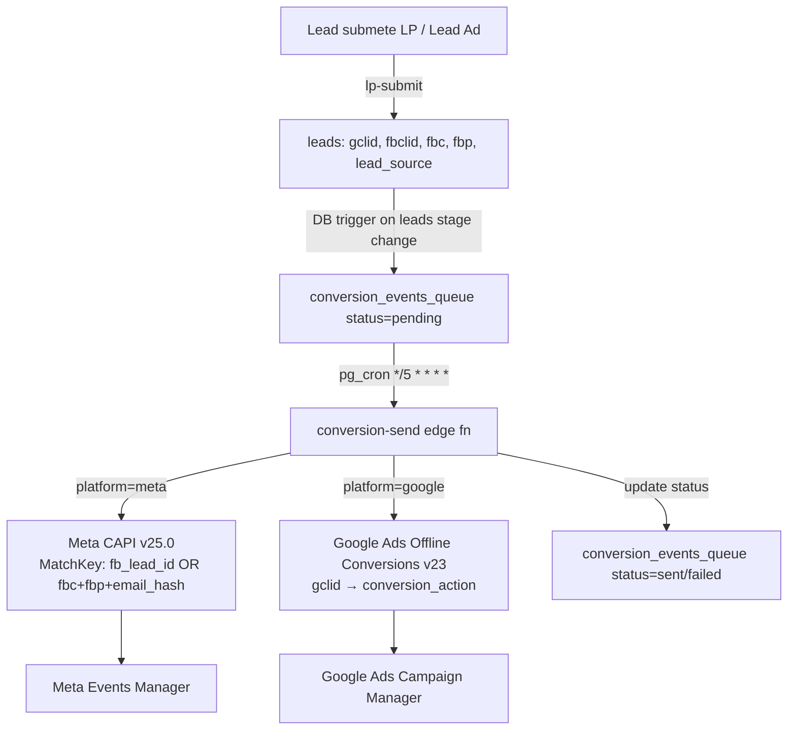
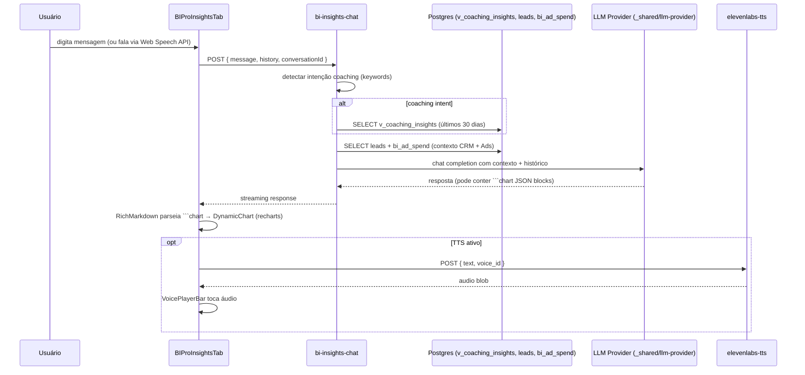

# BI PRO

Plataforma de inteligência comercial e de marketing. Consolida KPIs de CRM, funil, reuniões e disparos com dados de Ads (Meta, Google, TikTok) em painéis por aba. Inclui atribuição de conversões (UTM + click IDs + offline CAPI/Google Ads upload), chat de insights com LLM e TTS via ElevenLabs.

---

## 1. Visão e Responsabilidade

BI PRO é o **dashboard executivo do rev-os**. Sua responsabilidade única é agregar e apresentar métricas de desempenho com rastreabilidade de origem (attribution). O módulo:

- Lê dados existentes de CRM (`leads`, `clients_people`, `agendamentos`, `sends`) — nunca os escreve
- Sincroniza dados de ads de plataformas externas para tabelas `bi_*` via edge functions acionadas manualmente ou por cron
- Envia eventos de conversão offline para Meta CAPI e Google Ads Offline Conversions via `conversion-send` (cron a cada 5 min)
- Oferece chat de insights com contexto de CRM + Ads + Coaching via `bi-insights-chat` (LLM + ElevenLabs TTS)
- Nenhuma escrita em tabelas de negócio — é read-only em relação ao CRM

**Quem acessa:** todos os usuários autenticados (gestor e consultor). Filtros de período, pipeline e score são aplicados no frontend antes das queries.

---

## 2. Rotas e Páginas

| Rota | Página | Notas |
|---|---|---|
| `/bipro` | [[../../../../src/pages/Dashboard]] | alias principal |
| `/dashboard` | [[../../../../src/pages/Dashboard]] | alias legado (ambas mapeadas em App.tsx) |
| `/m/bi` | `src/pages/mobile/MobileBIDashboard.tsx` | versão mobile (subset) |

Sem sub-rotas — toda a navegação é por abas dentro de `Dashboard.tsx`.

---

## 3. Componentes Principais

Todos em `src/components/dashboard/`. Ver também [[../../agents/ux/components]].

| Componente | Responsabilidade |
|---|---|
| [[../../../../src/pages/Dashboard]] | Shell: gerencia estado de filtros (period, dateRange, pipeline, score), tab ativa, refresh e Meta sync manual. Lazy-loads cada tab. |
| `BIProSummaryBar` | Barra de KPIs executivos — só exibida na aba RevOps. Consome `useBIProKPIs`. |
| `BIProRevOpsTab` | Aba RevOps: waterfall de conversão, ciclo de venda, volume por stage. |
| `BIProComercialTab` | Aba Comercial: breakdown semanal (leads/MQLs/reuniões/won), tabela de consultores, funil comparativo. Consome `useBIProCRM` + `useBIProSchedules`. |
| `BIProMarketingTab` | Aba Marketing: ad spend, impressões, cliques, CPL, ROI por canal e campanha. Consome `useBIProAttribution`. |
| `BIProInsightsTab` | Aba Insights: chat LLM com histórico por conversa, suporte a `\`\`\`chart` blocks (DynamicChart), voice input (mic) e TTS (ElevenLabs). |
| `DashboardFilters` | Barra de filtros — período, dateRange customizado, pipeline, score. Oculta na aba Insights. |
| `DynamicChart` | Renderiza specs JSON de chart (recharts) emitidas pelo LLM em blocos de código `language-chart`. |
| `VoicePlayerBar` | Player TTS com waveform animado. |
| `VoicePicker` | Seletor de voz ElevenLabs. |
| `StageConversionMatrix` | Matriz de conversão entre stages. |
| `BottleneckAlert` | Alerta visual de gargalo de funil. |
| `DateRangeFilter` | Datepicker de intervalo customizado. |
| `bipro-shared.ts` | Variantes de layout (Framer Motion), skeletons, formatadores (`fmtPct`, `fmtNum`), constantes de classe CSS. |

---

## 4. Hooks de Dados

Todos em `src/hooks/`. Padrão: `useQuery` com TanStack Query, leem do Supabase via `@/integrations/supabase/client`.

| Hook | Query Key | Fonte de dados | O que retorna |
|---|---|---|---|
| `useBIProKPIs` | `['bi-pro-kpis']` | `leads`, `agendamentos`, `sends`, `bi_ad_spend` | `BIProKPIs`: receita, volume, conversão, custo, score, performance |
| `useBIProCRM` | `['bi-pro-crm']` | `leads`, `clients_people`, `leads_stages` | Breakdown por stage/consultor/período |
| `useBIProFunnel` | `['bi-pro-funnel']` | `leads`, `leads_stages` | Waterfall de conversão por pipeline |
| `useBIProOmni` | `['bi-pro-omni']` | `messages`, `crm_conversations` | Volume de mensagens por canal |
| `useBIProRevOps` | `['bi-pro-revops']` | `leads`, `agendamentos` | Ciclo de venda, tempo de resposta, taxa de atividade |
| `useBIProSchedules` | `['bi-pro-schedules']` | `agendamentos` | Reuniões agendadas/realizadas por período/consultor |
| `useBIProSends` | `['bi-pro-sends']` | `sends`, `send_recipients` | Stats de disparos (enviados, entregues, lidos) |
| `useBIProAdAccounts` | `['bi-pro-ad-accounts']` | `bi_ad_accounts` | Lista de contas Meta/Google conectadas; `syncAccount` mutation chama `bi-sync-meta-ads` ou `bi-sync-google-ads` |
| `useBIProAttribution` | `['bi-pro-attribution']` | `bi_ad_spend`, `bi_ad_daily_stats`, `bi_ad_campaigns`, `leads`, `form_pro_submissions` | `AttributionData`: por canal, por campanha, time series, form PRO |
| `useBIProSettings` | `['bi-pro-settings']` | `bi_settings` | Credenciais OAuth Meta/Google (Meta app_id/secret, Google client_id/secret/developer_token) |
| `useInsightsConversations` | `['insights-conversations']` | `bi_insights_conversations` (local) | Histórico de conversas do chat |
| `useElevenLabsTTS` | — | `elevenlabs-tts` edge fn | Síntese de voz; cache local por hash |
| `useCallProBIStats` | — | `call_pro_*` | Stats de CALL PRO exibidos na aba RevOps |

**Utilitário:** `src/hooks/bipro-date-utils.ts` — `buildDateFilter(period, from, to)` e `buildPrevDateFilter()` para período anterior (comparação).

---

## 5. Edge Functions

Todas em `supabase/functions/`. `verify_jwt` conforme `supabase/config.toml` (default = true quando não especificado).

| Função | verify_jwt | Responsabilidade |
|---|---|---|
| `bi-google-oauth` | true | Exchange code OAuth → access_token + refresh_token do Google Ads; upsert em `bi_ad_accounts`. Usa Google Ads API v20. |
| `bi-meta-oauth` | true | Exchange code OAuth → long-lived token (~60 dias) do Meta; lista ad accounts; retorna token para o cliente armazenar. |
| `bi-sync-google-ads` | true | Busca spend diário por campanha na Google Ads API REST v20; upsert em `bi_ad_spend` + `bi_ad_campaigns` + `bi_ad_daily_stats`. Acionado manualmente pelo usuário (botão "Meta Sync" em Dashboard). |
| `bi-sync-meta-ads` | true | Busca insights de campanha na Meta Marketing API v19.0; upsert em `bi_ad_campaigns` + `bi_ad_spend` + `bi_ad_daily_stats`. Acionado manualmente. |
| `bi-insights-chat` | true | Chat de insights: recebe mensagem + histórico; detecta intenção de coaching; monta contexto CRM + ads + `v_coaching_insights`; chama LLM via `_shared/llm-provider.ts`; streaming de resposta. |
| `conversion-fetch-platforms` | true | GET — lista Meta Pixels e Google Conversion Actions das contas `bi_ad_accounts` conectadas (para configuração de `conversion_stage_mappings`). |
| `conversion-send` | false (service_role) | Worker de conversões offline: lê `conversion_events_queue` com status `pending`; envia para Meta CAPI (v25.0) e/ou Google Ads Offline Conversions (v23); atualiza status. Invocado por pg_cron `*/5 * * * *` via `app.settings.supabase_url`. |

**Sobre o sync de TikTok:** `bi_tiktok_ad_spend` é alimentada pela integração TikTok Ads (migration `20260413230000_tiktok_integration.sql`); a edge function de sync TikTok não está listada em `supabase/functions/` com nome explícito — pode ser parte do fluxo OAuth TikTok (`tiktok-oauth`/`tiktok-inbound`) ou ainda não implementada. A tabela existe mas o cron de sync não foi encontrado nas migrations.

---

## 6. Schema e Tabelas

Ver [[../../agents/data-engineer/schema]] para definições completas. Tabelas próprias do BI PRO:

| Tabela | Migration | Descrição |
|---|---|---|
| `bi_settings` | `20260218140000_bi_settings-ok.sql` | Singleton: OAuth credentials para Meta Ads e Google Ads (meta_app_id/secret, google_client_id/secret/developer_token). RLS: authenticated. |
| `bi_ad_accounts` | `20260217000000_bipro_ad_tables-ok.sql` | Contas de Ads conectadas (Meta + Google). platform ∈ {meta, google}. UNIQUE(platform, account_id). RLS por tenant_id. |
| `bi_ad_campaigns` | `20260217000000_bipro_ad_tables-ok.sql` + `20260218200000_fix_bi_ad_campaigns_schema-ok.sql` | Metadados de campanha. FK bi_ad_accounts. |
| `bi_ad_spend` | `20260217000000_bipro_ad_tables-ok.sql` | Spend diário por campanha. Fonte de dados de attribution. |
| `bi_ad_daily_stats` | `20260217000000_bipro_ad_tables-ok.sql` | Stats agregados diários por campanha (impressões, cliques, spend). |
| `bi_sdr_targets` | `20260308110000_bi_sdr_targets-ok.sql` | Metas por SDR/período para RevOps. |
| `bi_tiktok_ad_spend` | `20260413230000_tiktok_integration.sql` | Spend TikTok por dia/advertiser/campaign/adgroup. |
| `conversion_platform_credentials` | `20260318800000_conversion_tracking_schema.sql` | Credenciais de conversão por usuário/plataforma (pixel_id, access_token para Meta; customer_id, oauth para Google). UNIQUE(user_id, platform). |
| `conversion_stage_mappings` | `20260318800000_conversion_tracking_schema.sql` | Mapeamento pipeline_id + stage_id → evento de conversão Meta/Google. Quando lead entra no stage, evento é enfileirado. |
| `conversion_events_queue` | `20260318800000_conversion_tracking_schema.sql` | Fila de eventos pendentes para envio às plataformas. Processada por `conversion-send` a cada 5 min. |

**Tabelas de CRM lidas (não escritas por BI PRO):** `leads`, `clients_people`, `agendamentos`, `sends`, `send_recipients`, `messages`, `form_pro_submissions`.

---

## 7. Fluxos Críticos

### 7.1 Ad Sync Manual (Meta/Google)

```mermaid
sequenceDiagram
    participant U as Usuário (Dashboard)
    participant FE as Dashboard.tsx
    participant Hook as useBIProAdAccounts
    participant SYNC as bi-sync-meta-ads / bi-sync-google-ads
    participant API as Meta Marketing API / Google Ads API
    participant DB as bi_ad_campaigns + bi_ad_spend + bi_ad_daily_stats

    U->>FE: clica "Meta Sync" (handleMetaSync)
    FE->>Hook: syncAccount.mutateAsync({ ad_account_id, date_from, date_to })
    Hook->>SYNC: POST (JWT user auth)
    SYNC->>DB: SELECT bi_ad_accounts WHERE id = ? (pega access_token)
    SYNC->>API: GET campaigns/insights (date preset = date_from..date_to)
    API-->>SYNC: rows de spend diário por campanha
    SYNC->>DB: UPSERT bi_ad_campaigns (campaign metadata)
    SYNC->>DB: UPSERT bi_ad_spend (daily rows, UNIQUE conflict = update)
    SYNC->>DB: UPSERT bi_ad_daily_stats (aggregated)
    SYNC-->>Hook: { success: true, synced: N }
    Hook->>FE: invalidateQueries(['bi-pro-attribution'])
    Note: Sync é por conta (loop sobre contas ativas em Dashboard)
```

**Ponto de atenção:** tokens OAuth não têm refresh automático no frontend — expiração de token gera erro de sync. Token Meta dura ~60 dias. Google usa refresh_token — refresh é responsabilidade da edge fn de sync.

### 7.2 Attribution Pipeline (Conversion Tracking)



**Dados de matching Meta CAPI:** se `fb_lead_id` presente (Lead Ad) → usa `lead_id`. Se site form → usa `fbc` + `fbp` + `email_hash` + `phone_hash`. Sem nenhum matching key = evento descartado (`no_matching_keys`).

**Onde fica o pg_cron:** migration `20260318800000_conversion_tracking_schema.sql` registra `cron.schedule('conversion-send-retry', '*/5 * * * *', ...)` usando `app.settings.supabase_url` + `app.settings.service_role_key`.

### 7.3 Insights Chat (LLM + TTS)



---

## 8. Integrações Externas

| Serviço | Protocolo | Edge Fn | Dados |
|---|---|---|---|
| Meta Marketing API | OAuth 2.0 (long-lived token) | `bi-meta-oauth`, `bi-sync-meta-ads` | Campaign insights: spend, impressions, clicks por dia |
| Meta Conversions API (CAPI) | Access token (pixel-level) | `conversion-send` | Upload de conversion events offline |
| Google Ads API | OAuth 2.0 (refresh_token) | `bi-google-oauth`, `bi-sync-google-ads` | Campaign insights via REST v20 |
| Google Ads Offline Conversions | OAuth 2.0 | `conversion-send` | Upload de gclid → conversion action |
| TikTok Ads API | OAuth 2.0 | via `tiktok-oauth` (fluxo não totalmente mapeado) | Spend por advertiser/campaign/adgroup em `bi_tiktok_ad_spend` |
| ElevenLabs TTS | API Key | `elevenlabs-tts` | Síntese de voz para respostas do Insights chat |
| LLM (OpenAI/Groq/Anthropic/Gemini) | API Key | `bi-insights-chat` via `_shared/llm-provider.ts` | Chat completion com contexto de CRM + Ads |

---

## 9. Estado Atual e Débito Técnico

| Item | Descrição | Severidade |
|---|---|---|
| Token refresh automático ausente | Tokens Meta (~60d) e Google expiram sem refresh automático na edge fn de sync. Usuário recebe erro de sync sem mensagem clara. | Alta |
| TikTok sync incompleto | `bi_tiktok_ad_spend` existe e tem dados históricos, mas a edge fn de sync TikTok não está identificada em `supabase/functions/`. Pode ser manual ou inexistente. | Média |
| `useBIProOmni` sem uso visível | Hook existe mas não foi localizado em nenhum tab component durante a auditoria. Pode ser legado ou planejado. | Baixa |
| `bi_insights_conversations` não tipado | Tabela não está em `types.ts` gerado — hook usa cast `supabase as any`. | Baixa |
| Score filter no frontend | Filtro de score em `Dashboard.tsx` é passado como `scoreFilter: number[]` mas o tratamento no hook é `contains` simples — sem faixa (range). | Baixa |
| Meta System Token | Migration `20260420210000_add_meta_system_token_to_bi_settings.sql` adicionou `meta_system_token` em `bi_settings` — sugere migração para system token (mais estável), mas o fluxo OAuth ainda usa user token. | Baixa |

---

## 10. Stories Candidatas / ADRs Relevantes

**Stories candidatas:**
- `BIPRO-TOKEN-REFRESH` — Implementar refresh automático de tokens OAuth Meta/Google nas edge fns de sync
- `BIPRO-TIKTOK-SYNC` — Clarificar/implementar edge fn de sync TikTok para `bi_tiktok_ad_spend`
- `BIPRO-ATTRIBUTION-FUNNEL` — Attribution por funil: filtrar `conversion_stage_mappings` por pipeline ativo nos filtros do dashboard
- `BIPRO-CHART-EXPORT` — Export de charts como PNG/CSV direto da aba Marketing

**ADRs relacionados:**
- [[../../decisions/ADR-SP-05-service-role-credentials-vault]] — vault para service_role_key usado pelo pg_cron do `conversion-send`
- `ADR-PP-03` — server-verified tenant_id (relevante para edge fns de sync que usam service_role)
