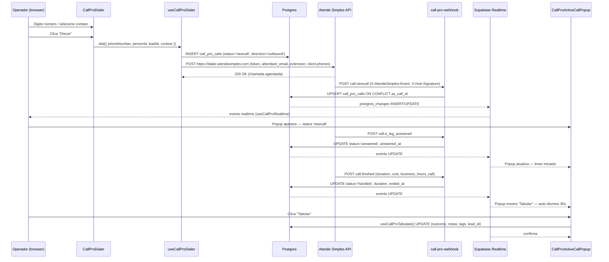
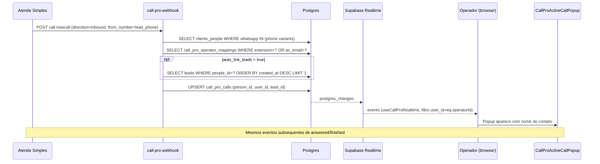

# CALL PRO™ — Discador & Gestão de Chamadas (call-pro)

## 1. Visão e responsabilidade

CALL PRO™ é o módulo de telefonia integrada. Permite que operadores façam e recebam chamadas via browser, com as chamadas registradas automaticamente no CRM e linkadas ao contato correspondente.

**Funcionalidades principais:**
- **Discador outbound** — operador digita o número ou clica em um contato e dispara a chamada via API do Atende Simples (AS)
- **Standby inbound** — exibe popup flutuante quando chega uma chamada entrante (realtime via Supabase postgres_changes)
- **Histórico de chamadas** — lista paginada com filtros (direção, status, operador, período)
- **Tabulação** — após a chamada, operador registra outcome, notas, tags e vincula a lead
- **Analytics (BI interno)** — KPIs de ligações por período: taxa de atendimento, duração média, custo, distribuição por operador
- **Filas AS** — configuração de filas do Atende Simples com seus tokens/credentials
- **Voice Agents (ElevenLabs)** — integração experimental de agentes de voz IA via ElevenLabs Conversational AI

**Quem usa:** operadores de vendas/SDRs (fazem e recebem chamadas), gestores (configuram operadores, filas, tabulação). **Valor de negócio:** centraliza o histórico de ligações no CRM, elimina registro manual, permite tabulação estruturada e análise de performance por operador.

---

## 2. Rotas e páginas

| Rota | Componente | Auth |
|---|---|---|
| `/call` | [[../../../../src/pages/CallPro.tsx]] | `ModuleProtectedRoute(call)` |
| `/call/negocios/:id` | redirect/embedded context (chamadas associadas a um negócio específico) | idem |

`CallPro.tsx` é uma single-page com **4 abas internas gerenciadas por `useState<Tab>`**:

| Tab | Componente | Função |
|---|---|---|
| `standby` | `CallProStandby` | Tela de espera do operador — exibe chamadas ativas recentes |
| `dialer` | `CallProDialer` | Interface de discagem (teclado numérico + busca de contato) |
| `history` | `CallProHistory` | Histórico paginado de chamadas com filtros |
| `analytics` | `CallProAnalytics` | KPIs e gráficos de evolução por período |

Adicionalmente, `CallProFloatingPanel` é montado em `DashLayout` como portal global — fica sempre visível independente da rota ativa, mostrando o popup de chamada ativa quando `useCallProRealtime` detecta um evento.

---

## 3. Componentes principais

Ver [[../../agents/ux/components]] seção `call-pro/`.

Todos em [[../../../../src/components/call-pro/]]:

| Componente | Responsabilidade |
|---|---|
| `CallProFloatingPanel.tsx` | Portal persistente renderizado em `DashLayout`. Combina `CallProActiveCallPopup` + `CallProHeaderIcon`. Sempre montado |
| `CallProActiveCallPopup.tsx` | Overlay flutuante que aparece quando há chamada ativa/incoming. Exibe dados do contato, status, timer de duração. Botões: Tabular / Dispensar |
| `CallProDialer.tsx` | Teclado numérico de discagem. Aceita busca de contato por nome/WhatsApp. Dispara `useCallProDialer.dial()` |
| `CallProStandby.tsx` | Lista de chamadas recentes do operador + status online/offline. Ponto de partida pós-login |
| `CallProHistory.tsx` | Tabela paginada de chamadas. Filtros: direção, status, operador, data. Clique abre `CallProCallDetail` |
| `CallProCallDetail.tsx` | Detalhe de uma chamada: dados completos, player de gravação, formulário de tabulação (outcome + notas + tags) |
| `CallProAudioPlayer.tsx` | Player de áudio para `recording_url`. Suporta MP3. Controles: play/pause/seek/speed |
| `CallProAnalytics.tsx` | Dashboard de KPIs via `useCallProBIStats`. Charts: evolução diária, distribuição por operador, top outcomes |
| `CallProPersonCalls.tsx` | Lista de chamadas de uma pessoa específica — usado dentro de `NegocioSingle` |
| `CallProTestSimulator.tsx` | Simulador de webhook para testes em dev: envia eventos fake de chamada para `call-pro-webhook` |
| `CallProHeaderIcon.tsx` | Ícone na header global com badge mostrando chamadas ativas. Abre floating panel |

---

## 4. Hooks de dados

Todos em [[../../../../src/hooks/]]:

| Hook | Tabela / Fonte | Query key | Propósito |
|---|---|---|---|
| `useCallProCalls(params)` | `call_pro_calls` JOIN `clients_people` | `['call-pro-calls', params]` | Lista paginada com filtros. `staleTime: 30s` |
| `useCallProCallDetail(callId)` | `call_pro_calls` | `['call-pro-call-detail', callId]` | Detalhes de uma chamada |
| `useCallProTabulate()` | `call_pro_calls` (UPDATE) | — | Salva outcome, notas, tags, lead_id pós-chamada |
| `useCallProDialer()` | `call_pro_calls` (INSERT) + fetch externo AS | — | Cria registro de chamada outbound + dispara via API Atende Simples (`https://dialer.atendesimples.com`) |
| `useCallProRealtime({ enabled })` | Supabase Realtime `call_pro_calls` filtrado por `user_id=eq.{userId}` | — | Retorna `{ activeCall, dismissPopup }`. Auto-dismiss 30s após status terminal |
| `useCallProSettings()` | `call_pro_settings` | `['call-pro-settings']` | Singleton de configuração: `webhook_secret`, `as_dialer_token`, `auto_link_leads`, `allowed_tags` |
| `useCallProOperators()` | `call_pro_operator_mappings` | `['call-pro-operators']` | CRUD de mapeamentos ramal ↔ usuário. `upsertOperator`, `deleteOperator`, `toggleOnlineStatus` |
| `useCallProTabulationCategories()` | `call_pro_tabulation_categories` | `['call-pro-tabulation-categories']` | CRUD de categorias de outcome. `seedDefaults()` popula os 6 defaults |
| `useCallProBIStats({ period, dateFrom, dateTo })` | `call_pro_calls` + `settings_users` | `['call-pro-bi-stats', from, to]` | Agrega KPIs client-side: total/atendidas/perdidas, taxa de atendimento, duração média, custo, off-hours rate, por operador, evolução diária, top outcomes |
| `useCallProASQueues()` | `call_pro_as_queues` | `['call-pro-as-queues']` | Lista filas do AS. CRUD via `useCreateASQueue`, `useUpdateASQueue`, `useDeleteASQueue` |
| `useCallProFollowups(filters?)` | `meetings_followups` + `meeting_followup_queue` | `['meeting-followup-rules']` / `['meeting-followup-queue', filters]` | Regras de follow-up pós-reunião. Polling 30s na queue |

**Tipos centrais** (exportados de `src/types/call-pro.ts`):

```typescript
type CallDirection = 'inbound' | 'outbound'
type CallStatus = 'newcall' | 'ringing' | 'in_progress' | 'abandoned' | 'answered' | 'blocked' | 'handled' | 'missed' | 'failed'
// ACTIVE_STATUSES = ['newcall', 'ringing', 'in_progress', 'answered']
// TERMINAL_STATUSES = ['handled', 'missed', 'failed', 'abandoned', 'blocked']
```

`DialContext` é passado como `dialer_info` JSON na API do AS e inclui `lead_id`, `lead_title`, `person_name`, `deal_stage`, `notes`.

---

## 5. Edge functions

### `call-pro-webhook`
- **verify_jwt:** `false` (Atende Simples não envia JWT do tenant)
- **Caminho:** [[../../../../supabase/functions/call-pro-webhook/index.ts]]
- **Provider:** Atende Simples (AS)
- **Segurança:** HMAC-SHA1 via `X-Hub-Signature` header. Se `webhook_secret` não configurado: aceita sem verificar mas loga warning
- **Idempotência (CP-02):** `X-AtendeSimples-Request-Id` — dedup antes de processar eventos UPDATE
- **Environment guard (CP-01):** header `X-AtendeSimples-Environment=staging` → skip, não polui produção
- **Eventos processados:**

| Evento | Ação |
|---|---|
| `call.newcall` | UPSERT `call_pro_calls` (onConflict: as_call_id). Resolve person_id por phone match multi-formato. Resolve user_id por extension/email do attendant. Auto-link lead mais recente ativo |
| `call.a_leg_answered` / `call.b_leg_answered` | UPDATE status='answered', answered_at |
| `call.finished` | UPDATE status (mapeado: answered→handled, no_answer/busy→missed, failed→failed, abandoned→abandoned, blocked→blocked), duration, billed_duration, cost, business_hours_call, ended_at |
| `call.audio_available` | UPDATE recording_url |
| `call.call_tag` | Merge de tags (append de novas, sem duplicatas) |
| `call.interaction` | Log apenas (raw_payload) — **TODO CP-07: IVR data** |
| `call.word_spotting` | Log apenas (raw_payload) — **TODO CP-11: AI Agent trigger** |
| `ping` | Retorna imediatamente (AS valida a URL) |

### `elevenlabs-tts`
- **verify_jwt:** `true`
- **Caminho:** [[../../../../supabase/functions/elevenlabs-tts/index.ts]]
- **Input:** `{ text, voice_id?, model_id?, output_format?, voice_settings? }`
- **Output:** `{ url, characters_used, duration_ms, model_id, voice_id }`
- **Flow:** texto → API ElevenLabs `/v1/text-to-speech/{voiceId}` → MP3/OGG → Upload `omni-media` Storage → URL pública
- **Limite:** 10.000 chars por request. Verifica `monthly_char_limit` em `settings_elevenlabs` antes de chamar API
- **Config:** lê `settings_elevenlabs` (singleton). Suporta `api_key_encrypted` (via `decrypt_elevenlabs_key` RPC) com fallback para `api_key` plaintext
- **Usado por:** BI PRO (voice insights), não diretamente pelo CALL PRO UI

### `elevenlabs-agent-sync`
- **verify_jwt:** `true`
- **Caminho:** [[../../../../supabase/functions/elevenlabs-agent-sync/index.ts]]
- **Input:** `{ ai_agent_id: uuid }`
- **Flow:** carrega `ai_agents` (deve ter `agent_type='voice'`) → descriptografa API key → POST/PATCH para ElevenLabs Conversational AI (`/v1/convai/agents`) → atualiza `ai_agents.elevenlabs_agent_id + el_sync_status` → UPSERT `elevenlabs_agents`
- **Propósito:** Sincroniza a configuração de um agente de voz IA do rev-os para o ElevenLabs Conversational AI. Permite que o agente atenda chamadas via ElevenLabs

### `elevenlabs-sync`
- **verify_jwt:** `true`
- **Caminho:** [[../../../../supabase/functions/elevenlabs-sync/index.ts]]
- **Flow:** GET `/v1/voices` (workspace) + GET `/v1/shared-voices` (pt, en, es — até 300 por idioma) → UPSERT `elevenlabs_voices` → cleanup de vozes workspace stale
- **Propósito:** Cataloga vozes disponíveis para seleção no ElevenLabsConfig

---

## 6. Schema e tabelas

Ver [[../../agents/data-engineer/schema]] seção "Módulo: Call PRO".

| Tabela | Colunas relevantes | Notas |
|---|---|---|
| `call_pro_calls` | `id`, `as_call_id` (UNIQUE — id do AS), `as_request_id` (dedup CP-02), `person_id` → clients_people, `user_id` → settings_users, `lead_id` → leads, `direction` (inbound/outbound), `status` (newcall…blocked), `from_number`, `to_number`, `duration`, `billed_duration`, `recording_url`, `cost`, `business_hours_call`, `outcome`, `tags` (text[]), `notes`, `raw_payload` (jsonb), `started_at`, `answered_at`, `ended_at` | Tabela central. `as_call_id` é a chave de idempotência com o AS. `raw_payload` guarda o webhook bruto |
| `call_pro_settings` | `webhook_secret`, `outbound_webhook_url`, `as_dialer_token`, `auto_link_leads`, `allowed_tags` | Singleton por tenant. `as_dialer_token` é o token para a API de discagem do AS |
| `call_pro_operator_mappings` | `user_id` (UNIQUE), `extension`, `as_email`, `active`, `is_online` | Mapeia usuário rev-os → ramal/email no AS. `is_online` é toggle manual |
| `call_pro_tabulation_categories` | `label`, `color`, `icon`, `sort_order`, `active` | Categorias de outcome personalizáveis. Defaults: Qualificado, Sem interesse, Callback, Caixa postal, Sem atender, Agendamento |
| `call_pro_as_queues` | `name`, `priority_label`, `color`, `as_queue_id`, `as_token`, `as_api_key`, `as_user_id`, `active`, `notes` | Filas do Atende Simples com suas credenciais próprias |
| `settings_elevenlabs` | `api_key`, `api_key_encrypted`, `default_voice_id`, `default_model_id`, `default_output_format`, `monthly_char_limit`, `monthly_char_used`, `active` | Credenciais ElevenLabs. Singleton. Usado por TTS e agent-sync |
| `elevenlabs_agents` | `elevenlabs_agent_id` (UNIQUE), `name`, `voice_id`, `ai_agent_id` | Tracking de agentes sincronizados com ElevenLabs Conversational AI |

**RLS strategy:**
- `call_pro_calls`, `call_pro_settings`, `call_pro_operator_mappings`, `call_pro_tabulation_categories`, `call_pro_as_queues` — RLS ativo, authenticated_all (FOR ALL TO authenticated USING (true)) ou tenant_id scoped
- `call-pro-webhook` usa `service_role` key diretamente — bypassa RLS

---

## 7. Fluxos críticos

### 7.1 Ciclo completo de uma ligação outbound (dial → conexão → tabulação)



### 7.2 Ciclo de uma ligação inbound



### 7.3 Fluxo ElevenLabs Voice Agent (experimental)

```mermaid
flowchart TD
    G[Gestor em /settings → AgentesIA]
    --> AE[ai_agents (agent_type='voice') configurado]
    --> SYNC[elevenlabs-agent-sync]
    --> EL[ElevenLabs Conversational AI POST/PATCH agent]
    --> UPD[UPDATE ai_agents.elevenlabs_agent_id + el_sync_status]
    --> UPSERT[UPSERT elevenlabs_agents]

    CALL[Chamada inbound via AS]
    -.->|TODO CP-11: integração futura| EL
```

---

## 8. Integrações externas

| Integração | Onde é chamada | Propósito |
|---|---|---|
| **Atende Simples (AS) — Dialer API** | `useCallProDialer` (frontend direto via fetch) | Dispara chamada outbound. URL: `https://dialer.atendesimples.com`. Auth: token em `call_pro_settings.as_dialer_token` |
| **Atende Simples (AS) — Webhook** | `call-pro-webhook` recebe | Eventos de ciclo de vida das chamadas. HMAC-SHA1 via `webhook_secret` |
| **ElevenLabs TTS API** | `elevenlabs-tts` | Síntese de voz para BI PRO Voice Insights. Endpoint: `/v1/text-to-speech/{voiceId}` |
| **ElevenLabs Conversational AI** | `elevenlabs-agent-sync` | Sync de agentes de voz IA. Endpoint: `/v1/convai/agents`. Experimental |
| **ElevenLabs Voices API** | `elevenlabs-sync` | Cataloga vozes disponíveis. Endpoints: `/v1/voices`, `/v1/shared-voices` |
| **Supabase Storage (`omni-media`)** | `elevenlabs-tts` | Upload de arquivos de áudio gerados por TTS |

**Nota sobre a escolha do provider:** Atende Simples é confirmado como o provider de telefonia (referências diretas à URL `dialer.atendesimples.com` em `useCallProDialer`, campos `as_*` em todas as tabelas e tipos, e headers `X-AtendeSimples-*` no webhook handler). Não há suporte a outros providers VoIP no código atual.

---

## 9. Estado atual e débito técnico

| Item | Descrição |
|---|---|
| **TODO CP-07: IVR data** | `call.interaction` eventos do AS são logados no `raw_payload` mas não processados. Planejado para extrair dados de URA |
| **TODO CP-11: AI Agent** | `call.word_spotting` eventos logados mas sem lógica. Planejado para acionar agente IA quando palavra-gatilho detectada durante chamada |
| **BI stats client-side** | `useCallProBIStats` agrega tudo client-side (sem RPC). Performance OK para volumes baixos mas pode ser problema com alto volume de chamadas — candidato a RPC server-side |
| **`is_online` manual** | Status online/offline do operador é toggle manual. Não reflete estado real da conexão com AS — operador pode esquecer de marcar offline |
| **`as_request_id` no schema** | CP-02 (idempotência) armazena `as_request_id` em `call_pro_calls` mas o campo não aparece explicitamente no schema.md — confirmar existência da coluna no baseline |
| **Tabulação sem modal dedicado** | A tabulação ocorre no `CallProCallDetail` (histórico) ou no popup ativo. Fluxo não é óbvio para operadores que fecham o popup antes de tabular |
| **Phone match multi-formato** | `call-pro-webhook` tenta 4 formatos (`phone`, `+phone`, `55phone`, `+55phone`) mas números com DDD de 9 dígitos sem 55 podem falhar no match |
| **ElevenLabs Agent integration incompleta** | `elevenlabs-agent-sync` cria/atualiza agentes no ElevenLabs mas não há fluxo de como o agente é acionado durante chamadas (TODO CP-11) |
| **`CallProFollowups` hook deslocado** | `useCallProFollowups` em `src/hooks/useCallProFollowups.ts` gerencia `meetings_followups` e `meeting_followup_queue` — dados de reuniões, não de chamadas. Nomeado no domínio call-pro mas pertence ao SCHEDULE PRO |

---

## 10. Stories candidatas / ADRs relevantes

| ID | Tipo | Descrição |
|---|---|---|
| CP-07 | Feature | Processar `call.interaction` (IVR data): extrair seleções de menu URA e registrar estruturado em `call_pro_calls` |
| CP-11 | Feature | Processar `call.word_spotting`: acionar AI Agent quando palavra-gatilho detectada durante chamada ativa |
| — | Performance | Migrar `useCallProBIStats` para RPC server-side (similar ao `get_insights_context`) para suportar alto volume |
| — | Bug | Phone match inbound: adicionar variantes sem DDD e com DDD de 9 dígitos (ex: `phone.slice(-11)`) |
| — | UX | Melhorar fluxo de tabulação: mostrar modal dedicado após chamada terminar, garantindo que operador tabule antes de fechar popup |
| — | Refactor | Mover `useCallProFollowups` para `useScheduleFollowups` ou `useMeetingFollowups` — não pertence ao domínio call-pro |
| — | ADR | Documentar decisão de usar Atende Simples como provider exclusivo e os campos `as_*` como coupling consciente |
