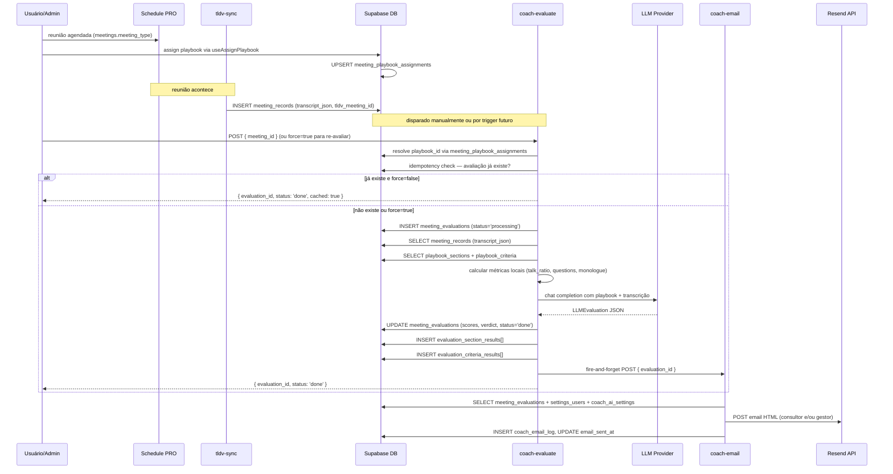
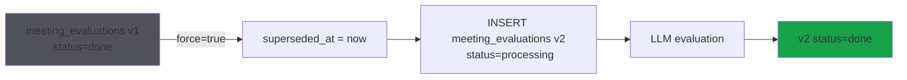
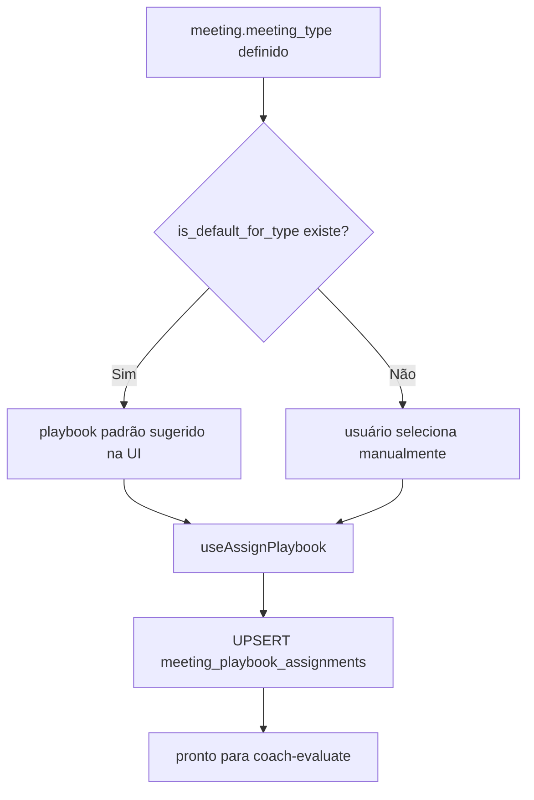

# Coach PRO

## 1. Visão e responsabilidade

Módulo de avaliação de qualidade de reuniões de consultoria/vendas por IA. Um gerente ou admin configura **playbooks** (critérios de avaliação estruturados por tipo de reunião). Quando uma reunião acontece e a transcrição chega (via tl;dv ou outro provedor), a edge function `coach-evaluate` lê o playbook atribuído, chama o LLM ativo e produz um scorecard com nota global, veredicto por critério, análise de risco do deal, pontos fortes/gaps e script de coaching. O resultado é enviado por email ao consultor e opcionalmente ao gestor.

**Responsabilidade exclusiva:** avaliação pós-reunião. Não agenda reuniões (isso é SCHEDULE PRO), não transcreve (isso é tl;dv via `tldv-sync`), não dispara WhatsApp.

**Estado:** módulo novo, schema criado inteiramente em 2026-04-22 (migrations `000000` a `000301`). Registrado como módulo `'coach'` em `settings_system_modules` com `is_active=true`.

---

## 2. Rotas e páginas

| Rota | Componente | Responsabilidade |
|---|---|---|
| `/coach` | [[../../../../../src/pages/CoachDashboard.tsx]] | Dashboard: métricas agregadas, avaliações recentes, filtro de período (7d/30d/90d) |
| `/coach/meeting/:meetingId` | [[../../../../../src/pages/CoachMeetingEvaluation.tsx]] | Scorecard completo de uma avaliação — score gauge, veredicto por critério, coaching script, histórico de re-avaliações, botão re-avaliar |
| `/coach/team` | [[../../../../../src/pages/CoachTeamBoard.tsx]] | Visão gerencial: ranking de consultores, trend de score, critério mais fraco |
| `/coach/consultant/:userId` | [[../../../../../src/pages/CoachConsultantProfile.tsx]] | Perfil individual: histórico de avaliações, score ao longo do tempo |

Módulo gateado por `ModuleProtectedRoute` com chave `'coach'` — invisível se `settings_system_modules.coach.is_active = false`.

---

## 3. Componentes principais

Ref: [[../../agents/ux/components]]

O módulo Coach não tem pasta dedicada em `src/components/coach/`. A UI é composta principalmente pelas páginas acima, usando primitivos `shadcn/ui` diretamente.

**Componentes de terceiros usados:**
- `Progress` (shadcn) — barra de score por seção
- `Tabs`, `TabsList`, `TabsContent` — abas no `CoachMeetingEvaluation` (Critérios / Coaching Script / Deal)
- `Badge` — veredicto (met/partial/not_met) e deal risk (low/medium/high)
- `ScoreGauge` — SVG semi-circular inline em `CoachMeetingEvaluation` (componente local, não extraído)

**Integração com SCHEDULE PRO:** `NegocioReunioes` (`src/components/negocios/NegocioReunioes.tsx`) exibe badge de avaliação inline para reuniões avaliadas, consultando `meeting_evaluations` diretamente (sem usar hooks do Coach PRO).

---

## 4. Hooks de dados

Todos em `src/hooks/`, TanStack Query.

| Hook | Arquivo | O que faz |
|---|---|---|
| `useCoachRecentEvaluations(limit)` | [[../../../../../src/hooks/useCoachEvaluations.ts]] | SELECT `coach_meeting_evaluations` (ver nota de tabela abaixo), join meetings, order by evaluated_at DESC, status='done'. staleTime 2min. |
| `useCoachEvaluation(evaluationId)` | [[../../../../../src/hooks/useCoachEvaluations.ts]] | Single evaluation com section_results + criterion_results + meeting. |
| `useCoachMeetingEvaluation(meetingId)` | [[../../../../../src/hooks/useCoachEvaluations.ts]] | Avaliação mais recente de uma reunião (order by evaluation_version DESC, limit 1). |
| `useCoachDashboardMetrics(period)` | [[../../../../../src/hooks/useCoachEvaluations.ts]] | Métricas agregadas: avg_score, total_done, pending, deal_risk counts. |
| `useCoachReEvaluateMeeting` | [[../../../../../src/hooks/useCoachEvaluations.ts]] | Mutation — chama `coach-evaluate` com `force=true`. |
| `usePlaybooksForAssignment` | [[../../../../../src/hooks/useCoachMeetingAssignment.ts]] | SELECT `playbooks` ativos, para dropdown de atribuição. |
| `useMeetingPlaybookAssignment(meetingId)` | [[../../../../../src/hooks/useCoachMeetingAssignment.ts]] | SELECT `meeting_playbook_assignments` join playbooks. |
| `useAssignPlaybook` | [[../../../../../src/hooks/useCoachMeetingAssignment.ts]] | Mutation — UPSERT `meeting_playbook_assignments`. |
| `useMeetingEvaluationStatus(meetingId)` | [[../../../../../src/hooks/useCoachMeetingAssignment.ts]] | SELECT `meeting_evaluations` status para badge inline. |
| `usePlaybookTemplates` | [[../../../../../src/hooks/useCoachPlaybooks.ts]] | SELECT `playbook_templates` (sistema). |
| `usePlaybooks` | [[../../../../../src/hooks/useCoachPlaybooks.ts]] | SELECT `playbooks` ativos com sections + criteria nested. |
| `useCreatePlaybook` | [[../../../../../src/hooks/useCoachPlaybooks.ts]] | INSERT `playbooks` a partir de um template ou em branco. |
| `useUpdatePlaybook` / `useDeletePlaybook` | [[../../../../../src/hooks/useCoachPlaybooks.ts]] | UPDATE/DELETE `playbooks`. |
| `useCreatePlaybookSection` / `useUpdatePlaybookSection` / `useDeletePlaybookSection` | [[../../../../../src/hooks/useCoachPlaybooks.ts]] | CRUD `playbook_sections`. |
| `useCreatePlaybookCriterion` / `useUpdatePlaybookCriterion` / `useDeletePlaybookCriterion` | [[../../../../../src/hooks/useCoachPlaybooks.ts]] | CRUD `playbook_criteria`. |
| `useCoachAiSettings` | [[../../../../../src/hooks/useCoachPlaybooks.ts]] | SELECT `coach_ai_settings` (singleton). |
| `useUpdateCoachAiSettings` | [[../../../../../src/hooks/useCoachPlaybooks.ts]] | UPDATE `coach_ai_settings`. |
| `useCoachTeamMetrics(period)` | [[../../../../../src/hooks/useCoachTeam.ts]] | Métricas por consultor: avg_score, trend, critério mais fraco/forte. Faz 4 queries paralelas. |
| `useCoachConsultantDetail(userId, period)` | [[../../../../../src/hooks/useCoachTeam.ts]] | Detalhe de um consultor: histórico de avaliações + score_history. |

**Nota importante — inconsistência de nomes de tabela:**

`useCoachTeam.ts` e `useCoachEvaluations.ts` consultam `coach_meeting_evaluations`, mas a migration criou a tabela como `meeting_evaluations`. Isso indica que provavelmente existe uma **view** `coach_meeting_evaluations` que aliasa `meeting_evaluations` (não encontrada nas migrations disponíveis — pode ter sido criada manualmente ou em migration não listada). `useCoachMeetingAssignment.ts` usa `meeting_evaluations` diretamente. A inconsistência causa erro em runtime se a view não existir.

---

## 5. Edge functions

| Função | verify_jwt | Responsabilidade |
|---|---|---|
| `coach-evaluate` | false (no-verify) | Motor de avaliação principal. Fluxo de 10 passos (ver seção 7). Chama LLM, persiste resultados, dispara `coach-email` fire-and-forget. |
| `coach-email` | false (no-verify) | Envia email de coaching via **Resend API**. HTML formatado com scorecard, strengths, gaps, next_steps. Envia para consultor e/ou gestor conforme `coach_ai_settings`. |

**Env vars necessárias:**
- `SUPABASE_URL`, `SUPABASE_SERVICE_ROLE_KEY` (ambas)
- `RESEND_API_KEY` (coach-email)
- `SITE_URL` (coach-email — link para o scorecard)

Ambas as funções usam `--no-verify-jwt` (chamadas internas ou de pg_cron futuro). Autenticação é validada via service_role internamente.

---

## 6. Schema e tabelas

Ref completo: [[../../agents/data-engineer/schema]]

Todas as tabelas criadas em 2026-04-22.

### `playbook_templates`
Templates de sistema — read-only para tenants.

| Coluna | Tipo | Notas |
|---|---|---|
| id | uuid PK | |
| name | text | Ex: "Sales Playbook Standard" |
| type | text | sales/consulting/mentoring/cs/custom |
| description | text | nullable |
| icon / color | text | nullable — decorativo |
| is_system | boolean | DEFAULT true — tenants não podem editar |
| display_order | int | ordem na UI |

**RLS:** `playbook_templates_select` — SELECT para authenticated, sem escrita.

Seed inicial: `20260422000200_coach_seed_playbooks.sql` — popula templates de sistema.

### `playbooks`
Playbooks editáveis por tenant (criados a partir de templates ou do zero).

| Coluna | Tipo | Notas |
|---|---|---|
| id | uuid PK | |
| name | text | |
| type | text | sales/consulting/mentoring/cs/custom |
| parent_template_id | uuid | FK → playbook_templates ON DELETE SET NULL |
| is_active | boolean | DEFAULT true |
| is_default_for_type | boolean | playbook padrão para este tipo de reunião |
| created_by | uuid | FK → settings_users ON DELETE SET NULL |

**RLS:** `playbooks_all` — authenticated full CRUD.  
**Índice:** `idx_playbooks_type_active` (type) WHERE is_active = true.

### `playbook_sections`
Seções de um playbook (ex: "Abertura", "Descoberta", "Proposta").

| Coluna | Tipo | Notas |
|---|---|---|
| id | uuid PK | |
| playbook_id | uuid | FK → playbooks ON DELETE CASCADE |
| title | text | |
| description | text | nullable |
| weight | NUMERIC(5,2) | DEFAULT 20.0 — peso na nota final |
| display_order | int | |

**RLS:** `playbook_sections_all`.

### `playbook_criteria`
Critérios individuais dentro de uma seção.

| Coluna | Tipo | Notas |
|---|---|---|
| id | uuid PK | |
| section_id | uuid | FK → playbook_sections ON DELETE CASCADE |
| title | text | Ex: "Identificou dor principal" |
| description | text | nullable |
| weight | NUMERIC(5,2) | DEFAULT 1.0 |
| detection_hints | text[] | pistas para o LLM detectar este critério |
| example_good / example_bad | text | exemplos positivo/negativo |
| is_required | boolean | DEFAULT false |
| display_order | int | |

**RLS:** `playbook_criteria_all`.

### `meeting_playbook_assignments`
Atribuição 1:1 meeting → playbook.

| Coluna | Tipo | Notas |
|---|---|---|
| id | uuid PK | |
| meeting_id | uuid | NOT NULL, FK → meetings ON DELETE CASCADE, UNIQUE |
| playbook_id | uuid | NOT NULL, FK → playbooks ON DELETE RESTRICT |
| assigned_at | timestamptz | DEFAULT now() |
| assigned_by | uuid | FK → settings_users ON DELETE SET NULL |

**Constraint:** UNIQUE (meeting_id) — cada reunião tem no máximo 1 playbook atribuído.

### `meeting_evaluations`

| Coluna | Tipo | Notas |
|---|---|---|
| id | uuid PK | |
| meeting_id | uuid | NOT NULL, FK → meetings |
| playbook_id | uuid | NOT NULL, FK → playbooks |
| evaluation_version | int | DEFAULT 1 — incrementado em re-avaliações |
| superseded_at | timestamptz | NULL = versão ativa; preenchido quando re-avaliação substitui |
| status | text | pending/processing/done/failed |
| triggered_by | text | auto/manual |
| model_used / provider_used / prompt_version | text | auditoria de IA |
| overall_score | NUMERIC(4,2) | 0.0–10.0 |
| overall_verdict | text | excellent/good/needs_improvement/critical |
| talk_ratio_consultant / talk_ratio_client | NUMERIC(4,1) | % de fala calculado localmente |
| questions_total / questions_open | int | métricas locais |
| monologue_longest_sec | int | maior monólogo detectado |
| competitors_mentioned | text[] | menções a concorrentes |
| deal_risk | text | low/medium/high |
| sentiment_arc | jsonb | arco de sentimento ao longo da reunião |
| strengths / gaps / next_steps | text[] | gerados pelo LLM |
| coaching_script | text | script de coaching gerado |
| follow_up_agenda | text | agenda sugerida |
| evaluated_at | timestamptz | quando a avaliação foi concluída |
| email_sent_at | timestamptz | quando o email foi enviado |

**RLS:** `meeting_evaluations_all` (authenticated).  
**Índices:** por meeting_id, created_at DESC, status (pending/processing), (meeting_id, playbook_id) WHERE superseded_at IS NULL (versão ativa).

**Nota:** Alguns hooks consultam esta tabela como `coach_meeting_evaluations`. Ver débito técnico na seção 9.

### `evaluation_section_results`
Nota por seção do playbook para uma avaliação.

| Coluna | Tipo | |
|---|---|---|
| evaluation_id | uuid | FK → meeting_evaluations CASCADE |
| section_id | uuid | FK → playbook_sections RESTRICT |
| score | NUMERIC(4,2) | |
| summary | text | |
UNIQUE (evaluation_id, section_id).

### `evaluation_criteria_results`
Veredicto por critério.

| Coluna | Tipo | |
|---|---|---|
| evaluation_id | uuid | FK → meeting_evaluations CASCADE |
| criterion_id | uuid | FK → playbook_criteria RESTRICT |
| verdict | text | met/partial/not_met |
| confidence | NUMERIC(4,1) | 0.0–10.0 |
| score | NUMERIC(4,2) | |
| quote | text | trecho da transcrição |
| quote_start_sec | int | segundo do trecho |
| coaching_tip | text | dica específica |
UNIQUE (evaluation_id, criterion_id).

### `coach_email_log`
Log de emails enviados.

| Coluna | Tipo | |
|---|---|---|
| evaluation_id | uuid | FK → meeting_evaluations CASCADE |
| recipient_email | text | |
| recipient_type | text | consultant/manager |
| subject | text | |
| status | text | pending/sent/failed |
| error | text | nullable |

### `coach_ai_settings`
Singleton de configuração do módulo.

| Coluna | Tipo | Notas |
|---|---|---|
| id | uuid PK | apenas 1 row por instância |
| business_context | text | contexto do negócio para o LLM |
| email_auto_send | boolean | DEFAULT true |
| email_consultant | boolean | DEFAULT true |
| email_manager | boolean | DEFAULT true |
| email_manager_threshold | NUMERIC(3,1) | nota mínima para enviar ao gestor |
| manager_user_id | uuid | FK → settings_users |
| weekly_summary_enabled | boolean | DEFAULT false |
| weekly_summary_day | int | 0–6 (dia da semana) |
| weekly_summary_hour | int | 0–23 (hora UTC) |

Seed: `INSERT INTO coach_ai_settings DEFAULT VALUES ON CONFLICT DO NOTHING` — garante que sempre existe 1 row.

### View: `v_coaching_insights`
View usada pelo `bi-insights-chat` para injetar contexto de coaching.
Filtra `meeting_evaluations WHERE status='done' AND superseded_at IS NULL`.
Joins: meetings, playbooks, settings_users.
Grant: SELECT para authenticated e service_role.

---

## 7. Fluxos críticos

### 7.1 Ciclo completo de avaliação

### 7.2 Re-avaliação (versionamento)

Apenas a avaliação com `superseded_at IS NULL` é a ativa. As anteriores são preservadas para histórico.

### 7.3 Atribuição de playbook a reunião

---

## 8. Integrações externas

| Sistema | Como integra | Onde |
|---|---|---|
| **tl;dv** | `tldv-sync` popula `meeting_records.transcript_json` com array de segmentos `{speaker, text, startTime}`. `coach-evaluate` lê este campo. | Migration `20260421180000` |
| **LLM ativo** | `coach-evaluate` usa `_shared/llm-provider.ts` → `getActiveProvider()` → chama o provider configurado em `settings_ai_providers` (OpenAI, Anthropic, Gemini, etc.) | `supabase/functions/_shared/llm-provider.ts` |
| **Resend** | `coach-email` usa SDK `resend@4.0.0` via `esm.sh`. Requer `RESEND_API_KEY` env var. | `supabase/functions/coach-email/index.ts` |
| **BI PRO Insights** | `v_coaching_insights` view é consultada por `bi-insights-chat` para responder perguntas sobre performance de consultores. | Migration `20260422000300` |
| **CRM PRO** | `NegocioReunioes` exibe badge de avaliação ao lado de cada reunião do negócio. | `src/components/negocios/NegocioReunioes.tsx:74` |

---

## 9. Estado atual e débito técnico

### Inconsistência de nomes de tabela (alto risco de runtime error)

Dois conjuntos de hooks usam nomes diferentes para a mesma tabela:

| Hook | Tabela consultada | Status |
|---|---|---|
| `useCoachEvaluations.ts` | `coach_meeting_evaluations` | Potencialmente quebrado se a view não existir |
| `useCoachTeam.ts` | `coach_meeting_evaluations` | Idem |
| `useCoachMeetingAssignment.ts` | `meeting_evaluations` | Correto (tabela real) |
| `NegocioReunioes.tsx` | `meeting_evaluations` | Correto |

A migration `20260422000100` criou `meeting_evaluations`. Se `coach_meeting_evaluations` é uma view, ela não aparece nas migrations conhecidas. **Verificar se existe manualmente na DB ou se há migration não incluída no repositório.**

Ação: unificar todos os hooks para usar `meeting_evaluations` diretamente, ou criar view e adicionar migration.

### Trigger de avaliação não automatizado

Atualmente `coach-evaluate` é chamado manualmente pelo usuário (botão "Avaliar" na UI). Não há pg_cron nem trigger automático quando `meeting_records` recebe nova transcrição. Isso significa que reuniões ficam sem avaliação até alguém clicar.

Ação candidata: trigger em `meeting_records` (AFTER INSERT/UPDATE de `transcript_json`) que chama `coach-evaluate` via `pg_net`.

### `coach_ai_settings` sem tenant_id

A tabela `coach_ai_settings` não tem `tenant_id` — é singleton absoluto por projeto Supabase. No modelo project-per-tenant isso é aceitável, mas impede multi-tenancy num projeto compartilhado.

### Email sem queue/retry

`coach-email` é chamado fire-and-forget. Se falhar, `coach_email_log.status='failed'` mas não há retry automático. Para produção, considerar enfileirar em `meeting_followup_queue` ou similar.

---

## 10. Stories candidatas / ADRs relevantes

**Stories candidatas:**
- `[P0]` Investigar e corrigir inconsistência `coach_meeting_evaluations` vs `meeting_evaluations` — criar view ou unificar hooks
- `[P1]` Automação de avaliação: trigger `meeting_records → coach-evaluate` via pg_net após inserção de transcrição
- `[P1]` Retry automático para `coach_email_log` failures
- `[P2]` Playbook editor completo na UI (drag-and-drop de seções/critérios, preview do prompt gerado)
- `[P2]` Weekly coaching summary: `coach_ai_settings.weekly_summary_enabled` existe mas o cron ainda não foi implementado
- `[P3]` tenant_id em `coach_ai_settings` para suporte a multi-tenant num projeto compartilhado

**ADRs relacionados:**
- Nenhum ADR formal criado para o Coach PRO ainda. Candidatos:
  - ADR-CP-01: versionamento de avaliações (superseded_at vs DELETE) — decisão de auditabilidade
  - ADR-CP-02: fire-and-forget vs queue para coach-email
