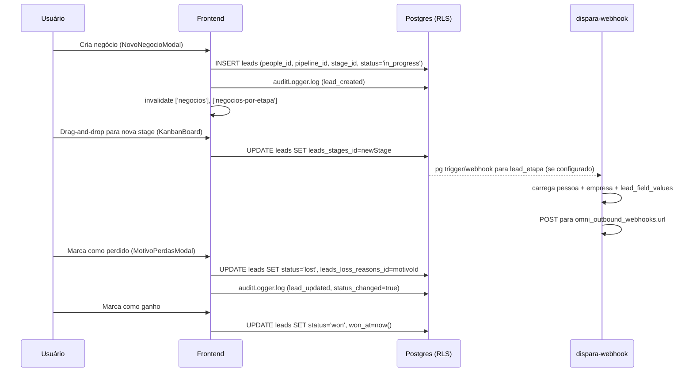
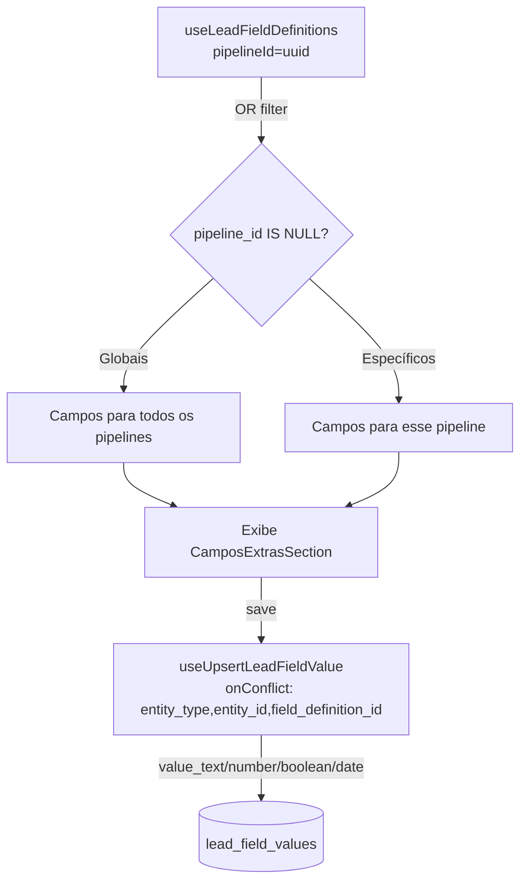
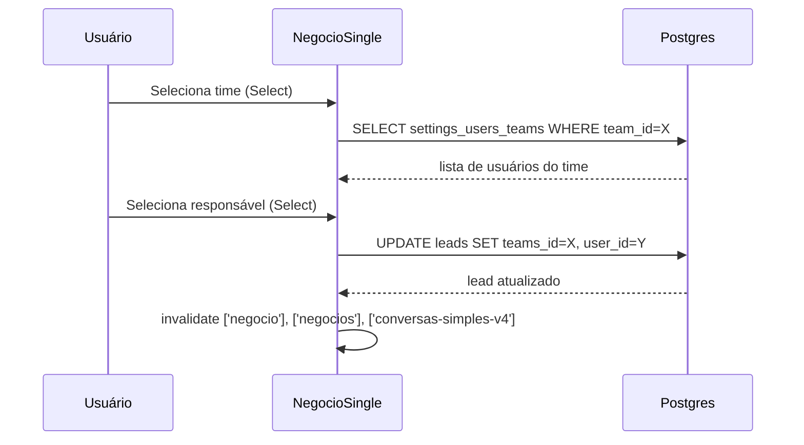

# CRM PRO — Deep-dive

## 1. Visão e responsabilidade

CRM PRO é o núcleo do produto. Gerencia pipelines de vendas (Kanban + lista), contatos (`clients_people`), empresas (`clients_companies`), e o ciclo de vida completo de um lead/negócio. Serve como ancoragem central para os demais módulos: OMNI PRO posta mensagens em leads, SCHEDULE PRO anota reuniões em leads, COACH PRO avalia meetings de leads, BI PRO agrega KPIs dos leads, SENDS PRO filtra leads para disparos.

**Responsabilidades exclusivas:**
- Gestão de pipelines e stages (leads_pipelines / leads_stages)
- Ciclo de vida do lead: criação → atribuição → movimentação de stage → fechamento (ganho/perdido)
- Campos personalizados hierárquicos (lead_field_definitions + lead_field_values) por entidade: negocio, pessoa, empresa
- Atribuição de leads a usuários e times (leads.user_id, leads.teams_id)
- Sidebar de negócio com tabs: Conversa, Notas, Arquivos, Análise IA, Reuniões, Score
- Gestão de contatos (Clientes.tsx) com views: Pessoas e Empresas paginadas

---

## 2. Rotas e páginas

| Rota | Page | Responsabilidade |
|---|---|---|
| `/crm/kanban` | [[../../../../src/pages/Negocios.tsx]] | View padrão Kanban — pipeline selecionado persiste em `localStorage` |
| `/crm/list` | [[../../../../src/pages/Negocios.tsx]] | Mesma page, `viewMode='list'` detectado da URL |
| `/crm/clients` | [[../../../../src/pages/Negocios.tsx]] | Mesma page, `viewMode='clientes'` — renderiza `<Clientes />` inline |
| `/crm/kanban/:id` | [[../../../../src/pages/NegocioSingle.tsx]] | Detalhe de um negócio/lead com todas as tabs |
| `/crm/clients/:id` | [[../../../../src/pages/Clientes.tsx]] | Detalhe de pessoa ou empresa (via `useNavigate`) |

**Detalhes de Negocios.tsx:**
- Lê `viewMode` da URL (`/crm/kanban` → kanban, `/crm/list` → list, `/crm/clients` → clientes)
- Pipeline filter persiste em `localStorage('negocios_pipeline_filter')`
- Usa `useNegociosPipeline` (otimizado, com Realtime inline por canal `leads-pipeline-{pipelineId}`)
- Suporta filtros: status, usuário, time, data, score_matrix, utm_campaign

**NegocioSingle.tsx — imports-chave:**
- `useNegocio(id)` — query do lead com JOINs em clients_people, clients_companies, leads_pipelines, leads_stages
- `usePipelines()` — pipelines + stages para o seletor de etapa
- `useTimesWithMethods()` + `useUsuarios()` — atribuição de time/responsável
- `useMotivosPerda()` — modal de motivo de perda ao marcar como perdido
- `useEstatisticasMensagens(negocio?.people_id)` — stats de mensagens da pessoa
- `useUpdatePessoa()` — edição inline de campos da pessoa associada
- `useDeleteLead()` — soft-delete do lead com ConfirmarExclusaoModal

**Clientes.tsx — hooks:**
- `usePessoasPaginadas(PessoasFilters)` — paginação server-side de pessoas
- `useCompaniesPaginated()` — paginação de empresas
- `useDeletarPessoa()`, `useArquivarPessoa()`, `useDesarquivarPessoa()`
- `useDeleteCompany()`, `useCompanyAssociations()`
- Tabs: Pessoas | Empresas — com busca debounced e filtro por status

---

## 3. Componentes principais

Todos em [[../../../../src/components/negocios/]] e [[../../../../src/components/pessoas/]] (ref: [[../../agents/ux/components]]).

| Componente | Arquivo | Responsabilidade |
|---|---|---|
| `KanbanBoard` | `negocios/KanbanBoard.tsx` | Drag-and-drop (@hello-pangea/dnd) — agrupa por stage, colunas de `StageColumn` |
| `StageColumn` | `negocios/StageColumn.tsx` | Coluna de stage com cards de negócios, total de valor |
| `NegociosList` | `negocios/NegociosList.tsx` | View lista alternativa ao kanban |
| `NegociosToolbar` | `negocios/NegociosToolbar.tsx` | Filtros (pipeline, status, usuário, time, data, campanha) + toggle kanban/lista/clientes |
| `NovoNegocioModal` | `negocios/NovoNegocioModal.tsx` | Modal criação de negócio — seleciona pessoa, pipeline, stage |
| `NegocioSidebar` | `negocios/NegocioSidebar.tsx` | Painel lateral do NegocioSingle (dados da pessoa, empresa, score, análise IA) |
| `NegocioConversa` | `negocios/NegocioConversa.tsx` | Tab "Conversa" — histórico de mensagens + input |
| `NegocioNotas` | `negocios/NegocioNotas.tsx` | Tab "Notas" — CRUD de notas do lead |
| `NegocioArquivos` | `negocios/NegocioArquivos.tsx` | Tab "Arquivos" — upload + lista de arquivos |
| `NegocioReunioes` | `negocios/NegocioReunioes.tsx` | Tab "Reuniões" — lista de meetings do lead |
| `NegocioScoreSection` | `negocios/NegocioScoreSection.tsx` | Exibe score da pessoa associada ao negócio |
| `NegocioAnalise` | `negocios/NegocioAnalise.tsx` | Tab "Análise IA" — Q-fields de qualificação (Q1-Q25) |
| `QualificacaoIASection` | `negocios/QualificacaoIASection.tsx` | Sub-seção de qualificação IA dentro da análise |
| `CamposExtrasSection` | `negocios/CamposExtrasSection.tsx` | Campos personalizados do negócio (lead_field_values entity_type='negocio') |
| `MotivoPerdasModal` | `negocios/MotivoPerdasModal.tsx` | Modal para selecionar motivo ao perder negócio |
| `ExtraFieldsCard` | `pessoas/ExtraFieldsCard.tsx` | Campos extras de pessoa (entity_type='pessoa') |
| `CompanyExtraFieldsCard` | `pessoas/CompanyExtraFieldsCard.tsx` | Campos extras de empresa (entity_type='empresa') |

**Modais compartilhados** (em [[../../../../src/components/modals/]]):
- `NovaPessoaModal`, `EditarPessoaModal`, `ArquivarPessoaModal`, `ExcluirPessoaModal`
- `NovaEmpresaModal`, `EditarEmpresaModal`
- `MergeContactModal`, `MergeLeadsModal`
- `ConfirmarExclusaoModal`

---

## 4. Hooks de dados

Lista exaustiva dos hooks do domínio CRM:

| Hook | Arquivo | Query key | Propósito |
|---|---|---|---|
| `useNegocios()` | `useNegocios.ts` | `['negocios']` | Lista completa de leads com JOINs (clients_people, pipeline, stage) |
| `useNegociosDefinitive()` | `useNegocios.ts` | `['negocios-definitive']` | Alias definitivo, mesma query |
| `useNegocio(id)` | `useNegocios.ts` | `['negocio', id]` | Lead único com JOINs completos + Q1-Q25 + disc_profile; `staleTime: 0` |
| `useNegociosPorEtapa(stageId, filters)` | `useNegocios.ts` | `['negocios-por-etapa', stageId, filters]` | Leads por stage com filtros inline |
| `useUpdateNegocio()` | `useNegocios.ts` | mutation | Update de lead (mapeia português→inglês: `controle→control`, `titulo→title`) |
| `useCriarNegocio(cb)` | `useNegocios.ts` | mutation | Criação com auditLogger; mapeia aliases de compatibilidade |
| `useNegociosPipeline(pipelineId, filters)` | `useNegociosOptimized.ts` | `['negocios-pipeline', pipelineId, filters]` | Query otimizada com realtime inline; usada no Kanban |
| `useNegociosPaginados()` | `useNegociosPaginados.ts` | `['negocios-paginados', ...]` | Paginação para view lista |
| `usePessoas(_tenantId?)` | `usePessoas.ts` | `['pessoas']` | Lista clientes_people não-archived, mapeado para shape legado |
| `usePessoasReal()` | `usePessoasReal.ts` | `['pessoas-real']` | Shape moderno de clients_people |
| `usePessoasPaginadas(filters)` | `usePessoasPaginadas.ts` | `['pessoas-paginadas', filters]` | Paginação server-side com filtros (nome, email, whatsapp, status) |
| `useUpdatePessoa()` | `usePessoasReal.ts` | mutation | Atualiza clients_people; invalida `['pessoas']` e `['negocio']` |
| `useDeletarPessoa()` | `useDeletarPessoa.ts` | mutation | Delete de pessoa |
| `useArquivarPessoa()` | `useArquivarPessoa.ts` | mutation | Status → 'archived' |
| `useDesarquivarPessoa()` | `useDesarquivarPessoa.ts` | mutation | Status → 'active' |
| `useCompanies()` | `useCompanies.ts` | `['companies']` | Lista de clients_companies |
| `useCompaniesPaginated()` | `useCompaniesPaginated.ts` | `['companies-paginated', ...]` | Paginação de empresas |
| `useDeleteCompany()` | `useCompanies.ts` | mutation | Delete empresa |
| `useCompanyAssociations(companyId)` | `useCompanyAssociations.ts` | `['company-associations', id]` | Pessoas associadas a uma empresa |
| `useLeads(filters?)` | `useLeads.ts` | `['leads', filters]` | Query simples de leads, sem JOINs, para filtros básicos |
| `useLead(id)` | `useLeads.ts` | `['lead', id]` | Lead único sem JOINs |
| `useCreateLead()` | `useLeads.ts` | mutation | useMutation clássico |
| `useUpdateLead()` | `useLeads.ts` | mutation | useMutation clássico |
| `useDeleteLead()` | `useLeads.ts` | mutation | Delete de lead |
| `useLeadsUpdates(leadId)` | `useLeads.ts` | `['leads-updates', leadId]` | Histórico de mudanças do lead (leads_updates) |
| `useLeadsPipelines()` | `useLeadsPipelines.ts` | `['leads-pipelines']` | Pipelines ativos (leads_pipelines) |
| `useLeadsStages(pipelineId?)` | `useLeadsPipelines.ts` | `['leads-stages', pipelineId]` | Stages ativos, filtrados por pipeline |
| `usePipelines()` | `usePipelines.ts` | composição | Wrapper que combina `usePipelinesReal` + `useStages` + mutations; retorna aliases PT |
| `useLeadFieldDefinitions(pipelineId?)` | `useLeadFieldDefinitions.ts` | `['lead_field_definitions', 'active', 'negocio', pipelineId]` | Definições de campos ativos para negócio — inclui globais (pipeline_id IS NULL) + específicos do pipeline |
| `useLeadFieldDefinitionsByEntity(entityType, pipelineId?, category?)` | `useLeadFieldDefinitions.ts` | `['lead_field_definitions', 'active', entityType, ...]` | Definições para qualquer entidade + filtro por categoria |
| `useAllLeadFieldDefinitions()` | `useLeadFieldDefinitions.ts` | `['lead_field_definitions', 'all']` | Todas as definições (config pages) |
| `useLeadFieldValues(leadId)` | `useLeadFieldValues.ts` | `['lead_field_values', 'negocio', leadId]` | Valores dos campos de um negócio |
| `useLeadFieldValuesByEntity(entityType, entityId)` | `useLeadFieldValues.ts` | `['lead_field_values', entityType, entityId]` | Valores de qualquer entidade |
| `useUpsertLeadFieldValue()` | `useLeadFieldValues.ts` | mutation | Upsert por `(entity_type, entity_id, field_definition_id)` — roteia valor para coluna correta (value_text/number/boolean/date) |
| `useMotivosPerda(tenantId?)` | `useMotivosPerda.ts` | estado local (useState) | Motivos de perda de leads_loss_reasons — **não usa TanStack Query** |
| `useTimesDisponiveis()` | `useAtribuicaoNegocio.ts` | `['times-disponiveis']` | Times ativos de settings_teams |
| `useUsuariosPorTime(timeId?)` | `useAtribuicaoNegocio.ts` | `['usuarios-por-time', timeId]` | Usuários de um time via settings_users_teams |
| `useAtualizarAtribuicao()` | `useAtribuicaoNegocio.ts` | mutation | Atualiza leads.user_id e leads.teams_id; invalida conversas também |

**Anomalia:** `useMotivosPerda` usa `useState + useEffect` manual em vez de TanStack Query — potencial inconsistência de cache.

---

## 5. Edge functions

O CRM PRO não possui edge functions próprias além do `dispara-webhook` (compartilhado). A lógica de negócio é toda via Supabase REST/RLS.

| Função | verify_jwt | Responsabilidade |
|---|---|---|
| `dispara-webhook` | true | Dispara webhooks de evento para eventos `lead_etapa` — chamado quando lead muda de stage. Carrega lead + pessoa + empresa + lead_field_values + field_definitions e envia payload enriquecido para a URL configurada em `omni_outbound_webhooks`. |
| `followup-enqueue` | default | Enfileira followup para um lead ao atingir trigger de stage ou status de agendamento |
| `followup-trigger-worker` | default | Worker que processa a fila `followup-trigger-worker` e dispara mensagens |
| `followup-status-callback` | default | Callback de status de followup |

**Nota:** AI Agent (`ai-agent-execute`) usa leads como contexto mas é responsabilidade do OMNI PRO.

---

## 6. Schema e tabelas

Ref: [[../../agents/data-engineer/schema]]

### Split legado vs. moderno

O CRM PRO opera num **split de schema documentado**:

| Schema legado (`crm_*`) | Schema moderno |
|---|---|
| `crm_pessoas` | `clients_people` |
| `crm_empresas` | `clients_companies` |
| `crm_leads` | `leads` |
| `crm_pipelines` | `leads_pipelines` |
| `crm_stages` | `leads_stages` |
| `crm_messages` | `messages` |
| `crm_motivo_perda` | `leads_loss_reasons` |
| `crm_negocio_notas` | `leads_notes` |
| `crm_negocio_arquivos` | `leads_files` |

**A SPA usa exclusivamente o schema moderno.** O schema legado (`crm_*`) permanece no banco por compatibilidade com migrações antigas e possivelmente para uso do `ai-agent-execute` que pode referenciar ambos. Ver `supabase/manual-fixes/cleanup_crm_modules.sql` para histórico de limpeza.

### Tabelas principais em uso ativo

**`leads`** — lead/negócio moderno
- `people_id` → `clients_people` (FK `leads_people_id_fkey`)
- `leads_pipelines_id` → `leads_pipelines` (FK `leads_leads_pipelines_id_fkey`)
- `leads_stages_id` → `leads_stages` (FK `leads_leads_stages_id_fkey`)
- `user_id` → `settings_users` (responsável individual)
- `teams_id` → `settings_teams` (responsável por time)
- `leads_loss_reasons_id` → `leads_loss_reasons`
- `status` enum: `in_progress | won | lost`
- Campos UTM: `utm_source, utm_medium, utm_campaign, utm_term, utm_content, gclid, fbclid, fb_lead_id`

**`lead_field_definitions`** — definições de campos customizáveis
- `entity_type`: `negocio | pessoa | empresa`
- `category`: `qualificacao | contato | comercial | custom | outros`
- `pipeline_id` nullable — NULL = campo global; preenchido = campo específico do pipeline
- `type`: `texto | numero | data | select | boolean | textarea`
- `order_index` — ordenação

**`lead_field_values`** — valores dos campos
- UNIQUE por `(entity_type, entity_id, field_definition_id)`
- Colunas de valor polimórficas: `value_text`, `value_number`, `value_boolean`, `value_date`
- `lead_id` nullable — preenchido apenas quando `entity_type = 'negocio'`

### RLS Strategy

Schema moderno usa `get_current_user_tenant_id()` e `user_has_tenant_access(uuid)` (SECURITY DEFINER). Schema legado usa `current_setting('app.current_tenant_id')`. As duas estratégias coexistem no mesmo tenant.

---

## 7. Fluxos críticos

### 7.1 Lifecycle de um lead (criação → fechamento)

### 7.2 Lead Field Values (campos hierárquicos)

### 7.3 Atribuição de time e responsável

**Nota:** Não existe round-robin automático no frontend. A lógica de atribuição automática seria responsabilidade de uma edge function ou trigger não identificado na codebase atual.

---

## 8. Integrações externas

| Módulo | Ponto de integração |
|---|---|
| **OMNI PRO** | Leads possuem `crm_messages` / `messages` associados; NegocioConversa.tsx exibe histórico |
| **SCHEDULE PRO** | `meetings.lead_id` → `leads`; NegocioReunioes.tsx exibe meetings do lead |
| **COACH PRO** | `meeting_evaluations` via meetings ligados ao lead |
| **SENDS PRO** | `filter-leads-for-send` filtra `clients_people` JOINando `leads` |
| **FORM PRO** | `lp-submit` cria leads automaticamente ao submeter formulário |
| **BI PRO** | `get_insights_context()` agrega leads, stages, pessoas para KPIs |
| **FOLLOW-UPS** | `followup-enqueue` é acionado por stages e agendamentos de leads |
| **dispara-webhook** | Disparado em mudanças de stage com payload enriquecido do lead |

---

## 9. Estado atual e débito técnico

| Item | Severidade | Descrição |
|---|---|---|
| **Split de schema legado/moderno** | Alta | Duas hierarquias paralelas (`crm_*` e schema moderno). SPA usa apenas moderna, mas migrações e possíveis edge functions ainda referenciam `crm_*`. Risco de drift. |
| **useMotivosPerda sem TanStack Query** | Média | Hook usa `useState + useEffect` manual — fora do padrão do projeto. Sem cache compartilhado, buscas redundantes. |
| **aliases PT/EN em useNegocios** | Média | Campos duplicados (`titulo/title`, `valor/value`, `controle/control`) por compatibilidade com código legado. Aumenta superfície de bugs. |
| **Sem round-robin automático** | Média | Atribuição de leads é manual. Não há edge function de round-robin identificada. |
| **Realtime no KanbanBoard via canal por pipeline** | Baixa | `useNegociosPipeline` subscreve canal Supabase por pipeline (`leads-pipeline-{id}`). Múltiplos pipelines abertos = múltiplos canais. |
| **useNegocio com staleTime: 0** | Baixa | NegocioSingle sempre re-busca ao montar — garante frescor mas aumenta número de requisições. |
| **crm_messages vs messages** | Alta | Duas tabelas de mensagens paralelas. `NegocioConversa` pode estar usando uma enquanto OMNI usa outra, gerando inconsistência visual. |

---

## 10. Stories candidatas / ADRs relevantes

**Stories candidatas:**
- Atribuição automática round-robin de leads por time/pipeline
- Migração definitiva do schema legado (`crm_*`) para moderno — remoção de aliases e simplificação dos hooks
- Refatorar `useMotivosPerda` para TanStack Query (padrão do projeto)
- Realtime granular por negócio individual no NegocioSingle (eliminar `staleTime: 0`)
- Consolidar `crm_messages` + `messages` em tabela única

**ADRs relevantes:**
- [[../../decisions/ADR-PP-03-server-verified-tenant-id]] — `get_current_user_tenant_id()` como mecanismo de tenant isolation no schema moderno
- [[../../decisions/ADR-PP-01-prospect-v1-deprecation]] — padrão de deprecação de schema legado (aplicável ao crm_*)
