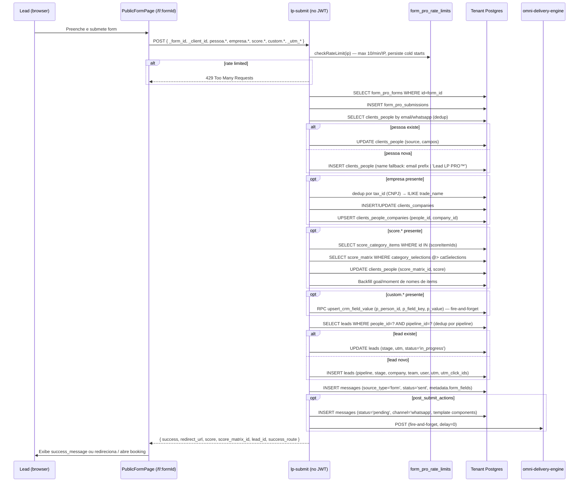
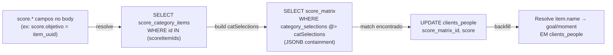

# FORM PRO™ — Landing Pages & Formulários (form-pro-lp)

## 1. Visão e responsabilidade

FORM PRO™ é o módulo de captura de leads. Permite criar formulários de conversão em dois sabores:

1. **Site forms** — formulários hospedados no rev-os, embutidos em `/f/:formId` (rota pública) ou como widget flutuante (FAB). O builder vive em `/lp`.
2. **Meta Lead Ads forms** — integração com Facebook/Instagram Lead Ads: mapeia campos do formulário Meta para campos CRM do tenant.

**Quem usa:** gestores de marketing que criam formulários, leads externos que os preenchem via LP pública. **Valor de negócio:** cada submissão cria automaticamente um contato (`clients_people`) + empresa + lead no pipeline CRM + dispara mensagens de bienvenida via OMNI, sem intervenção manual.

---

## 2. Rotas e páginas

| Rota | Componente | Auth |
|---|---|---|
| `/lp` | [[../../../../src/pages/LpPro.tsx]] | `ModuleProtectedRoute(lp)` |
| `/f/:formId` | `PublicFormPage` (rota pública) | nenhuma |

`LpPro.tsx` tem duas abas internas:
- **forms** — lista de formulários site + formulários Meta Lead Ads
- **log-envios** — não implementado (placeholder visível no código)

A rota `/f/:formId` renderiza o formulário público. Internamente chama `lp-submit` ao submeter.

---

## 3. Componentes principais

Ver [[../../agents/ux/components]] seção `lp/`.

Todos vivem em [[../../../../src/components/lp/]]:

| Componente | Responsabilidade |
|---|---|
| `LpFormBuilder.tsx` | Wrapper principal do builder — orquestra as sub-abas (Campos, Estilo, Configurações, Preview, Simulação, Submissões) |
| `FormBuilderSortable.tsx` | Lista de campos com drag-and-drop (dnd-kit) para reordenar |
| `FormBuilderCatalog.tsx` | Paleta de campos disponíveis — agrupa por Pessoa / Empresa / Score PRO / Campos Personalizados |
| `FormBuilderPreview.tsx` | Preview ao vivo do formulário renderizado |
| `FormBuilderSimulation.tsx` | Simulação de preenchimento, testa validações client-side |
| `FormBuilderSettings.tsx` | Painel de configurações (pipeline, etapa inicial, texto do botão, success_message, modo classic/steps/chatbot, display_style, post_submit_actions, success_routes) |
| `FormBuilderStyle.tsx` | Editor visual de estilo (skins, cores, tipografia, bordas, botão, badge decorativo) |
| `LpFieldEditor.tsx` | Editor de propriedades de um campo individual (label, crm_field, required, condições, options para select/radio) |
| `LpFormSubmissions.tsx` | Tabela de submissões recebidas para um formulário |
| `LpFormTest.tsx` | Página de teste interno do formulário |
| `MetaFormBuilder.tsx` | Container do builder de formulários Meta Lead Ads |
| `MetaFormEditor.tsx` | Editor de mapeamento campo Meta → campo CRM, post_submit_actions, success_routes para formulários Meta |
| `MetaPageSelector.tsx` | Dropdown para selecionar a Facebook Page conectada |
| `formBuilderConstants.ts` | Constantes: lista de field types, opções de skin, opções de display_style |
| `formBuilderUtils.tsx` | Utilitários: geração de ID de campo, cálculo de ordem, conversão de field type |

### lp-core runtime

Vive em [[../../../../src/lp-core/]]. É o runtime do **builder de landing pages** (LP builder, distinto dos forms simples):

| Arquivo | Função |
|---|---|
| `components/VirtualBlockList.tsx` | Renderização virtualizada de blocos (evita re-render de toda a lista) |
| `components/BlockListPerformanceMonitor.tsx` | Debug: mostra tempo de render por bloco |
| `render/section-presets.ts` | Presets de seções prontas que o usuário pode inserir |
| `schema/block-validation.ts` | Zod schemas para todos os 22 tipos de bloco (hero, headline, features, testimonial, testimonials_grid, video, image, cta, divider, form, countdown, social_proof, faq, pricing, steps, team, logo_bar, services, rich_text, tabs, comparison_table, product_grid) |
| `tokens/theme-packs.ts` | Packs de tema (color palette + typography preset) |
| `tokens/token-injector.ts` | Injeta CSS variables do tema ativo no DOM |
| `utils/block-optimization.ts` | Memoização e normalização de blocos para performance |
| `utils/thumbnail-generator.ts` | Gera thumbnail PNG do bloco para preview na sidebar |

> **Nota:** o lp-core é a infraestrutura do LP builder (editor de landing pages com blocos), distinto do FORM PRO builder de formulários simples. Os dois coexistem no módulo `/lp`.

---

## 4. Hooks de dados

Todos em [[../../../../src/hooks/]]:

| Hook | Tabela / Fonte | Query key | Propósito |
|---|---|---|---|
| `useLpForms()` | `form_pro_forms` | `['lp-forms']` | Lista todos os formulários do tenant |
| `useLpForm(id)` | `form_pro_forms` | `['lp-forms', id]` | Busca um formulário específico |
| `useCreateLpForm()` | `form_pro_forms` | — | Cria novo formulário |
| `useUpdateLpForm()` | `form_pro_forms` | — | Atualiza formulário (campos + settings + style) |
| `useDeleteLpForm()` | `form_pro_forms` | — | Remove formulário |
| `useLpFormSubmissions(formId)` | `form_pro_submissions` | `['form-pro-submissions', formId]` | Lista submissões paginadas de um formulário |
| `useDeleteLpSubmission()` | `form_pro_submissions` | — | Remove submissão |
| `useLpFormCatalog()` | Computed (score_categories + allScoreCategoryItems + allLeadFieldDefinitions) | via deps | Gera grupos de campos disponíveis no builder: Pessoa, Empresa, Score PRO, Campos Personalizados. Sem query key própria — depende de hooks internos |
| `useMetaLeadForms()` | `meta_lead_forms` | `['meta-lead-forms']` | Lista formulários Meta (status != 'archived') |
| `useMetaLeadForm(id)` | `meta_lead_forms` | `['meta-lead-forms', id]` | Busca formulário Meta específico |
| `useCreateMetaLeadForm()` | `meta_lead_forms` | — | Cria novo formulário Meta |
| `useUpdateMetaLeadForm()` | `meta_lead_forms` | — | Atualiza mapeamento e settings |
| `useDeleteMetaLeadForm()` | `meta_lead_forms` | — | Remove formulário Meta |
| `useMetaConnectedPages()` | `meta_lead_form_pages_safe` (view) | `['meta-connected-pages']` | Lista Facebook Pages conectadas e assinadas |

**Tipos centrais** (exportados de `useLpForms.ts`):

- `LpFormField` — tipo de campo, crm_field (namespace: `pessoa.*`, `empresa.*`, `score.*`, `custom.*`), condições de visibilidade
- `LpFormSettings` — modo (classic/steps/chatbot), display_style (static/fullscreen/floating), widget FAB, post_submit_actions, success_routes
- `LpFormStyle` — skins, cores de input/botão/accent, tipografia, badge decorativo
- `LpFormPostSubmitAction` — canal (whatsapp/email/sms/text), delay_minutes, wa_template, score_filter, webhook_id
- `LpFormSuccessRoute` — roteamento condicional por score_matrix_id: mensagem / redirect / booking

---

## 5. Edge functions

Ver `config.toml` para verify_jwt.

### `lp-submit`
- **verify_jwt:** `false` (endpoint público — leads não autenticados)
- **Caminho:** [[../../../../supabase/functions/lp-submit/index.ts]]
- **Rate limit:** 10 req/min/IP via tabela `form_pro_rate_limits` (lazy cleanup, persiste entre cold starts)
- **Multi-tenant:** aceita `_client_id` no body → busca credenciais via `adm_client_decrypted_secrets` RPC → cria client Supabase do tenant correto
- **Partial submit:** `_partial=true` salva contato sem criar lead/post-submit actions (usado em forms multi-step)
- **Responsabilidades detalhadas:** ver seção 7 (Fluxos críticos)
- **Dependencies:** `_shared/logger.ts`, `omni-delivery-engine` (fire-and-forget para dispatch imediato)

### `bi-google-oauth` / `bi-meta-oauth`
- **verify_jwt:** `true`
- Não relacionados a submissões — servem para conectar contas de anúncios Google Ads / Meta ao BI PRO. Compartilham namespace por convenção histórica mas pertencem ao módulo BI PRO.

### `meta-inbound`
- **verify_jwt:** `false` (Meta não envia JWT)
- Recebe webhook Meta Leadgen — processa leads capturados em formulários Meta Lead Ads e os insere no CRM (via `lp-submit`-like logic interna).

### `meta-leadgen-create` / `meta-leadgen-sync` / `meta-pages-list` / `meta-pages-subscribe` / `meta-save-credentials`
- Funções de setup e sync da integração Meta Lead Ads.

---

## 6. Schema e tabelas

Ver [[../../agents/data-engineer/schema]] seção "Módulo: Form PRO / Landing Pages".

| Tabela | Função |
|---|---|
| `form_pro_forms` | Formulários criados. Colunas: `id`, `name`, `pipeline_id`, `fields` (jsonb — array `LpFormField[]`), `settings` (jsonb — `LpFormSettings`), `tenant_id` |
| `form_pro_submissions` | Submissões recebidas. Colunas: `id`, `form_id`, `page_id` (nullable), `lead_id`, `people_id`, `data` (jsonb), `utm_source/medium/campaign/content/term`, `gclid`, `fbclid`, `fbc`, `fbp`, `ip_address`, `user_agent`, `source` |
| `form_pro_rate_limits` | Rate limiting persistente. Colunas: `ip`, `ts` (timestamptz). Lazy cleanup por IP |
| `meta_lead_forms` | Formulários Meta Lead Ads. Colunas: `id`, `page_id`, `meta_form_id`, `name`, `status` (active/archived/unmapped), `field_mapping` (jsonb — `MetaFieldMapping[]`), `raw_questions` (jsonb), `settings` (jsonb — `MetaLeadFormSettings`), `pipeline_id` |
| `meta_lead_form_pages` | Páginas Meta conectadas. `page_id`, `page_name`, `subscribed` |
| `lp_templates` / `lp_forms` / `lp_pages` | LP builder (blocos visuais). Diferentes de `form_pro_forms` — são as landing pages compostas por blocos |
| `lp_submissions` | Submissões de LP builder (FK → `lp_forms`, não `form_pro_forms`) |
| `lp_ab_tests` / `lp_ab_variants` / `lp_ab_sessions` / `lp_ab_conversions` | Infra de A/B testing em LPs |
| `lp_page_analytics` / `lp_analytics_events` | Analytics de views/cliques por página |
| `lp_automation_rules` / `lp_automation_log` | Regras de automação pós-submissão LP builder |

**RLS strategy:**
- `form_pro_forms` e `form_pro_submissions` — RLS ativo, isolado por tenant_id
- `form_pro_rate_limits` — sem RLS (service_role only no `lp-submit`)
- `meta_lead_forms` — RLS ativo por tenant_id

---

## 7. Fluxos críticos

### 7.1 Submissão pública de formulário site (Lead → LP → lp-submit → CRM)



**Invariantes críticas:**
- `verify_jwt=false` — endpoint público, rate limit é a única barreira de abuso
- `_client_id` no body aciona resolução multi-tenant via `adm_client_decrypted_secrets` RPC
- Lead dedup é **por pipeline**: mesma pessoa pode ter leads em pipelines distintos
- `_partial=true` pula criação de lead + post-submit — usado em forms multi-step para salvar step 1 imediatamente
- Fallback: se `pipeline_id` não configurado no form, busca o primeiro pipeline ativo do tenant
- Post-submit actions apenas INSERT mensagens com `status='pending'` — não dispara WhatsApp diretamente; OMNI delivery engine faz o dispatch

### 7.2 Criação e configuração de formulário (builder interno)

```mermaid
flowchart TD
    G[Gestor em /lp] -->|Clica "+ Novo"| T{Tipo de formulário}
    T -->|Site form| B[LpFormBuilder — Aba Campos]
    T -->|Meta Lead Ads| M[MetaFormEditor — mapeamento]
    B -->|Drag fields do catálogo| S[FormBuilderSortable]
    S -->|Salva via useUpdateLpForm| DB[(form_pro_forms)]
    B -->|Aba Estilo| FS[FormBuilderStyle → LpFormStyle JSONB]
    B -->|Aba Configurações| FC[FormBuilderSettings → LpFormSettings JSONB]
    FC -->|Post-submit actions| PA[post_submit_actions array]
    FC -->|Score routes| SR[success_routes array]
    DB -->|form_id| LP[/f/:formId - Rota pública]
```

### 7.3 Score matching na submissão



---

## 8. Integrações externas

| Integração | Onde é chamada | Propósito |
|---|---|---|
| **Meta Graph API** (Lead Ads) | `meta-inbound`, `meta-leadgen-sync`, `meta-pages-subscribe` | Receber leads capturados em formulários Meta, sincronizar campos do form, assinar webhooks de Lead Ads |
| **Meta Graph API** (OAuth Ads → BI) | `bi-meta-oauth` | OAuth de contas de ads — pertence ao BI PRO, co-localizado no módulo por convenção |
| **Google Ads OAuth** | `bi-google-oauth` | Idem — co-localizado |
| **OMNI delivery engine** | `lp-submit` (fire-and-forget fetch) | Dispatch imediato de mensagens pós-submissão com `delay=0` |
| **WhatsApp Graph API** | Indiretamente via OMNI — `lp-submit` não chama WA diretamente | |

**SDK / Libs front-end:**
- `@dnd-kit/core` — drag-and-drop no builder de campos
- `zod` — validação de blocos no lp-core (`block-validation.ts`)
- `react-hook-form` — formulários nas configurações do builder
- `sonner` — toasts no builder

---

## 9. Estado atual e débito técnico

| Item | Descrição |
|---|---|
| **Tabela errada** | Hook `useLpForms` usa tabela `form_pro_forms` mas o schema registrado como "Form PRO" nas migrações é `lp_forms`. As duas existem e são distintas — `form_pro_forms` é a tabela moderna do builder de formulários; `lp_forms` / `lp_pages` são do LP builder (blocos). Confusão de nomenclatura entre os dois produtos |
| **`lp_submissions` vs `form_pro_submissions`** | LP builder usa `lp_submissions`; FORM builder usa `form_pro_submissions`. Novo dev pode confundir as duas |
| **Log-envios não implementado** | Aba "log-envios" visível em `LpPro.tsx` mas sem conteúdo (placeholder) |
| **`bi-google-oauth` / `bi-meta-oauth` no módulo LP** | Essas funções são do BI PRO mas listadas no agrupamento LP por convenção histórica do `config.toml`. Dev novo pode procurar OAuth de ads em LP |
| **`whatsapp_auto` legado** | `LpFormSettings.whatsapp_auto` está marcado `@legacy` mas ainda processado em `lp-submit` como fallback quando `post_submit_actions` está vazio. Manter compat até todos os forms migrarem |
| **TODO: log-envios** | A aba existe na UI mas não renderiza nada — stories candidata |
| **Partial submit** | `_partial=true` funciona mas não há indicação clara na UI de quando é usado — apenas forms multi-step disparam |
| **Score backfill** | `lp-submit:799` tem `(item.category as any)?.slug` — `any` explícito que viola TypeScript strict. Candidate para fix |
| **`meta_lead_form_pages_safe`** | Hook `useMetaConnectedPages` usa uma view `meta_lead_form_pages_safe` — não documentada no schema.md; provavelmente remove campos sensíveis (access_token) |

---

## 10. Stories candidatas / ADRs relevantes

| ID | Tipo | Descrição |
|---|---|---|
| — | Bug | `(item.category as any)` em `lp-submit/index.ts:799` — remover `any`, tipar `score_category_items` join response corretamente |
| — | Feature | Implementar aba "log-envios" em `LpPro.tsx` — lista de submissões cross-form com filtros |
| — | Refactor | Migrar todos os forms de `whatsapp_auto` legado para `post_submit_actions` e remover fallback de `lp-submit` |
| — | Docs | Documentar `meta_lead_form_pages_safe` no schema.md |
| — | Feature | A/B test UI — infra existe (`lp_ab_*` tables) mas sem componente de configuração visível |
| — | Clarification | Nomear de forma distinta "LP Builder" (blocos, lp_forms) vs "Form Builder" (fields, form_pro_forms) no sidebar e docs |
