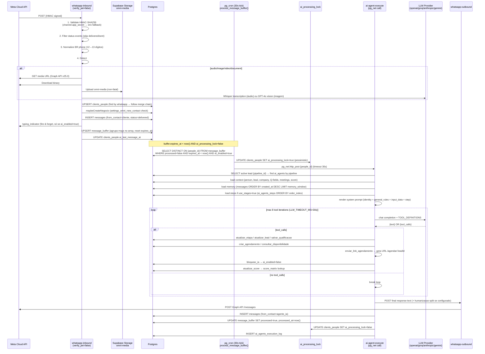
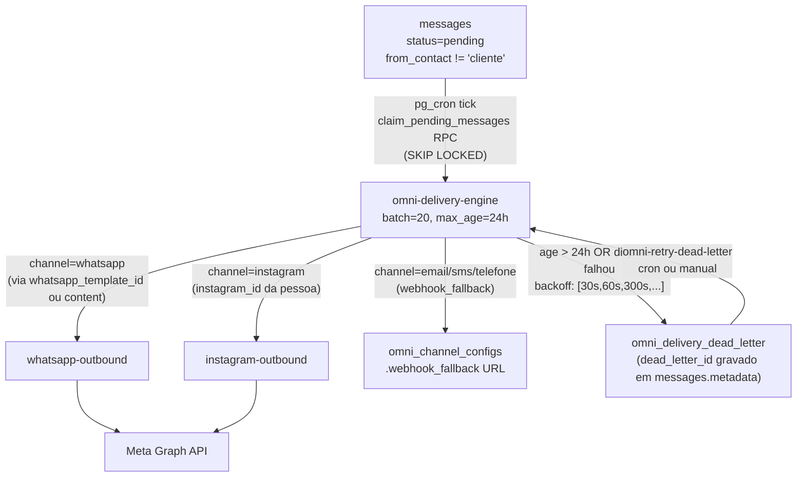

# OMNI PRO — Deep-dive

## 1. Visão e responsabilidade

Caixa omnicanal unificada: recebe e envia mensagens via WhatsApp (Meta Cloud API), Instagram DM, e TikTok. Integra agente de IA conversacional acionado por buffer de mensagens (pg_cron). Gerencia leads de meta leadgen (anúncios Lead Ads). É o canal primário de inbound de contatos e a principal superfície de comunicação humano↔cliente.

Responsabilidades exclusivas:
- Inbound de mensagens (HMAC validated) de todos os canais
- AI Agent loop (max 8 iterações LLM por burst)
- Agrupamento de mensagens por janela de buffer configurável por agente (`buffer_ms`)
- Dead-letter queue com retry exponencial para mensagens não entregues
- Mescla de pessoas duplicadas (`omni-merge-person`)
- Canal de saída para todas as mensagens CRM (follow-ups, disparos, respostas de agente)

## 2. Rotas e páginas

| Rota | Arquivo | Responsabilidade |
|---|---|---|
| `/omni` | [[../../../../src/pages/Conversas.tsx]] | Caixa principal: lista de conversas + sidebar de detalhes + área de mensagens |
| `/omni/:personId` | [[../../../../src/pages/Conversas.tsx]] | Mesma página, abre conversa de pessoa específica diretamente |
| `/omni/mensagens` | [[../../../../src/pages/OmniMensagens.tsx]] | Visão alternativa (mensagens brutas, debug/ops) |

Entry no router: `src/App.tsx` — rota protegida por `ModuleProtectedRoute` com módulo `omni`.

## 3. Componentes principais

Todos em [[../../../../src/components/conversas/]]:

| Componente | Responsabilidade |
|---|---|
| `ConversasSidebar.tsx` | Lista paginada de pessoas com conversas; filtros de canal, status, busca; badge de mensagens não lidas |
| `ConversaDetalhes.tsx` | Área central: histórico de mensagens da pessoa selecionada; input de resposta manual; suporte a templates |
| `PessoaSidebar.tsx` | Painel direito: dados do contato, score, negócios vinculados, campos de qualificação |
| `MessageContent.tsx` | Renderer de mensagem: texto, áudio, imagem, vídeo, arquivo, sticker |
| `MessageStatusTicks.tsx` | Ticks de status WhatsApp (sent/delivered/read) |
| `CannedResponsesModal.tsx` | Modal de respostas rápidas pré-configuradas |
| `WhatsappTemplateModal.tsx` | Seletor e preview de templates WhatsApp aprovados |
| `CriarAgendamentoModal.tsx` | Criação de reunião inline a partir da conversa |
| `ControleIA.tsx` | Toggle de habilitação de IA por contato; status do agente |
| `AlterarEtapaNegocio.tsx` | Move negócio para outra etapa diretamente da conversa |
| `AtribuirTimeResponsavel.tsx` | Atribui responsável/time ao negócio |
| `NegociosSection.tsx` | Lista de negócios vinculados à pessoa |
| `OmniTabNav.tsx` | Navegação de abas (Todos / WhatsApp / Instagram / TikTok) |
| `StatusAtendimento.tsx` | Badge de status do atendimento (aberto/em atendimento/encerrado) |
| `ConversasLoadingSkeleton.tsx` | Loading state da lista |
| `ConversasBadgeMidia.tsx` | Preview de mídia em miniatura na lista |

Ver também [[../../agents/ux/components]] para guias de uso dos primitivos shadcn.

## 4. Hooks de dados

Todos em `src/hooks/`, padrão TanStack Query v5:

| Hook | Query Key | Propósito |
|---|---|---|
| `useConversas.ts` | `['conversas', tenantId]` | Carrega pessoas com conversas (join messages); usado na visão principal da caixa |
| `useConversasPaginadas.ts` | `['conversas-paginadas', filters]` | Versão paginada com filtros; substitui useConversas em views grandes |
| `useConversasPessoas.ts` | `['conversas-pessoas', search]` | Busca pessoas por nome/telefone para a sidebar |
| `useConversasSimples.ts` | `['conversas-simples']` | Versão leve: apenas id, name, whatsapp, canal; para mobile shell |
| `useMensagensPorPessoa.ts` | `['mensagens', peopleId]` | Mensagens de uma pessoa com infinite scroll (order: created_at DESC) |
| `useOmniMensagens.ts` | `['omni-mensagens', filters]` | Mensagens filtradas por canal/status para a view OmniMensagens |
| `useCannedResponses.ts` | `['canned-responses']` | CRUD de respostas rápidas da tabela `canned_responses` |
| `useOmniChannelConfig.ts` | `['omni-channel-config', channel]` | Configuração de canal (credentials, is_active) de `omni_channel_configs` |
| `useOmniChannelAlerts.ts` | `['omni-channel-alerts']` | Alertas ativos de `omni_channel_alerts` |
| `useOmniChannelHealth.ts` | `['omni-channel-health']` | Status de saúde dos canais via `omni-channel-health-check` edge fn |
| `useOmniDeadLetter.ts` | `['omni-dead-letter']` | Mensagens em `omni_delivery_dead_letter` para ops/retry manual |
| `useOmniMediaUpload.ts` | — (mutation) | Upload de mídia via Supabase Storage bucket `omni-media` |
| `useOmniNewContactSettings.ts` | `['omni-new-contact-settings']` | Configurações de auto-criação de negócio de `settings_omni_new_contact` |
| `useWhatsappChannels.ts` | `['whatsapp-channels']` | Lista canais WhatsApp de `settings_whatsapp_channels` |
| `useWhatsappTemplates.ts` | `['whatsapp-templates']` | Templates aprovados de `whatsapp_templates` |
| `useInstagramAutomations.ts` | `['instagram-automations']` | Automações de Instagram (respostas a comentários/DMs) |
| `useSimularConversa.ts` | — (mutation) | Simula envio de mensagem para testes; chama `channel-test-send` |
| `useEstatisticasMensagens.ts` | `['estatisticas-mensagens', dateRange]` | Métricas de volume de mensagens por canal/período |
| `useDashboardConversas.ts` | `['dashboard-conversas']` | KPIs de conversas para o painel BI PRO |
| `useBIProOmni.ts` | `['bi-omni', filters]` | Dados BI do canal OMNI |

Realtime: `RealtimeContext.tsx` escuta `messages` e `clients_people` filtrado por `tenant_id` — invalida `['mensagens', peopleId]` a cada nova mensagem com debounce de 3s.

## 5. Edge functions

Todas em `supabase/functions/`. `verify_jwt` conforme `config.toml`.

### WhatsApp

| Função | verify_jwt | Responsabilidade |
|---|---|---|
| `whatsapp-inbound` | false (HMAC) | Webhook Meta; valida HMAC-SHA256 (`x-hub-signature-256`); normaliza telefone BR (12→13 dígitos); detecta `#apagar#` (cascade delete); processa mídia (áudio→Whisper, imagem→GPT-4o, PDF→regex); upsert `clients_people`; INSERT `messages`; INSERT/UPDATE `message_buffer`; dispara typing indicator condicionalmente |
| `whatsapp-outbound` | false (interno) | Dispatcher para Meta Graph API v25.0; chamado por `ai-agent-execute`, `omni-delivery-engine`, `send-dispatch-worker` |
| `whatsapp-templates-sync` | false | Sincroniza templates da conta WABA para `whatsapp_templates` |
| `whatsapp-templates-manage` | false | CRUD de templates via Meta Graph API |

**Env vars críticos de `whatsapp-inbound`:** `WHATSAPP_APP_SECRET`, `WHATSAPP_ACCESS_TOKEN`, `WHATSAPP_VERIFY_TOKEN` (default: `growthsales2026`), `OPENAI_API_KEY` (fallback: `settings_ai_providers`).

**Normalização de telefone BR** (linha 78–83 de `whatsapp-inbound/index.ts`): números de 12 dígitos (`55DD8digits`) recebem `9` na posição 4 para virar `55DD9digits` (13 dígitos).

**Mídia:** download da Meta → upload para bucket `omni-media` (`inbound/YYYY-MM-DD/timestamp-phone-type.ext`) → conteúdo processado para AI. Falha de upload é não-fatal — mensagem é salva com `media_url=null`.

**Auto-create negócio:** `maybeCreateNegocio` verifica `settings_omni_new_contact.auto_create_negocio`; se habilitado e pessoa não tem lead ativo, cria negócio via INSERT em `leads`. Template de título configurável (`{{nome}}`, `{{telefone}}`).

### Instagram

| Função | verify_jwt | Responsabilidade |
|---|---|---|
| `instagram-oauth` | true | Flow OAuth para conectar conta Instagram Business |
| `instagram-outbound` | false (interno) | Envia DM via Instagram Graph API |
| `instagram-automation-runner` | false | Executa automações de resposta a comentários/DMs |
| `instagram-comment-like` | true | Curtir comentário via Graph API |
| `instagram-comment-reply` | true | Responder comentário via Graph API |
| `instagram-posts-list` | true | Lista posts da conta para UI de automações |
| `instagram-token-refresh` | false | Refresh de token de longa duração (cron — DISABLED em 20260420220000) |

### TikTok

| Função | verify_jwt | Responsabilidade |
|---|---|---|
| `tiktok-oauth` | true | Flow OAuth TikTok Business |
| `tiktok-inbound` | false (HMAC) | Webhook TikTok; valida HMAC; INSERT mensagens |
| `tiktok-outbound` | false (interno) | Envia mensagem via TikTok Business API |
| `tiktok-token-refresh` | false | Refresh de token (pg_cron) |

### Meta Lead Gen

| Função | verify_jwt | Responsabilidade |
|---|---|---|
| `meta-inbound` | false | Webhook de leadgen Meta; recebe leads de anúncios Lead Ads |
| `meta-leadgen-create` | true | Cria formulário leadgen no Meta |
| `meta-leadgen-sync` | true | Sincroniza leads de formulário → `clients_people` + `leads` |
| `meta-pages-list` | true | Lista páginas Meta autenticadas |
| `meta-pages-subscribe` | true | Inscreve webhook na página Meta |
| `meta-save-credentials` | true | Salva token de página em `meta_lead_form_pages` |

### Orquestração

| Função | verify_jwt | Responsabilidade |
|---|---|---|
| `omni-delivery-engine` | false (pg_cron) | Busca `messages.status='pending'` com `from_contact != 'cliente'`; dispatch por canal; batch de 20; descarta > 24h; dead-letter após falha |
| `omni-channel-health-check` | true | Verifica saúde dos canais; grava `omni_channel_alerts` |
| `omni-merge-person` | true | Mescla duas pessoas duplicadas (migra mensagens, leads, meetings) |
| `omni-retry-dead-letter` | true | Reprocessa mensagens em `omni_delivery_dead_letter` |
| `channel-test-send` | true | Envia mensagem de teste num canal (chamado por `useSimularConversa`) |

### IA

| Função | verify_jwt | Responsabilidade |
|---|---|---|
| `ai-agent-execute` | false (pg_net/service_role) | Runtime do agente IA; acionado via `pg_net` por `process_message_buffer()` quando `message_buffer.expires_at < now()` |

## 6. Schema e tabelas

Ver definições completas em [[../../agents/data-engineer/schema]].

### Tabelas principais (OMNI PRO)

| Tabela | RLS | Descrição |
|---|---|---|
| `messages` | ativo | Todas as mensagens; `from_contact` CHECK (agente_ia/follow_up/humano/cliente); `channel` CHECK (whatsapp/instagram/email/sms/telefone/tldv); `status` CHECK (pending/sending/sent/delivered/read/error) |
| `message_buffer` | service_role only | Buffer temporário de mensagens inbound; `processed=false` até `expires_at < now()`; `messages jsonb[]` (array de objetos de mensagem agrupados); `wa_phone_number_id` para rotear para o canal certo |
| `omni_channel_configs` | ativo | Config por canal: `channel` CHECK (whatsapp/instagram/email/sms/telefone/tldv); `credentials jsonb`; `is_active`; `webhook_fallback jsonb` |
| `omni_channel_alerts` | ativo | Alertas de canal: `severity`, `message`, `resolved_at` |
| `omni_delivery_dead_letter` | ativo | Fila de mensagens que falharam; `next_retry_at`, `attempts`, backoff exponencial |
| `omni_outbound_webhooks` | ativo | Webhooks de saída para automações LP→Omni |
| `settings_whatsapp_channels` | ativo | Canais WhatsApp por `phone_number_id`; `access_token`, `app_secret`, `active` |
| `whatsapp_templates` | ativo | Templates aprovados; sincronizados via `whatsapp-templates-sync` |
| `canned_responses` | ativo | Respostas rápidas por tenant |
| `settings_omni_new_contact` | ativo | Config de auto-criação de contato/negócio por canal |
| `meta_lead_form_pages` | ativo | Páginas Meta autenticadas |
| `meta_lead_forms` | ativo | Formulários leadgen Meta |
| `ai_agents` | ativo | Configuração do agente IA: `buffer_ms`, `pipeline_id`, `llm_provider`, `memory_window`, `humanizacao`, `score_matrix_ids` |
| `ai_agents_steps` | ativo | Etapas sequenciais do agente com prompts específicos por estágio |
| `ai_agents_execution_log` | ativo | Log de execuções: `people_id`, `iterations`, `tokens`, `tool_calls`, `elapsed_ms` |

**RLS strategy:** tabelas de mensagens usam `service_role` para writes internos (edge functions usam `SUPABASE_SERVICE_ROLE_KEY`). Reads via anon key respeitam RLS por `tenant_id` via `get_current_user_tenant_id()`. `message_buffer` é `service_role only` — nunca exposto ao client direto.

### Índices críticos

- `message_buffer_ready_to_process` — `(people_id, expires_at) WHERE processed = false` — usado por `process_message_buffer()` a cada tick de cron
- `idx_crm_messages_lead_id`, `idx_crm_messages_tenant_id` — queries da caixa de conversas

## 7. Fluxos críticos

### 7.1 Inbound WhatsApp → AI Agent → Outbound

Referência base em `[[../architecture]] §5.1`. Abaixo: detalhes de implementação não documentados lá.

**Detalhes de implementação críticos:**

- **Agrupamento de mensagens:** `pushToBuffer` acumula múltiplos objetos no array `messages[]` da mesma entrada de `message_buffer` (se `processed=false` já existe para o `people_id`). O `expires_at` é resetado a cada nova mensagem — isso é a "janela de buffer". O agente recebe TODAS as mensagens do burst de uma vez, não uma por uma.
- **`ai_processing_lock`:** coluna booleana em `clients_people`. O cron verifica `ai_processing_lock=false` antes de acionar o agente — previne execuções paralelas para a mesma pessoa. `release_stale_ai_locks()` (cron) libera locks > 2 minutos (timeout safety).
- **Tool definitions no agente** (TOOL_DEFINITIONS, `ai-agent-execute/index.ts` linhas 172–452):
  - `atualizar_etapa` — move lead de stage
  - `atualizar_control` — atualiza campo control no lead
  - `atualizar_lead` — título, valor, status, temperatura, probabilidade
  - `atualizar_pessoa` — nome, email, whatsapp, notas
  - `atualizar_empresa` — dados da empresa associada
  - `salvar_qualificacao` — 25 campos Q (q1–q25) + goal, moment, conversation_summary
  - `bloquear_ia` — `ai_enabled=false`
  - `criar_agendamento` — INSERT meetings; agente prefere `enviar_link_agendamento`
  - `consultar_disponibilidade` — slots via `get_available_slots` RPC
  - `consultar_agenda` — PostgREST filter em meetings
  - `remarcar_agendamento` — update start/end_time no meeting
  - `enviar_link_agendamento` — gera URL pública `/agendar/:leadId`; PRIMARY tool para reuniões comerciais
  - `collect_identity` / `collect_identity_optout` — coleta email, whatsapp, instagram, CNPJ
  - `atualizar_score` — seleciona objetivo + investimento + enquadramento → score recalculado
  - `enviar_nota` — INSERT nota interna (não enviada ao cliente)
- **Multi-provider:** agente suporta `openai`, `groq` (compat OpenAI), `anthropic`, `gemini` (compat OpenAI). Seleção por `ai_agents.llm_provider`.
- **Score gate routing** (`score_matrix_ids`): agente só dispara se `person.score` bate com a matrix configurada. `score_allow_empty=true` permite acionar mesmo sem score.
- **Humanização:** `humanizacao = 'alta'` → quebra resposta em múltiplas mensagens com delays simulados (digitar...). `'nenhuma'` → uma mensagem única.
- **Voice:** `voice_enabled=true` → converte resposta para áudio via ElevenLabs antes de enviar (usa `elevenlabs-tts`).

### 7.2 OMNI Delivery Engine (outbound não-cliente)

`claim_pending_messages` RPC usa `SELECT FOR UPDATE SKIP LOCKED` — garante que múltiplas instâncias do cron não processam o mesmo batch.

### 7.3 AI Agent para Instagram DM

Sem buffer dedicado — `instagram-automation-runner` é acionado diretamente pelo webhook, sem agrupamento de mensagens. Sem typing indicator. Sem ferramenta `collect_identity` implementada. Fluxo de AI mais simples (sem steps, sem score gate).

## 8. Integrações externas

| Integração | Função(ões) | Auth | Notas |
|---|---|---|---|
| Meta WhatsApp Cloud API v25.0 | `whatsapp-inbound`, `whatsapp-outbound` | App Secret (HMAC inbound), Bearer token (outbound) | Token por canal em `settings_whatsapp_channels.access_token` |
| Meta Instagram Graph API | `instagram-*` | OAuth token longa duração | Token refresh cron DISABLED; precisa refresh manual |
| Meta Lead Ads | `meta-inbound`, `meta-leadgen-*` | Page access token | Webhook subscrito via `meta-pages-subscribe` |
| TikTok Business API | `tiktok-*` | OAuth + HMAC webhook | Token refresh via cron `tiktok-token-refresh` |
| OpenAI (Whisper + GPT-4o) | `whatsapp-inbound` | API Key | Fallback para `settings_ai_providers` se env var ausente |
| OpenAI / Groq / Anthropic / Gemini | `ai-agent-execute` | API Key de `settings_ai_providers` | Seleção por `ai_agents.llm_provider` |
| ElevenLabs | `elevenlabs-tts` | API Key de `settings_elevenlabs` | Apenas quando `voice_enabled=true` no agente |
| Supabase Storage | `whatsapp-inbound` | Service role | Bucket `omni-media`; public URLs para client |

## 9. Estado atual e débito técnico

- **Instagram token refresh desabilitado** (cron DISABLED em 20260420220000): tokens expirarão se não renovados manualmente. Prioridade alta para reativar ou migrar para refresh automático via webhook.
- **PDF extraction** (`extractPdfText` em `whatsapp-inbound/index.ts` linhas 158–167): regex básico — retorna texto parcial ou placeholder. Não integrado a parser real. Débito técnico conhecido.
- **Schema duplo messages:** `messages` (moderno, bigint PK) e `crm_messages` (legado). O OMNI PRO usa `messages`. Alguns hooks legados ainda apontam para `crm_messages`. Confirmar migração completa.
- **`msg_buffer` vs `message_buffer`:** duas tabelas com nomes similares. `msg_buffer` (id text PK) é legado/n8n. `message_buffer` (id uuid, `people_id uuid`) é o buffer do agente atual. Não confundir.
- **Sem testes de integração** para o loop do agente IA — cobertura zero de AI tool execution.
- **`whatsapp-outbound` é `verify_jwt=false`:** depende de service role key para autenticação edge↔edge. Considerar migração para action tokens (ADR-SP-02) para consistência com SCHEDULE PRO.
- **Broken merge edge case** (`upsertPerson` linhas 239–244): registro com `status='merged'` mas `merged_into_id=null` é restaurado para `active` no lugar de criar novo — workaround documentado no código.

## 10. Stories candidatas / ADRs relevantes

**ADRs:**
- **N8N-WAA-5/6/7/8** — rework do pipeline WhatsApp → AI Agent (referências nos comentários de `whatsapp-inbound/index.ts` e `ai-agent-execute/index.ts`)
- **ADR-PP-03** — server-verified tenant_id — `extractTenantId` @deprecated; edge fns OMNI PRO usam service role, não JWT de usuário

**Stories candidatas:**
- Reativar/refatorar Instagram token refresh automático
- Migrar PDF extraction para parser real (PDF.js server-side ou Cloudflare AI)
- Adicionar `verify_jwt` ou action tokens para `whatsapp-outbound` (alinhamento com ADR-SP-02)
- Unificar schema messages/crm_messages — deprecar `crm_messages`
- Testes de integração para AI agent loop (mock LLM, real DB)
- Dashboard de health por canal (`omni-channel-health-check` → visualização em Configurações)
- Suporte a TikTok Comments (equivalente ao `instagram-comment-reply`)
