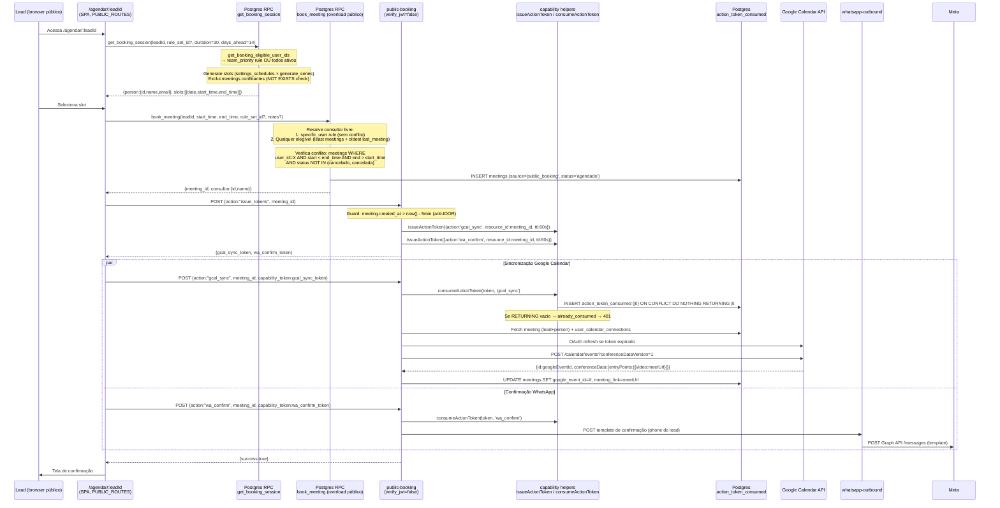
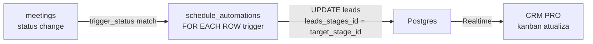
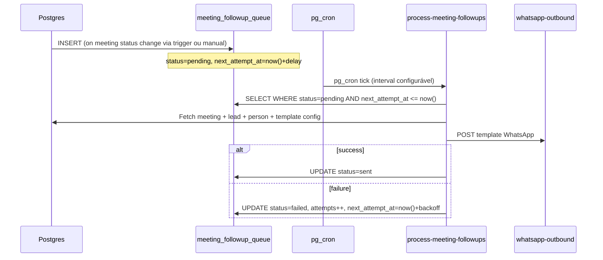

# SCHEDULE PRO — Deep-dive

## 1. Visão e responsabilidade

Módulo de agendamento e gestão de reuniões: permite que leads agendem reuniões diretamente via link público (`/agendar/:leadId`), sincroniza com Google Calendar / Microsoft Teams / Zoom, e automatiza followup pós-reunião via WhatsApp templates. Inclui transcrição via tl;dv, avaliação por COACH PRO, e automações de pipeline acionadas por mudança de status de reunião.

Responsabilidades exclusivas:
- Booking público sem autenticação (`public-booking` edge fn + RPCs Postgres)
- Distribuição de consultores por `booking_rule_sets` (team_priority, round_robin, least_busy, specific_user)
- Sincronização bidirecional com Google Calendar (busy/free slots, evento criado no cal do consultor)
- Follow-up automático de reuniões (templates WhatsApp por status: agendado, compareceu, não compareceu, cancelado)
- Automações de pipeline: mover lead de stage automaticamente quando meeting muda de status
- Transcrições tl;dv associadas ao meeting_record
- Exposição de `meeting_evaluations` para COACH PRO

## 2. Rotas e páginas

| Rota | Arquivo | Responsabilidade |
|---|---|---|
| `/schedule` | [[../../../../src/pages/Reunioes.tsx]] | Calendário de reuniões (semanal/mensal), lista, cards; aba padrão |
| `/schedules` | [[../../../../src/pages/Horarios.tsx]] | Configuração de horários de disponibilidade por usuário |
| `/schedule/automacoes` | [[../../../../src/pages/ScheduleAutomacoes.tsx]] | Editor de automações de pipeline por status de reunião |
| `/agendar/:leadId` | pública (sem auth) | Booking público — carrega sessão via RPC, exibe slots, confirma |

Entry no router: rotas autenticadas protegidas por `ModuleProtectedRoute` com módulo `schedule`. Rota `/agendar/:leadId` é `PUBLIC_ROUTES` — sem guard.

## 3. Componentes principais

Em [[../../../../src/components/reunioes/]]:

| Componente | Responsabilidade |
|---|---|
| `CalendarioView.tsx` | Visão mensal com drag-to-schedule e click para criar reunião |
| `CalendarioSemanalView.tsx` | Visão semanal por hora; grade de todos os consultores do time |
| `SmartSlotPicker.tsx` | Picker inteligente de slots para booking manual interno; chama `get_available_slots` RPC |
| `MeetingRecordCard.tsx` | Card de gravação/transcrição de reunião com link tl;dv e highlights |
| `MeetingTranscriptViewer.tsx` | Viewer inline de transcrição JSON; renderiza segmentos com timestamp |
| `RescheduleModal.tsx` | Modal de reagendamento; atualiza `meetings.start_time/end_time` e chama `google-cal-upsert-event` |
| `AddMeetingRecordModal.tsx` | Adiciona manualmente URL de gravação/transcrição ao `meeting_records` |

Em [[../../../../src/components/booking/]]:

| Componente | Responsabilidade |
|---|---|
| `InlineBooking.tsx` | Embed do booking público dentro do app (para agendar sem sair da tela) |

## 4. Hooks de dados

Todos em `src/hooks/`, padrão TanStack Query v5:

| Hook | Query Key | Propósito |
|---|---|---|
| `useAgendamentos.ts` | alias | Re-exporta `useAgendamentosSimple` (backwards compat); inclui `useCriarAgendamento` e `useAtualizarAgendamento` mutations |
| `useAgendamentosSimple.ts` | `['agendamentos-simples']` | Lista meetings com join leads+people+users; leve (sem paginação) |
| `useAgendamentosSimples.ts` | `['agendamentos', filters]` | Versão com filtros de data/usuário/status; paginada |
| `useAgendamentosFollowups.ts` | `['agendamentos-followups']` | Followup queue (`meeting_followup_queue`) |
| `useBookingRuleSets.ts` | `['booking_rule_sets']` | CRUD de `booking_rule_sets` + `booking_rules`; upsert atômico de regras (delete+insert) |
| `useCalendarConnectedUsers.ts` | `['calendar-connected-users']` | Usuários com conexão ativa em `user_calendar_connections` |
| `useCalendarConnectionsHealth.ts` | `['calendar-connections-health']` | Estado de saúde (token expirado, sync error) por usuário |
| `useCalendarSyncStatus.ts` | `['calendar-sync-status', userId]` | Status de sync individual por usuário/provider |
| `useGoogleCalendarEvents.ts` | `['google-cal-events', userId, dateRange]` | Eventos do Google Calendar via `google-cal-sync-events` |
| `useGoogleCalendarStatus.ts` | `['google-cal-status', userId]` | Se o usuário tem token Google válido |
| `useMSTeamsStatus.ts` | `['ms-teams-status', userId]` | Status da conexão Microsoft Teams |
| `useSchedules.ts` | `['schedules', userId]` | `settings_schedules`: horários de disponibilidade (dia_semana, hora_inicio, hora_fim) |
| `useScheduleAutomations.ts` | `['schedule_automations']` | CRUD de `schedule_automations`; `TriggerStatus` enum |
| `useMeetingRecords.ts` | `['meeting-records', meetingId]` | `meeting_records` de uma reunião (transcrições/gravações) |
| `useMeetingSingle.ts` | `['meeting', meetingId]` | Um meeting por ID com dados completos |
| `useMeetingFollowupAutoSetup.ts` | — (mutation) | Chama `meeting-followup-auto-setup` para criar templates padrão |
| `useZoomConnection.ts` | `['zoom-connection', userId]` | Estado conexão Zoom (`user_calendar_connections.provider='zoom'`) |
| `useCoachMeetingAssignment.ts` | `['coach-assignment', meetingId]` | `meeting_playbook_assignments` — playbook atribuído a uma reunião |
| `useBIProSchedules.ts` | `['bi-schedules', filters]` | Métricas de reuniões para BI PRO |
| `useDashboardAgendamentos.ts` | `['dashboard-agendamentos']` | KPIs de agendamentos para painel principal |
| `useTeamsNew.ts` | `['teams-new']` | Lista de times (`settings_teams`) para atribuição |
| `useUsersTeams.ts` | `['users-teams']` | Membros por time (`settings_users_teams`) |

## 5. Edge functions

| Função | verify_jwt | Responsabilidade |
|---|---|---|
| `public-booking` | false | Rota pública de booking: `issue_tokens`, `gcal_sync`, `wa_confirm`; rate limit 30/min/IP (in-memory); autenticação edge↔edge via action tokens HMAC (ADR-SP-02) |
| `google-cal-connect` | true | OAuth flow Google Calendar; salva tokens em `user_calendar_connections` |
| `google-cal-availability` | true | Consulta busy/free via Google FreeBusy API para um usuário |
| `google-cal-pull-event` | true | Puxa evento específico por `google_event_id` |
| `google-cal-sync-events` | true | Importa eventos Google Cal → `meetings` (source='google') para um usuário |
| `google-cal-sync-to-db` | true | Sync em batch de todos os eventos do período para o DB |
| `google-cal-upsert-event` | true | Cria ou atualiza evento no Google Calendar de um usuário |
| `ms-teams-connect` | true | OAuth flow Microsoft Teams; salva tokens em `user_calendar_connections` |
| `ms-teams-upsert-event` | true | Cria ou atualiza evento no Teams (via Microsoft Graph API) |
| `zoom-connect` | true | OAuth flow Zoom; salva tokens zoom_* em `user_calendar_connections` |
| `zoom-upsert-event` | true | Cria evento Zoom via API; retorna `zoom_join_url` |
| `meeting-followup-auto-setup` | true | Setup em batch de templates WhatsApp por status de reunião (agendado/compareceu/não compareceu/cancelado); chama `whatsapp-templates-manage` para criar os templates no Meta |
| `process-meeting-followups` | false (pg_cron) | Processa `meeting_followup_queue`; envia templates via whatsapp-outbound |
| `send-meeting-confirmation` | true | Envia template de confirmação para o lead via WhatsApp |
| `tldv-sync` | false (pg_cron) | Sync diário de reuniões tl;dv (02:00 UTC); match por email/time com meetings existentes |
| `tldv-webhook` | false | Webhook tl;dv para receber transcrições em tempo real |

### public-booking — detalhe de ações

`POST { action: "issue_tokens", meeting_id }` — chamado imediatamente após `book_meeting` RPC. Guard: meeting criado < 5 min (previne IDOR). Retorna dois tokens HMAC de 60s: `gcal_sync_token` e `wa_confirm_token`.

`POST { action: "gcal_sync", meeting_id, capability_token }` — valida token via `consumeActionToken`; verifica `resource_id === meeting_id`; resolve conexão Google do consultor; refresh de token se expirado; push do evento para Google Calendar com Google Meet; persiste `google_event_id` + `meeting_link` no meeting.

`POST { action: "wa_confirm", meeting_id, capability_token, template_name? }` — valida token; lookup meeting com lead+pessoa; envia template WhatsApp de confirmação via `whatsapp-outbound`.

**OAuth credentials lookup (`gcal_sync`):** settings → `settings.google_client_id/secret` → `bi_settings.google_client_id/secret` → env vars `GOOGLE_CLIENT_ID/SECRET`. Fallback chain garante que o mesmo OAuth serve para GCal e BI PRO Ads.

## 6. Schema e tabelas

Ver [[../../agents/data-engineer/schema]] para colunas completas.

### Tabelas principais (SCHEDULE PRO)

| Tabela | RLS | Descrição |
|---|---|---|
| `meetings` | ativo | Reuniões modernas; `source` CHECK: `ai_agent/public_booking/google/manual`; `status` livre; `zoom_meeting_id` UNIQUE WHERE NOT NULL; `tldv_meeting_id` UNIQUE WHERE NOT NULL |
| `meeting_records` | ativo | Gravações/transcrições: `transcript_text`, `transcript_json`, `highlights text[]`, `audio_url`, `duration_sec`, `tldv_meeting_id` |
| `meeting_followup_queue` | ativo | Fila de followup: `status`, `next_attempt_at`, `attempts` |
| `schedule_automations` | authenticated_all | Automações pipeline↔status; UNIQUE (pipeline_id, trigger_status) WHERE is_active; trigger_status CHECK (criado/confirmado/cancelado/reagendado/realizado/no_show) |
| `user_calendar_connections` | ativo | Conexões de calendário por usuário; provider: google/microsoft/zoom; colunas zoom_*: access_token, refresh_token, expires_at, user_id, account_id, email |
| `settings_schedules` | ativo | Disponibilidade por usuário: `day_of_week` (0–6), `start_time`, `end_time`, `is_available` |
| `booking_rule_sets` | ativo (anon read) | Sets de regras de booking; `url_id smallint` autoincrement (trigger `assign_booking_rule_set_url_id`); `is_default` → fallback para bookings sem rule_set |
| `booking_rules` | ativo (anon read) | Regras individuais: `rule_type` CHECK (team_priority/random/least_busy/specific_user/round_robin); `config jsonb`; `order_index` |
| `meeting_playbook_assignments` | ativo | UNIQUE (meeting_id) — playbook atribuído para avaliação COACH PRO |
| `meeting_evaluations` | authenticated_all | Avaliações IA; `superseded_at IS NULL` = versão ativa; `overall_score`, `deal_risk`, `strengths/gaps/next_steps` |
| `action_token_consumed` | service_role | Single-use token table (ADR-SP-02); PK = jti; GC cron limpa expirados |
| `booking_token_jti_usage` | service_role | Denylist de JWTs de booking revogados (ADR-SP-01) |

### Funções Postgres críticas

| Função | Tipo | Descrição |
|---|---|---|
| `get_booking_session(p_lead_id, p_rule_set_id?, p_duration?, p_days_ahead?)` | SECURITY DEFINER | Retorna person info + slots disponíveis para os próximos N dias; slots gerados por JOIN settings_schedules × users × generate_series; exclui slots com conflito em meetings |
| `book_meeting(p_lead_id, p_start_time, p_end_time, p_rule_set_id?, ...)` | SECURITY DEFINER | Overload público: resolve consultor livre (sem conflito), INSERT meetings; retorna `{meeting_id, consultor:{id,name}}` |
| `book_meeting(p_lead_id, p_user_id, p_title, ...)` | SECURITY DEFINER | Overload interno (AI agent): cria meeting diretamente com user_id explícito |
| `get_booking_eligible_user_ids(p_rule_set_id?)` | SECURITY DEFINER | Resolve quais usuários podem receber bookings: team_priority (filtra por times do booking_rule) → todos os ativos |
| `get_available_slots(p_user_id, p_date, p_period?, p_slot_minutes?)` | — | Slots de um usuário em uma data; usado por `consultar_disponibilidade` do AI agent |

**RLS strategy especial:**
- `booking_rule_sets` e `booking_rules` têm política `anon_read` — consultor público (`/agendar/:leadId`) consegue ler sem JWT
- `action_token_consumed` e `booking_token_jti_usage` são `service_role only` — apenas edge functions com service role key podem escrever/ler

## 7. Fluxos críticos

### 7.1 Public Booking com capability tokens

Referência base em `[[../architecture]] §5.4`. Abaixo: detalhes de implementação.



**Algoritmo de slot:**

`get_booking_session` usa `generate_series` para criar os slots baseado em `settings_schedules`:
```sql
-- Para cada usuário elegível × cada dia nos próximos N dias × cada schedule disponível
-- Gera slots de 30 min (ou p_duration):
ss.start_time + (n * INTERVAL '30 minutes')
-- Exclui se conflito com meetings existentes:
NOT EXISTS (SELECT 1 FROM meetings WHERE user_id=X AND start < ts_end AND end > ts_start AND status NOT IN ('cancelado','cancelada'))
```

**Algoritmo de distribuição de consultor** (`book_meeting` overload público):
1. `specific_user` rule (se `rule_set` tem regra de usuário específico com `order_index ASC`) — usa esse consultor se livre
2. Fallback: round-robin por menor número de meetings futuros (`COUNT(*) ASC`) + menor data de último meeting (`MAX(created_at) ASC`)

**Atomic single-use token** (ADR-SP-02):
- `consumeActionToken` usa `INSERT ON CONFLICT DO NOTHING RETURNING jti`
- Se `RETURNING` vazio → jti já consumido → `already_consumed` — sem race condition possível
- Token expirado antes de ser consumido → falha em `Step 5 — Expiration`
- Falha da ação após consume → token fica consumido; client deve solicitar novos tokens via `issue_tokens`

### 7.2 Automações de pipeline por status de reunião



`schedule_automations` tem trigger `set_schedule_automation_updated_at` (updated_at). A movimentação de leads é feita por um trigger Postgres no `UPDATE meetings SET status` — o trigger consulta `schedule_automations WHERE trigger_status=NEW.status AND pipeline_id = lead.pipeline_id` e move o lead para `target_stage_id`. UNIQUE index garante no máximo uma automação ativa por (pipeline_id, trigger_status).

### 7.3 Follow-up automático pós-reunião



`meeting-followup-auto-setup` cria templates por status:
- `agendado` → confirmacao_reuniao (imediato), lembrete_30min, lembrete_5min, lembrete_dia, lembrete_1dia_antes
- `compareceu/realizado` → pos_reuniao_followup (imediato)
- `nao_compareceu` → ausencia_imediato (0min), ausencia_6h, ausencia_24h
- `cancelado` → reagendamento_cancelamento (imediato)

## 8. Integrações externas

| Integração | Função(ões) | Auth | Notas |
|---|---|---|---|
| Google Calendar API v3 | `google-cal-connect`, `google-cal-upsert-event`, `google-cal-sync-events`, `public-booking` (gcal_sync) | OAuth2 por usuário (tokens em `user_calendar_connections`) | Token refresh automático em `gcal_sync`; `conferenceDataVersion=1` para criar Google Meet |
| Microsoft Graph API (Teams) | `ms-teams-connect`, `ms-teams-upsert-event` | OAuth2 (Microsoft) | Eventos criados no calendário Outlook com link Teams |
| Zoom API | `zoom-connect`, `zoom-upsert-event` | OAuth2 (Zoom) | Meeting criado com `zoom_join_url`; credenciais em `bi_settings.zoom_*` |
| Meta WhatsApp Cloud API | `send-meeting-confirmation`, `process-meeting-followups` | Bearer token de canal | Templates pré-aprovados em `whatsapp_templates` |
| tl;dv API | `tldv-sync`, `tldv-webhook` | API Key | Match de reuniões por email/hora com meetings existentes (fuzzy match via `tldv-matching.ts`) |
| Google FreeBusy API | `google-cal-availability` | OAuth token do usuário | Consulta ocupação do calendário para cálculo de slots |

## 9. Estado atual e débito técnico

- **Schema duplo de agendamentos:** `crm_agendamentos` (legado, FKs para crm_leads/crm_usuarios) e `meetings` (moderno, FKs para leads/settings_users). `useAgendamentos` já aponta para `meetings` mas ainda há componentes/hooks com `// @ts-nocheck` por incompatibilidade de tipos. Migração incompleta.
- **`get_booking_session` não verifica Google Calendar:** slots são calculados apenas com base em `meetings` do DB — se um consultor tiver evento no Google Calendar importado com `source='google'`, ele aparece como conflito. Mas eventos externos não-importados (fora de sync) NÃO bloqueiam slots. Risco de double-booking.
- **Rate limit em memória** (`public-booking`): `_rateMap` reinicia em cold start do edge function — não é rate limit distribuído. Efetivo na prática (30/min por IP por instância quente), mas bypass possível.
- **`meeting_evaluations` sem isolamento tenant** (`authenticated_all`): qualquer usuário autenticado pode ler avaliações de outros tenants se souber o ID. Necessário RLS tenant-scoped.
- **tl;dv cron DISABLED para Instagram** (comentário em schema): o cron `tldv-daily-sync` existe mas Instagram token refresh foi desabilitado separadamente — se o módulo tl;dv usa token de Instagram, pode falhar silenciosamente.
- **Zoom sem refresh automático:** `zoom-connect` salva tokens mas não há cron de refresh para Zoom. Tokens expiram em ~1h — precisa reconectar manualmente.
- **`public-booking` capability token `tenant_id` incorreto:** linha 108 `const tenant_id = (meeting.user_id as string) ?? 'unknown'` — usa `user_id` como `tenant_id` no token. Bug de nomenclatura; não afeta segurança (o token valida `resource_id`), mas o campo `tid` do payload do token é semanticamente errado.

## 10. Stories candidatas / ADRs relevantes

**ADRs:**
- **ADR-SP-01** — `booking_token_jti_usage` (denylist de JWTs de booking; tabela criada em 20260422)
- **ADR-SP-02** — action tokens HMAC para edge↔edge em `public-booking` (implementado); `issueActionToken`/`consumeActionToken` em `supabase/functions/_shared/capability/`
- **ADR-SP-05** — service-role credentials vault; `secret_access_log` para auditoria

**Stories candidatas:**
- Fix: corrigir `tenant_id` no payload do capability token em `public-booking` (linha 108 — `user_id` ≠ `tenant_id`)
- Fix: adicionar RLS tenant-scoped em `meeting_evaluations` (atualmente `authenticated_all`)
- Feature: verificação de Google Calendar busy antes de expor slots em `get_booking_session` — integrar `google-cal-availability` para eliminar risco de double-booking
- Feature: Zoom token refresh automático via pg_cron (equivalente ao padrão de outros providers)
- Feature: rate limit distribuído para `public-booking` (Redis via Upstash ou tabela Postgres com SKIP LOCKED)
- Refactor: migrar `crm_agendamentos` para `meetings` — deprecar schema legado; remover `// @ts-nocheck` dos hooks
- Feature: cancelamento público de reunião via capability token (ação `cancel_meeting` com TTL de 24h)
- Feature: reagendamento público (link no email/WhatsApp de confirmação → `reschedule_meeting` action token)
