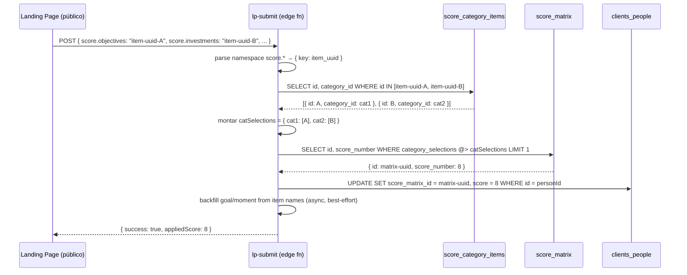
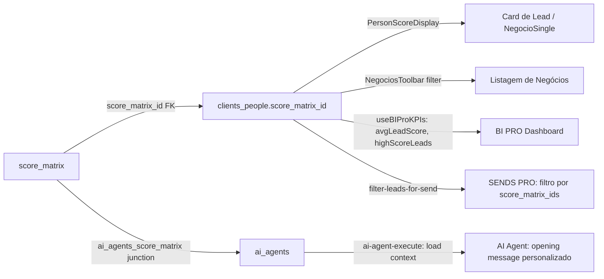

# SCORE PRO

Motor de qualificação de leads baseado em matriz de categorias. Gestores configuram dimensões de classificação (ex: objetivo, faixa de investimento, segmento) e combinações dessas dimensões recebem um score numérico (0–10). O score é aplicado automaticamente no submit de formulários LP, exposto no CRM e usado como filtro em BI PRO e SENDS PRO.

---

## 1. Visão e Responsabilidade

SCORE PRO é o **sistema de qualificação padronizado** do rev-os. Sua responsabilidade:

- Permitir ao gestor criar dimensões de classificação (categorias) e seus itens possíveis
- Montar uma matriz de combinações categóricas → score numérico + perfil textual
- Aplicar automaticamente o score em leads que chegam via LP (FORM PRO) — lógica em `lp-submit`
- Expor o score nos cards de pessoa/lead no CRM (CRM PRO) como filtro e dado de contexto
- Fornecer o score como input ao BI PRO (filtro `scoreFilter` no dashboard) e ao AI Agent (contexto de abertura)

**Sem edge function própria** — toda a lógica de aplicação de score vive em `lp-submit` (FORM PRO). Score PRO é puramente configuração + dados persistidos.

**Acesso restrito:** `Score.tsx` usa `RestrictedRoute requireGestor={true}` — apenas gestores acessam a tela de configuração.

---

## 2. Rotas e Páginas

| Rota | Página | Notas |
|---|---|---|
| `/score` | [[../../../../src/pages/Score]] | Restrito a gestor (RestrictedRoute) |

Sem sub-rotas. A navegação interna é por abas dentro de `ScoreConfig`.

---

## 3. Componentes Principais

Ver também [[../../agents/ux/components]].

| Componente | Path | Responsabilidade |
|---|---|---|
| `Score` | `src/pages/Score.tsx` | Shell: lazy-load `ScoreConfig` com RestrictedRoute gestor |
| `ScoreConfig` | `src/components/config/ScoreConfig.tsx` | Container com duas abas: Cadastros Base e Matriz de Score |
| `ScoreCadastrosBase` | `src/components/config/score/ScoreCadastrosBase.tsx` | Lista e gerencia todas as categorias dinâmicas e seus itens |
| `ScoreCategoryCard` | `src/components/config/score/ScoreCategoryCard.tsx` | Card de uma categoria dinâmica com seus itens e botão de adicionar item |
| `ScoreObjectivesCard` | `src/components/config/score/ScoreObjectivesCard.tsx` | Card específico da categoria "Objetivos" (slug `objectives`) |
| `ScoreInvestmentsCard` | `src/components/config/score/ScoreInvestmentsCard.tsx` | Card específico da categoria "Faixas de Investimento" (slug `investments`) |
| `ScoreFramingsCard` | `src/components/config/score/ScoreFramingsCard.tsx` | Card específico da categoria "Segmentos" (slug `framings`) |
| `ScoreBaseCard` | `src/components/config/score/ScoreBaseCard.tsx` | Card genérico compartilhado entre as 3 cards base |
| `ScoreBaseModal` | `src/components/config/score/ScoreBaseModal.tsx` | Modal de criação/edição de item de categoria |
| `ScoreMatriz` | `src/components/config/score/ScoreMatriz.tsx` | Lista e filtra entradas da `score_matrix`; permite criar/editar/excluir |
| `ScoreMatrizModal` | `src/components/config/score/ScoreMatrizModal.tsx` | Modal de criação/edição de entrada da matriz: seleção multi-categoria → score numérico + perfil |
| `PersonScoreDisplay` | `src/components/common/PersonScoreDisplay.tsx` | Card de exibição de score de uma pessoa (usado em NegocioSingle e perfil) |
| `PersonScoreSection` | `src/components/common/PersonScoreSection.tsx` | Seção de score inline em cards de pessoa |
| `ScoreInformationDisplay` | `src/components/common/ScoreInformationDisplay.tsx` | Display compacto de score number com badge de cor |

**Uso do score no CRM:**
- `NegociosToolbar` — filtro por `score_matrix_id` na listagem de negócios
- `ConversasSidebar` — exibe `score_matrix_id` no card de conversa
- `PersonScoreDisplay` / `PersonScoreSection` — exibem score no perfil de pessoa

---

## 4. Hooks de Dados

Todos em `src/hooks/`. Padrão: `useQuery` + `useMutation` via TanStack Query. Todos os hooks de score usam cast `supabase as unknown as { from: (t: string) => any }` porque `score_categories` e `score_category_items` não estão no schema gerado (`types.ts`) — foram adicionados após a última geração de tipos.

| Hook | Query Key | Fonte | O que faz |
|---|---|---|---|
| `useScoreCategories` | `['score-categories']` | `score_categories` | Lista todas as categorias ordenadas por `order_index`. Também expõe `useAllScoreCategoryItems`. |
| `useScoreObjectives` | `['score-objectives']` | `score_category_items WHERE category.slug='objectives'` | Itens da categoria Objetivos (compat legado). |
| `useScoreInvestments` | `['score-investments']` | `score_category_items WHERE category.slug='investments'` | Itens da categoria Faixas de Investimento (compat legado). |
| `useScoreFramings` | `['score-framings']` | `score_category_items WHERE category.slug='framings'` | Itens da categoria Segmentos (compat legado). |
| `useScoreMatrix` | `['score-matrix', filters]` | `score_matrix` | Lista entradas da matriz; filtro por `category_selections @> { cat_id: [item_id] }` (JSONB containment). |
| `useScoreSettings` | `['score_settings']` | `score_settings` | Labels customizados das 3 categorias base (objectives_label, investments_label, framings_label). |

**Mutações disponíveis (em cada hook):**
- `useCreate*`, `useUpdate*`, `useDelete*` para categories, category items (via hooks base), objectives, investments, framings
- `useCreateScoreMatrix`, `useUpdateScoreMatrix`, `useDeleteScoreMatrix` para a matriz

---

## 5. Edge Functions

**SCORE PRO não possui edge functions próprias.** A lógica de aplicação de score está em `lp-submit` (FORM PRO — `supabase/functions/lp-submit/index.ts`).

| Função | Responsabilidade relacionada a Score |
|---|---|
| `lp-submit` | Recebe `score.*` campos do form; resolve item UUIDs → categorias; faz JSONB containment query em `score_matrix`; atualiza `clients_people.score_matrix_id` + `clients_people.score` (número); backfill de `goal`/`moment` a partir de nomes de itens |

Não há RPC Postgres para score — é tudo feito na edge fn via queries encadeadas.

---

## 6. Schema e Tabelas

Ver [[../../agents/data-engineer/schema]] para definições completas. Tabelas do SCORE PRO:

| Tabela | Migration | Descrição |
|---|---|---|
| `score_categories` | `20260311120000_score_dynamic_categories.sql` | Dimensões de qualificação. Campos: `id`, `name`, `slug` (UNIQUE — 3 slugs base: `objectives`, `investments`, `framings`), `order_index`, `active`. |
| `score_category_items` | `20260311120000_score_dynamic_categories.sql` | Itens de cada categoria. FK `category_id → score_categories`. Campos: `id`, `category_id`, `name`, `description`, `active`, `order_index`. |
| `score_matrix` | `20251202180828_*.sql` (v2 com `category_selections`) | Combinações categóricas → score. `category_selections JSONB NOT NULL` — formato `{ cat_id: [item_id, ...] }`. `score_number INTEGER NOT NULL`. Campos opcionais: `name`, `profile_score`, `pre_description_score`, `detail_score`. |
| `score_settings` | `20260223000000_phase_consolidation.sql` | Key-value store para labels das 3 categorias base. Chaves: `objectives_label`, `investments_label`, `framings_label`. |
| `ai_agents_score_matrix` | `20251202180828_*.sql` | Junction entre `ai_agents` e `score_matrix`. O AI Agent usa esta tabela para saber quais score profiles usar na abertura da conversa. |

**Colunas em outras tabelas:**

| Tabela | Coluna | Uso |
|---|---|---|
| `clients_people` | `score_matrix_id UUID` | FK para `score_matrix` — set por `lp-submit` ao match |
| `clients_people` | `score INTEGER` | Número de score copiado de `score_matrix.score_number` |
| `leads` | `score_matrix_ids UUID[]` | Array de IDs de score_matrix (filtros em SENDS PRO e CRM) |
| `sends` | `score_matrix_id UUID` | Filtro de score para um disparo |

---

## 7. Fluxos Críticos

### 7.1 Configuração da Matriz (Gestor)

```mermaid
flowchart TB
    G[Gestor acessa /score] --> A[ScoreConfig: aba Cadastros Base]
    A --> B[Cria/edita Categorias via useScoreCategories]
    B --> C[Adiciona Itens via useCreateScoreCategoryItem]
    A --> D[Aba Matriz de Score]
    D --> E[ScoreMatriz lista score_matrix]
    E --> F[ScoreMatrizModal: seleciona itens por categoria]
    F --> G2[useCreateScoreMatrix: INSERT score_matrix\ncategory_selections: {cat_id: item_ids}, score_number]
    G2 --> H[score_matrix salva]
    H --> I[lp-submit pode fazer JSONB containment match]
```

### 7.2 Aplicação de Score via LP Submit



**Invariantes do matching:**
- JSONB containment (`@>`) é subset-match: se a matriz define `{cat1: [A, B]}` e o submit envia só `{cat1: [A]}`, NÃO dá match. O submit deve conter exatamente os items que a matriz espera (ou um superset).
- `LIMIT 1` — primeiro match vence. Se múltiplos, o resultado é não-determinístico. Recomendação: combinações da matriz devem ser mutuamente exclusivas.
- Chaves legado (`score.objetivo`, `score.enquadramento`, `score.momento`) são suportadas via backfill de nomes, mas o match de matriz usa UUIDs das categorias dinâmicas.

### 7.3 Score no CRM e AI Agent



---

## 8. Integrações Externas

SCORE PRO não tem integrações externas. Todos os dados são internos ao tenant Supabase.

**Pontos de integração interna:**

| Integração | Direção | Detalhe |
|---|---|---|
| FORM PRO (`lp-submit`) | Escrita de score | Única fonte de score automático. LP deve expor campos `score.*` com IDs de itens. |
| CRM PRO (leads, clients_people) | Leitura de score | `NegociosToolbar` filtra por `score_matrix_id`; `PersonScoreDisplay` exibe score_number. |
| BI PRO (`useBIProKPIs`) | Leitura de score | `avgLeadScore` e `highScoreLeads` lidos de `clients_people.score`. |
| SENDS PRO (`filter-leads-for-send`) | Leitura de score | Filtro por `score_matrix_ids` (array) em `leads`. |
| AI Agent (`ai-agent-execute`) | Leitura de score | Junction `ai_agents_score_matrix` define quais perfis de score o agente usa para personalizar a abertura. |

---

## 9. Estado Atual e Débito Técnico

| Item | Descrição | Severidade |
|---|---|---|
| `score_categories` / `score_category_items` fora de `types.ts` | Todas as queries usam cast `supabase as any`. Qualquer erro de tipo é silenciado. | Alta |
| JSONB containment não-determinístico com múltiplos matches | Se duas entradas de `score_matrix` fazem match com as mesmas seleções, `LIMIT 1` sem `ORDER BY` retorna resultado arbitrário. | Média |
| Chaves legado em lp-submit (`score.objetivo`, `score.enquadramento`) | Coexistem com o sistema dinâmico. Backfill de `goal`/`moment` resolve nomes, mas o code path é complexo e tem lógica condicional ramificada. | Média |
| Re-avaliação assíncrona não implementada | O comentário em `lp-submit` menciona "async re-evaluation" mas o código implementa apenas avaliação síncrona no submit. Não há trigger de re-avaliação quando a matriz muda. | Média |
| Score manual no CRM ausente | Não há UI para gestor/consultor atribuir score manualmente a um lead existente. Score só é aplicado via lp-submit. | Baixa |
| `ai_agents_score_matrix` sem UI de configuração | A junction existe e é lida pelo AI Agent, mas não foi localizada UI de configuração no módulo Agentes IA. | Baixa |

---

## 10. Stories Candidatas / ADRs Relevantes

**Stories candidatas:**
- `SCORE-TYPES` — Gerar tipos TypeScript para `score_categories` e `score_category_items` e remover todos os casts `as any`
- `SCORE-MANUAL-APPLY` — UI para gestor aplicar score manualmente a um lead no CRM (sem LP submit)
- `SCORE-REEVALUATION` — Trigger de re-avaliação de score quando a matriz muda (RPC ou background job)
- `SCORE-MATRIX-ORDER` — Adicionar `ORDER BY score_number DESC` no LIMIT 1 para tornar o match determinístico (maior score vence em caso de overlap)
- `SCORE-AGENT-UI` — UI de configuração de `ai_agents_score_matrix` na tela de Agentes IA

**ADRs relacionados:**
- Sem ADR específico para Score PRO. Padrão de JSONB para dados de configuração segue o padrão geral do projeto.
