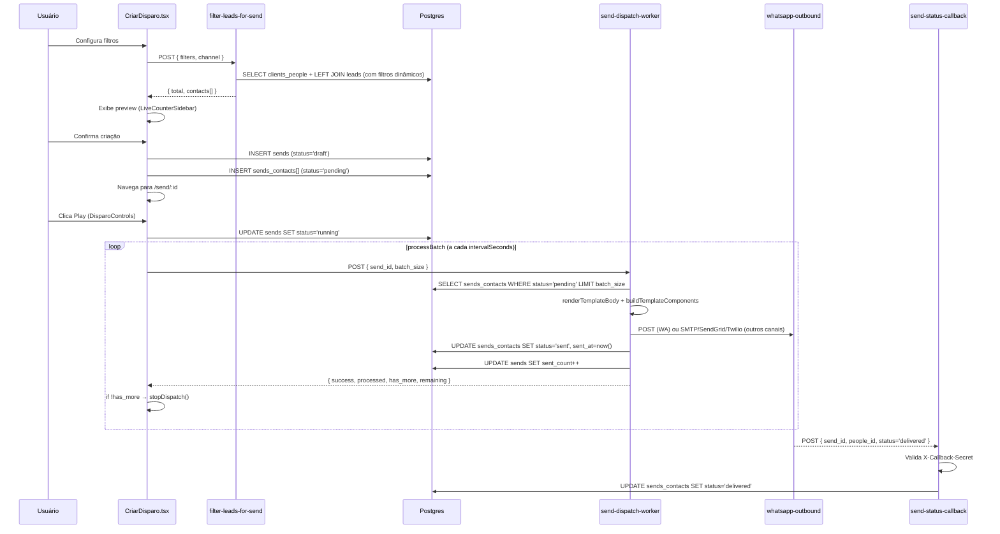
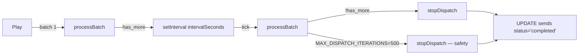

# SENDS PRO — Deep-dive

## 1. Visão e responsabilidade

SENDS PRO é o módulo de broadcast multi-canal. Permite criar campanhas de disparo em massa via WhatsApp, Email, SMS e Telefone para uma audiência filtrada de contatos (`clients_people`). A audiência pode ser definida de duas formas:

1. **Filtrado** — seleção dinâmica por filtros de CRM (pipeline, stage, status, UTM, score, Q-fields, etc.)
2. **Importado** — upload de CSV mapeado para campos de pessoa + opcionalmente criação de leads

O disparo é processado em batches pela edge function `send-dispatch-worker`, com controle de cadência (intervalo configurável em segundos) e via polling do frontend. WhatsApp usa a integração OMNI PRO (whatsapp-outbound via Meta Graph API).

**Responsabilidades exclusivas:**
- Gestão de campanhas (sends) com status lifecycle: `draft → scheduled → running → paused → completed | failed`
- Filtro dinâmico de contatos com query builder server-side (filter-leads-for-send)
- Import de CSV com deduplicação, normalização de telefone e criação opcional de leads
- Dispatch em batch com cadência controlada pelo frontend
- Rastreamento de status por contato (pending → sent → delivered → read | failed)
- Webhooks de evento do tipo `disparo` via `dispara-webhook`

---

## 2. Rotas e páginas

| Rota | Page | Responsabilidade |
|---|---|---|
| `/send` | [[../../../../src/pages/Disparos.tsx]] | Lista de campanhas com KPIs globais (total, running, completed, contacts) |
| `/send/novo` | [[../../../../src/pages/CriarDisparo.tsx]] | Wizard de criação de disparo — canal, audiência, conteúdo, cadência |
| `/send/:id` | [[../../../../src/pages/Disparos.tsx]] | Detalhe de campanha — stats + tabela de contatos + controles de disparo |

**Disparos.tsx (lista + detalhe):**
- `useSends(filters?)` — lista campanhas com JOINs em `leads_pipelines`, `settings_whatsapp_channels`, `settings_users`
- `useSend(id)` — campanha individual para view de detalhe
- `useAtualizarSend()`, `useDeletarSend()`, `useDuplicarSend()` — mutations de gestão
- Tabs no detalhe: Visão Geral | Contatos | Configuração
- `DisparoControls` — botões play/pause/stop que disparam `useSendDispatch()`

**CriarDisparo.tsx:**
- Wizard com steps: Canal → Audiência (Filtro ou Import) → Conteúdo → Cadência → Revisão
- Para WhatsApp: seletor de template + canal WhatsApp (`useWhatsappChannels`, `useWhatsappTemplates`)
- Para Email/SMS/Phone: `Textarea` de conteúdo livre
- `FiltroContatosVisual` — builder visual de filtros com contagem live
- `LiveCounterSidebar` — sidebar que exibe preview dos contatos filtrados em tempo real
- `ImportListaTab` (lazy) — upload CSV com `FileUploadZone` + `FieldMapper` + `ImportPreviewTable`
- `useFilterLeads()` — mutation que chama `filter-leads-for-send` e retorna preview de contatos
- `useCriarSend()` — cria a campanha no DB e insere `sends_contacts`

---

## 3. Componentes principais

Todos em [[../../../../src/components/disparos/]] (ref: [[../../agents/ux/components]]).

| Componente | Arquivo | Responsabilidade |
|---|---|---|
| `CriarDisparoModal` | `disparos/CriarDisparoModal.tsx` | Modal alternativo de criação (fluxo simplificado) |
| `DisparoCard` | `disparos/DisparoCard.tsx` | Card resumo de campanha na lista |
| `DisparoControls` | `disparos/DisparoControls.tsx` | Play/pause/stop — controla `useSendDispatch` |
| `FiltroContatosVisual` | `disparos/FiltroContatosVisual.tsx` | Builder visual de filtros de CRM e Pessoa |
| `FilterWizardStepper` | `disparos/FilterWizardStepper.tsx` | Stepper wrapper do wizard de filtros |
| `FileUploadZone` | `disparos/FileUploadZone.tsx` | Drag-and-drop para CSV |
| `ImportPreviewTable` | `disparos/ImportPreviewTable.tsx` | Preview da tabela CSV antes de confirmar |
| `FieldMapper` / `FieldMappingRow` | `disparos/FieldMapper.tsx`, `FieldMappingRow.tsx` | Mapeamento de colunas CSV para campos de pessoa |
| `LiveCounterSidebar` | `disparos/LiveCounterSidebar.tsx` | Sidebar de contagem live (chama filter-leads-for-send a cada mudança de filtro) |
| `CountdownCircular` | `disparos/CountdownCircular.tsx` | Contador circular do intervalo entre batches |
| `StatCard` / `PerformanceCard` / `ProgressCard` | `disparos/StatCard.tsx`, `PerformanceCard.tsx`, `ProgressCard.tsx` | Cards de métricas da campanha |
| `StatusBadge` | `disparos/StatusBadge.tsx` | Badge de status da campanha |
| `TabelaContatos` | `disparos/TabelaContatos.tsx` | Tabela de contatos do disparo com status individual |
| `ImportListaTab` | `disparos/ImportListaTab.tsx` | Tab de import CSV (lazy-loaded) |
| `CriarComFiltrosTab` | `disparos/CriarComFiltrosTab.tsx` | Tab de filtro dinâmico |
| `SimplifiedFiltersTab` | `disparos/SimplifiedFiltersTab.tsx` | Filtros simplificados para wizard rápido |
| `ChannelSelector` | `disparos/ChannelSelector.tsx` | Seletor de canal (WhatsApp/Email/SMS/Telefone) |
| `ConfiguracaoDisparoTab` | `disparos/ConfiguracaoDisparoTab.tsx` | Configurações gerais do disparo |
| `LeadFiltrosSimples` | `disparos/LeadFiltrosSimples.tsx` | Filtros simples de lead |

**Wizard steps em `disparos/steps/`:**
- `PipelineStep.tsx` — seleção de pipeline e stages
- `EtapasStep.tsx` — filtro por etapas
- `LeadFiltersStep.tsx` — filtros de lead (status, valor, UTM, responsável, time)
- `PessoaFiltersStep.tsx` — filtros de pessoa (score, Q-fields, ai_enabled, accepts_calls)

---

## 4. Hooks de dados

| Hook | Arquivo | Query key | Propósito |
|---|---|---|---|
| `useSends(filters?)` | `useSends.ts` | `['sends', filters]` | Lista campanhas com JOINs. staleTime: 5min; refetchOnMount: 'always' |
| `useSend(id)` | `useSends.ts` | `['send', id]` | Campanha única com JOINs |
| `useCriarSend()` | `useSendMutations.ts` | mutation | Cria `sends` + insere `sends_contacts` em batch; invalida `['sends']` |
| `useAtualizarSend()` | `useSendMutations.ts` | mutation | PATCH em `sends`; invalida `['sends']` e `['send', id]` |
| `useDeletarSend()` | `useSendMutations.ts` | mutation | DELETE em `sends` + cascade `sends_contacts` |
| `useDuplicarSend()` | `useSendMutations.ts` | mutation | Clona campanha sem contatos (status='draft') |
| `useSendContacts(sendId, filters?)` | `useSendContacts.ts` | `['send-contacts', sendId, filters]` | Contatos do disparo com JOIN em clients_people |
| `useSendContactMutations` | `useSendContactMutations.ts` | mutations | Update de status de contato individual |
| `useFilterLeads()` | `useFilterLeads.ts` | mutation | Chama `filter-leads-for-send` via `supabase.functions.invoke` — retorna `FilterResult` |
| `useSendDispatch()` | `useSendDispatch.ts` | mutation + timers | Loop de disparo: chama `send-dispatch-worker` repetidamente com intervalo configurado; controla `MAX_DISPATCH_ITERATIONS=500` e `DEFAULT_BATCH_SIZE=1` |
| `useValidateWebhook()` | `useSendDispatch.ts` | mutation | Chama `send-dispatch-worker` com `validate_only: true` |
| `useSendWebhooks()` | `useSendWebhooks.ts` | `['send-webhooks']` | Lista webhooks de sends em `sends_webhooks` |
| `useCreateWebhook()` | `useSendWebhooks.ts` | mutation | Cria webhook |

**Nota sobre useSendDispatch:** O hook implementa o loop de disparo inteiramente no frontend via `setInterval`. Não existe cron ou worker server-side gerenciando o progresso — o frontend deve permanecer aberto. `stopDispatch()` é chamado no `useEffect` cleanup (desmontagem do componente).

---

## 5. Edge functions

| Função | verify_jwt | Responsabilidade |
|---|---|---|
| `filter-leads-for-send` | false (valida JWT em código) | Query builder dinâmico — recebe `SendFilters` + `channel` + `limit` + `offset`. Valida JWT via `supabase.auth.getUser(token)` e exige role `gestor` ou `super_admin`. Retorna `{ total, contacts[], has_more, offset, limit }`. |
| `send-dispatch-worker` | false (valida JWT em código) | Worker de batch. Recebe `{ send_id, batch_size, validate_only }`. Se `validate_only=true`, apenas valida webhook. Renderiza template WA com variáveis (`resolveTemplateVar`), constrói `components[]` para Meta API, despacha via whatsapp-outbound (WA) ou email/SMS/phone direto. Atualiza `sends_contacts.status` e `sends.sent_count/failed_count`. |
| `sends-import-contacts` | false (valida JWT em código) | Importação CSV. Normaliza telefones (últimos 11 dígitos), deduplica por `whatsapp/email`, cria `clients_people` inexistentes, opcionalmente cria `leads` e `lead_field_values`, rastreia progresso em `sends_import_sessions`. Retorna `people_ids[]` para popular `sends_contacts`. |
| `send-status-callback` | false (valida por shared secret `X-Callback-Secret`) | Callback de status de entrega. Atualiza `sends_contacts.status` (sent/delivered/read/failed). Autentica via `SEND_CALLBACK_SECRET` env var — NÃO usa JWT. |
| `dispara-webhook` | true | Webhook de evento para tipo `disparo`. Enriquece payload com lead, pessoa, empresa, lead_field_values e custom fields antes de chamar a URL configurada em `omni_outbound_webhooks`. |

### filter-leads-for-send — Query Builder Dinâmico

A função constrói uma única query Supabase partindo de `clients_people` com LEFT JOIN em `leads`:

```
clients_people
  └── leads (LEFT JOIN — todos os contatos, incluindo sem leads)
        ├── leads.leads_pipelines_id
        ├── leads.leads_stages_id
        ├── leads.status (in_progress/won/lost)
        ├── leads.user_id
        ├── leads.teams_id
        ├── leads.value (range)
        └── leads.created_at (range)
```

**Lógica de inclusão:** `needsLeadFilter` é `true` quando qualquer filtro de lead é passado. Se `needsLeadFilter=true`, pessoas sem `leads` correspondentes são excluídas. Se `needsLeadFilter=false`, todos os contatos ativos com o campo de canal preenchido são incluídos.

**Filtros de pessoa:** `name/email` via `ilike` sanitizado (escapa `%`, `_`, `\`); `status`, `service_status`, `accepts_calls`, `ai_enabled`; score dimensions por UUID; Q-fields B2B via `ilike`.

**Limites operacionais:**
- `limit` máximo: 1000 por chamada
- `stage_ids` máximo: 50 UUIDs
- `user_id` / `team_id` máximo: 50 UUIDs
- Apenas `gestor` ou `super_admin` podem chamar
- Q-field filters: somente `q1-q6`, `q19`, `q21-q22` (não todos os 25)
- Filtros de UTM: `utm_source/medium/campaign` e `followup_status`

**Deduplicação:** resultado é passado por `Map<people_id, contact>` — cada pessoa aparece apenas uma vez, com o primeiro lead encontrado.

---

## 6. Schema e tabelas

Ref: [[../../agents/data-engineer/schema]]

### Tabelas principais

**`sends`** — Campanha de disparo
| Coluna | Tipo | Notas |
|---|---|---|
| `id` | uuid | PK |
| `name` | text | Nome da campanha |
| `type` | text | `imported | filtered` |
| `channel` | text | `whatsapp | email | sms | phone` |
| `template_id` | text | UUID de `whatsapp_templates` (armazenado como text, sem FK constraint) |
| `pipeline_id` | uuid | FK → `leads_pipelines` |
| `stage_ids` | uuid[] | Array de stage IDs (sem FK constraint) |
| `webhook_id` | uuid | FK → `sends_webhooks` (webhook de evento `disparo`) |
| `wa_channel_id` | uuid | FK → `settings_whatsapp_channels` |
| `message_content` | text | Conteúdo para canais não-WhatsApp |
| `status` | text | `draft | scheduled | running | paused | completed | failed` |
| `total_contacts` | int | Populado ao criar a campanha |
| `sent_count` | int | Incrementado pelo worker |
| `failed_count` | int | Incrementado pelo worker |
| `send_interval_seconds` | int | Cadência entre batches |
| `filter_config` | jsonb | Snapshot dos filtros usados (tipo `SendFilters`) |
| `scheduled_at` | timestamptz | Para campanhas agendadas |
| `started_at` | timestamptz | Quando o disparo foi iniciado |
| `completed_at` | timestamptz | Quando finalizou |
| `created_by` | uuid | FK → `settings_users` |

**`sends_contacts`** — Contatos de um disparo
| Coluna | Tipo | Notas |
|---|---|---|
| `id` | uuid | PK |
| `send_id` | uuid | FK → `sends` |
| `people_id` | uuid | FK → `clients_people` |
| `whatsapp` | text | Campo de contato genérico (armazena email/phone/whatsapp dependendo do canal) |
| `status` | text | `pending | sent | delivered | read | failed | invalid` |
| `error_message` | text | Mensagem de erro do worker |
| `retry_count` | int | Tentativas (0 = primeira, max 3) |
| `sent_at` | timestamptz | Quando foi enviado |
| `delivered_at` | timestamptz | Entregue (via callback) |
| `read_at` | timestamptz | Lido (via callback) |

**`sends_import_sessions`** — Sessões de importação CSV
- `status`: `processing | done | failed`
- `total_rows`, `processed`, `new_people`, `existing_people`, `failed_rows`
- Trigger: `trg_sends_import_sessions_updated_at`

**`sends_webhooks`** — Webhooks para eventos de disparo
- Tabela separada de `omni_outbound_webhooks` — específica para eventos `disparo`

### RLS Strategy

As tabelas `sends` e `sends_contacts` usam RLS padrão do schema moderno. `sends_contacts` não possui tipos gerados automaticamente no Supabase client — todos os hooks fazem cast `(supabase as any)`.

---

## 7. Fluxos críticos

### 7.1 Criação de campanha filtrada → disparo → callback



### 7.2 Import CSV

```mermaid
flowchart TB
    A[FileUploadZone — drag CSV] --> B[FieldMapper — mapeia colunas]
    B --> C[ImportPreviewTable — preview]
    C --> D[sends-import-contacts]
    D --> E{Normaliza telefone<br/>últimos 11 dígitos}
    E --> F{Dedup por whatsapp/email/phone}
    F -->|Existe| G[Usa existing clients_people]
    F -->|Novo| H[INSERT clients_people]
    G & H --> I{create_leads=true?}
    I -->|Sim| J[INSERT leads + lead_field_values]
    I -->|Não| K[Pula leads]
    J & K --> L[sends_import_sessions — progress]
    L --> M[Retorna people_ids[]]
    M --> N[Frontend popula sends_contacts]
```

### 7.3 Cadência do disparo (loop frontend)



**Invariante crítica:** O loop roda no browser. Se o usuário fechar a aba durante um disparo, o disparo para. O banco fica com `sends.status='running'` e contatos pendentes. Para retomar, o usuário deve clicar Play novamente — o worker continua de onde parou (busca `sends_contacts WHERE status='pending'`).

---

## 8. Integrações externas

| Sistema | Ponto de integração |
|---|---|
| **Meta Graph API (WhatsApp)** | `send-dispatch-worker` chama `whatsapp-outbound` que usa `credentials.messaging_product=whatsapp`. Template WA aprovado obrigatório. |
| **Meta Graph API (WhatsApp)** — callbacks | `send-status-callback` recebe status `delivered/read` via webhook da Meta configurado no número WA |
| **SMTP (Email)** | `send-dispatch-worker` usa `denomailer` — configurado em `omni_channel_configs` (channel='email') |
| **SendGrid (Email)** | `send-dispatch-worker` — alternativa ao SMTP via API key |
| **Twilio (SMS)** | `send-dispatch-worker` — via `Messages API` |
| **Twilio (Phone/Voice)** | `send-dispatch-worker` — via `Programmable Voice` com `<Say>` TwiML |
| **OMNI PRO** | WhatsApp enviado via `whatsapp-outbound` — compartilha infra com OMNI PRO. Mensagem aparece no histórico de conversas da pessoa |
| **CRM PRO** | `filter-leads-for-send` filtra `clients_people` com JOIN em `leads` do CRM |

---

## 9. Estado atual e débito técnico

| Item | Severidade | Descrição |
|---|---|---|
| **Loop de disparo no frontend** | Alta | `useSendDispatch` usa `setInterval` no browser. Se a aba fechar, o disparo para. Não há retomada automática server-side. Campanhas grandes ficam vulneráveis a interrupções. |
| **sends_contacts sem tipos gerados** | Média | Tabela não está nos tipos auto-gerados do Supabase. Todos os hooks fazem `(supabase as any)`. Risco de divergência silenciosa. |
| **template_id como text sem FK** | Média | `sends.template_id` referencia `whatsapp_templates` mas sem FK constraint — risco de referência a template deletado. |
| **stage_ids como array sem FK** | Média | `sends.stage_ids` é `uuid[]` sem FK — stages podem ser deletados sem invalidar campanhas. |
| **Filtros Q-field incompletos** | Baixa | `filter-leads-for-send` aceita apenas `q1-q6`, `q19`, `q21-q22`. Os demais Q-fields (q7-q18, q20, q23-q25) não são filtráveis por send. |
| **Sem retry automático no worker** | Média | `send-dispatch-worker` marca como `failed` após erro, mas não existe mecanismo de retry automático server-side. `retry_count` existe no schema mas não há lógica de reprocessamento de falhos. |
| **Sem agendamento server-side** | Média | `scheduled_at` existe no schema mas `pg_cron` não está configurado para disparar campanhas agendadas — campo seria usado por lógica de frontend ou futura edge function. |
| **send-status-callback com shared secret** | Baixa/Observação | Autenticação por `X-Callback-Secret` — mais fraco que JWT. Seguro apenas se o secret não vazar. Considerar rotação periódica via Vault. |

---

## 10. Stories candidatas / ADRs relevantes

**Stories candidatas:**
- Worker server-side para loop de disparo — eliminar dependência do browser (pg_cron + edge function)
- Retry automático de contatos `failed` (max 3 tentativas com backoff)
- Agendamento server-side de campanhas (`scheduled_at` + pg_cron)
- Gerar tipos Supabase para `sends_contacts` — remover casts `(supabase as any)`
- Adicionar FK constraint em `sends.template_id → whatsapp_templates`
- Expandir filtros Q-field no `filter-leads-for-send` para cobrir Q7-Q18, Q20, Q23-Q25
- Rotate `SEND_CALLBACK_SECRET` via Vault (alinhado ao ADR-SP-05)

**ADRs relevantes:**
- [[../../decisions/ADR-SP-05-service-role-credentials-vault]] — gerenciamento de secrets via Vault; aplicável ao `SEND_CALLBACK_SECRET`
- [[../../decisions/ADR-PP-03-server-verified-tenant-id]] — padrão de autenticação JWT em edge functions; `filter-leads-for-send` e `sends-import-contacts` já seguem este padrão
