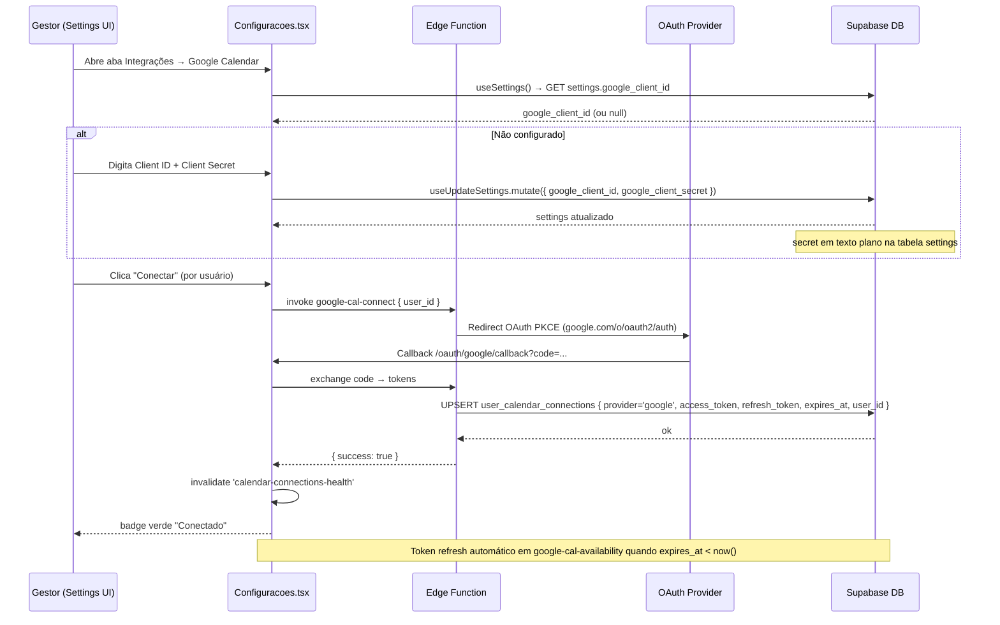

# Settings (Configurações) — Deep Dive

> Nível: "novo dev abre e produz em 1 dia."
> Paths absolutos. Read-only discovery — 2026-04-22.

---

## 1. Visão e Responsabilidade

Settings é o **painel de administração do tenant** — o único ponto de onde gestores configuram todo o comportamento do produto. Ela não é um módulo de produto em si: é a camada de configuração transversal que habilita e customiza todos os módulos PRO.

**Hierarquia de configuração:**

| Nível | Onde é salvo | Quem controla | Exemplos |
|---|---|---|---|
| **Sistema / Control Plane** | `adm_clients.enabled_modules` + secrets ADM | super_admin via `/adm` | quais módulos estão habilitados por tenant |
| **Tenant** | `settings`, `bi_settings`, `omni_channel_configs`, `settings_elevenlabs`, `settings_ai_providers`, `call_pro_settings`, `score_settings`, `coach_ai_settings` | gestor via `/settings` | nome da empresa, integrações OAuth, pipelines, score matrix |
| **Usuário** | `settings_users`, `user_calendar_connections`, `crm_horarios` | usuário via `/profile` + `/schedules` | horários de disponibilidade, conexão pessoal de calendário |

**Regra de acesso:** toda a rota `/settings` está envolta em `<RestrictedRoute requireGestor={true}>` — apenas `gestor` e `super_adm` têm acesso. Consultores e clientes nunca veem essa página.

---

## 2. Rotas e Páginas

### Arquivo principal
`/Users/joaoramos/Desktop/Projetos/Sistemas/rev-os/src/pages/Configuracoes.tsx`

### URL structure

Todas as rotas em `src/App.tsx` mapeiam para `<Configuracoes />` (mesmo componente, seção ativa inferida da URL):

```
/settings                         → geral
/settings/crm/pipelines           → pipelines
/settings/crm/motivos             → motivos
/settings/crm/followups           → followups (renderiza <Followups />)
/settings/crm/campos-extras       → campos-extras
/settings/crm/score               → score
/settings/crm/aiagents            → agentes-ia (renderiza <AgentesIA />)
/settings/crm/aiagents/:id        → AgenteSingle (fora da Configuracoes, rota separada)
/settings/crm/conversoes          → conversoes
/settings/omni/email              → omni-email
/settings/omni/instagram          → omni-instagram
/settings/omni/sms                → omni-sms
/settings/omni/call               → omni-call
/settings/omni/dedup              → omni-dedup
/settings/omni/whatsapp-log       → whatsapp-log (legacy deep link)
/settings/coach/config            → coach
/settings/schedule/distribuicao   → schedule-distribuicao
/settings/schedule/automacoes     → schedule-automacoes
/settings/general/config          → geral
/settings/general/usuarios        → usuarios
/settings/general/times           → times
/settings/general/integracoes     → integracoes
/settings/general/design-system   → integracoes (redirect)
/settings/general/ai-providers    → integracoes (redirect)
/settings/general/outros          → outros
/settings/general/webhooks        → integracoes (redirect)
```

**Legacy redirects** (mapeados internamente em `getActiveSectionFromUrl`):
- `/settings/omni/whatsapp` → `integracoes`
- `/settings/omni/meta` → `integracoes`
- `/settings/schedule/google` → `integracoes`
- `/settings/schedule/teams` → `integracoes`
- `/settings/bi/ads` → `integracoes`
- `/settings/prospect/integracao` → `integracoes`
- `/settings/lp/config` → `integracoes`
- `/settings/general/logs` → `outros`
- `/settings/call/config` → `omni-call`

### Layout da página

```
┌────────────────────────────────────────────────────────────────────┐
│  DashLayout sidebar (240px)                                         │
├──────────────────┬─────────────────────────────────────────────────┤
│  Left nav        │  Content panel                                   │
│  w-60, sticky    │  flex-1, overflow-auto                           │
│  border-r        │  p-8 max-w-3xl  (maioria)                        │
│                  │  p-8 max-w-5xl  (score/integracoes/outros/coach) │
│  CRM PRO™        │  p-0 max-w-none (agentes-ia, agenteSingle)       │
│    Pipelines     │                                                   │
│    Motivos       │  <Suspense fallback=spinner>                      │
│    Follow-ups    │    {renderContent()}                              │
│    Campos extras │  </Suspense>                                      │
│    Score         │                                                   │
│    AI Agents     │  v{__APP_VERSION__} (rodapé, exceto agentes-ia)  │
│    Conversões    │                                                   │
│  OMNI PRO™       │                                                   │
│    Email         │                                                   │
│    Instagram     │                                                   │
│    Call          │                                                   │
│    SMS           │                                                   │
│    Dedup Health  │                                                   │
│  COACH PRO™      │                                                   │
│    CoachPRO™     │                                                   │
│  SCHEDULE PRO™   │                                                   │
│    Distribuição  │                                                   │
│    Automações    │                                                   │
│  Geral           │                                                   │
│    Geral         │                                                   │
│    Usuários  ●   │                                                   │
│    Times         │                                                   │
│    Integrações   │                                                   │
│    Outros        │                                                   │
└──────────────────┴─────────────────────────────────────────────────┘
```

Todos os painéis são **lazy-loaded** via `React.lazy` + `<Suspense>`. O spinner fallback é um círculo animado com `border-b-2 border-primary`.

---

## 3. Estrutura dos 22 Painéis de Nível 1

> Nota: "50+ painéis" inclui os sub-tabs dentro de cada seção. A contagem de seções de nível 1 na sidebar é 22.

### 3.1 Mapa completo com componentes e hooks

| Seção (sidebar) | Grupo | Componente raiz | Sub-tabs / sub-componentes | Hook(s) principal | Tabela DB | Edge fn associada |
|---|---|---|---|---|---|---|
| **Geral** | Geral | `GeralConfig` | — | `useSettings`, `useUpdateSettings`, `useUploadLogo` | `settings`, `logos` | — |
| **Usuários** | Geral | `UsuariosConfig` | — | `useUsers`, `useInviteUser`, `useDeleteUser` | `settings_users` | `create-tenant-user`, `delete-user`, `send-invite-email` |
| **Times** | Geral | `TimesConfig` | — | `useTimes`, `useCreateTime`, `useUpdateTime` | `settings_teams`, `settings_users_teams` | — |
| **Integrações** | Geral | `IntegracoesConfig` | 10 tabs: Meta, TikTok, Google Ads, Google Calendar, Microsoft Teams, Zoom, Prospect PRO, Provedores IA, ElevenLabs, tl;dv | múltiplos (ver §3.2) | múltiplas (ver §3.2) | múltiplas OAuth (ver §6) |
| **Outros** | Geral | `OutrosConfig` | 3 tabs: Links Úteis, Logs, Documentação | — / `LogsViewer` / `SystemDocConfig` | — | `logs-proxy` |
| **Pipelines** | CRM PRO™ | `PipelinesConfig` | — | `usePipelines`, `useCreatePipeline`, `useUpdatePipeline`, `useDeletePipeline` | `leads_pipelines`, `leads_stages` | — |
| **Motivos** | CRM PRO™ | `MotivosConfig` | — | `useMotivosPerda` | `leads_loss_reasons` | — |
| **Follow-ups** | CRM PRO™ | `Followups` (full page) | — | `useFollowups`, `useFollowupQueue`, `useStageFollowups` | `crm_stage_followups`, `leads_stages_followups` | `followup-enqueue`, `followup-trigger-worker` |
| **Campos Extras** | CRM PRO™ | `CamposExtrasConfig` | — | `useCamposExtras`, `useLeadFieldDefinitions` | `crm_campos_personalizados`, `crm_field_definitions` | — |
| **Score** | CRM PRO™ | `ScoreConfig` → sub-cards | 5 cards: Base, Categorias, Objetivos, Investimentos, Enquadramentos | `useScoreSettings`, `useScoreCategories`, `useScoreObjectives`, `useScoreInvestments`, `useScoreFramings`, `useScoreMatrix` | `score_settings`, `score_objectives`, `score_incomes`, `score_framings`, `score_matrix` | — |
| **AI Agents** | CRM PRO™ | `AgentesIA` (full page embutida) | Tabs por agente + central de testes | `useAgentesIA`, `useAIAgentPrompts`, `useAIAgentHistory` | `ai_agents`, `ai_agents_steps`, `ai_agents_history` | `ai-agent-execute` |
| **Conversões** | CRM PRO™ | `ConversionTrackingConfig` | — | `useConversionTracking` | `conversion_platform_credentials`, `conversion_stage_mappings`, `conversion_events_queue`, `conversion_event_rules` | `conversion-fetch-platforms`, `conversion-send` |
| **Email** | OMNI PRO™ | `EmailMegaConfig` | Seções: Provider (smtp/sendgrid/webhook), Webhook fallback, Horários, New Contact | `useOmniChannelConfig('email')`, `useUpdateOmniChannelConfig` | `omni_channel_configs` (channel='email') | `channel-test-send` |
| **Instagram** | OMNI PRO™ | `InstagramMegaConfig` | Seções: Conexão OAuth, Webhook, Automações, New Contact | `useOmniChannelConfig('instagram')`, `useInstagramTokenStatus`, `useBIProSettings` | `omni_channel_configs` (channel='instagram') | `instagram-oauth`, `instagram-token-refresh` |
| **Call (OMNI)** | OMNI PRO™ | `CallMegaConfig` | 6 sub-tabs: Integração, Operadores, Filas, Tabulação, Tags, Follow-ups | `useOmniChannelConfig`, `useCallProSettings`, `useCallProOperators`, `useCallProTabulationCategories`, `useUsers` | `omni_channel_configs`, `call_pro_settings`, `call_pro_operator_mappings`, `call_pro_tabulation_categories`, `call_pro_as_queues` | `call-pro-webhook` |
| **SMS** | OMNI PRO™ | `SmsMegaConfig` | Seções: Provider, Webhook fallback, New Contact | `useOmniChannelConfig('sms')`, `useUpdateOmniChannelConfig` | `omni_channel_configs` (channel='sms') | — |
| **Dedup Health** | OMNI PRO™ | `OmniDedupHealthConfig` | — | `useOmniDedupHealth` | `omni_channel_configs`, `clients_people` | `omni-merge-person` |
| **CoachPRO™** | COACH PRO™ | `CoachProConfig` | Configurações de IA, email automático, playbooks | `useCoachConfig` | `coach_ai_settings`, `playbooks`, `playbook_templates` | `coach-email`, `coach-evaluate` |
| **Distribuição** | SCHEDULE PRO™ | `BookingDistribuicaoConfig` | Sub-seções: regras por usuário, distribuição round-robin | `useBookingRuleSets`, `useBookingDistribuicao` | `settings_schedules` (horários) | — |
| **Automações (Schedule)** | SCHEDULE PRO™ | `ScheduleAutomacoesConfig` | — | `useScheduleAutomations` | `schedule_automations` | `meeting-followup-auto-setup` |
| **WhatsApp Log** | — (legacy deep link) | `WhatsappLogConfig` | — | `useWhatsappLog` | `crm_messages` (filtro canal=whatsapp) | — |
| **Módulos** (não na sidebar) | — | `ModulosConfig` (em GeralConfig ou standalone?) | lista de módulos ativos | `useSystemModules` | `settings_system_modules` | `adm-sync-client` |

### 3.2 Integrações — 10 sub-tabs em detalhe

| Tab | Componente | Hook(s) | Tabela | Edge fn |
|---|---|---|---|---|
| **Meta** | `MetaIntegrationConfig` | `useBIProSettings`, query direto `bi_settings` | `bi_settings` (meta_system_token), `omni_channel_configs` (WhatsApp + Instagram sub-tabs) | `meta-save-credentials`, `meta-pages-list`, `meta-pages-subscribe` |
| **TikTok** | `TikTokIntegrationConfig` | `useBIProSettings` | `bi_settings` | `tiktok-oauth` |
| **Google Ads** | `AdsConfig` (platform="google") | `useBIProSettings`, `useBIAdAccounts` | `bi_settings`, `bi_ad_accounts` | `bi-google-oauth`, `bi-sync-google-ads` |
| **Google Calendar** | `GoogleConfig` | `useSettings`, `useCalendarConnectionsHealth` | `settings` (google_client_id/secret), `user_calendar_connections` | `google-cal-connect`, `google-cal-availability` |
| **Microsoft Teams** | `TeamsConfig` | `useMSTeamsStatus` | `user_calendar_connections` (provider='microsoft') | `ms-teams-connect` |
| **Zoom** | `ZoomConfig` | `useZoomConnection` | `user_calendar_connections` (provider='zoom'), `bi_settings` (zoom_*) | `zoom-connect` |
| **Prospect PRO** | `ProspectConfig` | `useProspectProviders`, `useSettings` | `settings` (explorium_api_key, apollo_api_key, pdl_api_key) | `prospect-test-connection` |
| **Provedores IA** | `AIProvidersConfig` | `useAIProviders` | `settings_ai_providers` | — |
| **ElevenLabs** | `ElevenLabsConfig` | `useElevenLabsConfig`, `useElevenLabsVoices`, `useElevenLabsAgents` | `settings_elevenlabs`, `elevenlabs_voices` | `elevenlabs-agent-sync`, `elevenlabs-sync` |
| **tl;dv** | `TldvIntegrationConfig` | `useTldvConfig` | `omni_channel_configs` (channel='tldv') | `tldv-sync`, `tldv-webhook` |

---

## 4. Padrões de UI Repetidos

### 4.1 FieldRow — padrão dominante nos painéis simples

Definido inline em `GeralConfig.tsx` e re-implementado em `OutrosConfig.tsx` (duplicação — ver §9):

```tsx
// Label esquerda (w-44) + controle direita (flex-1, justify-end)
// Separados por border-b exceto o último (last prop)
<FieldRow label="Nome da empresa" hint="Aparece no header">
  <Input className="w-64 h-[30px] text-[13px]" />
</FieldRow>
```

**Variações observadas:**
- Input de texto (nome, email, CNPJ, website, endereço)
- Select (fuso horário, idioma, moeda, provedor WhatsApp)
- Textarea (descrição)
- Upload de logo (hidden `<input type="file">` + preview com `` + botão de deletar)

### 4.2 SectionHeader — separador visual de seção

```tsx
// bg-muted, border-b, uppercase, tracking-widest, 10px
<SectionHeader title="EMPRESA" />
```

Também duplicado entre `GeralConfig` e `OutrosConfig`.

### 4.3 Painel com Tabs internas (MegaConfig pattern)

Usado em: `IntegracoesConfig`, `CallMegaConfig`, `MetaIntegrationConfig`, `OutrosConfig`.

```tsx
// shadcn Tabs com URL sync via useSearchParams
<Tabs value={currentTab} onValueChange={handleTabChange}>
  <TabsList className="h-auto w-full justify-start gap-0 bg-muted border rounded-[2px] p-1 flex-wrap">
    <TabsTrigger className="text-[11px] h-[26px] px-3 data-[state=active]:bg-background data-[state=active]:rounded-[3px]">
  </TabsList>
  <TabsContent>
    <Suspense fallback={<Spinner />}>
      <LazyComponent />
    </Suspense>
  </TabsContent>
</Tabs>
```

**Padrão de persistência de tab:** `?tab=valor` no searchParams. `IntegracoesConfig` usa `?tab=`, `MetaIntegrationConfig` usa `?meta-section=`, `CallMegaConfig` usa estado local (`useState`).

### 4.4 Secret input — campos de credencial

Padrão consistente para campos sensíveis (API keys, client secrets):

```tsx
// Toggle show/hide com Eye/EyeOff + Input type=password ou text
const [showSecret, setShowSecret] = useState(false);
<div className="relative">
  <Input
    type={showSecret ? "text" : "password"}
    value={clientSecret}
    onChange={e => setClientSecret(e.target.value)}
    className="h-[30px] text-[13px] pr-9 font-mono"
    placeholder="••••••••"
  />
  <button onClick={() => setShowSecret(v => !v)} className="absolute right-2 top-2">
    {showSecret ? <EyeOff /> : <Eye />}
  </button>
</div>
```

**Masking pattern em listas** (ex: WhatsappChannelsConfig):
```tsx
const tokenPreview = (token) => `${token.slice(0, 8)}${'•'.repeat(8)}`;
// Com toggle full reveal via <MaskedToken /> component
```

**Importante:** Secrets salvos na tabela `settings` (colunas `google_client_secret`, `explorium_api_key`, `apollo_api_key`, `pdl_api_key`) ficam em texto plano no banco. Google secret via `useSettings` / `useUpdateSettings`. **Sem Vault** para esses campos — diferente dos tokens de cron que foram movidos para Vault em `move_cron_jwt_to_vault` (migration 2026-04-22).

### 4.5 CopyRow / CopyField — copyable read-only

Padrão para exibir webhooks e URLs:

```tsx
// Input readOnly + botão Copy com feedback checkmark temporário (2s)
<Input value={webhookUrl} readOnly className="h-[30px] text-xs font-mono bg-muted" />
<Button size="icon" variant="ghost" onClick={copy}>
  {copied ? <Check className="w-3.5 h-3.5 text-green-500" /> : <Copy />}
</Button>
```

Implementado como `CopyRow` em `MetaIntegrationConfig` e `CopyField` em `InstagramMegaConfig` — funcionalidade idêntica, dois componentes distintos.

### 4.6 OAuth connection card

Padrão para integrações OAuth (Google Calendar, Teams, Zoom):
1. Badge de status (CheckCircle2 verde / AlertCircle vermelho / Loader2)
2. Campo de Client ID (validação de formato inline, ex: `.includes(".apps.googleusercontent.com")`)
3. Campo de Client Secret (secret input com show/hide)
4. Botão "Salvar" que chama `useUpdateSettings.mutate()`
5. Seção "Como configurar" com `Collapsible` expandível (guia passo-a-passo)
6. Lista de usuários conectados (via `useCalendarConnectionsHealth`)
7. Botão "Conectar" por usuário (abre OAuth popup ou redirect)

### 4.7 ChannelHealthBadge

Componente compartilhado entre `CallMegaConfig`, `EmailMegaConfig`, `InstagramMegaConfig`:
`/Users/joaoramos/Desktop/Projetos/Sistemas/rev-os/src/components/config/ChannelHealthBadge.tsx`

Exibe status do canal (ativo/inativo/erro) com badge colorida.

### 4.8 NewContactSection

Sub-seção reutilizada em todos os MegaConfigs de canal (Email, Instagram, Call, SMS):
`/Users/joaoramos/Desktop/Projetos/Sistemas/rev-os/src/components/config/NewContactSection.tsx`

Configura comportamento ao receber mensagem de contato desconhecido: criar pessoa automaticamente, pipeline destino, stage inicial.

Hook: `useOmniNewContactSettings` → tabela `settings_omni_new_contact`.

### 4.9 WebhookPanel

Seção recorrente em MegaConfigs: URL de webhook para fallback de delivery (quando o canal nativo não está configurado). Inclui URL + método HTTP + template de payload (Textarea).

---

## 5. Hooks de Configuração

| Hook | Arquivo | Tabela DB | Finalidade |
|---|---|---|---|
| `useSettings` | `src/hooks/useSettings.ts` | `settings` | Configurações gerais do tenant (singleton). Campos: company_name, logo_url, whatsapp_provider, timezone, language, currency, tax_id, website, email, phone, address, google_client_id/secret, explorium/apollo/pdl api_keys |
| `useUpdateSettings` | `src/hooks/useSettings.ts` | `settings` | Mutation: upsert na tabela settings (cria se não existe) |
| `useUploadLogo` | `src/hooks/useSettings.ts` | `logos` (Storage) | Upload de logo para Supabase Storage |
| `useConfiguracoesGerais` | `src/hooks/useSettings.ts` | `settings` | Re-export de `useSettings` (alias legacy) |
| `useSettingsCompat` | `src/hooks/useSettingsCompat.ts` | `settings` + `bi_settings` | Bridge: lê `settings` com fallback para `bi_settings` para backward-compat de campos migrados |
| `useGoogleOAuthConfig` | `src/hooks/useGoogleOAuthConfig.ts` | `settings` → fallback `bi_settings` | Lê google_client_id para PKCE OAuth; fallback para bi_settings pré-migração |
| `useOmniChannelConfig(channel)` | `src/hooks/useOmniChannelConfig.ts` | `omni_channel_configs` | Lê/atualiza config de canal específico (email/instagram/sms/whatsapp/call/tldv) |
| `useOmniNewContactSettings` | `src/hooks/useOmniNewContactSettings.ts` | `settings_omni_new_contact` | Config de criação automática de contato via Omni |
| `useElevenLabsConfig` | `src/hooks/useElevenLabsConfig.ts` | `settings_elevenlabs`, `elevenlabs_voices` | Credenciais ElevenLabs + lista de vozes disponíveis |
| `useWebhooks` | `src/hooks/useWebhooks.ts` | `webhooks`, `webhook_logs` | CRUD de webhooks de saída + logs |
| `useBIProSettings` | `src/hooks/useBIProSettings.ts` | `bi_settings` | Configurações BI: meta_system_token, zoom_*, TikTok tokens, Google Ads OAuth tokens |
| `useCallProSettings` | `src/hooks/useCallProSettings.ts` | `call_pro_settings` | Configurações do Call PRO (provider, webhook events, etc.) |
| `useCallProOperators` | `src/hooks/useCallProOperators.ts` | `call_pro_operator_mappings` | Mapeamento ramal ↔ usuário |
| `useCallProTabulationCategories` | `src/hooks/useCallProTabulationCategories.ts` | `call_pro_tabulation_categories` | Categorias de tabulação de chamadas |
| `useScoreSettings` / `useScore*` | `src/hooks/useScore*.ts` | `score_settings`, `score_objectives`, `score_incomes`, `score_framings`, `score_matrix` | Score matrix completa |
| `useSystemModules` | `src/hooks/useSystemModules.ts` | `settings_system_modules` | Feature flags de módulos ativos por tenant |
| `useScheduleAutomations` | `src/hooks/useScheduleAutomations.ts` | `schedule_automations` | Automações de pipeline por status de reunião |
| `useBookingRuleSets` | `src/hooks/useBookingRuleSets.ts` | `settings_schedules` | Regras de disponibilidade para booking público |
| `usePipelines` / `useUpdatePipeline` | `src/hooks/usePipelines.ts` | `leads_pipelines`, `leads_stages` | CRUD de pipelines e etapas |
| `useMotivosPerda` | `src/hooks/useMotivosPerda.ts` | `leads_loss_reasons` | Motivos de perda configuráveis |
| `useConversionTracking` | (inferido de `ConversionTrackingConfig`) | `conversion_platform_credentials`, `conversion_stage_mappings` | Credenciais + mapeamentos de conversão Meta/Google |
| `useTimes` | `src/hooks/useTimes.ts` | `settings_teams`, `settings_users_teams` | Times e membros |
| `useAIProviders` | (inferido de `AIProvidersConfig`) | `settings_ai_providers` | Provedores LLM configurados |

---

## 6. Edge Functions Associadas

### OAuth — fluxos de conexão externa

| Edge fn | Trigger | Finalidade | Notes |
|---|---|---|---|
| `bi-google-oauth` | botão "Conectar Google Ads" | OAuth PKCE para Google Ads API | verify_jwt=true |
| `bi-meta-oauth` | botão "Conectar Meta Ads" | OAuth para Meta Graph API (ads) | verify_jwt=true |
| `instagram-oauth` | botão "Conectar Instagram" | OAuth Instagram via Meta App | verify_jwt=true |
| `tiktok-oauth` | botão "Conectar TikTok" | OAuth TikTok for Business | verify_jwt=true |
| `google-cal-connect` | botão "Conectar Google Calendar" (por usuário) | OAuth PKCE Google Calendar por usuário | escreve em user_calendar_connections |
| `ms-teams-connect` | botão "Conectar Microsoft Teams" | OAuth Microsoft por usuário | escreve em user_calendar_connections |
| `zoom-connect` | botão "Conectar Zoom" | OAuth Zoom por usuário | escreve em user_calendar_connections (provider='zoom') |

### Credenciais / salvar secrets

| Edge fn | Trigger | Finalidade |
|---|---|---|
| `meta-save-credentials` | salvar system token Meta | Persiste meta_system_token em bi_settings |
| `meta-pages-list` | load da aba Meta | Lista páginas FB associadas ao token |
| `meta-pages-subscribe` | ação "Subscrever webhook" | Registra webhook na página FB |
| `elevenlabs-agent-sync` | salvar config ElevenLabs | Sincroniza agentes ElevenLabs na conta |
| `elevenlabs-sync` | trigger de config | Sincroniza vozes disponíveis |
| `prospect-test-connection` | botão "Testar" em ProspectConfig | Valida API keys Apollo/PDL/Explorium |

### Usuários

| Edge fn | Trigger | Finalidade |
|---|---|---|
| `create-tenant-user` | `UsuariosConfig` → criar usuário | Provisiona usuário no tenant (e no Supabase Auth) |
| `delete-user` | `UsuariosConfig` → remover usuário | Remove usuário do Auth e do DB |
| `send-invite-email` | `ConvidarUsuarioModal` | Envia email de convite para novo usuário |
| `update-user-email` | `EditarUsuarioModal` | Atualiza email no Auth |
| `update-user-password` | `EditarUsuarioModal` | Reset de senha de usuário |

### Outros

| Edge fn | Trigger | Finalidade |
|---|---|---|
| `conversion-fetch-platforms` | `ConversionTrackingConfig` load | Busca plataformas e contas de conversão |
| `conversion-send` | salvar regras de conversão | Dispara upload de conversão para Meta CAPI / Google Ads |
| `logs-proxy` | `LogsViewer` | Proxy para logs de edge functions |
| `call-pro-webhook` | config Call PRO | Registra URL de webhook no provedor (AtendeSimples/Twilio) |
| `tldv-sync` / `tldv-webhook` | config tl;dv | Sincroniza reuniões e transcrições do tl;dv |
| `meeting-followup-auto-setup` | `ScheduleAutomacoesConfig` | Cria automação de followup por evento de reunião |
| `instagram-token-refresh` | cron (DISABLED) | Refresh do token Instagram (desabilitado em 2026-04-20) |

---

## 7. Schema e Tabelas

Detalhes completos em [[../../agents/data-engineer/schema]].

### Tabelas de configuração por módulo

| Tabela | Módulo | Conteúdo |
|---|---|---|
| `settings` | Geral | Singleton por tenant: company_name, logo_url, timezone, language, currency, google_client_id/secret, apollo/pdl/explorium api_keys |
| `bi_settings` | BI PRO / Integrações | Singleton: meta_system_token, zoom_*, TikTok tokens, Google Ads OAuth (pre-migration fallback) |
| `omni_channel_configs` | OMNI PRO | 1 row por canal por tenant: channel, credentials (jsonb), is_active, webhook_fallback (jsonb), business_hours (jsonb), settings (jsonb) |
| `settings_elevenlabs` | ElevenLabs | Singleton por tenant: api_key, default_voice_id, model |
| `settings_ai_providers` | AI Providers | Múltiplos provedores por tenant: provider, api_key, model_default, is_active |
| `settings_system_modules` | Feature flags | Módulos ativos por tenant |
| `settings_users` | Usuários | Usuários do tenant com roles |
| `settings_teams` + `settings_users_teams` | Times | Teams e membros |
| `settings_schedules` | Schedule PRO | Horários de disponibilidade |
| `settings_omni_new_contact` | OMNI PRO | Config de criação automática de contato |
| `settings_whatsapp_channels` | OMNI PRO / WhatsApp | Canais WhatsApp (legacy, convive com omni_channel_configs) |
| `call_pro_settings` | Call PRO | Config de call: provider, webhook_url, is_active |
| `call_pro_operator_mappings` | Call PRO | ramal → settings_user_id |
| `call_pro_tabulation_categories` | Call PRO | Categorias de tabulação |
| `call_pro_as_queues` | Call PRO | Filas (AtendeSimples) |
| `score_settings` | Score PRO | Config de score (thresholds) |
| `score_objectives` / `score_incomes` / `score_framings` / `score_matrix` | Score PRO | Critérios e matriz |
| `leads_pipelines` + `leads_stages` | CRM PRO | Pipelines e etapas |
| `leads_loss_reasons` | CRM PRO | Motivos de perda |
| `crm_field_definitions` | CRM PRO | Definições de campos extras |
| `schedule_automations` | Schedule PRO | Automações por trigger_status de reunião |
| `coach_ai_settings` | Coach PRO | Config IA do coach: email_auto_send, manager_user_id, weekly_summary |
| `conversion_platform_credentials` | Conversões | Credenciais Meta CAPI / Google Ads para conversões |
| `conversion_stage_mappings` | Conversões | stage_id → evento de conversão |
| `user_calendar_connections` | Schedule PRO | Conexões pessoais: google/microsoft/zoom por usuário |
| `webhooks` + `webhook_logs` | Geral | Webhooks de saída configurados |
| `_app_config` | Infra | key/value: supabase_url, service_role_key (SECURITY DEFINER) |

---

## 8. Fluxo Crítico — OAuth de Integração Externa



**Fluxo TikTok/Instagram** é idêntico mas com callback em `/tiktok/callback` e `/oauth/meta/callback`.

**Fluxo Meta Ads** usa `bi-meta-oauth` que salva em `bi_settings.meta_system_token` — não em `user_calendar_connections`.

---

## 9. Estado Atual e Débito Técnico

### DT-1: FieldRow e SectionHeader duplicados

`FieldRow` é definido identicamente em `GeralConfig.tsx` (linha ~13) e `OutrosConfig.tsx` (linha ~15). `SectionHeader` idem. Ambos deveriam estar em `src/components/common/` ou `src/components/config/shared.tsx` para reuso.

**Impacto:** qualquer mudança de estilo tem que ser feita em dois lugares.

### DT-2: Secrets em texto plano

`google_client_secret`, `explorium_api_key`, `apollo_api_key`, `pdl_api_key` ficam na tabela `settings` sem criptografia. Outros dados sensíveis (cron JWTs) foram migrados para Vault (migration `move_cron_jwt_to_vault` de 2026-04-22). Há inconsistência de postura de segurança.

**Impacto:** RLS protege contra outros tenants, mas o DB admin ou um vazamento do service_role key expõe todos os segredos.

### DT-3: `settings` vs `bi_settings` — split confuso

Campos que logicamente pertencem à configuração do tenant (Google OAuth, Zoom) estão fragmentados entre `settings` e `bi_settings`. `useGoogleOAuthConfig` já implementa fallback, o que indica migração incompleta.

**Impacto:** dois hooks para o mesmo domínio, confusão de onde salvar.

### DT-4: Tab persistence inconsistente

- `IntegracoesConfig`: `?tab=` no URL (correto — bookmarkável)
- `CallMegaConfig`: `useState` local (perde-se no refresh)
- `MetaIntegrationConfig`: `?meta-section=` (redundante com o `?tab=` de `IntegracoesConfig`)

### DT-5: `CopyRow` vs `CopyField` — componentes idênticos com nomes diferentes

Implementados em dois arquivos distintos. Deveriam ser um único componente em `src/components/common/` ou `src/components/ui/`.

### DT-6: `settings_whatsapp_channels` vs `omni_channel_configs`

Dois sistemas para configuração de canais WhatsApp coexistem. `WhatsappChannelsConfig` usa `settings_whatsapp_channels` via hook em `useAgentesIA`. `CallMegaConfig` e outros usam `omni_channel_configs`. Não está claro qual é canônico.

### DT-7: Instagram token refresh cron desabilitado

Migration `20260420220000` desabilitou o cron de refresh de tokens Instagram. Tokens Instagram expiram — usuários podem ter canal quebrado sem aviso. `useInstagramTokenStatus` exibe badge de alerta, mas não há resolução automática.

### DT-8: Acessibilidade dos painéis de config

- Botões de sidebar em `Configuracoes.tsx` não têm `aria-label` explícito — apenas `title` na maioria
- Secret inputs toggleiam `type` entre "text" e "password" mas não emitem `aria-live` ao revelar
- Nenhum foco automático ao trocar de painel (usuário de teclado tem que re-navegar o DOM)

### DT-9: `allSections` tem campo `adminOnly` sem uso real

```tsx
// src/pages/Configuracoes.tsx linha 350
.filter((s) => !s.adminOnly || isSuperAdmin)
```

Mas nenhum item em `allSections` tem `adminOnly: true`. Código morto.

---

## 10. Stories Candidatas

### US-CFG-01: Extrair FieldRow / SectionHeader para componente compartilhado
**Contexto:** duplicação entre GeralConfig e OutrosConfig.
**Critério:** mover para `src/components/config/shared.tsx`, atualizar imports, zero regressão visual.

### US-CFG-02: Unificar tab persistence via searchParams
**Contexto:** CallMegaConfig usa estado local, perdendo tab no refresh.
**Critério:** migrar para `?tab=` no URL em CallMegaConfig. IntegracoesConfig já é o padrão.

### US-CFG-03: Unificar CopyRow / CopyField em componente único
**Contexto:** dois componentes idênticos em MetaIntegrationConfig e InstagramMegaConfig.
**Critério:** `src/components/common/CopyableField.tsx`, reuso em ambos.

### US-CFG-04: Migrar secrets de `settings` para Vault
**Contexto:** google_client_secret, apollo/pdl/explorium api_keys em texto plano.
**Critério:** usar `supabase.vault` ou criptografia em DB. Seguir padrão de `_app_config` + `SECURITY DEFINER`.

### US-CFG-05: Resolver fragmentação settings / bi_settings
**Contexto:** campos Google OAuth em duas tabelas, `useGoogleOAuthConfig` com fallback.
**Critério:** migrar todos os campos de OAuth de calendário para `settings`, deprecar fallback bi_settings.

### US-CFG-06: Reativar e robustecer Instagram token refresh
**Contexto:** cron desabilitado, tokens podem expirar silenciosamente.
**Critério:** reativar cron com retry + notificação in-app via `omni_channel_alerts` quando token expira.

### US-CFG-07: Resolver dualidade settings_whatsapp_channels / omni_channel_configs
**Contexto:** dois sistemas de canal WhatsApp coexistem.
**Critério:** documentar qual é canônico (provavelmente omni_channel_configs), migrar data, deprecar o outro.

### US-CFG-08: Melhorar acessibilidade dos painéis
**Contexto:** sidebar sem aria-labels, sem foco automático ao trocar painel.
**Critério:** `aria-label` em botões de sidebar, `focus()` no primeiro campo ao ativar seção, `aria-live` nos secret toggles.

---

*Deep-dive produzido por Vela+Astra (dev-ux) — read-only, 2026-04-22.*
