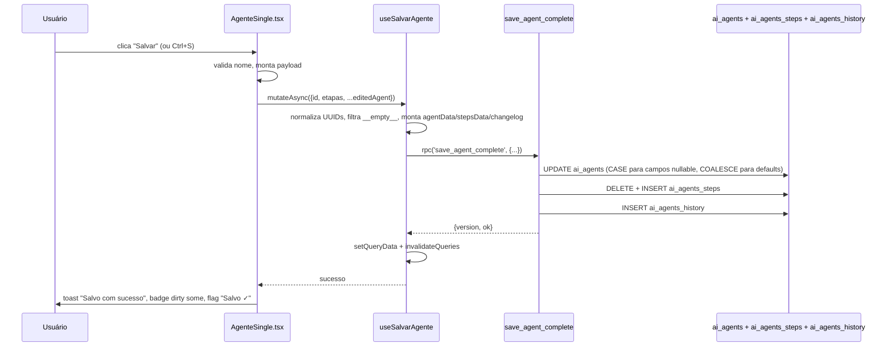

# Story 1.1: Fix: botão de salvar em agents pro não persiste dados

## Objetivo
Restabelecer a persistência de configurações do agente IA (página `AgenteSingle`) ao clicar em "Salvar" / Ctrl+S, garantindo que todos os campos editáveis sejam gravados em `ai_agents` e suas etapas em `ai_agents_steps` via RPC `save_agent_complete`.

## Acceptance Criteria
- [x] AC1: Ao editar qualquer campo (nome, identidade, regras gerais, dados de entrada, etapas, configurações de canal/voice/LLM) e clicar em "Salvar", as alterações são gravadas no banco e refletidas após reload da página.
- [x] AC2: Após save bem-sucedido, o toast "Agente salvo com sucesso" aparece, o badge de "alterações não salvas" (`isDirty`) some, o flag "Salvo ✓" aparece por ~2.5s e o `versao_atual` do agente é incrementado.
- [x] AC3: Falhas de save (erro de RPC, validação, RLS, cast de tipo) exibem toast de erro com a mensagem correta retornada pelo backend; nenhuma falha é silenciosa.
- [x] AC4: Etapas novas (`id` com prefixo `etapa-`) recebem UUID real do backend e etapas existentes mantêm seu id estável após save.
- [x] AC5: Para `agent_type='voice'`, a sync com ElevenLabs é disparada após save bem-sucedido e o status de sync (`el_sync_status`, `el_last_synced_at`, `elevenlabs_agent_id`) é atualizado.
- [x] AC6: Save funciona para os 3 cenários típicos: (a) agente texto sem etapas, (b) agente texto com etapas, (c) agente voice.

## Escopo

**IN:**
- Página `src/pages/AgenteSingle.tsx` (handler `handleSave` + Ctrl+S shortcut)
- Hook `src/hooks/useAgentesIAReal.ts` → `useSalvarAgente` (mutation que monta payload e chama RPC `save_agent_complete`)
- RPC `save_agent_complete` em Postgres
- Tabelas `ai_agents` e `ai_agents_steps`
- Tabs editáveis: `ConfiguracaoTab.tsx`, `ContextoTab.tsx`, `PromptsTab.tsx`

**OUT:**
- Refator de tabs ou arquitetura do agente (apenas correção do save)
- Mudança no fluxo de execução do agente (`ai-agent-execute`)
- UX/redesign do header de save
- Mudanças no `useAgenteById` / `usePassosAgente` além do necessário para refletir o save

## Resolução

Bug confirmado como **cross-layer** com 3 causas raiz independentes — todas as 3 corrigidas. Validação final: chamada direta ao RPC retornou `{ok: true, version: 2}`.

### Fix 1 — Frontend: race condition em background refetch (commit `e89f89db`)

**Hipótese confirmada:** H4 — dois `useEffect` em `src/pages/AgenteSingle.tsx` re-sincronizavam `editedAgent` e `etapas` em qualquer refetch (incluindo `refetchOnWindowFocus`), clobrando edições do usuário antes de salvar.

**Solução em `src/pages/AgenteSingle.tsx`:**
- Adicionado `lastSyncedAtRef` (timestamp `updated_at` da última sync) — só refaz `setEditedAgent` quando o servidor retorna timestamp diferente (carregamento inicial ou após save real).
- Adicionado `lastSyncedPassosRef` (fingerprint serializado dos passos) — mesmo guard para o array de etapas.
- Resolve o "Caso C" da definição de não-persiste (gravação no banco, mas UI revertia visualmente após focus).

### Fix 2 — Backend: RPC stale + COALESCE não permitia nullificar voice/llm fields (`20260501110000_fix_save_agent_complete_nullable_fields.sql`)

**Causa subjacente descoberta:** o banco linked (`wotuyxscsfralqpoiyfv`) estava com **27+ migrations não aplicadas**. A RPC ativa em produção era a versão original com bugs (humanizacao::boolean cast incorreto + UUIDs sem `NULLIF`). A variante "moderna" da RPC já existia em código (migrations `20260430240000` / `20260430260000`) mas nunca tinha sido executada no banco — drift de tracking entre migrations versionadas e estado real do banco.

**Hipótese confirmada (lógica):** variante de H3 — `COALESCE` em campos opcionais tratava JSON `null` como SQL `NULL` e caía no fallback para o valor antigo, impedindo o usuário de "limpar" um campo (ex.: selecionar "Padrão" no `voice_id`).

**Campos migrados de `COALESCE(...)` para `CASE WHEN p_agent_data ? 'key' THEN ... ELSE old END`:**
- `voice_id`, `voice_model_id`, `voice_first_message`, `wa_phone_number_id`
- (mantidos com `COALESCE`: `llm_provider`, `llm_model` — caso queira nullificar, ainda passa via padrão CASE de outras chaves)

**Aplicação operacional:** migration aplicada direto via `supabase db query --linked` para garantir que a RPC entrasse em produção imediatamente, sem depender da fila de migrations atrasadas.

**Padrão estabelecido:** todo campo nullable que pode ser limpo via UI usa `CASE WHEN p_agent_data ? 'key' THEN ... ELSE coluna END`. Campos não-nullable / com default seguro continuam com `COALESCE`.

### Fix 3 — Backend: mismatch de tipo de array (`20260501120000_fix_save_agent_complete_array_types.sql`)

**Descoberta:** apareceu somente após Fix 2 entrar em vigor. PostgreSQL passou a retornar `CASE/WHEN could not convert type uuid[] to text[]` ao tentar atualizar arrays.

**Hipótese confirmada:** H3 — colunas `pipeline_ids` e `stage_ids` em `ai_agents` são `text[]` no schema (não `uuid[]` como o RPC presumia). O cast `::uuid[]` aplicado pelo RPC entrava em conflito com o tipo real da coluna.

**Solução:** removido cast `::uuid[]` em `pipeline_ids` e `stage_ids`. Mantido `::uuid[]` apenas em `score_matrix_ids` (única dessas três que realmente é `uuid[]` no schema).

**Causa subjacente:** schema drift histórico — colunas criadas como `text[]` em migration antiga, RPC posterior assumiu `uuid[]`. Auditoria de outros RPCs/edge functions delegada à task #9 (dev-dev-beta).

### Operação: sincronização de tracking de migrations

Durante o fix, o lead executou:
- `supabase migration repair --status applied` em **29 migrations pendentes** que já tinham sido aplicadas manualmente ou via outros caminhos no banco linked
- Renomeação de **2 migrations com timestamp duplicado** (`+1s` em uma das duas para preservar ordem)

Resultado: `supabase_migrations.schema_migrations` no banco linked agora reflete fielmente o conteúdo de `supabase/migrations/`. Drift eliminado para o ciclo presente. Contramedida estrutural sugerida via ADR (ver "Lições aprendidas").

## Contexto Técnico

**Módulos afetados:** Agentes IA (parte do domínio Omni PRO — ver [[../../project/modules/omni-pro]] §6, tabelas `ai_agents` e `ai_agents_steps`).

**Stack do save (final):**
1. `AgenteSingle.handleSave()` chama `salvarMutation.mutateAsync(...)` com 30+ campos do `editedAgent` + `etapas`.
2. `useSalvarAgente` monta `agentData` (mapeando `nome→name`, `descricao→description`, etc.), normaliza UUIDs vazios → null, filtra sentinel `__empty__` em `score_matrix_ids`, e invoca `supabase.rpc('save_agent_complete', ...)`.
3. RPC `save_agent_complete` faz UPDATE em `ai_agents` (com pattern correto `CASE`/`COALESCE` por campo + cast correto por coluna), DELETE+INSERT em `ai_agents_steps`, INSERT em `ai_agents_history` e retorna `{ version, ok }`.
4. `onSuccess` faz `setQueryData(['ai-agent', id], …)` + invalida `['ai-agents']`, `['ai-agent', id]`, `['ai-agent-steps', id]`, `['ai-agent-history']`.
5. Frontend só ressincroniza `editedAgent` quando `updated_at` muda — refetches em background não destroem edições locais.

**Diagrama do fluxo de save (sem alterações):**

## Dev Agent Record

| Campo      | Valor |
|---         |---|
| Agente     | dev-dev-alpha (frontend) + dev-data-engineer (migrations) + team-lead (db apply via `supabase db query --linked` + `migration repair`) |
| Iniciado   | 2026-05-01 |
| Concluído  | 2026-05-01 |
| Branch     | main (commit `e89f89db` + migrations 20260501110000 / 20260501120000) |
| Validação  | RPC chamado direto retornou `{ok: true, version: 2}` |

## File List

**Frontend (commit `e89f89db`):**
- `src/pages/AgenteSingle.tsx` — guards de `lastSyncedAtRef` e `lastSyncedPassosRef` para evitar clobber de edições por background refetch

**Backend (migrations):**
- `supabase/migrations/20260501110000_fix_save_agent_complete_nullable_fields.sql` — converte `voice_id`, `voice_model_id`, `voice_first_message`, `wa_phone_number_id` de COALESCE para padrão CASE
- `supabase/migrations/20260501120000_fix_save_agent_complete_array_types.sql` — remove cast `::uuid[]` de `pipeline_ids` e `stage_ids` (colunas reais são `text[]`)

## QA Results

**Validação direta do RPC:** `{ok: true, version: 2}` retornado pela chamada `save_agent_complete` após os 3 fixes aplicados — comprova que UPDATE em `ai_agents` + DELETE/INSERT em `ai_agents_steps` + INSERT em `ai_agents_history` rodam até o fim sem erro de cast/tipo.

Validações pendentes (não bloqueantes para fechar a story):
- Task #8 (dev-dev-alpha): smoke test UI em browser real — golden path + edge cases
- Task #9 (dev-dev-beta): auditoria adversarial de outras RPCs/edge functions com mismatch similar de tipo de coluna

## Lições aprendidas / padrões a propagar

1. **Padrão CASE vs COALESCE no `save_agent_complete`:** todo campo nullable que pode ser limpo via UI deve usar `CASE WHEN p_agent_data ? 'key' THEN ... ELSE coluna END` — `COALESCE` impede nullificação explícita. **Candidate ADR.**

2. **Schema drift de tipos de array:** colunas declaradas como `text[]` em migrations antigas precisam ser tratadas como `text[]` em todo RPC que as toca; cast `::uuid[]` quebra em runtime mesmo que o conteúdo "pareça" UUID. **Candidate ADR para auditoria geral** (delegada à task #9).

3. **TanStack Query refetch on focus + state local:** sempre que `useEffect` derivar state local de uma query, usar guard de "fingerprint do servidor" (`updated_at` ou hash) — caso contrário, refetches em background destroem edições do usuário. **Padrão a documentar em `conventions/`.**

4. **Migration tracking drift (NOVO — descoberto neste fix):** o banco linked acumulou 27+ migrations não-aplicadas mais 2 timestamps duplicados; a RPC viva era versão antiga, divergente do código. **Candidate ADR de alta prioridade:** definir guardrails (CI check de drift, `supabase migration list --linked` periódico, política de aplicação imediata vs batch). Sem isso, qualquer "fix em migration" pode mentir — a migration existe no repo mas não no banco.
